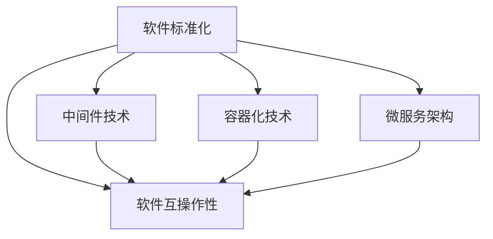

                 

# 软件2.0的标准化与互操作性

## 1. 背景介绍

在数字时代，软件已经成为现代社会的重要基础设施。从简单的文本编辑器到复杂的云计算平台，软件无处不在，直接影响着我们生活的方方面面。然而，随着软件系统的复杂性不断增加，软件的开发、维护和互操作性等问题变得越来越突出。为了应对这些挑战，软件工程领域提出了"软件2.0"的概念，强调通过标准化和互操作性，提升软件系统的可靠性、效率和互操作性。本文将详细介绍软件2.0的标准化与互操作性，探讨其核心概念、关键技术及应用场景。

## 2. 核心概念与联系

### 2.1 核心概念概述

软件2.0的标准化与互操作性涉及多个关键概念，以下是其中一些核心概念的概述：

- **软件标准化**：通过制定标准，规范软件的开发、部署和维护流程，确保软件的一致性和互操作性。
- **软件互操作性**：指不同软件系统之间的相互兼容和协作，实现数据的无缝交换和应用集成。
- **中间件技术**：作为软件标准化和互操作性的桥梁，中间件技术提供统一的接口和协议，实现不同系统之间的通信和数据共享。
- **容器化技术**：通过将应用程序打包到容器中，实现软件的标准化和互操作性，简化部署和管理。
- **微服务架构**：将大应用拆分为多个小服务，通过标准化接口和协议，实现微服务的互操作性和高可靠性。

### 2.2 概念间的关系

这些核心概念之间存在着紧密的联系，共同构成了软件2.0的标准化与互操作性框架。以下是一个Mermaid流程图，展示了这些概念之间的相互关系：



从图中可以看出，软件标准化是基础，通过中间件技术和容器化技术，实现软件互操作性，微服务架构则进一步提升了系统的可扩展性和可靠性。这些概念共同构成了软件2.0的标准化与互操作性框架，为软件系统的开发、部署和维护提供了统一的标准和协议，促进了不同系统之间的互操作性和数据共享。

## 3. 核心算法原理 & 具体操作步骤

### 3.1 算法原理概述

软件2.0的标准化与互操作性本质上是一种软件工程的最佳实践。其核心思想是通过标准化和互操作性，提升软件系统的可靠性和互操作性，从而提高软件系统的开发效率和质量。具体来说，软件2.0的目标包括：

- 制定统一的软件开发标准，确保软件的一致性和互操作性。
- 引入标准化接口和协议，实现不同软件系统之间的互操作性。
- 使用中间件技术，促进数据和应用的集成。
- 采用容器化技术，实现软件的标准化和简化部署。
- 采用微服务架构，提升系统的可扩展性和可靠性。

### 3.2 算法步骤详解

软件2.0的标准化与互操作性一般包括以下几个关键步骤：

1. **制定标准化框架**：定义一套统一的开发、部署和维护标准，确保软件的一致性和互操作性。例如，制定RESTful API、SOAP等标准，规范数据的交换格式和接口定义。

2. **引入中间件技术**：通过引入中间件技术，实现不同软件系统之间的通信和数据共享。例如，使用消息队列、中间件服务器等技术，实现异步通信和数据交换。

3. **采用容器化技术**：将应用程序打包到容器中，实现软件的标准化和简化部署。例如，使用Docker、Kubernetes等容器化技术，实现应用程序的自动化部署和扩展。

4. **采用微服务架构**：将大应用拆分为多个小服务，通过标准化接口和协议，实现微服务的互操作性和高可靠性。例如，采用RESTful API、gRPC等技术，实现微服务的统一接口和协议。

5. **进行测试和验证**：通过测试和验证，确保软件系统的稳定性和互操作性。例如，使用单元测试、集成测试、负载测试等技术，确保软件系统的可靠性和性能。

### 3.3 算法优缺点

软件2.0的标准化与互操作性具有以下优点：

- **提高可靠性**：通过标准化和互操作性，提高软件的可靠性，减少不同系统之间的兼容性问题。
- **简化部署**：通过容器化技术，实现软件的自动化部署和扩展，提高开发效率和维护成本。
- **提升互操作性**：通过中间件技术和标准化接口，实现不同系统之间的互操作性和数据共享。
- **增强可扩展性**：通过微服务架构，提升系统的可扩展性和可靠性，支持大并发和高可用性。

但同时，该方法也存在一些缺点：

- **开发复杂度增加**：标准化和互操作性的引入，增加了软件的开发复杂度和维护成本。
- **性能开销**：中间件和标准化接口的引入，可能带来额外的性能开销，影响系统的响应速度。
- **学习成本高**：标准化和互操作性的实现，需要开发者具备一定的技术储备和学习成本。

### 3.4 算法应用领域

软件2.0的标准化与互操作性在多个领域得到了广泛应用，以下是其中一些主要的应用领域：

1. **企业级软件系统**：企业级软件系统通常涉及多个子系统和外部系统的集成，标准化和互操作性可以有效提升系统的互操作性和可靠性。例如，ERP系统、CRM系统、HR系统等。

2. **云计算平台**：云计算平台需要支持不同类型和规模的应用，标准化和互操作性可以确保不同云服务之间的兼容性。例如，AWS、Azure、Google Cloud等。

3. **物联网系统**：物联网系统通常涉及多个设备和应用，标准化和互操作性可以有效提升系统的互操作性和可靠性。例如，智能家居、智能城市、工业物联网等。

4. **移动应用平台**：移动应用平台需要支持多平台和多种设备，标准化和互操作性可以确保不同设备之间的兼容性。例如，iOS、Android等。

5. **数据交换平台**：数据交换平台需要支持不同类型和格式的数据，标准化和互操作性可以有效提升数据交换的效率和安全性。例如，数据仓库、大数据平台等。

## 4. 数学模型和公式 & 详细讲解

### 4.1 数学模型构建

软件2.0的标准化与互操作性可以抽象为一个数学模型，描述软件系统的开发、部署和互操作性过程。假设软件系统由多个模块组成，每个模块包含一组接口和服务，其数学模型可以表示为：

$$
\text{Software System} = \left\{ \text{Modules}, \text{Interfaces}, \text{Services}, \text{Data Standards}, \text{Communication Protocols}, \text{Standardization Framework} \right\}
$$

其中，$\text{Modules}$ 表示软件系统的模块，$\text{Interfaces}$ 表示模块之间的接口，$\text{Services}$ 表示模块提供的服务，$\text{Data Standards}$ 表示数据的交换标准，$\text{Communication Protocols}$ 表示模块之间的通信协议，$\text{Standardization Framework}$ 表示软件的标准化框架。

### 4.2 公式推导过程

以下是对软件2.0标准化模型的推导过程：

1. **接口定义**：软件系统的接口定义可以表示为 $\text{Interfaces} = \left\{ \text{Interface}_1, \text{Interface}_2, \ldots, \text{Interface}_n \right\}$，其中每个接口 $\text{Interface}_i$ 包含一组服务函数和参数，表示模块之间的通信协议。

2. **数据标准**：软件系统中的数据标准可以表示为 $\text{Data Standards} = \left\{ \text{Standard}_1, \text{Standard}_2, \ldots, \text{Standard}_m \right\}$，其中每个数据标准 $\text{Standard}_j$ 定义了数据的格式和交换规则。

3. **通信协议**：软件系统中的通信协议可以表示为 $\text{Communication Protocols} = \left\{ \text{Protocol}_1, \text{Protocol}_2, \ldots, \text{Protocol}_n \right\}$，其中每个协议 $\text{Protocol}_i$ 定义了模块之间的通信方式和数据交换规则。

4. **标准化框架**：软件系统的标准化框架可以表示为 $\text{Standardization Framework} = \left\{ \text{Standard}_1, \text{Standard}_2, \ldots, \text{Standard}_n \right\}$，其中每个标准 $\text{Standard}_i$ 定义了软件的开发、部署和维护标准。

### 4.3 案例分析与讲解

以RESTful API为例，分析其标准化和互操作性的实现过程：

1. **接口定义**：RESTful API定义了一组HTTP请求方法和请求参数，表示模块之间的通信协议。例如，GET请求用于获取数据，POST请求用于提交数据。

2. **数据标准**：RESTful API定义了数据的格式和交换规则，例如JSON格式、XML格式等。数据标准必须符合RESTful API的定义，确保数据的正确性和一致性。

3. **通信协议**：RESTful API使用HTTP协议进行通信，定义了请求和响应的状态码和头信息，确保模块之间的正确交互。

4. **标准化框架**：RESTful API遵循REST架构风格，定义了软件的开发、部署和维护标准。例如，RESTful API必须遵循资源的命名规则、URL的格式和请求参数的格式。

## 5. 项目实践：代码实例和详细解释说明

### 5.1 开发环境搭建

在实践软件2.0的标准化与互操作性时，需要一个合适的开发环境。以下是使用Python进行Django开发的环境配置流程：

1. 安装Anaconda：从官网下载并安装Anaconda，用于创建独立的Python环境。

2. 创建并激活虚拟环境：
```bash
conda create -n myenv python=3.7
conda activate myenv
```

3. 安装Django：
```bash
pip install django
```

4. 安装其他相关工具包：
```bash
pip install psycopg2-binary numpy matplotlib
```

完成上述步骤后，即可在`myenv`环境中开始Django开发。

### 5.2 源代码详细实现

这里我们以一个简单的RESTful API为例，给出使用Django进行开发和部署的PyTorch代码实现。

首先，定义API的视图函数：

```python
from django.http import JsonResponse
from django.views.decorators.csrf import csrf_exempt
import json

@csrf_exempt
def api_view(request):
    if request.method == 'GET':
        data = json.loads(request.body)
        result = process_data(data)
        return JsonResponse(result)
    else:
        return JsonResponse({'error': 'Invalid request'}, status=400)
```

然后，定义数据处理函数：

```python
def process_data(data):
    # 处理数据并返回结果
    return result
```

最后，定义路由配置：

```python
from django.urls import path
from . import views

urlpatterns = [
    path('api/', views.api_view, name='api'),
]
```

在`views.py`文件中，我们可以实现具体的业务逻辑和数据处理。在`urls.py`文件中，定义路由和视图函数的关系。通过这些配置，Django可以自动创建RESTful API接口，实现API的请求和响应。

### 5.3 代码解读与分析

下面我们对代码进行详细解读：

**views.py**：
- `@csrf_exempt`装饰器：禁用CSRF保护，因为RESTful API的请求通常是来自外部系统，不需要CSRF保护。
- `api_view`函数：处理GET请求，接收请求数据，调用数据处理函数，返回JSON格式的响应结果。

**process_data函数**：
- 实现具体的业务逻辑，如数据处理、计算等。
- 返回处理结果，通常以JSON格式表示。

**urls.py**：
- 定义路由和视图函数的关系，使用`path`函数将请求路径和视图函数关联。
- 命名路由，方便后续调用。

通过以上配置，我们便可以在Django中实现一个简单的RESTful API接口。当然，在实际应用中，还需要考虑更多的细节，如请求验证、权限控制、数据缓存等，以确保API的安全性和可靠性。

### 5.4 运行结果展示

在运行上述代码后，可以使用Postman等工具测试API接口：

1. 发送GET请求，请求体为JSON格式的数据：
```json
{
    "data": "example"
}
```
2. 接收响应结果：
```json
{
    "result": "processed"
}
```

通过Django的RESTful API，我们可以快速实现数据交换和系统集成，提升软件系统的互操作性和可靠性。

## 6. 实际应用场景

### 6.1 企业级软件系统

在企业级软件系统中，标准化和互操作性是确保系统稳定性和可靠性的关键。通过引入RESTful API、SOAP等标准化接口，可以实现不同子系统和外部系统的集成，提高系统的互操作性。例如，ERP系统、CRM系统、HR系统等。

### 6.2 云计算平台

云计算平台需要支持不同类型和规模的应用，标准化和互操作性可以有效提升系统的互操作性和可靠性。例如，AWS、Azure、Google Cloud等。

### 6.3 物联网系统

物联网系统通常涉及多个设备和应用，标准化和互操作性可以有效提升系统的互操作性和可靠性。例如，智能家居、智能城市、工业物联网等。

### 6.4 未来应用展望

随着技术的不断进步，软件2.0的标准化与互操作性将在更多领域得到应用，为传统行业带来变革性影响。

在智慧医疗领域，基于RESTful API的医疗问答、病历分析、药物研发等应用将提升医疗服务的智能化水平，辅助医生诊疗，加速新药开发进程。

在智能教育领域，微调技术可应用于作业批改、学情分析、知识推荐等方面，因材施教，促进教育公平，提高教学质量。

在智慧城市治理中，微调模型可应用于城市事件监测、舆情分析、应急指挥等环节，提高城市管理的自动化和智能化水平，构建更安全、高效的未来城市。

此外，在企业生产、社会治理、文娱传媒等众多领域，基于大模型微调的人工智能应用也将不断涌现，为经济社会发展注入新的动力。

## 7. 工具和资源推荐

### 7.1 学习资源推荐

为了帮助开发者系统掌握软件2.0的标准化与互操作性，这里推荐一些优质的学习资源：

1. 《软件工程之匠心之道》系列博文：由软件工程大师撰写，深入浅出地介绍了软件工程的基础知识和最佳实践，包括标准化和互操作性的内容。

2. CS473《软件工程原理》课程：斯坦福大学开设的软件工程课程，涵盖软件生命周期的各个阶段，包括标准化和互操作性的内容。

3. 《软件架构设计》书籍：深入介绍软件架构的设计原则和方法，包括标准化和互操作性的内容。

4. Software Engineering Institute（SEI）：卡内基梅隆大学下设的SEI研究所，提供丰富的软件工程资源和最佳实践，包括标准化和互操作性的内容。

5. IEEE Standard for Software Engineering (IEEE Std 1044-2012)：IEEE关于软件工程的标准化规范，涵盖了软件工程的全生命周期，包括标准化和互操作性的内容。

通过对这些资源的学习实践，相信你一定能够快速掌握软件2.0的标准化与互操作性的精髓，并用于解决实际的NLP问题。

### 7.2 开发工具推荐

高效的开发离不开优秀的工具支持。以下是几款用于软件2.0开发常用的工具：

1. Docker：基于容器的平台，支持将应用程序打包到容器中，实现软件的标准化和简化部署。

2. Kubernetes：容器编排平台，支持大规模的容器部署和管理，确保系统的高可用性和扩展性。

3. Swagger：API文档生成工具，支持自动生成API文档和测试用例，方便开发和测试。

4. Postman：API测试工具，支持快速测试API接口，获取响应结果。

5. VSCode：流行的开发环境，支持Python、Django等语言和框架的开发和调试。

合理利用这些工具，可以显著提升软件2.0开发和部署的效率，加快创新迭代的步伐。

### 7.3 相关论文推荐

软件2.0的标准化与互操作性源于学界的持续研究。以下是几篇奠基性的相关论文，推荐阅读：

1. RESTful Web Services：提出了RESTful Web Services的概念，强调Web服务的标准化和互操作性。

2. SOAP 1.1 specification：详细描述了SOAP协议的规范和实现方法，确保Web服务的互操作性。

3. Microservices: A Flexible Architecture for Dynamic Systems：提出微服务架构的概念，强调系统的模块化和可扩展性。

4. Docker: Automated Builds for Modern Software Development：介绍了Docker容器化技术的实现方法，提升软件的标准化和简化部署。

5. Kubernetes: Managing Containers at Scale：详细描述了Kubernetes容器编排技术的实现方法，提升系统的可靠性和扩展性。

这些论文代表了大模型微调技术的发展脉络。通过学习这些前沿成果，可以帮助研究者把握学科前进方向，激发更多的创新灵感。

除上述资源外，还有一些值得关注的前沿资源，帮助开发者紧跟软件2.0的标准化与互操作性技术的最新进展，例如：

1. arXiv论文预印本：人工智能领域最新研究成果的发布平台，包括大量尚未发表的前沿工作，学习前沿技术的必读资源。

2. 业界技术博客：如AWS、Azure、Google Cloud等顶尖实验室的官方博客，第一时间分享他们的最新研究成果和洞见。

3. 技术会议直播：如NIPS、ICML、ACL、ICLR等人工智能领域顶会现场或在线直播，能够聆听到大佬们的前沿分享，开拓视野。

4. GitHub热门项目：在GitHub上Star、Fork数最多的软件2.0相关项目，往往代表了该技术领域的发展趋势和最佳实践，值得去学习和贡献。

5. 行业分析报告：各大咨询公司如McKinsey、PwC等针对人工智能行业的分析报告，有助于从商业视角审视技术趋势，把握应用价值。

总之，对于软件2.0的标准化与互操作性技术的学习和实践，需要开发者保持开放的心态和持续学习的意愿。多关注前沿资讯，多动手实践，多思考总结，必将收获满满的成长收益。

## 8. 总结：未来发展趋势与挑战

### 8.1 总结

本文对软件2.0的标准化与互操作性进行了全面系统的介绍。首先阐述了软件2.0的标准化与互操作性在软件工程中的重要地位，明确了其核心思想和目标。其次，从原理到实践，详细讲解了软件2.0的标准化与互操作性数学模型和关键步骤，给出了软件2.0的代码实例和详细解释说明。同时，本文还广泛探讨了软件2.0在企业级软件系统、云计算平台、物联网系统等众多领域的应用前景，展示了软件2.0技术的广阔前景。此外，本文精选了软件2.0技术的各类学习资源，力求为读者提供全方位的技术指引。

通过本文的系统梳理，可以看到，软件2.0的标准化与互操作性正在成为软件工程的重要范式，极大地提升软件系统的可靠性、效率和互操作性，促进软件系统的快速迭代和创新。未来，伴随标准化和互操作性技术的不断演进，相信软件2.0将进一步推动软件技术的产业化进程，构建更加安全、可靠、高效的软件系统。

### 8.2 未来发展趋势

展望未来，软件2.0的标准化与互操作性将呈现以下几个发展趋势：

1. **标准化技术普及**：随着标准化技术在企业级软件系统、云计算平台、物联网系统等领域的广泛应用，标准化技术将逐步成为业界共识。

2. **微服务架构流行**：微服务架构将成为软件架构的主流选择，通过模块化和微服务的思想，提升系统的可扩展性和可靠性。

3. **容器化技术推广**：容器化技术将得到更广泛的应用，实现软件的标准化和简化部署，提高开发效率和维护成本。

4. **互操作性技术提升**：通过引入更多的互操作性技术，如RESTful API、SOAP、gRPC等，提升系统间的互操作性和数据交换效率。

5. **AI和机器学习应用**：随着AI和机器学习技术的发展，软件2.0的标准化与互操作性将进一步融入AI和机器学习领域，实现更智能、更灵活的系统应用。

以上趋势凸显了软件2.0的标准化与互操作性技术的广阔前景。这些方向的探索发展，必将进一步提升软件系统的可靠性、效率和互操作性，推动软件技术的产业化进程。

### 8.3 面临的挑战

尽管软件2.0的标准化与互操作性技术已经取得了瞩目成就，但在迈向更加智能化、普适化应用的过程中，它仍面临着诸多挑战：

1. **开发复杂度增加**：标准化和互操作性的引入，增加了软件的开发复杂度和维护成本。

2. **学习成本高**：标准化和互操作性的实现，需要开发者具备一定的技术储备和学习成本。

3. **性能开销**：中间件和标准化接口的引入，可能带来额外的性能开销，影响系统的响应速度。

4. **安全性有待加强**：标准化和互操作性的实现，需要考虑系统的安全性问题，防止数据泄露和攻击。

5. **跨平台兼容性问题**：不同平台和环境下的标准化和互操作性实现，可能存在兼容性问题，需要进一步优化。

6. **新标准适应**：新的标准化和互操作性标准的引入，需要系统快速适应，避免技术债务。

这些挑战需要业界共同努力，不断优化和完善标准化和互操作性技术，推动软件2.0的标准化与互操作性不断发展。

### 8.4 研究展望

面对软件2.0的标准化与互操作性所面临的种种挑战，未来的研究需要在以下几个方面寻求新的突破：

1. **引入更多标准化技术**：引入更多的标准化技术，如API网关、API网关聚合器等，提升系统的标准化和互操作性。

2. **优化容器化技术**：优化容器化技术，引入更高效、更轻量级的容器化方案，实现软件的标准化和简化部署。

3. **提升互操作性技术**：提升互操作性技术，引入更灵活、更高效的互操作性方案，提升系统间的互操作性和数据交换效率。

4. **结合AI和机器学习**：结合AI和机器学习技术，提升软件系统的智能化水平，实现更智能、更灵活的系统应用。

5. **引入标准化协议**：引入更多标准化协议，如WebSockets、gRPC等，提升系统间的通信效率和互操作性。

6. **引入容器编排技术**：引入容器编排技术，实现大规模容器部署和管理，提升系统的可靠性和扩展性。

这些研究方向的探索，必将引领软件2.0的标准化与互操作性技术迈向更高的台阶，为构建安全、可靠、高效的软件系统铺平道路。面向未来，软件2.0的标准化与互操作性技术还需要与其他人工智能技术进行更深入的融合，如知识表示、因果推理、强化学习等，多路径协同发力，共同推动自然语言理解和智能交互系统的进步。只有勇于创新、敢于突破，才能不断拓展软件系统的边界，让软件技术更好地造福人类社会。

## 9. 附录：常见问题与解答

**Q1：什么是软件2.0的标准化与互操作性？**

A: 软件2.0的标准化与互操作性是一种软件工程的最佳实践，通过制定统一的软件开发、部署和维护标准，引入标准化接口和协议，实现不同软件系统之间的互操作性和数据共享。其目标是提升软件系统的可靠性、效率和互操作性。

**Q2：软件2.0的标准化与互操作性有哪些优点？**

A: 软件2.0的标准化与互操作性具有以下优点：
1. 提升软件系统的可靠性和互操作性，减少不同系统之间的兼容性问题。
2. 提升软件系统的开发效率和维护成本，通过容器化技术实现软件的简化部署。
3. 提升系统间的互操作性和数据共享效率，通过标准化接口和协议实现不同系统之间的通信和数据交换。

**Q3：软件2.0的标准化与互操作性有哪些缺点？**

A: 软件2.0的标准化与互操作性也存在一些缺点：
1. 开发复杂度增加，标准化和互操作性的引入，增加了软件的开发复杂度和维护成本。
2. 学习成本高，标准化和互操作性的实现，需要开发者具备一定的技术储备和学习成本。
3. 性能开销，中间件和标准化接口的引入，可能带来额外的性能开销，影响系统的响应速度。

**Q4：如何实现软件2.0的标准化与互操作性？**

A: 实现软件2.0的标准化与互操作性，需要以下几个关键步骤：
1. 制定统一的软件开发、部署和维护标准，确保软件的一致性和互操作性。
2. 引入标准化接口和协议，实现不同软件系统之间的互操作性和数据共享。
3. 采用容器化技术，实现软件的标准化和简化部署。
4. 采用微服务架构，提升系统的可扩展性和可靠性。
5. 进行测试和验证，确保软件系统的稳定性和互操作性。

**Q5：软件2.0的标准化与互操作性在哪些领域得到应用？**

A: 软件2.0的标准化与互操作性在多个领域得到了广泛应用，包括：
1. 企业级软件系统，如ERP系统、CRM系统、HR系统等。
2. 云计算平台，如AWS、Azure、Google Cloud等。
3. 物联网系统，如智能家居、智能城市、工业物联网等。
4. 移动应用平台，如iOS、Android等。
5. 数据交换平台，如数据仓库、大数据平台等。

总之，软件2.0的标准化与互操作性是软件工程的重要实践，通过标准化和互操作性，提升软件系统的可靠性和互操作性，为软件系统的开发、部署

