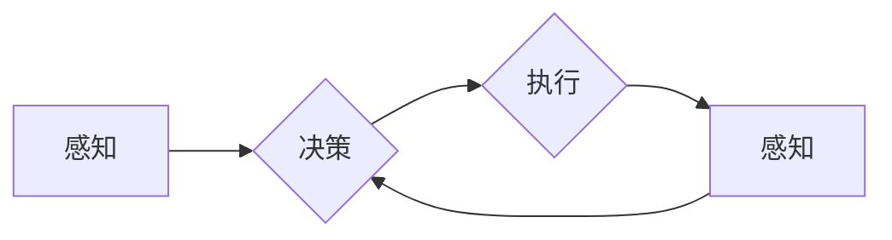

# AI Agent: AI的下一个风口 具身机器人在工业领域的应用

> 关键词：AI Agent，具身智能，机器人，工业自动化，智能控制，认知计算，未来工厂

## 1. 背景介绍
### 1.1 问题的由来

随着人工智能技术的飞速发展，AI Agent作为人工智能的一个核心概念，逐渐成为学术界和工业界的关注焦点。AI Agent，即智能体，是一种具有感知、决策和执行能力的实体，能够在特定环境中自主行动，完成复杂任务。近年来，具身智能（Embodied AI）的概念应运而生，它强调将AI Agent的智能与物理世界相结合，使智能体能够通过传感器感知环境，通过执行器与环境交互。

在工业领域，传统自动化技术已经取得了显著的成果，但它们往往缺乏智能决策能力，难以适应复杂多变的生产环境。随着AI Agent和具身智能技术的发展，将智能体应用于工业领域，实现智能化、自动化生产，成为推动工业4.0的重要方向。

### 1.2 研究现状

目前，AI Agent在工业领域的应用主要集中在以下几个方面：

- **智能巡检**：利用AI Agent进行设备巡检，自动识别异常情况，提高巡检效率，降低人工成本。
- **自动化装配**：将AI Agent应用于自动化装配线，实现零件的自动抓取、放置和组装，提高生产效率和质量。
- **危险作业**：将AI Agent应用于危险环境，如高空作业、核电站等，保障人员安全。
- **物流运输**：利用AI Agent进行自动化物流运输，提高物流效率，降低能耗。

### 1.3 研究意义

AI Agent在工业领域的应用具有以下重要意义：

- **提高生产效率**：通过自动化和智能化生产，提高生产效率，降低生产成本。
- **保障人员安全**：将AI Agent应用于危险作业，保障人员安全。
- **提升产品质量**：通过智能控制，提高产品质量，降低次品率。
- **促进产业升级**：推动工业4.0的发展，促进产业升级。

### 1.4 本文结构

本文将从AI Agent的核心概念、算法原理、项目实践、实际应用场景、未来发展趋势等方面，对AI Agent在工业领域的应用进行深入探讨。

## 2. 核心概念与联系
### 2.1 具身智能

具身智能是指将AI Agent的智能与物理世界相结合，使智能体能够通过传感器感知环境，通过执行器与环境交互。其核心思想是将AI Agent视为一个具有自主意识的个体，使其能够在复杂环境中进行决策和行动。

以下为具身智能的Mermaid流程图：



### 2.2 AI Agent

AI Agent是指具有感知、决策和执行能力的实体。它可以通过传感器感知环境，通过执行器与环境交互，实现自主行动。

### 2.3 机器人

机器人是AI Agent的一种实现形式，它具有机械结构，可以通过传感器感知环境，通过执行器与环境交互。

## 3. 核心算法原理 & 具体操作步骤
### 3.1 算法原理概述

AI Agent在工业领域的应用主要基于以下算法原理：

- **感知算法**：利用传感器获取环境信息，如视觉、听觉、触觉等。
- **决策算法**：根据感知信息，进行推理、规划和决策。
- **执行算法**：根据决策结果，通过执行器与环境交互。

### 3.2 算法步骤详解

以下为AI Agent在工业领域应用的步骤详解：

1. **感知**：利用传感器获取环境信息，如图像、声音、温度等。
2. **决策**：根据感知信息，进行推理、规划和决策。
3. **执行**：根据决策结果，通过执行器与环境交互，如机械臂抓取、机器人移动等。
4. **反馈**：根据执行结果，对决策进行调整，实现闭环控制。

### 3.3 算法优缺点

AI Agent在工业领域应用的算法优点：

- **高效**：自动化生产，提高生产效率。
- **精确**：智能控制，提高产品质量。
- **安全**：将AI Agent应用于危险环境，保障人员安全。

AI Agent在工业领域应用的算法缺点：

- **成本高**：传感器、执行器等硬件设备成本较高。
- **技术难度大**：需要整合多种技术，如传感器融合、机器学习、控制理论等。
- **系统复杂**：需要考虑传感器、执行器、决策算法等多方面因素。

### 3.4 算法应用领域

AI Agent在工业领域的主要应用领域：

- **智能巡检**：利用AI Agent进行设备巡检，自动识别异常情况。
- **自动化装配**：将AI Agent应用于自动化装配线，实现零件的自动抓取、放置和组装。
- **危险作业**：将AI Agent应用于危险环境，如高空作业、核电站等。
- **物流运输**：利用AI Agent进行自动化物流运输。

## 4. 数学模型和公式 & 详细讲解 & 举例说明
### 4.1 数学模型构建

AI Agent在工业领域的应用主要基于以下数学模型：

- **感知模型**：将传感器获取的信号转换为数学模型可处理的格式。
- **决策模型**：根据感知模型输出的信息，进行推理和决策。
- **执行模型**：将决策模型输出的指令转换为执行器的动作。

### 4.2 公式推导过程

以下以视觉感知模型为例，介绍公式推导过程：

$$
\begin{align*}
I &= S(\theta) \\
O &= f(I)
\end{align*}
$$

其中，$I$ 为输入图像，$S(\theta)$ 为感知模型，$O$ 为输出特征，$f$ 为决策模型。

### 4.3 案例分析与讲解

以下以智能巡检应用为例，进行案例分析：

1. **感知**：利用摄像头获取设备图像。
2. **决策**：将图像输入感知模型，得到设备状态特征。
3. **执行**：根据设备状态特征，判断设备是否正常工作。

## 5. 项目实践：代码实例和详细解释说明
### 5.1 开发环境搭建

以下以Python为例，介绍开发环境搭建步骤：

1. 安装Python：从官网下载并安装Python。
2. 安装TensorFlow：使用pip安装TensorFlow库。
3. 安装OpenCV：使用pip安装OpenCV库。

### 5.2 源代码详细实现

以下为智能巡检的Python代码示例：

```python
import cv2
import tensorflow as tf
from tensorflow.keras.models import load_model

# 加载模型
model = load_model('model.h5')

# 捕获视频流
cap = cv2.VideoCapture(0)

while True:
    ret, frame = cap.read()
    if not ret:
        break
    
    # 预处理图像
    processed_frame = preprocess_image(frame)
    
    # 预测设备状态
    prediction = model.predict(processed_frame)
    
    # 根据预测结果进行决策
    if prediction > 0.5:
        print("设备异常")
    else:
        print("设备正常")
    
    # 显示图像
    cv2.imshow('Camera', frame)
    
    if cv2.waitKey(1) & 0xFF == ord('q'):
        break

cap.release()
cv2.destroyAllWindows()
```

### 5.3 代码解读与分析

以上代码展示了智能巡检的基本流程：

1. 加载模型：加载预训练的模型，用于设备状态预测。
2. 捕获视频流：从摄像头捕获视频流。
3. 预处理图像：对捕获的图像进行预处理，如缩放、归一化等。
4. 预测设备状态：将预处理后的图像输入模型，得到设备状态预测结果。
5. 根据预测结果进行决策：根据预测结果，判断设备是否正常工作。
6. 显示图像：显示捕获的图像。

### 5.4 运行结果展示

运行以上代码，摄像头会实时显示捕获的图像，并根据模型预测结果输出设备状态。

## 6. 实际应用场景
### 6.1 智能巡检

智能巡检是AI Agent在工业领域应用的一个重要场景。通过将AI Agent应用于设备巡检，可以实现以下功能：

- **自动识别设备异常**：利用图像识别技术，自动识别设备异常情况。
- **远程监控**：通过远程监控，实时了解设备运行状态。
- **预警通知**：当检测到设备异常时，及时发出预警通知。

### 6.2 自动化装配

自动化装配是AI Agent在工业领域应用的另一个重要场景。通过将AI Agent应用于自动化装配线，可以实现以下功能：

- **自动抓取零件**：利用机械臂，自动抓取零件。
- **自动放置零件**：将抓取到的零件放置到指定位置。
- **自动组装**：将多个零件组装成产品。

### 6.3 危险作业

危险作业是AI Agent在工业领域应用的一个挑战性场景。通过将AI Agent应用于危险环境，可以实现以下功能：

- **自动巡检**：利用AI Agent进行危险环境巡检，如高空作业。
- **自动操作**：利用AI Agent进行危险环境操作，如核电站操作。

### 6.4 物流运输

物流运输是AI Agent在工业领域应用的一个典型场景。通过将AI Agent应用于物流运输，可以实现以下功能：

- **自动导航**：利用AI Agent进行自动导航，如无人驾驶。
- **自动搬运**：利用AI Agent进行自动搬运，如无人搬运车。

## 7. 工具和资源推荐
### 7.1 学习资源推荐

以下是一些关于AI Agent在工业领域应用的学习资源：

- 《人工智能：一种现代的方法》
- 《机器人学：基础与算法》
- 《机器学习：原理与实践》

### 7.2 开发工具推荐

以下是一些关于AI Agent在工业领域应用的开发工具：

- TensorFlow：用于构建和训练AI Agent。
- OpenCV：用于图像处理。
- ROS：用于机器人开发。

### 7.3 相关论文推荐

以下是一些关于AI Agent在工业领域应用的相关论文：

- Embodied AI: An Introduction
- Learning to Walk from Pictures
- Embodied Language Learning

## 8. 总结：未来发展趋势与挑战
### 8.1 研究成果总结

本文介绍了AI Agent在工业领域的应用，包括其核心概念、算法原理、项目实践、实际应用场景等。通过AI Agent的应用，可以实现智能化、自动化生产，提高生产效率，降低生产成本，保障人员安全。

### 8.2 未来发展趋势

未来，AI Agent在工业领域的应用将呈现以下发展趋势：

- **技术融合**：AI Agent将与云计算、大数据、物联网等技术深度融合，实现更加智能的生产系统。
- **领域专用**：AI Agent将针对不同工业领域进行优化，如制造业、医疗、能源等。
- **人机协同**：AI Agent将与人类工人协同工作，实现人机共融。

### 8.3 面临的挑战

AI Agent在工业领域的应用也面临以下挑战：

- **技术瓶颈**：AI Agent的技术瓶颈，如感知、决策、执行等方面的技术瓶颈。
- **数据安全**：工业数据的安全性和隐私保护问题。
- **伦理问题**：AI Agent在工业领域的伦理问题。

### 8.4 研究展望

未来，AI Agent在工业领域的应用研究将重点关注以下几个方面：

- **技术创新**：突破AI Agent的技术瓶颈，提高AI Agent的感知、决策、执行能力。
- **数据治理**：建立完善的工业数据治理体系，保障数据安全和隐私。
- **伦理规范**：制定AI Agent在工业领域的伦理规范，确保AI Agent的应用符合伦理道德。

## 9. 附录：常见问题与解答

**Q1：AI Agent在工业领域应用有哪些优势？**

A：AI Agent在工业领域应用具有以下优势：

- **提高生产效率**：通过自动化和智能化生产，提高生产效率，降低生产成本。
- **保障人员安全**：将AI Agent应用于危险环境，保障人员安全。
- **提升产品质量**：通过智能控制，提高产品质量，降低次品率。

**Q2：AI Agent在工业领域的应用有哪些挑战？**

A：AI Agent在工业领域的应用面临以下挑战：

- **技术瓶颈**：AI Agent的技术瓶颈，如感知、决策、执行等方面的技术瓶颈。
- **数据安全**：工业数据的安全性和隐私保护问题。
- **伦理问题**：AI Agent在工业领域的伦理问题。

**Q3：如何保障AI Agent在工业领域的应用安全？**

A：为了保障AI Agent在工业领域的应用安全，可以从以下几个方面入手：

- **数据安全**：建立完善的数据安全体系，保障数据安全和隐私。
- **算法安全**：设计安全的算法，防止AI Agent被恶意利用。
- **伦理规范**：制定AI Agent在工业领域的伦理规范，确保AI Agent的应用符合伦理道德。

**Q4：AI Agent在工业领域的应用前景如何？**

A：AI Agent在工业领域的应用前景广阔，将推动工业4.0的发展，促进产业升级。

---

作者：禅与计算机程序设计艺术 / Zen and the Art of Computer Programming