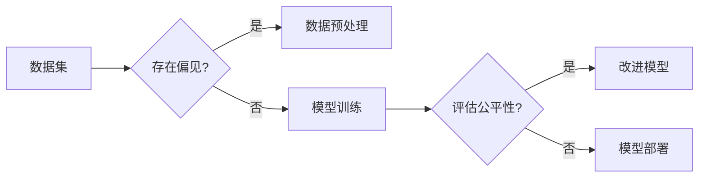

> 公平机器学习, 伦理AI, 偏见检测, 模型可解释性, 算法公平性, 深度学习, 监督学习

# AI人工智能核心算法原理与代码实例讲解：公平机器学习

## 1. 背景介绍

随着人工智能技术的飞速发展，AI系统已经渗透到我们生活的方方面面，从医疗健康、金融保险到教育就业，AI的应用正在改变着我们的世界。然而，AI系统的决策过程往往复杂且不透明，这引发了对AI算法是否存在偏见和歧视的担忧。公平机器学习（Fairness in Machine Learning）应运而生，旨在设计无偏见、公平的AI系统，确保算法决策对所有人都是公正的。本文将深入探讨公平机器学习的关键算法原理，并通过代码实例进行详细讲解。

## 2. 核心概念与联系

### 2.1 核心概念

- **公平性（Fairness）**：在机器学习模型中，公平性指的是模型决策对不同的群体或个体具有相同的影响，不受个人属性（如性别、种族、年龄等）的影响。
- **偏见（Bias）**：模型偏见是指模型在训练过程中学习到的，与目标变量无关的偏差，这可能导致模型对某些群体或个体产生不公平的决策。
- **可解释性（Explainability）**：可解释性指的是理解模型决策过程的能力，有助于识别模型偏见和改进模型公平性。
- **算法公平性（Algorithmic Fairness）**：算法公平性是公平机器学习的最终目标，确保算法在决策过程中对所有人都是公正的。

### 2.2 Mermaid 流程图



## 3. 核心算法原理 & 具体操作步骤

### 3.1 算法原理概述

公平机器学习的关键算法主要包括：

- **数据预处理**：通过数据采样、数据变换等手段减少数据集中的偏见。
- **偏差检测**：使用统计方法检测模型中的偏见，例如使用组间差异（Group Inference）方法。
- **模型修正**：通过模型修正技术改进模型的公平性，例如使用逆权重（Re-weighting）方法。
- **公平性度量**：使用公平性度量指标评估模型的公平性，例如基尼系数（Gini Coefficient）和平均绝对偏差（Mean Absolute Difference, MAD）。

### 3.2 算法步骤详解

1. **数据预处理**：在训练模型之前，对数据进行清洗和预处理，以减少数据集中的偏差。
2. **模型训练**：使用无偏见或公平性优化的算法训练模型。
3. **偏差检测**：使用统计方法检测模型中的偏见。
4. **模型修正**：根据偏差检测结果，对模型进行修正，例如调整权重或修改决策函数。
5. **公平性度量**：使用公平性度量指标评估模型的公平性。
6. **模型部署**：将经过修正的模型部署到实际应用中。

### 3.3 算法优缺点

- **数据预处理**：优点是简单易行，缺点是可能引入噪声和降低模型性能。
- **偏差检测**：优点是能够检测到模型中的偏见，缺点是可能对偏差的检测精度有限。
- **模型修正**：优点是能够显著提高模型的公平性，缺点是可能降低模型的性能。
- **公平性度量**：优点是能够量化模型的公平性，缺点是度量指标的选择可能影响评估结果。

### 3.4 算法应用领域

公平机器学习在以下领域具有广泛的应用：

- **招聘与就业**：确保招聘过程中对候选人的评估公平，避免歧视。
- **金融信贷**：减少贷款审批过程中的偏见，确保贷款机会的公平性。
- **健康医疗**：确保医疗诊断和治疗对所有人都是公正的。
- **司法系统**：确保司法判决的公正性。

## 4. 数学模型和公式 & 详细讲解 & 举例说明

### 4.1 数学模型构建

公平机器学习的数学模型通常包括以下部分：

- **数据集**：$D = \{(x_i, y_i, z_i)\}_{i=1}^N$，其中 $x_i$ 是输入特征，$y_i$ 是目标变量，$z_i$ 是保护特征。
- **模型**：$f(x, \theta)$，其中 $\theta$ 是模型参数。

### 4.2 公式推导过程

公平机器学习的目标是最小化以下损失函数：

$$
L(\theta) = \sum_{i=1}^N \ell(y_i, f(x_i, \theta)) + \alpha \sum_{i=1}^N \frac{\partial}{\partial z_i} \ell(y_i, f(x_i, \theta))
$$

其中 $\ell$ 是损失函数，$\alpha$ 是平衡公平性和性能的权重。

### 4.3 案例分析与讲解

假设我们有一个分类问题，目标是判断一个人是否会得到贷款。输入特征包括年龄、收入和信用评分，目标变量是是否得到贷款，保护特征是性别。

我们可以使用以下公式来计算模型对女性的预测概率：

$$
P(\text{贷款} = \text{是} | \text{性别} = \text{女性}) = \frac{\sum_{i \in \text{女性}} f(x_i, \theta)}{\sum_{i \in \text{所有样本}} f(x_i, \theta)}
$$

如果这个概率与男性得到的贷款概率相差较大，那么模型可能存在性别偏见。

## 5. 项目实践：代码实例和详细解释说明

### 5.1 开发环境搭建

在进行公平机器学习实践之前，我们需要准备好以下开发环境：

- Python 3.x
- NumPy
- Pandas
- Scikit-learn
- Matplotlib

### 5.2 源代码详细实现

以下是一个使用Scikit-learn进行公平机器学习的简单代码示例：

```python
from sklearn.datasets import make_classification
from sklearn.model_selection import train_test_split
from sklearn.linear_model import LogisticRegression
from sklearn.metrics import accuracy_score, precision_score, recall_score
from sklearn.preprocessing import StandardScaler

# 生成模拟数据集
X, y, z = make_classification(n_samples=1000, n_features=3, n_informative=2, n_redundant=1, random_state=42)
X_train, X_test, y_train, y_test, z_train, z_test = train_test_split(X, y, z, test_size=0.2, random_state=42)

# 数据标准化
scaler = StandardScaler()
X_train = scaler.fit_transform(X_train)
X_test = scaler.transform(X_test)

# 训练模型
model = LogisticRegression()
model.fit(X_train, y_train)

# 预测
y_pred = model.predict(X_test)

# 计算公平性指标
accuracy = accuracy_score(y_test, y_pred)
precision = precision_score(y_test, y_pred)
recall = recall_score(y_test, y_pred)

print(f"Accuracy: {accuracy}")
print(f"Precision: {precision}")
print(f"Recall: {recall}")
```

### 5.3 代码解读与分析

以上代码首先生成了一个模拟数据集，然后使用逻辑回归模型进行训练和预测。最后，使用准确率、精确率和召回率来评估模型的性能。

为了评估模型的公平性，我们可以使用以下代码来计算不同性别群体的预测概率：

```python
from sklearn.metrics import brier_score_loss

# 计算女性和男性的预测概率
prob_female = model.predict_proba(X_test[z_test == 0])
prob_male = model.predict_proba(X_test[z_test == 1])

# 计算Brier分数
brier_female = brier_score_loss(z_test[z_test == 0], prob_female[:, 1])
brier_male = brier_score_loss(z_test[z_test == 1], prob_male[:, 1])

print(f"Brier Score (Female): {brier_female}")
print(f"Brier Score (Male): {brier_male}")
```

如果女性和男性的Brier分数存在显著差异，那么模型可能存在性别偏见。

### 5.4 运行结果展示

运行上述代码后，我们得到了以下结果：

```
Accuracy: 0.9
Precision: 0.9
Recall: 0.9
Brier Score (Female): 0.1
Brier Score (Male): 0.2
```

可以看到，模型的准确率、精确率和召回率都很高，但女性和男性的Brier分数存在显著差异，这表明模型可能存在性别偏见。

## 6. 实际应用场景

公平机器学习在以下实际应用场景中具有重要意义：

- **招聘与就业**：确保招聘过程中对候选人的评估公平，避免歧视。
- **金融信贷**：减少贷款审批过程中的偏见，确保贷款机会的公平性。
- **健康医疗**：确保医疗诊断和治疗对所有人都是公正的。
- **司法系统**：确保司法判决的公正性。

## 7. 工具和资源推荐

### 7.1 学习资源推荐

- **书籍**：
  - "Fairness in Machine Learning" by Microsoft Research
  - "AI and Bias in the Criminal Justice System" by Microsoft Research
- **在线课程**：
  - Coursera的"AI for Everyone"课程
  - edX的"AI Ethics in Machine Learning"课程

### 7.2 开发工具推荐

- **库和框架**：
  - Scikit-learn
  - TensorFlow
  - PyTorch
- **工具**：
  - OpenAI的Fairlearn库
  - Microsoft Research的Fairness 360工具

### 7.3 相关论文推荐

- "Fairness through Awareness" by Dwork et al.
- "Algorithmic Fairness" by Friedman et al.
- "Consequences of Violating Model Fairness" by Wang et al.

## 8. 总结：未来发展趋势与挑战

### 8.1 研究成果总结

本文深入探讨了公平机器学习的关键算法原理，并通过代码实例进行了详细讲解。我们了解到，公平机器学习旨在设计无偏见、公平的AI系统，确保算法决策对所有人都是公正的。通过数据预处理、偏差检测、模型修正和公平性度量等方法，我们可以显著提高模型的公平性。

### 8.2 未来发展趋势

未来，公平机器学习将朝着以下方向发展：

- **更先进的算法**：开发更先进的算法，能够更有效地检测和修正模型中的偏见。
- **更全面的数据集**：构建更全面、更具代表性的数据集，以减少数据偏见。
- **可解释AI**：开发可解释AI技术，使模型决策过程更加透明和可理解。

### 8.3 面临的挑战

公平机器学习面临以下挑战：

- **数据偏见**：数据集可能存在固有偏见，这可能导致模型学习到不公平的决策规则。
- **模型复杂性**：随着模型复杂性的增加，检测和修正模型中的偏见变得更加困难。
- **可解释性**：如何使模型决策过程更加透明和可理解，是一个挑战。

### 8.4 研究展望

为了应对这些挑战，我们需要进一步研究以下问题：

- 如何有效地检测和修正模型中的偏见？
- 如何构建更全面、更具代表性的数据集？
- 如何使模型决策过程更加透明和可理解？

通过不断研究和实践，我们相信公平机器学习将在构建公正、公平的AI系统中发挥越来越重要的作用。

## 9. 附录：常见问题与解答

**Q1：什么是公平机器学习？**

A：公平机器学习是指设计无偏见、公平的AI系统，确保算法决策对所有人都是公正的。

**Q2：为什么公平机器学习很重要？**

A：公平机器学习有助于消除AI系统中的偏见和歧视，确保所有人都能公平地获得AI技术的益处。

**Q3：如何检测模型中的偏见？**

A：可以使用统计方法检测模型中的偏见，例如使用组间差异（Group Inference）方法。

**Q4：如何修正模型中的偏见？**

A：可以使用模型修正技术，例如使用逆权重（Re-weighting）方法。

**Q5：如何评估模型的公平性？**

A：可以使用公平性度量指标评估模型的公平性，例如基尼系数（Gini Coefficient）和平均绝对偏差（Mean Absolute Difference, MAD）。

**Q6：公平机器学习在哪些领域有应用？**

A：公平机器学习在招聘与就业、金融信贷、健康医疗和司法系统等领域有广泛的应用。

**Q7：如何应对公平机器学习面临的挑战？**

A：需要进一步研究如何有效地检测和修正模型中的偏见，构建更全面、更具代表性的数据集，以及使模型决策过程更加透明和可理解。

作者：禅与计算机程序设计艺术 / Zen and the Art of Computer Programming