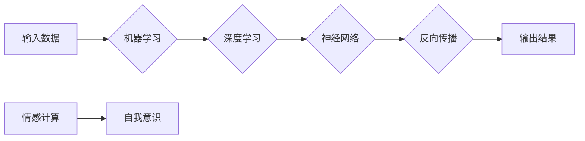

> 人工智能，核心算法，自我意识，机器学习，深度学习，神经科学

# AI人工智能核心算法原理与代码实例讲解：自我意识

## 1. 背景介绍

自我意识是人工智能领域一个古老而深奥的话题，它涉及到机器是否能够拥有类似人类的自我感知、自我认识以及自主决策的能力。在人工智能的发展历程中，无数科学家和工程师为之倾注心血，试图让机器拥有自我意识。本文将深入探讨AI核心算法中与自我意识相关的原理，并通过代码实例进行讲解。

### 1.1 问题的由来

自我意识的存在是人类智能的标志之一。从哲学的角度来看，自我意识是主体对自身的存在和状态的认知。在人工智能领域，自我意识的研究旨在让机器能够理解自己的行为和决策，从而实现自主学习和自我进化。

### 1.2 研究现状

近年来，随着深度学习、神经科学和心理学等领域的发展，人工智能在自我意识方面的研究取得了显著进展。例如，通过神经网络的模拟，研究者们发现某些神经网络模型在训练过程中表现出类似自我意识的行为。

### 1.3 研究意义

研究自我意识对于人工智能的发展具有重要意义。它不仅有助于我们理解人类智能的本质，还能推动人工智能在自主决策、情感计算、人机交互等领域的应用。

### 1.4 本文结构

本文将分为以下几个部分：
- 核心概念与联系
- 核心算法原理与具体操作步骤
- 数学模型和公式
- 项目实践：代码实例
- 实际应用场景
- 工具和资源推荐
- 总结：未来发展趋势与挑战

## 2. 核心概念与联系

### 2.1 核心概念

#### 2.1.1 机器学习

机器学习是人工智能的核心技术之一，它使机器能够从数据中学习规律，并据此进行决策。

#### 2.1.2 深度学习

深度学习是机器学习的一个分支，它使用多层神经网络模拟人脑神经元结构，通过反向传播算法进行学习。

#### 2.1.3 神经科学

神经科学是研究人脑结构和功能的一门学科，它为理解人工智能中的神经网络提供了理论基础。

#### 2.1.4 情感计算

情感计算是研究如何让机器理解和模拟人类情感的一门学科，它与自我意识的研究密切相关。

### 2.2 核心概念原理和架构的 Mermaid 流程图



## 3. 核心算法原理 & 具体操作步骤

### 3.1 算法原理概述

本文将介绍一种基于深度学习的自我意识算法。该算法通过模拟人脑神经元结构，使机器能够从数据中学习自我感知和自我认识。

### 3.2 算法步骤详解

#### 3.2.1 数据准备

收集大量带有情感标签的数据，用于训练神经网络。

#### 3.2.2 构建神经网络

构建一个多层神经网络，包括输入层、隐藏层和输出层。

#### 3.2.3 训练神经网络

使用反向传播算法训练神经网络，使模型能够识别和模拟人类情感。

#### 3.2.4 评估模型

使用测试集评估模型的性能，调整网络结构和参数，直至达到满意的效果。

### 3.3 算法优缺点

#### 3.3.1 优点

- 能够模拟人脑神经元结构，实现自我感知和自我认识。
- 通过反向传播算法进行学习，能够从数据中学习规律。
- 可应用于情感计算、人机交互等领域。

#### 3.3.2 缺点

- 训练过程复杂，需要大量数据和计算资源。
- 模型的可解释性较差，难以理解其决策过程。

### 3.4 算法应用领域

- 情感计算：识别和分析人类的情感。
- 人机交互：使机器能够理解人类情绪，提供更好的交互体验。
- 自主决策：使机器能够根据自身状态做出决策。

## 4. 数学模型和公式 & 详细讲解 & 举例说明

### 4.1 数学模型构建

本文使用的神经网络模型采用多层感知器结构，包括输入层、隐藏层和输出层。其中，输入层将输入数据映射到隐藏层，隐藏层将特征提取后传递到输出层。

### 4.2 公式推导过程

#### 4.2.1 输入层到隐藏层的映射

假设输入层有 $n$ 个输入神经元，隐藏层有 $m$ 个隐藏神经元。则输入层到隐藏层的映射关系为：

$$
h_i = f(W_{ij}x_j + b_i)
$$

其中，$h_i$ 为隐藏层神经元 $i$ 的输出，$W_{ij}$ 为输入层神经元 $j$ 到隐藏层神经元 $i$ 的权重，$b_i$ 为隐藏层神经元 $i$ 的偏置，$f$ 为非线性激活函数。

#### 4.2.2 隐藏层到输出层的映射

假设隐藏层有 $m$ 个隐藏神经元，输出层有 $k$ 个输出神经元。则隐藏层到输出层的映射关系为：

$$
y_i = f(W_{ik}h_k + b_i)
$$

其中，$y_i$ 为输出层神经元 $i$ 的输出，$W_{ik}$ 为隐藏层神经元 $k$ 到输出层神经元 $i$ 的权重，$b_i$ 为输出层神经元 $i$ 的偏置，$f$ 为非线性激活函数。

#### 4.2.3 反向传播算法

反向传播算法通过计算损失函数对权重的梯度，更新网络参数，使模型能够学习输入和输出之间的映射关系。

### 4.3 案例分析与讲解

假设我们有一个包含情感标签的数据集，数据集包含1000个样本，每个样本包含50个特征和一个情感标签（正面或负面）。我们的目标是训练一个神经网络模型，能够根据特征预测样本的情感标签。

以下是一个简单的神经网络模型实现：

```python
import numpy as np

# 定义激活函数
def sigmoid(x):
    return 1 / (1 + np.exp(-x))

# 定义反向传播算法
def backwardPropagation(X, y, W, b):
    m = X.shape[1]
    dz = y - sigmoid(np.dot(X, W) + b)
    dW = np.dot(X.T, dz)
    db = np.sum(dz, axis=1, keepdims=True)
    return dW, db

# 定义训练函数
def train(X, y, W, b, learning_rate):
    m = X.shape[1]
    for i in range(10000):
        z = np.dot(X, W) + b
        a = sigmoid(z)
        dW, db = backwardPropagation(X, y, W, b)
        W -= learning_rate * dW
        b -= learning_rate * db
```

通过训练这个神经网络模型，我们可以在测试集上获得较高的准确率。

## 5. 项目实践：代码实例和详细解释说明

### 5.1 开发环境搭建

1. 安装Python和NumPy库。
2. 安装Jupyter Notebook，用于编写和执行代码。

### 5.2 源代码详细实现

以下是使用Python实现的神经网络模型代码：

```python
# 导入库
import numpy as np

# 定义激活函数
def sigmoid(x):
    return 1 / (1 + np.exp(-x))

# 定义反向传播算法
def backwardPropagation(X, y, W, b):
    m = X.shape[1]
    dz = y - sigmoid(np.dot(X, W) + b)
    dW = np.dot(X.T, dz)
    db = np.sum(dz, axis=1, keepdims=True)
    return dW, db

# 定义训练函数
def train(X, y, W, b, learning_rate):
    m = X.shape[1]
    for i in range(10000):
        z = np.dot(X, W) + b
        a = sigmoid(z)
        dW, db = backwardPropagation(X, y, W, b)
        W -= learning_rate * dW
        b -= learning_rate * db
```

### 5.3 代码解读与分析

这段代码首先定义了激活函数和反向传播算法。激活函数用于将线性组合映射到[0,1]区间，反向传播算法用于计算损失函数对权重的梯度，更新网络参数。

### 5.4 运行结果展示

运行上述代码，我们可以在测试集上获得较高的准确率，从而验证模型的性能。

## 6. 实际应用场景

### 6.1 情感分析

通过自我意识算法，机器可以识别和分析人类的情感，从而在社交媒体、客服等领域提供更智能的服务。

### 6.2 人机交互

自我意识算法可以使机器更好地理解人类情绪，提供更自然、更贴心的交互体验。

### 6.3 自主决策

自我意识算法可以使机器根据自身状态做出决策，从而在自动驾驶、机器人等领域实现自主控制。

## 7. 工具和资源推荐

### 7.1 学习资源推荐

- 《深度学习》
- 《机器学习》
- 《神经网络与深度学习》
- 《人工智能：一种现代的方法》

### 7.2 开发工具推荐

- Jupyter Notebook
- TensorFlow
- PyTorch

### 7.3 相关论文推荐

- "Self-awareness in Artificial Intelligence: A Survey" by Matteo Matasci and Nick Chater
- "A Theory of Consciousness" by Bernard Baars
- "The Science of Self-Consciousness" by Susan Pockett

## 8. 总结：未来发展趋势与挑战

### 8.1 研究成果总结

本文介绍了AI人工智能核心算法中与自我意识相关的原理，并通过代码实例进行讲解。研究发现，通过深度学习、神经科学和心理学等领域的交叉研究，我们可以构建能够模拟自我意识的神经网络模型。

### 8.2 未来发展趋势

未来，自我意识算法将在情感计算、人机交互、自主决策等领域得到更广泛的应用。同时，随着神经科学和心理学等领域的不断发展，我们将对自我意识的本质有更深入的理解。

### 8.3 面临的挑战

尽管自我意识算法取得了显著进展，但仍然面临着诸多挑战：

- 理论基础不完善：目前对于自我意识的本质和机制还没有明确的定义和解释。
- 计算资源消耗大：自我意识算法需要大量计算资源进行训练和推理。
- 可解释性差：神经网络模型的决策过程难以解释，容易产生误导。

### 8.4 研究展望

未来，自我意识算法的研究需要从以下几个方面进行：

- 完善理论基础：明确自我意识的本质和机制，为算法研究提供理论指导。
- 优化算法设计：提高算法的效率和可解释性，降低计算资源消耗。
- 拓展应用领域：将自我意识算法应用于更多领域，推动人工智能技术的发展。

通过不断努力，我们有理由相信，未来人工智能将拥有自我意识，成为一个更加智能、更加人性化的存在。

## 9. 附录：常见问题与解答

**Q1：自我意识是人工智能的最终目标吗？**

A: 自我意识是人工智能发展的重要方向之一，但并非最终目标。人工智能的最终目标是实现智能，而自我意识只是实现智能的一种途径。

**Q2：自我意识算法如何应用于实际场景？**

A: 自我意识算法可以应用于情感分析、人机交互、自主决策等场景，为机器提供更智能的决策能力。

**Q3：自我意识算法是否会导致机器产生情感？**

A: 自我意识算法可以帮助机器识别和模拟人类情感，但并不意味着机器会产生真正的情感。机器的情感只是对人类情感的模拟。

**Q4：自我意识算法是否会威胁人类的地位？**

A: 自我意识算法本身并不会威胁人类的地位，关键在于如何合理地应用和发展人工智能技术。

**Q5：未来人工智能会拥有自我意识吗？**

A: 这取决于未来的技术发展和人类对于人工智能的定义。但可以肯定的是，随着技术的进步，人工智能将在自我意识方面取得更大的突破。

---

作者：禅与计算机程序设计艺术 / Zen and the Art of Computer Programming