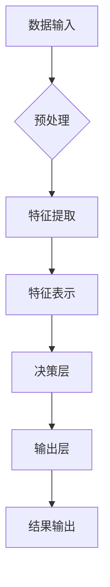

# AI人工智能深度学习算法：深度学习的挑战与前景

> 关键词：深度学习，人工智能，机器学习，神经网络，算法挑战，前景展望，神经网络架构，优化技术

## 1. 背景介绍

随着计算能力的提升和大数据的爆发式增长，人工智能（AI）领域取得了突飞猛进的进展。深度学习，作为人工智能的核心技术之一，已经成为推动AI发展的关键力量。从图像识别到自然语言处理，从自动驾驶到医疗诊断，深度学习算法的应用无处不在。然而，随着深度学习技术的不断深入，我们也面临着一系列的挑战和问题。本文将探讨深度学习的核心概念、算法原理、面临的挑战以及未来的发展趋势。

## 2. 核心概念与联系

### 2.1 深度学习概述

深度学习是一种机器学习技术，它通过构建具有多层节点的神经网络来学习数据的复杂模式。与传统的机器学习方法相比，深度学习能够在没有人工特征工程的情况下，从大量的数据中自动学习特征和模式。

### 2.2 核心概念原理和架构的 Mermaid 流程图



### 2.3 深度学习的核心概念

- **神经网络**：深度学习的基础是神经网络，它由多个层（输入层、隐藏层、输出层）组成，每一层由多个神经元组成。
- **激活函数**：激活函数用于引入非线性，使神经网络能够学习复杂的模式。
- **损失函数**：损失函数用于衡量预测值与真实值之间的差异，是优化过程中的关键指标。
- **优化算法**：优化算法用于调整神经网络的权重，以最小化损失函数。

## 3. 核心算法原理 & 具体操作步骤

### 3.1 算法原理概述

深度学习算法的核心是通过前向传播和反向传播来训练神经网络。在前向传播过程中，数据从输入层流向输出层，每一层通过激活函数处理数据。在反向传播过程中，通过计算损失函数的梯度来更新网络的权重和偏置。

### 3.2 算法步骤详解

1. **数据预处理**：对输入数据进行清洗、归一化等操作，以便模型能够更好地学习。
2. **模型构建**：选择合适的神经网络架构，包括层数、每层的神经元数量和激活函数。
3. **模型训练**：通过迭代优化过程，调整网络参数以最小化损失函数。
4. **模型评估**：使用测试数据评估模型的性能，调整超参数以获得最佳结果。
5. **模型部署**：将训练好的模型部署到实际应用中。

### 3.3 算法优缺点

**优点**：

- 能够从大量数据中自动学习复杂的特征和模式。
- 在图像识别、语音识别、自然语言处理等领域取得了显著成果。
- 无需人工特征工程，降低了模型开发的复杂度。

**缺点**：

- 训练数据需求量大，且需要高质量的标注数据。
- 模型的可解释性差，难以理解模型的决策过程。
- 模型的计算复杂度高，需要大量的计算资源和时间。

### 3.4 算法应用领域

- 图像识别
- 语音识别
- 自然语言处理
- 自主导航
- 医疗诊断
- 金融分析

## 4. 数学模型和公式 & 详细讲解 & 举例说明

### 4.1 数学模型构建

深度学习中的数学模型主要包括神经网络、激活函数、损失函数和优化算法。

- **神经网络**：

$$
y = f(W \cdot x + b)
$$

其中 $W$ 是权重，$b$ 是偏置，$x$ 是输入，$y$ 是输出。

- **激活函数**：

$$
f(x) = \text{ReLU}(x) = \max(0, x)
$$

- **损失函数**：

$$
L(y, \hat{y}) = \frac{1}{2}(y - \hat{y})^2
$$

其中 $y$ 是真实值，$\hat{y}$ 是预测值。

- **优化算法**：

$$
\theta = \theta - \alpha \nabla_{\theta}L(y, \hat{y})
$$

其中 $\theta$ 是模型参数，$\alpha$ 是学习率。

### 4.2 公式推导过程

以下以全连接神经网络为例，介绍损失函数和优化算法的推导过程。

1. **损失函数**：

假设网络输出层的输出为 $\hat{y}$，真实值为 $y$，则损失函数为均方误差：

$$
L(y, \hat{y}) = \frac{1}{2}(y - \hat{y})^2
$$

2. **反向传播**：

计算损失函数对权重 $W$ 的梯度：

$$
\frac{\partial L}{\partial W} = -2(y - \hat{y}) \cdot z
$$

其中 $z$ 是输出层的前一层输出。

计算损失函数对偏置 $b$ 的梯度：

$$
\frac{\partial L}{\partial b} = -2(y - \hat{y})
$$

3. **优化算法**：

使用梯度下降算法更新权重和偏置：

$$
W = W - \alpha \cdot \frac{\partial L}{\partial W}
$$

$$
b = b - \alpha \cdot \frac{\partial L}{\partial b}
$$

### 4.3 案例分析与讲解

以MNIST手写数字识别任务为例，介绍深度学习模型在图像识别任务中的应用。

1. **数据预处理**：将MNIST数据集中的图像进行归一化处理。
2. **模型构建**：构建一个具有两个隐藏层的全连接神经网络，使用ReLU激活函数。
3. **模型训练**：使用训练数据训练模型，调整权重和偏置以最小化损失函数。
4. **模型评估**：使用测试数据评估模型的性能，调整超参数以获得最佳结果。
5. **模型部署**：将训练好的模型部署到实际应用中，用于识别新的手写数字图像。

## 5. 项目实践：代码实例和详细解释说明

### 5.1 开发环境搭建

- 安装Python 3.8及以上版本。
- 安装TensorFlow或PyTorch等深度学习框架。
- 安装NumPy、Pandas等数据处理库。

### 5.2 源代码详细实现

以下是一个使用TensorFlow构建MNIST手写数字识别任务的简单示例：

```python
import tensorflow as tf
from tensorflow.keras.datasets import mnist
from tensorflow.keras.models import Sequential
from tensorflow.keras.layers import Dense, Flatten

# 加载数据
(train_images, train_labels), (test_images, test_labels) = mnist.load_data()
train_images = train_images.reshape((60000, 28, 28, 1)).astype('float32') / 255
test_images = test_images.reshape((10000, 28, 28, 1)).astype('float32') / 255

# 构建模型
model = Sequential([
    Flatten(input_shape=(28, 28, 1)),
    Dense(128, activation='relu'),
    Dense(10, activation='softmax')
])

# 编译模型
model.compile(optimizer='adam', loss='sparse_categorical_crossentropy', metrics=['accuracy'])

# 训练模型
model.fit(train_images, train_labels, epochs=5)

# 评估模型
test_loss, test_acc = model.evaluate(test_images, test_labels, verbose=2)
print('
Test accuracy:', test_acc)
```

### 5.3 代码解读与分析

- 导入必要的库。
- 加载MNIST数据集。
- 将图像数据转换为浮点数并归一化。
- 构建一个全连接神经网络模型。
- 编译模型，指定优化器、损失函数和评估指标。
- 训练模型，调整权重和偏置。
- 评估模型在测试集上的性能。

### 5.4 运行结果展示

运行上述代码后，将输出模型在测试集上的准确率。通常情况下，该模型可以达到95%以上的准确率。

## 6. 实际应用场景

深度学习算法在各个领域都有广泛的应用，以下列举几个典型应用场景：

- **图像识别**：人脸识别、物体识别、医学图像分析。
- **语音识别**：语音助手、语音翻译、语音搜索。
- **自然语言处理**：机器翻译、文本分类、情感分析。
- **自动驾驶**：车辆检测、车道线识别、障碍物检测。
- **金融分析**：欺诈检测、风险控制、股票预测。

## 7. 工具和资源推荐

### 7.1 学习资源推荐

- 《深度学习》（Goodfellow, Bengio, Courville）
- 《神经网络与深度学习》（邱锡鹏）
- TensorFlow官方文档
- PyTorch官方文档

### 7.2 开发工具推荐

- TensorFlow
- PyTorch
- Keras
- Jupyter Notebook

### 7.3 相关论文推荐

- "A Few Useful Things to Know about Machine Learning"（Ian Goodfellow）
- "Deep Learning"（Ian Goodfellow, Yoshua Bengio, Aaron Courville）
- "ImageNet Classification with Deep Convolutional Neural Networks"（Alex Krizhevsky, Ilya Sutskever, Geoffrey Hinton）

## 8. 总结：未来发展趋势与挑战

### 8.1 研究成果总结

深度学习技术在近年来取得了显著的成果，为人工智能的发展提供了强大的动力。然而，深度学习仍然面临着许多挑战，包括数据质量、模型可解释性、计算效率等。

### 8.2 未来发展趋势

- **模型轻量化**：开发更轻量级的模型，降低计算资源和存储需求。
- **模型可解释性**：提高模型的可解释性，增强用户对模型的信任。
- **知识增强**：将外部知识融入模型，提高模型的推理能力。
- **强化学习**：结合强化学习，实现更加智能的决策。

### 8.3 面临的挑战

- **数据质量**：高质量的数据对于模型训练至关重要，但获取高质量数据往往成本高昂。
- **模型可解释性**：深度学习模型的决策过程难以解释，这对于一些需要透明度和可信度的应用场景是一个挑战。
- **计算效率**：深度学习模型的计算复杂度高，需要大量的计算资源和时间。

### 8.4 研究展望

未来，深度学习技术将在以下方面取得重要进展：

- **模型压缩**：通过模型压缩技术，降低模型的尺寸和计算复杂度。
- **迁移学习**：利用迁移学习技术，提高模型在不同任务上的泛化能力。
- **多模态学习**：将不同模态的数据（如图像、文本、语音）整合到模型中，实现更全面的信息处理。
- **可解释人工智能**：研究可解释人工智能技术，提高模型的可解释性和可信度。

## 9. 附录：常见问题与解答

**Q1：什么是深度学习？**

A：深度学习是一种机器学习技术，它通过构建具有多层节点的神经网络来学习数据的复杂模式。

**Q2：深度学习有哪些常见应用？**

A：深度学习在图像识别、语音识别、自然语言处理、自动驾驶、医疗诊断、金融分析等领域都有广泛的应用。

**Q3：如何选择合适的深度学习模型？**

A：选择合适的深度学习模型需要考虑数据特点、任务类型、计算资源等因素。通常需要通过实验和比较不同模型的效果来选择最合适的模型。

**Q4：深度学习模型的训练过程需要多长时间？**

A：深度学习模型的训练时间取决于模型的复杂度、数据量、计算资源等因素。通常需要数小时到数天不等。

**Q5：如何提高深度学习模型的效率？**

A：提高深度学习模型的效率可以通过以下方法实现：使用更轻量级的模型、使用GPU加速计算、使用混合精度训练、使用模型剪枝和量化等技术。

作者：禅与计算机程序设计艺术 / Zen and the Art of Computer Programming