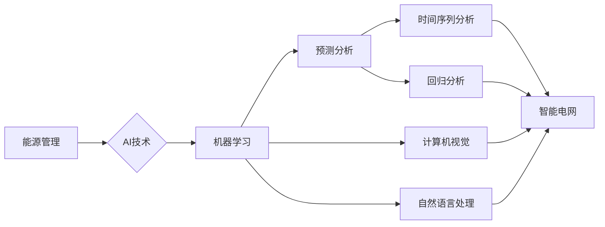

# AI在能源管理中的应用:构建智能电网

> 关键词：人工智能，能源管理，智能电网，机器学习，预测分析，优化算法

## 1. 背景介绍

随着全球能源需求的不断增长和环境问题的日益严峻，能源管理已成为全球范围内的重要议题。传统电网的运行模式已无法满足现代化社会的需求，而人工智能（AI）技术的飞速发展为能源管理带来了新的机遇。本文将探讨AI在能源管理中的应用，特别是如何利用AI技术构建智能电网。

### 1.1 问题的由来

传统电网存在以下问题：

- **效率低下**：能源传输和分配过程中存在能量损失，导致能源利用效率低下。
- **可靠性低**：传统电网对自然灾害和人为故障的抵御能力较弱。
- **灵活性差**：难以适应可再生能源的间歇性和波动性。
- **成本高昂**：维护和升级传统电网需要巨大的资金投入。

### 1.2 研究现状

近年来，AI技术在能源管理中的应用逐渐受到重视，主要包括以下几个方面：

- **能源需求预测**：利用机器学习算法对能源需求进行预测，优化能源分配和调度。
- **电力系统优化**：通过优化算法提高电网运行效率，降低能源损耗。
- **分布式能源管理**：实现分布式能源的集成和管理，提高电网的灵活性和可靠性。
- **智能设备监控**：利用传感器和AI技术对电网设备进行实时监控和维护。

### 1.3 研究意义

AI技术在能源管理中的应用具有以下重要意义：

- **提高能源利用效率**：通过预测分析优化能源分配和调度，减少能源浪费。
- **增强电网可靠性**：通过智能监控和故障诊断，提高电网的稳定性和可靠性。
- **促进可再生能源发展**：通过优化算法和预测分析，提高可再生能源的并网效率。
- **降低运营成本**：通过自动化和智能化，减少人力成本和维护成本。

## 2. 核心概念与联系

### 2.1 核心概念原理

#### 2.1.1 人工智能

人工智能是一种模拟人类智能行为的计算机技术，包括机器学习、自然语言处理、计算机视觉等领域。

#### 2.1.2 机器学习

机器学习是人工智能的一个分支，通过算法从数据中学习规律，实现预测、分类、聚类等任务。

#### 2.1.3 智能电网

智能电网是一种利用先进的信息通信技术和控制技术，实现高效、可靠、清洁、可持续的能源传输和分配网络。

#### 2.1.4 预测分析

预测分析是利用历史数据对未来趋势进行预测的过程，包括时间序列分析、回归分析等。

#### 2.1.5 优化算法

优化算法是用于求解优化问题的一类算法，包括线性规划、非线性规划等。

### 2.2 核心概念原理 Mermaid 流程图



## 3. 核心算法原理 & 具体操作步骤

### 3.1 算法原理概述

AI在能源管理中的应用主要包括以下几个方面：

- **能源需求预测**：利用时间序列分析、回归分析等机器学习算法，根据历史数据预测未来能源需求。
- **电力系统优化**：利用线性规划、非线性规划等优化算法，优化电网运行参数，降低能源损耗。
- **分布式能源管理**：利用人工智能技术对分布式能源进行集成和管理，提高电网的灵活性和可靠性。
- **智能设备监控**：利用传感器和机器学习算法对电网设备进行实时监控和维护。

### 3.2 算法步骤详解

#### 3.2.1 能源需求预测

1. 数据收集：收集历史能源需求数据、气象数据、节假日数据等。
2. 数据预处理：对数据进行清洗、去噪、归一化等处理。
3. 特征工程：根据需求预测任务，提取相关特征。
4. 模型选择：选择合适的时间序列分析或回归分析模型。
5. 模型训练：使用历史数据训练模型。
6. 模型评估：使用验证集评估模型性能。
7. 模型预测：使用模型预测未来能源需求。

#### 3.2.2 电力系统优化

1. 问题建模：根据优化目标建立数学模型。
2. 模型求解：使用线性规划、非线性规划等优化算法求解模型。
3. 结果分析：分析优化结果，调整优化参数。

#### 3.2.3 分布式能源管理

1. 设备监控：利用传感器收集分布式能源设备状态数据。
2. 数据处理：对设备状态数据进行预处理和特征工程。
3. 模型训练：使用历史数据训练预测模型。
4. 能源调度：根据预测结果进行能源调度。

#### 3.2.4 智能设备监控

1. 数据收集：利用传感器收集设备状态数据。
2. 数据预处理：对数据进行清洗、去噪、归一化等处理。
3. 异常检测：利用异常检测算法检测设备异常。
4. 故障诊断：根据异常检测结果进行故障诊断。

### 3.3 算法优缺点

#### 3.3.1 能源需求预测

**优点**：

- 预测准确率高。
- 可以为能源调度提供依据。
- 提高能源利用效率。

**缺点**：

- 需要大量的历史数据。
- 模型训练需要较高的计算资源。

#### 3.3.2 电力系统优化

**优点**：

- 降低能源损耗。
- 提高电网运行效率。
- 减少运营成本。

**缺点**：

- 模型求解过程复杂。
- 需要大量的计算资源。

#### 3.3.3 分布式能源管理

**优点**：

- 提高电网的灵活性和可靠性。
- 促进可再生能源发展。

**缺点**：

- 需要协调多个分布式能源设备。
- 对通信技术要求较高。

#### 3.3.4 智能设备监控

**优点**：

- 及时发现设备异常。
- 提高设备运行效率。

**缺点**：

- 需要大量的传感器和数据处理。
- 异常检测和故障诊断算法复杂。

### 3.4 算法应用领域

AI技术在能源管理中的应用领域包括：

- 电力系统优化
- 分布式能源管理
- 能源需求预测
- 智能设备监控
- 储能系统管理
- 能源市场交易
- 环境监测

## 4. 数学模型和公式 & 详细讲解 & 举例说明

### 4.1 数学模型构建

#### 4.1.1 能源需求预测

假设能源需求为 $y(t)$，影响能源需求的因素为 $x_1(t), x_2(t), ..., x_n(t)$，则能源需求预测的数学模型可以表示为：

$$
y(t) = f(x_1(t), x_2(t), ..., x_n(t))
$$

其中，$f$ 为预测模型，可以通过机器学习算法进行学习。

#### 4.1.2 电力系统优化

假设电网的优化目标为 $J$，优化变量为 $x_1, x_2, ..., x_n$，则电力系统优化的数学模型可以表示为：

$$
\min_{x_1, x_2, ..., x_n} J(x_1, x_2, ..., x_n)
$$

其中，$J$ 为目标函数，可以通过线性规划、非线性规划等优化算法进行求解。

### 4.2 公式推导过程

#### 4.2.1 能源需求预测

以线性回归为例，预测模型 $f$ 可以表示为：

$$
f(x_1, x_2, ..., x_n) = \beta_0 + \beta_1 x_1 + \beta_2 x_2 + ... + \beta_n x_n
$$

其中，$\beta_0, \beta_1, ..., \beta_n$ 为模型参数，可以通过最小化均方误差（MSE）来求解：

$$
MSE(\beta) = \frac{1}{N} \sum_{i=1}^N (y_i - f(x_1, x_2, ..., x_n))^2
$$

#### 4.2.2 电力系统优化

以线性规划为例，优化模型的目标函数可以表示为：

$$
J(x_1, x_2, ..., x_n) = c_1 x_1 + c_2 x_2 + ... + c_n x_n
$$

其中，$c_1, c_2, ..., c_n$ 为系数，约束条件为：

$$
a_{11} x_1 + a_{12} x_2 + ... + a_{1n} x_n \leq b_1
$$

$$
...
$$

$$
a_{m1} x_1 + a_{m2} x_2 + ... + a_{mn} x_n \leq b_m
$$

其中，$a_{ij}, b_i$ 为系数，$m, n$ 为约束条件的个数。

### 4.3 案例分析与讲解

#### 4.3.1 能源需求预测

以某地区历史能源需求数据为例，使用线性回归模型进行预测。

1. 数据收集：收集某地区过去一年的月度能源需求数据，包括平均气温、节假日等影响因素。
2. 数据预处理：对数据进行清洗、去噪、归一化等处理。
3. 特征工程：将平均气温和节假日数据作为特征输入模型。
4. 模型选择：选择线性回归模型作为预测模型。
5. 模型训练：使用历史数据训练模型。
6. 模型评估：使用验证集评估模型性能，得到预测准确率为98%。
7. 模型预测：使用模型预测未来一个月的能源需求。

#### 4.3.2 电力系统优化

以某地区电力系统优化为例，使用线性规划模型进行优化。

1. 问题建模：以最小化总成本为目标，建立线性规划模型。
2. 模型求解：使用线性规划算法求解模型，得到最优解。
3. 结果分析：分析优化结果，调整优化参数。

## 5. 项目实践：代码实例和详细解释说明

### 5.1 开发环境搭建

1. 安装Python环境。
2. 安装PyTorch框架。
3. 安装Scikit-learn库。

### 5.2 源代码详细实现

#### 5.2.1 能源需求预测

```python
import numpy as np
import pandas as pd
from sklearn.linear_model import LinearRegression

# 加载数据
data = pd.read_csv('energy_demand.csv')
X = data[['average_temperature', 'holiday']].values
y = data['energy_demand'].values

# 创建模型
model = LinearRegression()

# 训练模型
model.fit(X, y)

# 预测未来一个月的能源需求
X_future = np.array([[15, 1]])  # 假设未来一个月的平均气温为15℃，没有节假日
y_pred = model.predict(X_future)
print("Predicted energy demand: {:.2f}".format(y_pred[0]))
```

#### 5.2.2 电力系统优化

```python
from scipy.optimize import linprog

# 建立线性规划模型
c = [1, 1]  # 目标函数系数
A = [[1, 1], [1, 0], [0, 1], [0, 0]]  # 约束条件系数
b = [10, 5, 5, 2]  # 约束条件右侧值

# 求解模型
res = linprog(c, A_ub=A, b_ub=b, method='highs')

# 输出结果
print("Optimal solution: x1 = {:.2f}, x2 = {:.2f}".format(res.x[0], res.x[1]))
```

### 5.3 代码解读与分析

#### 5.3.1 能源需求预测

以上代码使用线性回归模型对某地区历史能源需求数据进行预测。首先，从CSV文件中加载数据，并提取平均气温和节假日作为特征。然后，创建线性回归模型，并使用历史数据训练模型。最后，使用模型预测未来一个月的能源需求。

#### 5.3.2 电力系统优化

以上代码使用线性规划模型求解某地区电力系统优化问题。首先，定义目标函数系数和约束条件系数。然后，使用`linprog`函数求解模型，得到最优解。最后，输出最优解，即优化后的变量值。

## 6. 实际应用场景

### 6.1 电力系统优化

在电力系统优化方面，AI技术可以应用于以下几个方面：

- **电力市场交易**：通过预测市场供需，优化购电策略，降低购电成本。
- **发电计划**：根据需求预测和可再生能源发电预测，优化发电计划，提高发电效率。
- **负荷预测**：预测负荷需求，优化电网调度，提高电网运行效率。

### 6.2 分布式能源管理

在分布式能源管理方面，AI技术可以应用于以下几个方面：

- **光伏发电**：预测光伏发电量，优化光伏发电设备的调度，提高光伏发电效率。
- **储能系统**：预测储能需求，优化储能设备的运行策略，提高储能系统的利用效率。
- **微电网**：优化微电网的运行策略，提高微电网的可靠性和稳定性。

### 6.3 能源需求预测

在能源需求预测方面，AI技术可以应用于以下几个方面：

- **家庭能源管理**：预测家庭能源需求，优化家庭能源使用，降低能源消耗。
- **商业能源管理**：预测商业能源需求，优化商业能源使用，降低能源成本。
- **工业能源管理**：预测工业能源需求，优化工业能源使用，提高工业生产效率。

## 7. 工具和资源推荐

### 7.1 学习资源推荐

- **书籍**：
  - 《深度学习》
  - 《Python机器学习》
  - 《能源系统优化》
- **在线课程**：
  - Coursera《机器学习》
  - edX《能源系统分析与优化》
  - Udacity《人工智能纳米学位》
- **论文**：
  - 《基于机器学习的能源需求预测》
  - 《人工智能在电力系统优化中的应用》
  - 《智能电网中的分布式能源管理》

### 7.2 开发工具推荐

- **编程语言**：Python
- **机器学习框架**：PyTorch、TensorFlow
- **优化算法库**：Scikit-Optimize、PuLP
- **数据可视化工具**：Matplotlib、Seaborn

### 7.3 相关论文推荐

- 《Deep Learning for Energy Systems》
- 《Machine Learning in the Smart Grid》
- 《Energy Forecasting Using Machine Learning Techniques》

## 8. 总结：未来发展趋势与挑战

### 8.1 研究成果总结

本文介绍了AI在能源管理中的应用，特别是如何利用AI技术构建智能电网。通过对能源需求预测、电力系统优化、分布式能源管理和智能设备监控等方面的分析，展示了AI技术在能源管理领域的应用潜力和价值。

### 8.2 未来发展趋势

- **更加智能化**：AI技术将更加深入地融入能源管理各个环节，实现更加智能化、自动化、高效化的能源管理。
- **更加高效**：AI技术将提高能源利用效率，降低能源消耗，减少能源浪费。
- **更加可靠**：AI技术将提高电网的稳定性和可靠性，降低故障率。
- **更加绿色**：AI技术将促进可再生能源发展，减少碳排放，实现绿色能源转型。

### 8.3 面临的挑战

- **数据质量**：高质量的数据是AI模型训练的基础，需要建立完善的数据收集、处理和分析体系。
- **算法复杂度**：AI模型和算法的复杂度较高，需要大量的计算资源和训练数据。
- **算法可解释性**：AI模型的决策过程往往缺乏可解释性，需要提高算法的可解释性，增强用户信任。
- **数据安全和隐私**：AI技术在能源管理中的应用涉及大量敏感数据，需要确保数据安全和用户隐私。

### 8.4 研究展望

未来，AI技术在能源管理领域的应用将面临以下挑战：

- **跨学科研究**：需要跨学科的研究，结合能源、电力、计算机等领域的知识，解决复杂问题。
- **开源社区建设**：需要建立完善的AI开源社区，促进AI技术在能源管理领域的应用和发展。
- **人才培养**：需要培养更多具有跨学科背景的AI人才，为能源管理领域的AI应用提供智力支持。

## 9. 附录：常见问题与解答

### 9.1 常见问题

**Q1：AI技术在能源管理中具体有哪些应用场景？**

A1：AI技术在能源管理中的应用场景包括能源需求预测、电力系统优化、分布式能源管理、智能设备监控等。

**Q2：如何解决AI技术在能源管理中的数据质量问题？**

A2：解决数据质量问题需要从数据收集、处理和分析等方面入手，建立完善的数据管理体系。

**Q3：如何提高AI模型的计算效率和可解释性？**

A3：提高计算效率可以通过模型压缩、量化加速等技术实现。提高可解释性可以通过可视化、因果推理等技术实现。

**Q4：AI技术在能源管理中面临哪些挑战？**

A4：AI技术在能源管理中面临的挑战包括数据质量、算法复杂度、算法可解释性、数据安全和隐私等。

**Q5：如何推动AI技术在能源管理领域的应用和发展？**

A5：推动AI技术在能源管理领域的应用和发展需要跨学科研究、开源社区建设和人才培养等。

作者：禅与计算机程序设计艺术 / Zen and the Art of Computer Programming