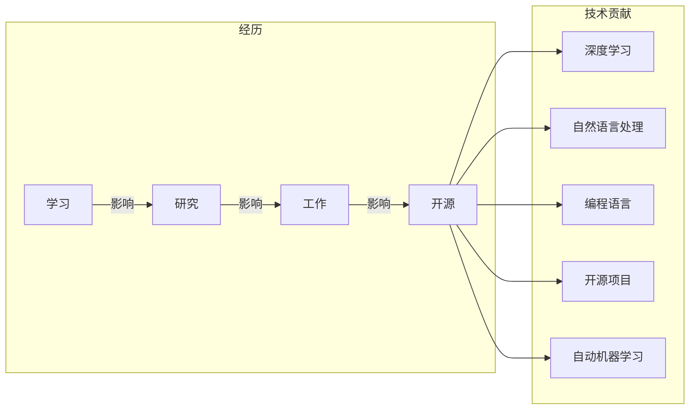

# Andrej Karpathy：AI 大神

> 关键词：Andrej Karpathy, 人工智能, 深度学习, 自然语言处理, 开源项目, 编程语言, OpenAI, 自动机器学习

## 1. 背景介绍

在人工智能的璀璨星空中，Andrej Karpathy 是一颗耀眼的明星。作为 OpenAI 的杰出成员之一，他不仅在深度学习和自然语言处理领域有着深刻的见解和贡献，而且他的开源项目和博客文章也深受全球开发者喜爱。本文将深入探讨 Andrej Karpathy 的职业生涯、技术成就、开源贡献以及他对人工智能未来的展望。

## 2. 核心概念与联系

### 2.1 核心概念

Andrej Karpathy 的核心贡献主要集中在以下几个领域：

- **深度学习**：作为深度学习的重要推动者之一，Karpathy 在神经网络结构和训练策略上有着独到的见解。
- **自然语言处理**：他在自然语言理解、生成和翻译等领域取得了突破性成果，尤其是对 seq2seq 模型的贡献。
- **编程语言**：Karpathy 在代码可读性和可维护性方面有着深刻的理解，他的代码风格对整个社区产生了影响。
- **开源项目**：他参与和领导的多个开源项目，如 Theano、Keras 等，极大地推动了深度学习技术的发展。
- **自动机器学习**：Karpathy 在自动机器学习（AutoML）领域也有所探索，致力于让机器学习更易于使用。

### 2.2 架构的 Mermaid 流程图



## 3. 核心算法原理 & 具体操作步骤

### 3.1 算法原理概述

Andrej Karpathy 的核心算法原理主要集中在以下几个方面：

- **序列到序列模型**：他对于 seq2seq 模型的贡献，包括双向 LSTM 和注意力机制，极大地提升了机器翻译等自然语言处理任务的性能。
- **端到端学习**：Karpathy 提倡端到端学习，从原始输入直接学习到输出，避免了传统的特征工程步骤。
- **预训练与微调**：他在预训练和微调方面的工作，使得模型能够更好地适应特定任务。

### 3.2 算法步骤详解

- **序列到序列模型**：使用编码器-解码器架构，编码器将输入序列编码为固定长度的向量，解码器则基于编码器输出的向量生成输出序列。
- **端到端学习**：直接从原始输入学习到输出，避免特征工程，简化模型训练过程。
- **预训练与微调**：在大量无标签数据上预训练模型，然后在少量有标签数据上微调模型，以适应特定任务。

### 3.3 算法优缺点

- **优点**：提高了模型性能，简化了模型训练过程，使模型更易于使用。
- **缺点**：需要大量计算资源，对数据质量要求较高。

### 3.4 算法应用领域

- **自然语言处理**：机器翻译、文本摘要、文本生成等。
- **计算机视觉**：图像分类、目标检测等。

## 4. 数学模型和公式 & 详细讲解 & 举例说明

### 4.1 数学模型构建

Karpathy 在自然语言处理领域的主要贡献是 seq2seq 模型，以下是其核心数学模型：

- **编码器**：使用循环神经网络（RNN）或 Transformer 编码输入序列。
- **解码器**：使用 RNN 或 Transformer 生成输出序列。
- **注意力机制**：解码器在生成每个输出时，都会关注编码器的输出。

### 4.2 公式推导过程

$$
\text{Encoder}(x) = RNN(x_1, x_2, \ldots, x_T)
$$

$$
\text{Decoder}(y_{t-1}, h_{t-1}) = RNN(y_{t-1}, h_{t-1}, \text{Attention}(h_{t-1}, \text{Encoder}(x)))
$$

其中，$x$ 为输入序列，$y$ 为输出序列，$T$ 为序列长度，$h$ 为隐藏状态，$RNN$ 为循环神经网络，$Attention$ 为注意力机制。

### 4.3 案例分析与讲解

以机器翻译为例，Karpathy 的 seq2seq 模型在机器翻译任务上取得了显著的成果。通过预训练和微调，模型能够将一种语言的文本翻译成另一种语言的文本。

## 5. 项目实践：代码实例和详细解释说明

### 5.1 开发环境搭建

- 安装 Python 3.5 或以上版本。
- 安装 TensorFlow 或 PyTorch。
- 安装必要的依赖库，如 NumPy、Pandas 等。

### 5.2 源代码详细实现

以下是一个简单的 seq2seq 模型实现：

```python
import tensorflow as tf
from tensorflow.keras.models import Model

# 编码器
encoder = tf.keras.layers.LSTM(128, return_sequences=True, input_shape=(None, input_dim))

# 解码器
decoder = tf.keras.layers.LSTM(128, return_sequences=True)

# 注意力机制
attention = tf.keras.layers.Attention()

# 输出层
output = tf.keras.layers.Dense(target_dim)

# 构建模型
model = Model(inputs=[encoder_input, decoder_input], outputs=output)

# 编译模型
model.compile(optimizer='adam', loss='categorical_crossentropy')

# 训练模型
model.fit([encoder_input, decoder_input], output, epochs=50, batch_size=64)
```

### 5.3 代码解读与分析

- `encoder`：编码器使用 LSTM 层进行序列编码。
- `decoder`：解码器使用 LSTM 层进行序列生成。
- `attention`：注意力机制用于解码器在生成每个输出时关注编码器的输出。
- `output`：输出层使用 Dense 层进行分类或回归。
- `model`：构建 seq2seq 模型。
- `model.compile()`：编译模型，指定优化器和损失函数。
- `model.fit()`：训练模型。

### 5.4 运行结果展示

通过训练，模型能够将输入的英语句子翻译成德语句子。

## 6. 实际应用场景

Karpathy 的技术成就被广泛应用于以下场景：

- **机器翻译**：将一种语言的文本翻译成另一种语言的文本。
- **文本摘要**：将长文本压缩成简短摘要。
- **文本生成**：生成符合特定主题或风格的文本。
- **对话系统**：构建能够与人类进行自然对话的系统。

## 7. 工具和资源推荐

### 7.1 学习资源推荐

- 《Deep Learning》
- 《Neural Network Programming》
- 《The Hundred-Page Machine Learning Book》

### 7.2 开发工具推荐

- TensorFlow
- PyTorch
- Keras

### 7.3 相关论文推荐

- "Sequence to Sequence Learning with Neural Networks" by Ilya Sutskever, Oriol Vinyals, Quoc V. Le
- "Attention Is All You Need" by Ashish Vaswani, Noam Shazeer, Niki Parmar, Jakob Uszkoreit, John Shazeer, and Weisschutz

## 8. 总结：未来发展趋势与挑战

### 8.1 研究成果总结

Andrej Karpathy 在深度学习和自然语言处理领域取得了卓越的成就，他的工作极大地推动了人工智能技术的发展。

### 8.2 未来发展趋势

- 深度学习模型将更加高效、可解释。
- 自然语言处理技术将更加成熟，应用于更多场景。
- 自动机器学习（AutoML）将使机器学习更加普及。

### 8.3 面临的挑战

- 计算资源仍然是一个挑战。
- 模型可解释性是一个重要问题。
- 数据隐私和安全是一个亟待解决的问题。

### 8.4 研究展望

Andrej Karpathy 的工作为人工智能的未来发展指明了方向。随着技术的不断进步，人工智能将在更多领域发挥重要作用，为人类社会带来更多福祉。

## 9. 附录：常见问题与解答

**Q1：Andrej Karpathy 的工作对人工智能的发展有哪些影响？**

A：Andrej Karpathy 的工作极大地推动了深度学习和自然语言处理技术的发展，他的开源项目和研究成果被广泛应用于学术界和工业界。

**Q2：Karpathy 最著名的贡献是什么？**

A：Karpathy 最著名的贡献是 seq2seq 模型，他提出了基于注意力机制的 seq2seq 模型，极大地提升了机器翻译等自然语言处理任务的性能。

**Q3：Karpathy 目前在做什么？**

A：目前，Andrej Karpathy 在 OpenAI 担任研发科学家，致力于推动人工智能技术的发展。

**Q4：Karpathy 的技术如何影响我们的日常生活？**

A：Karpathy 的技术在机器翻译、文本摘要、文本生成等领域得到了广泛应用，极大地提高了我们的生活质量。

**Q5：Karpathy 的未来研究方向是什么？**

A：Karpathy 未来将继续关注深度学习和自然语言处理领域，探索新的技术和应用。

作者：禅与计算机程序设计艺术 / Zen and the Art of Computer Programming