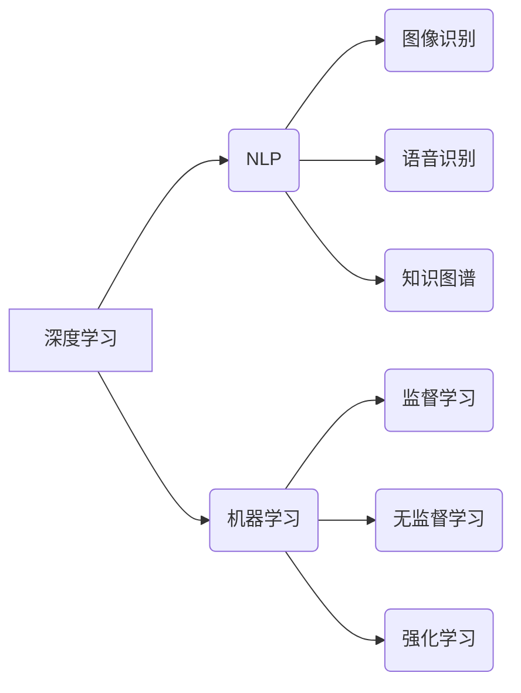

> 关键词：Andrej Karpathy，人工智能，未来规划，深度学习，自然语言处理，机器学习，神经科学，技术趋势

# Andrej Karpathy：人工智能的未来发展规划

> 作者：禅与计算机程序设计艺术 / Zen and the Art of Computer Programming

## 1. 背景介绍

Andrej Karpathy，一位在人工智能领域备受尊敬的专家，以其对自然语言处理（NLP）和深度学习的深刻理解而闻名。他的博客和演讲激发了全球开发者对AI的无限热情。本文将基于Andrej Karpathy的思考和愿景，探讨人工智能的未来发展规划，并分析其核心算法、应用场景和面临的挑战。

## 2. 核心概念与联系

### 2.1 核心概念

#### 深度学习

深度学习是一种模拟人脑神经网络结构和功能的计算模型，通过多层神经网络对数据进行学习，以实现图像识别、语音识别、自然语言处理等任务。

#### 自然语言处理

自然语言处理（NLP）是人工智能的一个分支，旨在使计算机能够理解和生成人类语言。

#### 机器学习

机器学习是一种使计算机系统能够从数据中学习并作出决策的技术。

#### 神经科学

神经科学研究人脑的工作原理，为人工智能的发展提供了理论基础。

### 2.2 Mermaid 流程图



## 3. 核心算法原理 & 具体操作步骤

### 3.1 算法原理概述

人工智能的核心在于模拟人脑的神经网络结构和功能，通过不断的学习和优化，使计算机能够像人类一样进行感知、推理和决策。

### 3.2 算法步骤详解

1. 数据收集：收集相关领域的大量数据，为模型提供足够的训练样本。
2. 数据预处理：对数据进行清洗、归一化等处理，以提高模型的学习效果。
3. 模型选择：根据任务需求选择合适的模型结构，如神经网络、支持向量机等。
4. 模型训练：使用训练数据对模型进行训练，优化模型参数。
5. 模型评估：使用测试数据对模型进行评估，以检验模型的泛化能力。
6. 模型部署：将训练好的模型部署到实际应用场景中。

### 3.3 算法优缺点

#### 优点：

- 高效的泛化能力：深度学习模型能够学习到数据中的复杂模式，具有强大的泛化能力。
- 高度的自适应性：机器学习模型可以根据不同的任务和数据集进行调整和优化。
- 高度的可解释性：通过神经网络的可视化，可以直观地理解模型的决策过程。

#### 缺点：

- 计算资源消耗大：深度学习模型需要大量的计算资源，如GPU、TPU等。
- 数据需求量大：机器学习模型需要大量的数据，且数据质量对模型效果影响较大。
- 模型可解释性差：深度学习模型的可解释性较差，难以理解其决策过程。

### 3.4 算法应用领域

人工智能已经广泛应用于各个领域，如：

- 自然语言处理：机器翻译、文本摘要、情感分析等。
- 计算机视觉：图像识别、目标检测、图像分割等。
- 语音识别：语音合成、语音识别、语音翻译等。
- 推荐系统：电影推荐、商品推荐、新闻推荐等。
- 无人驾驶：自动驾驶、路径规划、交通管理等。

## 4. 数学模型和公式 & 详细讲解 & 举例说明

### 4.1 数学模型构建

人工智能的核心是数学模型，以下是一些常见的数学模型：

#### 神经网络

神经网络是一种模拟人脑神经元结构和功能的计算模型，其基本单元为神经元。每个神经元接收多个输入，通过激活函数处理后输出结果。

#### 机器学习模型

机器学习模型包括监督学习、无监督学习和强化学习等。以下是一些常见的机器学习模型：

- 线性回归：用于预测连续值。
- 逻辑回归：用于分类任务。
- 决策树：用于分类和回归任务。
- 随机森林：集成学习算法，由多个决策树组成。

### 4.2 公式推导过程

以下以线性回归为例，讲解其公式推导过程。

假设我们有一个线性回归模型：

$$
y = \beta_0 + \beta_1x_1 + \beta_2x_2 + \cdots + \beta_nx_n + \epsilon
$$

其中，$y$ 为因变量，$x_1, x_2, \cdots, x_n$ 为自变量，$\beta_0, \beta_1, \cdots, \beta_n$ 为模型参数，$\epsilon$ 为误差项。

为了求出最优的模型参数，我们需要最小化损失函数：

$$
L(\beta_0, \beta_1, \cdots, \beta_n) = \sum_{i=1}^N (y_i - (\beta_0 + \beta_1x_{1i} + \cdots + \beta_nx_{ni}))^2
$$

通过求导和化简，我们可以得到以下公式：

$$
\beta_0 = \frac{1}{N} \sum_{i=1}^N (y_i - \beta_1x_{1i} - \cdots - \beta_nx_{ni})
$$

$$
\beta_1 = \frac{1}{N} \sum_{i=1}^N (y_i - \beta_0 - \beta_2x_{2i} - \cdots - \beta_nx_{ni})(x_{1i})
$$

同理，我们可以求出其他参数的值。

### 4.3 案例分析与讲解

以下以情感分析任务为例，讲解如何使用深度学习模型进行情感分析。

#### 数据集

使用IMDb电影评论数据集，该数据集包含25,000条电影评论和对应的情感标签（正面/负面）。

#### 模型

使用LSTM（长短期记忆网络）模型进行情感分析。

#### 训练

使用训练数据对LSTM模型进行训练，优化模型参数。

#### 测试

使用测试数据对训练好的模型进行测试，评估模型的性能。

## 5. 项目实践：代码实例和详细解释说明

### 5.1 开发环境搭建

1. 安装Python环境。
2. 安装PyTorch框架。
3. 安装Numpy、Scikit-learn等库。

### 5.2 源代码详细实现

```python
import torch
import torch.nn as nn
from torch.utils.data import DataLoader, Dataset
from torch.optim import Adam

class SentimentDataset(Dataset):
    def __init__(self, texts, labels):
        self.texts = texts
        self.labels = labels

    def __len__(self):
        return len(self.texts)

    def __getitem__(self, item):
        return self.texts[item], self.labels[item]

class LSTMClassifier(nn.Module):
    def __init__(self, vocab_size, embedding_dim, hidden_dim, output_dim):
        super(LSTMClassifier, self).__init__()
        self.embedding = nn.Embedding(vocab_size, embedding_dim)
        self.lstm = nn.LSTM(embedding_dim, hidden_dim)
        self.fc = nn.Linear(hidden_dim, output_dim)

    def forward(self, text):
        embedded = self.embedding(text)
        output, (hidden, cell) = self.lstm(embedded)
        return self.fc(hidden[-1])

# 加载数据集
texts = [...] # 电影评论文本
labels = [...] # 对应的情感标签

# 创建数据集
dataset = SentimentDataset(texts, labels)
dataloader = DataLoader(dataset, batch_size=32, shuffle=True)

# 创建模型
model = LSTMClassifier(vocab_size=len(texts[0]), embedding_dim=100, hidden_dim=256, output_dim=2)

# 训练模型
optimizer = Adam(model.parameters(), lr=0.001)
criterion = nn.CrossEntropyLoss()

for epoch in range(10):
    for text, label in dataloader:
        optimizer.zero_grad()
        output = model(text)
        loss = criterion(output, label)
        loss.backward()
        optimizer.step()

# 评估模型
# ...
```

### 5.3 代码解读与分析

以上代码实现了一个基于LSTM的文本情感分析模型。首先，定义了一个`SentimentDataset`类，用于加载和预处理数据。然后，定义了一个`LSTMClassifier`类，用于构建LSTM模型。最后，使用PyTorch框架进行模型的训练和评估。

## 6. 实际应用场景

### 6.1 自然语言处理

自然语言处理是人工智能领域的一个重要应用场景，如：

- 机器翻译：将一种语言的文本翻译成另一种语言。
- 文本摘要：将长文本压缩成简短的摘要。
- 情感分析：分析文本的情感倾向，如正面、负面或中性。

### 6.2 计算机视觉

计算机视觉是人工智能领域的另一个重要应用场景，如：

- 图像识别：识别图像中的对象和场景。
- 目标检测：检测图像中的目标及其位置。
- 图像分割：将图像分割成多个区域。

### 6.3 无人驾驶

无人驾驶是人工智能领域的一个重要应用场景，如：

- 路径规划：为自动驾驶车辆规划最佳行驶路径。
- 传感器融合：整合多个传感器数据，提高车辆的环境感知能力。

## 7. 工具和资源推荐

### 7.1 学习资源推荐

- 《深度学习》（Goodfellow, Bengio, Courville）
- 《Python深度学习》（François Chollet）
- 《动手学深度学习》（A. G. Ng, M. Chen, K. Kavukcuoglu）

### 7.2 开发工具推荐

- PyTorch
- TensorFlow
- Keras

### 7.3 相关论文推荐

- "A Neural Probabilistic Language Model"（Bengio et al., 2003）
- "Rectifier Nonlinearities Improve Deep Neural Networks"（Huang et al., 2013）
- "Sequence to Sequence Learning with Neural Networks"（Sutskever et al., 2014）

## 8. 总结：未来发展趋势与挑战

### 8.1 研究成果总结

本文基于Andrej Karpathy的思考，探讨了人工智能的未来发展规划。通过分析核心算法、应用场景和面临的挑战，我们看到了人工智能领域的广阔前景。

### 8.2 未来发展趋势

- 模型规模将不断增大，计算资源需求将进一步提高。
- 跨领域学习和少样本学习将成为新的研究方向。
- 可解释人工智能和可信人工智能将成为重要的发展方向。
- 人工智能将与其他技术（如区块链、物联网等）深度融合。

### 8.3 面临的挑战

- 数据隐私和安全问题。
- 模型可解释性和可信任度。
- 人工智能的伦理和社会影响。
- 算法偏见和歧视问题。

### 8.4 研究展望

未来，人工智能将迎来更加快速的发展，为人类社会带来更多福祉。我们需要共同努力，解决人工智能发展过程中遇到的挑战，推动人工智能技术更好地服务于人类社会。

## 9. 附录：常见问题与解答

**Q1：人工智能是否会取代人类？**

A：人工智能可以辅助人类工作，提高生产效率，但不会取代人类。人工智能的发展需要人类的引导和监管。

**Q2：人工智能是否会产生算法偏见？**

A：是的，如果训练数据存在偏见，那么人工智能模型也会存在偏见。因此，我们需要关注数据质量，避免算法偏见。

**Q3：人工智能是否会引发失业问题？**

A：人工智能可能会取代一些重复性工作，但也会创造新的工作机会。我们需要关注人工智能对就业市场的影响，并培养适应未来社会需求的人才。

**Q4：人工智能是否具有情感？**

A：人工智能目前没有情感，它只是模拟人类行为和决策过程的计算模型。

**Q5：人工智能的未来发展方向是什么？**

A：人工智能的未来发展方向包括跨领域学习、少样本学习、可解释人工智能、可信人工智能等。