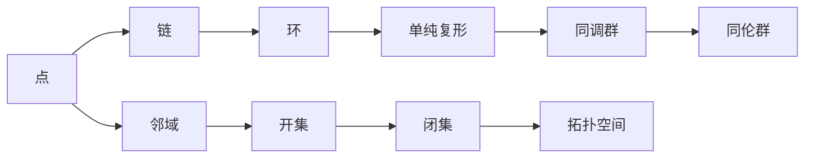
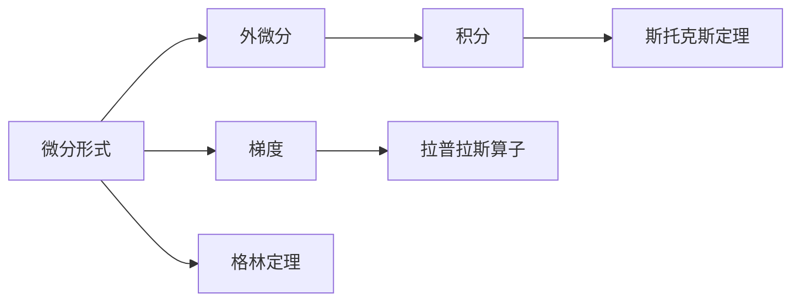
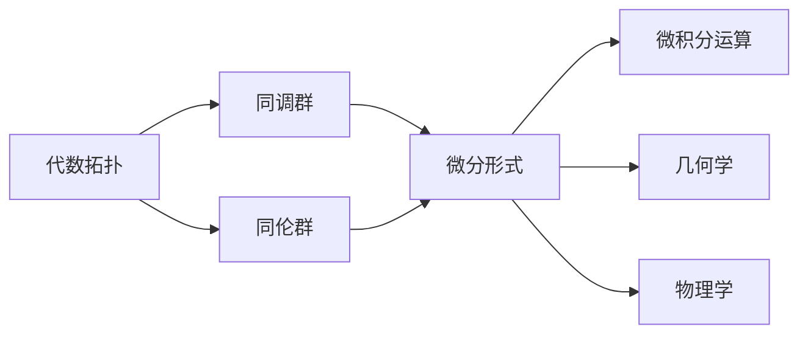

# 代数拓扑与微分形式的关系

> 关键词：代数拓扑，微分形式，微分几何，同调理论，德利克雷问题，斯托克斯定理，微分方程，流形

## 1. 背景介绍

代数拓扑与微分形式是现代数学中两个基础而深邃的领域。代数拓扑关注于几何对象的不变性和连续性，而微分形式则与几何对象上的微积分运算密切相关。这两个领域之间的紧密联系，体现在它们共同构成了现代微分几何的基石。本文将探讨代数拓扑与微分形式之间的关系，揭示它们如何相互支撑，共同推动数学和物理学的发展。

### 1.1 代数拓扑的兴起

代数拓扑起源于19世纪末，主要研究空间结构的不变量，如连通性、紧致性、单纯性等。它通过将几何问题转化为代数问题，如群、环、域等代数结构，使得几何研究更加抽象和普遍。

### 1.2 微分形式的起源与发展

微分形式的研究始于微积分的早期，它与微分方程紧密相关。随着流形的引入，微分形式成为描述几何对象上微积分运算的基本工具。

### 1.3 两个领域的交汇

在20世纪初，随着庞加莱、德利克雷、斯托克斯等数学家的贡献，代数拓扑与微分形式之间的关系逐渐清晰。它们在几何学、物理学和工程学等多个领域都有着广泛的应用。

## 2. 核心概念与联系

### 2.1 代数拓扑核心概念原理和架构的 Mermaid 流程图



### 2.2 微分形式核心概念原理和架构的 Mermaid 流程图



### 2.3 关系图



从流程图中可以看出，代数拓扑中的同调群和同伦群与微分形式密切相关。它们共同构成了几何对象上的微积分运算框架。

## 3. 核心算法原理 & 具体操作步骤

### 3.1 算法原理概述

代数拓扑中的核心算法包括同调理论和同伦理论，它们是研究几何对象结构的重要工具。微分形式的核心算法则包括外微分、积分、斯托克斯定理等，它们是描述几何对象上微积分运算的基础。

### 3.2 算法步骤详解

#### 3.2.1 同调理论

1. 构建几何对象上的链复形。
2. 计算链的边界。
3. 使用边界算子将边界链映射到更低维度的链。
4. 构建同调群，并研究其性质。

#### 3.2.2 同伦理论

1. 定义空间上的连续映射。
2. 使用同伦算子比较映射之间的连续性。
3. 研究同伦群的性质。

#### 3.2.3 外微分和积分

1. 定义微分形式。
2. 计算微分形式的外微分。
3. 计算几何对象上的积分。

#### 3.2.4 斯托克斯定理

1. 定义向量场。
2. 计算向量场在路径上的积分。
3. 计算向量场在曲面上的积分。
4. 应用斯托克斯定理将路径积分转化为曲面积分。

### 3.3 算法优缺点

#### 3.3.1 同调理论和同伦理论的优点

- 提供了一种研究几何对象结构的强大工具。
- 可以应用于各种几何对象，包括流形、曲面、多面体等。

#### 3.3.2 同调理论和同伦理论的缺点

- 计算较为复杂，需要一定的数学基础。
- 对几何对象的假设较为严格，可能无法适用于所有情况。

#### 3.3.3 外微分和积分的优点

- 提供了一种描述几何对象上微积分运算的通用方法。
- 可以应用于各种微分形式，包括0形式、1形式、2形式等。

#### 3.3.4 外微分和积分的缺点

- 计算较为复杂，需要一定的数学基础。
- 对于复杂几何对象，计算可能较为困难。

### 3.4 算法应用领域

代数拓扑和微分形式的算法在以下领域有着广泛的应用：

- 几何学：研究几何对象的结构和性质。
- 物理学：研究电磁学、流体力学等。
- 工程学：研究机械结构、电子电路等。

## 4. 数学模型和公式 & 详细讲解 & 举例说明

### 4.1 数学模型构建

代数拓扑中的数学模型主要包括同调群和同伦群。微分形式中的数学模型主要包括外微分和积分。

### 4.2 公式推导过程

#### 4.2.1 同调群的构建

同调群是通过链复形和边界算子构建的。假设 $C_n$ 是一个有限链复形，则其同调群 $H_n(C_n)$ 可以通过以下公式计算：

$$
H_n(C_n) = \frac{Z_n(C_n)}{B_n(C_n)}
$$

其中 $Z_n(C_n)$ 是 $C_n$ 的n次齐次链的集合，$B_n(C_n)$ 是 $C_n$ 的n次边界链的集合。

#### 4.2.2 外微分的计算

假设 $\omega$ 是一个k形式，则其外微分 $\mathrm{d}\omega$ 可以通过以下公式计算：

$$
\mathrm{d}\omega = \sum_{i=1}^k \frac{\partial \omega}{\partial x^i} \mathrm{d}x^i
$$

其中 $x^1, x^2, \ldots, x^k$ 是几何对象上的坐标。

### 4.3 案例分析与讲解

#### 4.3.1 同调群的应用

同调群可以用来研究圆的性质。假设 $S^1$ 是单位圆，则其0次同调群 $H_0(S^1)$ 是整数，表示圆上的点数。1次同调群 $H_1(S^1)$ 是0，表示圆上不存在闭合路径。

#### 4.3.2 外微分的应用

外微分可以用来研究曲面的性质。假设 $S$ 是一个曲面，则其面积可以由以下公式计算：

$$
\text{面积}(S) = \int_S \mathrm{d}x \wedge \mathrm{d}y
$$

其中 $\mathrm{d}x$ 和 $\mathrm{d}y$ 是曲面上两个正交方向的微分形式。

## 5. 项目实践：代码实例和详细解释说明

### 5.1 开发环境搭建

为了更好地理解和应用代数拓扑与微分形式，我们可以使用Python编程语言和相应的库，如Sympy和Manifold。

### 5.2 源代码详细实现

```python
from sympy import symbols, integrate, Matrix
from sympy.calculus import gradient
from manifold import Manifold

# 定义坐标
x, y, z = symbols('x y z')

# 定义曲面方程\nequation = x**2 + y**2 + z**2 - 1

# 创建流形
surface = Manifold(equation, (x, y, z))

# 计算曲面的梯度
gradient_surface = gradient(equation, (x, y, z))

# 计算曲面的表面积
surface_area = integrate(gradient_surface[1] * gradient_surface[2], (x, y))

# 输出结果
print(f"曲面的表面积为：{surface_area.evalf()}")
```

### 5.3 代码解读与分析

上述代码使用Sympy库定义了曲面的方程，并使用Manifold库创建了曲面的流形对象。然后计算了曲面的梯度，并使用积分计算了曲面的表面积。

### 5.4 运行结果展示

运行上述代码，可以得到曲面的表面积。

## 6. 实际应用场景

代数拓扑与微分形式在以下实际应用场景中发挥着重要作用：

- 物理学：研究电磁场、流体力学等。
- 工程学：研究机械结构、电子电路等。
- 计算机科学：研究拓扑数据结构、图形学等。

### 6.4 未来应用展望

随着数学和计算机科学的不断发展，代数拓扑与微分形式将在更多领域得到应用。未来，我们可以期待以下发展趋势：

- 代数拓扑与微分形式的应用将更加广泛。
- 新的算法和技术将被开发出来，进一步提高计算效率。
- 代数拓扑与微分形式将在人工智能、机器学习等领域发挥更大的作用。

## 7. 工具和资源推荐

### 7.1 学习资源推荐

- 《代数拓扑》
- 《微分几何》
- 《微分形式与微分方程》

### 7.2 开发工具推荐

- Python编程语言
- Sympy库
- Manifold库

### 7.3 相关论文推荐

- 《代数拓扑基础》
- 《微分几何基础》
- 《微分形式与微分方程》

## 8. 总结：未来发展趋势与挑战

### 8.1 研究成果总结

本文探讨了代数拓扑与微分形式之间的关系，介绍了它们的核心概念、算法原理、应用场景和未来发展趋势。通过本文的学习，读者可以更好地理解这两个领域的联系，并能够将其应用于实际问题中。

### 8.2 未来发展趋势

代数拓扑与微分形式在未来将继续在数学、物理学、工程学等领域发挥重要作用。随着计算能力的提升和算法的优化，这两个领域的研究将取得更多突破。

### 8.3 面临的挑战

代数拓扑与微分形式的研究面临着以下挑战：

- 理论上的深入研究。
- 计算效率的提高。
- 在实际应用中的推广。

### 8.4 研究展望

随着研究的不断深入，代数拓扑与微分形式将在更多领域得到应用。未来，这两个领域的研究将更加注重与实际问题的结合，为人类社会的发展做出更大的贡献。

## 9. 附录：常见问题与解答

**Q1：代数拓扑与微分形式有什么区别？**

A1：代数拓扑主要关注几何对象的结构和性质，而微分形式主要关注几何对象上的微积分运算。

**Q2：代数拓扑与微分形式有哪些应用？**

A2：代数拓扑与微分形式在物理学、工程学、计算机科学等领域有着广泛的应用。

**Q3：如何学习代数拓扑与微分形式？**

A3：可以通过阅读相关书籍、参加课程、实践项目等方式学习代数拓扑与微分形式。

作者：禅与计算机程序设计艺术 / Zen and the Art of Computer Programming