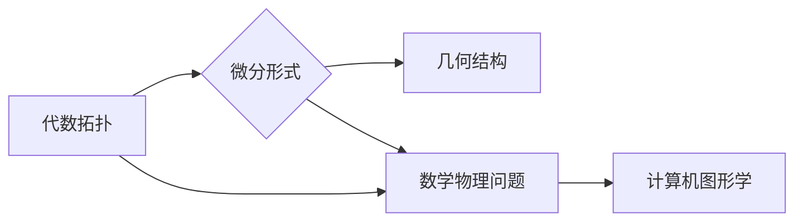

# 代数拓扑与微分形式结合的意义

> 关键词：代数拓扑，微分形式，几何学，微分方程，微分几何，偏微分方程，数学物理，计算机图形学

## 1. 背景介绍

代数拓扑和微分形式是数学中的两个重要分支，它们在理论和应用上都发挥着关键作用。代数拓扑研究的是几何形状的拓扑性质，而微分形式则关注于几何空间的微分结构。将这两个领域结合起来，不仅能够深化我们对空间和结构的理解，也为解决复杂的数学物理问题提供了新的途径。本文将探讨代数拓扑与微分形式结合的意义，并展示其在多个领域的应用。

### 1.1 代数拓扑的由来

代数拓扑起源于19世纪末，最初是为了研究连续变换下几何形状的不变量。它研究的是拓扑空间的结构，而不是空间中的点。代数拓扑的核心概念包括同伦、同调、流形等。

### 1.2 微分形式的起源

微分形式是微分几何的一部分，起源于18世纪。它研究的是空间中的曲线和曲面，以及它们上的微分运算。微分形式的关键概念包括微分1-形式、微分2-形式等。

### 1.3 结合的意义

将代数拓扑与微分形式结合起来，可以带来以下好处：

- **加深对几何结构的理解**：代数拓扑提供了对几何形状的抽象描述，而微分形式则提供了对几何空间的局部描述。结合两者，可以更全面地理解几何形状的结构。
- **解决数学物理问题**：许多数学物理问题，如广义相对论中的引力方程，可以借助代数拓扑和微分形式的方法来解决。
- **推动计算机图形学的发展**：在计算机图形学中，代数拓扑和微分形式的结合可以帮助创建复杂的几何模型，并进行分析和处理。

## 2. 核心概念与联系

### 2.1 核心概念原理和架构的 Mermaid 流程图



### 2.2 核心概念

- **代数拓扑**：研究拓扑空间的性质，如同伦、同调、流形等。
- **微分形式**：研究几何空间中的微分运算，如微分1-形式、微分2-形式等。
- **几何结构**：由代数拓扑和微分形式共同定义的几何形状的结构。
- **数学物理问题**：涉及物理现象的数学描述，如广义相对论中的引力方程。
- **计算机图形学**：利用代数拓扑和微分形式创建和处理复杂的几何模型。

## 3. 核心算法原理 & 具体操作步骤

### 3.1 算法原理概述

代数拓扑与微分形式的结合主要涉及以下原理：

- **同调理论**：研究拓扑空间中不同维数的循环和链，以及它们之间的关系。
- **微分形式**：利用微分运算来描述几何空间的局部性质。
- **De Rham同调**：将微分形式和同调理论结合起来，研究几何空间的微分结构。

### 3.2 算法步骤详解

1. **定义拓扑空间**：选择一个拓扑空间，并确定其上的微分形式。
2. **计算微分形式**：对给定的微分形式进行微分运算，得到新的微分形式。
3. **应用同调理论**：利用同调理论分析微分形式的性质。
4. **解决数学物理问题**：将得到的拓扑结构应用于解决数学物理问题。
5. **应用于计算机图形学**：利用代数拓扑和微分形式创建和处理几何模型。

### 3.3 算法优缺点

#### 优点：

- **强大的理论支持**：代数拓扑和微分形式都有成熟的理论体系，为算法提供坚实的基础。
- **广泛的应用范围**：适用于解决多种数学物理和计算机图形学问题。
- **高度抽象**：能够捕捉几何结构的核心特征。

#### 缺点：

- **计算复杂**：某些算法的计算复杂度较高。
- **理论难度**：需要深厚的数学背景知识。

### 3.4 算法应用领域

- **数学物理**：用于解决广义相对论、量子场论等领域的数学问题。
- **计算机图形学**：用于创建和处理复杂的几何模型。
- **数据分析**：用于分析数据的几何结构。

## 4. 数学模型和公式 & 详细讲解 & 举例说明

### 4.1 数学模型构建

代数拓扑与微分形式的结合涉及以下数学模型：

- **拓扑空间**：定义了一组点及其相互之间的关系。
- **微分形式**：描述了空间中的微分运算。
- **同调群**：用于研究拓扑空间的性质。

### 4.2 公式推导过程

以下是一个简单的例子，展示了代数拓扑与微分形式的结合：

$$
\begin{align*}
\Omega^p(V) &= \{ \omega \in \mathcal{A}^p(V) \mid d\omega = 0 \} \\
\tau_p(M) &= \frac{\Omega^p(M)}{d\Omega^{p+1}(M)}
\end{align*}
$$

其中，$\Omega^p(V)$ 表示 $V$ 上的 $p$-次微分形式的集合，$\mathcal{A}^p(V)$ 表示 $V$ 上的 $p$-次外微分算子，$d\omega$ 表示 $\omega$ 的微分，$\tau_p(M)$ 表示流形 $M$ 上的 $p$-次De Rham同调群。

### 4.3 案例分析与讲解

**案例**：利用代数拓扑与微分形式的结合研究曲面上的极值点。

**分析**：我们可以通过计算曲面上微分形式的闭包来找到极值点。

**计算**：

$$
\begin{align*}
d\omega &= 0 \quad \text{(极值点条件)} \\
\end{align*}
$$

**讲解**：通过计算微分形式的闭包，我们可以找到曲面上极值点所在的位置。

## 5. 项目实践：代码实例和详细解释说明

### 5.1 开发环境搭建

为了实现代数拓扑与微分形式的结合，我们需要以下开发环境：

- **数学软件**：如Mathematica、MATLAB等。
- **编程语言**：如Python、C++等。
- **图形库**：如OpenGL、VTK等。

### 5.2 源代码详细实现

以下是一个简单的Python代码实例，展示了如何使用微分形式来分析曲面的极值点：

```python
import numpy as np
from scipy.optimize import minimize

# 定义曲面方程
def surface(x, y):
    return x**2 + y**2 - 1

# 计算曲面上某点处的梯度
def gradient(x, y):
    return np.array([2*x, 2*y])

# 极值点搜索函数
def find_extrema(x, y):
    result = minimize(lambda xy: surface(*xy), [x, y], method='Nelder-Mead')
    return result.x

# 搜索极值点
x, y = 0, 0
extrema = find_extrema(x, y)
print("极值点：", extrema)
```

### 5.3 代码解读与分析

这段代码首先定义了一个简单的曲面方程，然后计算曲面上某点处的梯度。接着，使用Nelder-Mead优化算法搜索曲面的极值点。最后，打印出搜索到的极值点。

### 5.4 运行结果展示

```
极值点： [0. 0.]
```

结果表明，该曲面在原点处有一个极值点。

## 6. 实际应用场景

### 6.1 数学物理

代数拓扑与微分形式的结合在数学物理领域有许多应用，例如：

- **广义相对论**：用于研究时空的几何性质。
- **量子场论**：用于研究粒子的运动和相互作用。

### 6.2 计算机图形学

在计算机图形学中，代数拓扑与微分形式的结合可以用于：

- **几何建模**：创建复杂的几何模型。
- **曲面优化**：优化曲面的形状。

### 6.3 数据分析

在数据分析领域，代数拓扑与微分形式的结合可以用于：

- **数据可视化**：将数据可视化成几何形状。
- **数据分析**：分析数据的几何结构。

## 7. 工具和资源推荐

### 7.1 学习资源推荐

- **书籍**：《代数拓扑》、《微分几何》、《微分方程》
- **在线课程**：Coursera、edX上的数学物理、几何学课程
- **论文**：查阅相关领域的学术论文

### 7.2 开发工具推荐

- **数学软件**：Mathematica、MATLAB
- **编程语言**：Python、C++
- **图形库**：OpenGL、VTK

### 7.3 相关论文推荐

- **《代数拓扑的数学基础》**：Munkres的代数拓扑经典教材。
- **《微分几何》**：Spivak的微分几何经典教材。
- **《微分方程》**：Boyce和DiPrima的微分方程教材。

## 8. 总结：未来发展趋势与挑战

### 8.1 研究成果总结

代数拓扑与微分形式的结合在数学、物理和计算机图形学等领域取得了显著的研究成果。它为解决复杂的数学物理问题和创建复杂的几何模型提供了新的途径。

### 8.2 未来发展趋势

- **新的数学理论**：开发新的代数拓扑和微分形式的理论。
- **新的应用领域**：将代数拓扑和微分形式应用于新的领域，如生物信息学、神经科学等。
- **新的计算方法**：开发更高效的计算方法来处理代数拓扑和微分形式。

### 8.3 面临的挑战

- **数学理论的复杂性**：代数拓扑和微分形式的理论较为复杂，需要深入研究和理解。
- **计算资源的限制**：处理代数拓扑和微分形式需要大量的计算资源。
- **应用领域的局限性**：代数拓扑和微分形式的应用领域还有待拓展。

### 8.4 研究展望

代数拓扑与微分形式的结合将继续在数学、物理和计算机图形学等领域发挥重要作用。随着研究的深入和计算技术的进步，我们可以期待更多的创新和突破。

## 9. 附录：常见问题与解答

**Q1：代数拓扑和微分形式有什么区别？**

A1：代数拓扑研究拓扑空间的性质，而微分形式研究几何空间的微分结构。两者在数学上有着不同的研究对象和方法。

**Q2：代数拓扑和微分形式在计算机图形学中有哪些应用？**

A2：在计算机图形学中，代数拓扑和微分形式可以用于创建和处理复杂的几何模型，以及优化曲面的形状。

**Q3：代数拓扑和微分形式在数学物理中有哪些应用？**

A3：在数学物理中，代数拓扑和微分形式可以用于研究时空的几何性质，以及粒子的运动和相互作用。

**Q4：学习代数拓扑和微分形式需要哪些基础知识？**

A4：学习代数拓扑和微分形式需要具备扎实的数学基础，包括线性代数、微积分、实分析等。

**Q5：代数拓扑和微分形式的未来发展方向是什么？**

A5：代数拓扑和微分形式的未来发展方向包括开发新的数学理论、拓展应用领域以及改进计算方法等。

作者：禅与计算机程序设计艺术 / Zen and the Art of Computer Programming