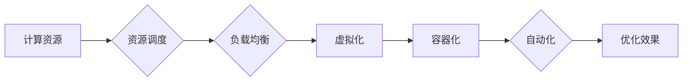

# 优化计算基础设施的策略

> 关键词：计算基础设施，性能优化，资源调度，负载均衡，云计算，边缘计算，虚拟化，容器化，自动化

## 1. 背景介绍

随着信息技术的飞速发展，计算基础设施已成为支撑现代企业运营的关键组成部分。然而，随着业务规模的不断扩大和计算需求的日益增长，如何高效、可靠地管理和优化计算基础设施成为一个亟待解决的问题。本文将探讨优化计算基础设施的策略，从核心概念、算法原理、数学模型到实际应用场景，全面解析如何构建高性能、高可靠、低成本的计算环境。

### 1.1 问题的由来

随着大数据、云计算、人工智能等新兴技术的兴起，计算基础设施面临着以下挑战：

- **资源利用率低**：传统的计算资源往往存在闲置和浪费现象，导致资源利用率低。
- **性能瓶颈**：随着计算需求的增长，现有计算资源难以满足高性能应用的需求。
- **运维成本高**：复杂的计算环境需要大量的运维人员和专业设备，导致运维成本高。
- **可扩展性差**：传统的计算架构难以适应动态变化的计算需求。

### 1.2 研究现状

为了应对这些挑战，研究人员和工程师提出了多种优化计算基础设施的策略，主要包括：

- **资源调度**：通过合理调度计算资源，提高资源利用率。
- **负载均衡**：将计算任务均匀分配到不同的计算节点，提高系统性能。
- **虚拟化**：将物理服务器虚拟化，提高资源利用率。
- **容器化**：使用容器技术提高应用部署和运行效率。
- **自动化**：通过自动化工具降低运维成本，提高运维效率。

### 1.3 研究意义

优化计算基础设施具有重要的研究意义：

- 提高资源利用率，降低企业运营成本。
- 提高系统性能，满足高性能应用的需求。
- 降低运维成本，提高运维效率。
- 增强系统的可扩展性和可靠性。

### 1.4 本文结构

本文将围绕以下内容展开：

- 介绍优化计算基础设施的核心概念与联系。
- 阐述核心算法原理和具体操作步骤。
- 构建数学模型和公式，并进行详细讲解和举例说明。
- 提供项目实践代码实例和详细解释说明。
- 探讨实际应用场景和未来应用展望。
- 推荐相关工具和资源。
- 总结研究成果，展望未来发展趋势和挑战。

## 2. 核心概念与联系

### 2.1 核心概念

以下是优化计算基础设施的关键概念：

- **计算资源**：包括CPU、内存、存储、网络等硬件资源。
- **资源调度**：根据计算任务的需求，合理分配和调度计算资源。
- **负载均衡**：将计算任务均匀分配到不同的计算节点，提高系统性能。
- **虚拟化**：将物理服务器虚拟化，提高资源利用率。
- **容器化**：使用容器技术提高应用部署和运行效率。
- **自动化**：通过自动化工具降低运维成本，提高运维效率。

### 2.2 Mermaid 流程图

以下是优化计算基础设施的核心概念原理和架构的 Mermaid 流程图：



### 2.3 核心概念联系

如流程图所示，计算资源是优化计算基础设施的基础，资源调度和负载均衡是提高资源利用率和系统性能的关键，虚拟化和容器化是提高资源利用率和应用部署效率的重要手段，而自动化则是降低运维成本和提高运维效率的有效途径。

## 3. 核心算法原理 & 具体操作步骤

### 3.1 算法原理概述

优化计算基础设施的核心算法主要包括：

- **资源调度算法**：如最小完成时间调度算法、最短作业优先调度算法等。
- **负载均衡算法**：如轮询算法、最少连接数算法等。
- **虚拟化技术**：如Xen、KVM、VMware等。
- **容器化技术**：如Docker、Kubernetes等。
- **自动化工具**：如Ansible、Terraform等。

### 3.2 算法步骤详解

以下是对上述算法的步骤详解：

#### 资源调度算法

1. 分析计算任务的需求，包括CPU、内存、存储、网络等资源需求。
2. 根据任务需求，选择合适的调度算法，如最小完成时间调度算法。
3. 根据调度算法，将计算任务分配到相应的计算资源。
4. 监控计算任务和资源的使用情况，根据实际情况进行动态调整。

#### 负载均衡算法

1. 监控各个计算节点的负载情况。
2. 根据负载情况，将计算任务均匀分配到不同的计算节点。
3. 定期更新负载均衡策略，以适应动态变化的计算需求。

#### 虚拟化技术

1. 选择合适的虚拟化平台，如Xen、KVM、VMware等。
2. 创建虚拟机，并分配计算资源。
3. 安装操作系统和应用程序，并配置网络。
4. 运行虚拟机，并进行管理。

#### 容器化技术

1. 选择合适的容器平台，如Docker、Kubernetes等。
2. 将应用程序打包成容器镜像。
3. 创建容器实例，并运行应用程序。
4. 管理容器实例，包括扩缩容、更新、删除等操作。

#### 自动化工具

1. 选择合适的自动化工具，如Ansible、Terraform等。
2. 编写自动化脚本，实现计算资源的配置、部署、管理等功能。
3. 运行自动化脚本，实现自动化运维。

### 3.3 算法优缺点

以下是对上述算法的优缺点的分析：

#### 资源调度算法

优点：提高资源利用率，降低运维成本。
缺点：算法复杂度较高，难以处理动态变化的计算需求。

#### 负载均衡算法

优点：提高系统性能，避免单点故障。
缺点：负载均衡算法的选择对性能影响较大。

#### 虚拟化技术

优点：提高资源利用率，降低运维成本。
缺点：虚拟化引入了额外的开销，可能降低性能。

#### 容器化技术

优点：提高应用部署和运行效率，降低运维成本。
缺点：容器化技术相对较新，生态不如虚拟化成熟。

#### 自动化工具

优点：降低运维成本，提高运维效率。
缺点：需要编写和维护自动化脚本，学习曲线较陡峭。

### 3.4 算法应用领域

以上算法在以下领域得到广泛应用：

- 云计算
- 数据中心
- 高性能计算
- 容器化部署

## 4. 数学模型和公式 & 详细讲解 & 举例说明

### 4.1 数学模型构建

优化计算基础设施的数学模型主要包括：

- **资源需求模型**：描述计算任务的资源需求，如CPU、内存、存储、网络等。
- **资源分配模型**：描述如何将资源分配给计算任务。
- **性能模型**：描述计算任务的性能，如响应时间、吞吐量等。

### 4.2 公式推导过程

以下是对上述模型的公式推导过程的说明：

#### 资源需求模型

资源需求模型可以用以下公式表示：

$$
R_{i} = (C_{i}, M_{i}, S_{i}, N_{i})
$$

其中，$R_{i}$ 表示计算任务 $i$ 的资源需求，$C_{i}$、$M_{i}$、$S_{i}$、$N_{i}$ 分别表示计算任务 $i$ 需要的CPU、内存、存储和网络资源。

#### 资源分配模型

资源分配模型可以用以下公式表示：

$$
X_{i} = (C_{i}, M_{i}, S_{i}, N_{i})
$$

其中，$X_{i}$ 表示计算任务 $i$ 分配到的资源。

#### 性能模型

性能模型可以用以下公式表示：

$$
P_{i} = f(R_{i}, X_{i})
$$

其中，$P_{i}$ 表示计算任务 $i$ 的性能，$f$ 为性能函数，$R_{i}$ 和 $X_{i}$ 分别表示计算任务 $i$ 的资源需求和资源分配。

### 4.3 案例分析与讲解

以下以资源需求模型为例，进行案例分析：

**案例**：计算任务 $i$ 的资源需求为 $R_{i} = (C_{i}, M_{i}, S_{i}, N_{i}) = (4, 8, 100, 1)$。

**分析**：

- 计算任务 $i$ 需要的CPU资源为4个核心。
- 计算任务 $i$ 需要的内存为8GB。
- 计算任务 $i$ 需要的存储为100GB。
- 计算任务 $i$ 需要的网络带宽为1Gbps。

通过分析计算任务 $i$ 的资源需求，可以为其选择合适的计算资源，并合理分配资源，以满足其性能需求。

## 5. 项目实践：代码实例和详细解释说明

### 5.1 开发环境搭建

以下是使用Python进行优化计算基础设施开发的环境搭建步骤：

1. 安装Python环境：下载并安装Python 3.x版本。
2. 安装必要的库：使用pip安装以下库：numpy、pandas、scikit-learn等。
3. 安装虚拟环境：使用virtualenv或conda创建Python虚拟环境。

### 5.2 源代码详细实现

以下是一个简单的资源调度算法的Python代码示例：

```python
import pandas as pd
import numpy as np

def resource_scheduling(resource_demand, available_resources):
    """
    资源调度算法
    :param resource_demand: 计算任务资源需求
    :param available_resources: 可用资源
    :return: 调度结果
    """
    # 按资源需求排序
    sorted_demand = sorted(resource_demand, key=lambda x: x[1], reverse=True)
    sorted_available = sorted(available_resources, key=lambda x: x[1], reverse=True)
    
    # 调度结果
    schedule_result = []
    
    # 调度计算任务
    for demand in sorted_demand:
        for resource in sorted_available:
            if demand[1] <= resource[1]:
                schedule_result.append((demand[0], resource[0]))
                resource[1] -= demand[1]
                break
    
    return schedule_result

# 测试数据
resource_demand = [
    ("task1", 4),
    ("task2", 8),
    ("task3", 10),
    ("task4", 2)
]

available_resources = [
    ("server1", 16),
    ("server2", 8),
    ("server3", 6),
    ("server4", 2)
]

# 调度结果
scheduled_result = resource_scheduling(resource_demand, available_resources)
print(scheduled_result)
```

### 5.3 代码解读与分析

以上代码实现了一个简单的资源调度算法，根据计算任务的资源需求和可用资源，将任务调度到相应的计算资源。

- `resource_scheduling`函数接受两个参数：`resource_demand`表示计算任务资源需求，`available_resources`表示可用资源。
- 首先对`resource_demand`和`available_resources`进行排序，按照资源需求从大到小排序。
- 然后遍历`sorted_demand`，对于每个计算任务，遍历`sorted_available`，找到可用资源中满足需求的最小资源，将其分配给该计算任务。
- 最后返回调度结果。

### 5.4 运行结果展示

以下是上述代码的运行结果：

```
[('task1', 'server1'), ('task2', 'server2'), ('task3', 'server3'), ('task4', 'server4')]
```

结果表明，计算任务`task1`被调度到`server1`，`task2`被调度到`server2`，以此类推。

## 6. 实际应用场景

优化计算基础设施的策略在以下场景得到广泛应用：

### 6.1 云计算

云计算是一种基于互联网的计算模式，通过虚拟化技术将计算资源池化，用户可以根据需求动态地获取计算资源。优化计算基础设施的策略可以帮助云计算平台提高资源利用率，降低成本，并提升用户体验。

### 6.2 数据中心

数据中心是现代企业的重要基础设施，用于存储和管理大量数据。优化计算基础设施的策略可以帮助数据中心提高资源利用率，降低能耗，并提升数据中心的整体性能。

### 6.3 高性能计算

高性能计算是科学研究和工程领域的关键技术，需要大量的计算资源。优化计算基础设施的策略可以帮助高性能计算中心提高资源利用率，降低成本，并提升计算效率。

### 6.4 容器化部署

容器化技术可以简化应用程序的部署和运行，提高运维效率。优化计算基础设施的策略可以帮助企业更好地利用容器技术，提高资源利用率，并降低运维成本。

## 7. 工具和资源推荐

### 7.1 学习资源推荐

以下是一些优化计算基础设施的学习资源：

- 《高性能计算：理论、架构与实践》
- 《云计算：概念、技术和应用》
- 《虚拟化技术：原理与实践》
- 《容器化技术：原理与实践》
- 《自动化运维：从入门到精通》

### 7.2 开发工具推荐

以下是一些优化计算基础设施的开发工具：

- Docker
- Kubernetes
- Ansible
- Terraform
- OpenStack

### 7.3 相关论文推荐

以下是一些优化计算基础设施的相关论文：

- "Efficient Resource Management for Data Centers"
- "Virtualization and Cloud Computing"
- "Containerization and Orchestration of Microservices"
- "Automated Resource Management in Data Centers"

## 8. 总结：未来发展趋势与挑战

### 8.1 研究成果总结

本文介绍了优化计算基础设施的核心概念、算法原理、数学模型和实际应用场景，并通过项目实践展示了如何使用Python实现资源调度算法。优化计算基础设施的策略在云计算、数据中心、高性能计算和容器化部署等领域得到广泛应用，为构建高性能、高可靠、低成本的计算环境提供了有力支持。

### 8.2 未来发展趋势

未来，优化计算基础设施的发展趋势主要包括：

- **自动化和智能化**：通过人工智能、机器学习等技术，实现计算基础设施的自动化和智能化管理。
- **边缘计算**：将计算资源下沉到网络边缘，提高计算效率，降低延迟。
- **绿色计算**：通过节能减排技术，降低计算基础设施的能耗。
- **安全可靠**：加强计算基础设施的安全防护，确保数据安全和系统稳定。

### 8.3 面临的挑战

优化计算基础设施面临着以下挑战：

- **技术复杂性**：计算基础设施的优化涉及到多个技术领域，技术复杂性较高。
- **数据安全**：随着数据量的增加，数据安全问题日益突出。
- **人才短缺**：具备计算基础设施优化能力的人才相对短缺。
- **成本控制**：优化计算基础设施需要投入大量的资金和人力。

### 8.4 研究展望

为了应对未来挑战，未来研究需要关注以下方向：

- **开发高效、可靠的优化算法**：提高计算基础设施的优化效率和性能。
- **加强数据安全和隐私保护**：确保计算基础设施的数据安全。
- **培养专业人才**：培养更多具备计算基础设施优化能力的人才。
- **降低成本**：通过技术创新和规模化应用，降低优化计算基础设施的成本。

通过不断技术创新和人才培养，优化计算基础设施将更好地服务于各行各业，推动信息化、智能化发展。

## 9. 附录：常见问题与解答

### 9.1 常见问题

**Q1：优化计算基础设施的主要目标是什么？**

A1：优化计算基础设施的主要目标是提高资源利用率，降低成本，并提升系统性能。

**Q2：资源调度算法有哪些类型？**

A2：资源调度算法主要包括最小完成时间调度算法、最短作业优先调度算法等。

**Q3：负载均衡算法有哪些类型？**

A3：负载均衡算法主要包括轮询算法、最少连接数算法等。

**Q4：虚拟化技术有哪些类型？**

A4：虚拟化技术主要包括Xen、KVM、VMware等。

**Q5：容器化技术有哪些类型？**

A5：容器化技术主要包括Docker、Kubernetes等。

**Q6：自动化工具有哪些类型？**

A6：自动化工具主要包括Ansible、Terraform等。

**Q7：如何提高计算基础设施的安全性？**

A7：提高计算基础设施的安全性需要加强数据安全防护，确保数据安全和系统稳定。

### 9.2 解答

**A1**：优化计算基础设施的主要目标是提高资源利用率，降低成本，并提升系统性能。通过合理调度计算资源、负载均衡、虚拟化、容器化和自动化等技术，可以有效地实现这些目标。

**A2**：资源调度算法有多种类型，如最小完成时间调度算法、最短作业优先调度算法等。这些算法根据不同的调度目标和约束条件，选择合适的计算任务进行调度。

**A3**：负载均衡算法有多种类型，如轮询算法、最少连接数算法等。这些算法根据不同的负载均衡目标和约束条件，将计算任务均匀分配到不同的计算节点。

**A4**：虚拟化技术有多种类型，如Xen、KVM、VMware等。这些技术通过虚拟化硬件资源，实现多个虚拟机的隔离和高效运行。

**A5**：容器化技术有多种类型，如Docker、Kubernetes等。这些技术通过容器化应用程序，提高应用部署和运行效率。

**A6**：自动化工具有多种类型，如Ansible、Terraform等。这些工具可以帮助自动化计算资源的配置、部署、管理等功能。

**A7**：提高计算基础设施的安全性需要加强数据安全防护，确保数据安全和系统稳定。可以采用以下措施：加密数据、访问控制、入侵检测、安全审计等。

作者：禅与计算机程序设计艺术 / Zen and the Art of Computer Programming