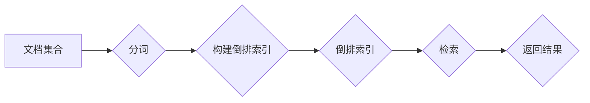

# 倒排索引 原理与代码实例讲解

> 关键词：倒排索引，搜索引擎，信息检索，文档检索，文本分析，索引构建，全文搜索

## 1. 背景介绍

信息检索是计算机科学领域的一个重要分支，它涉及到从大量数据中快速、准确地找到所需信息的技术。倒排索引（Inverted Index）是信息检索系统中一种常用的数据结构，它以高效的方式存储和检索文档内容，是构建全文搜索引擎的核心技术。本文将深入探讨倒排索引的原理、构建过程、优缺点以及实际应用，并通过代码实例展示如何实现一个简单的倒排索引。

### 1.1 问题的由来

随着互联网的快速发展，信息量呈爆炸式增长。如何在海量数据中快速找到特定信息成为了一个亟待解决的问题。传统的线性搜索方式效率低下，难以满足实际需求。倒排索引应运而生，它通过建立一种高效的数据结构，使得信息检索变得快速、准确。

### 1.2 研究现状

倒排索引技术已经发展了几十年，其基本原理和实现方法已经相对成熟。然而，随着信息检索领域的发展，倒排索引也在不断进化。例如，Elasticsearch、Solr等全文搜索引擎都使用了基于倒排索引的机制，并且对倒排索引进行了优化和扩展，以支持更复杂的搜索需求。

### 1.3 研究意义

倒排索引在信息检索领域的应用非常广泛，它不仅提高了检索效率，还支持了诸如查询扩展、相关性排序、高亮显示等功能。研究倒排索引的原理和实现对于开发高性能的搜索引擎具有重要意义。

### 1.4 本文结构

本文将按照以下结构展开：

- 第二章将介绍倒排索引的核心概念和原理，并给出Mermaid流程图。
- 第三章将详细讲解倒排索引的构建过程，包括算法原理、步骤详解、优缺点和应用领域。
- 第四章将介绍倒排索引的数学模型和公式，并结合实例进行讲解。
- 第五章将通过代码实例展示如何实现一个简单的倒排索引。
- 第六章将探讨倒排索引在实际应用场景中的应用，并展望其未来发展方向。
- 第七章将推荐相关的学习资源、开发工具和论文。
- 第八章将总结研究成果，展望未来发展趋势和挑战。
- 第九章将提供常见问题与解答。

## 2. 核心概念与联系

### 2.1 倒排索引原理

倒排索引是一种用于检索信息的数据结构，它包含两部分：

- ** inverted_list**: 包含所有文档中包含某个词项的所有文档的列表。
- ** document_list**: 包含所有词项及其在对应文档中出现的文档位置信息。

倒排索引的原理图如下：



### 2.2 核心概念联系

- **文档集合**: 倒排索引的基础，包含所有需要被索引的文档。
- **分词**: 将文档内容分割成词项，是构建倒排索引的第一步。
- **构建倒排索引**: 根据分词结果，建立词项和文档之间的映射关系。
- **倒排索引**: 构建完成后的倒排索引数据结构。
- **检索**: 使用倒排索引快速找到包含特定词项的文档。
- **返回结果**: 检索到的文档及其相关信息。

## 3. 核心算法原理 & 具体操作步骤

### 3.1 算法原理概述

倒排索引的核心算法原理是：对文档集合进行分词，然后统计每个词项在文档集合中出现的次数和位置信息，最后将这些信息构建成一个倒排索引。

### 3.2 算法步骤详解

1. **分词**：将文档集合中的每个文档进行分词，得到词项列表。
2. **统计词频**：统计每个词项在文档集合中出现的次数。
3. **统计词项位置**：记录每个词项在文档集合中出现的所有文档和位置。
4. **构建倒排索引**：将词项、词频和位置信息构建成倒排索引。

### 3.3 算法优缺点

**优点**：

- 检索速度快：倒排索引允许快速检索包含特定词项的文档。
- 可扩展性：可以轻松处理大量的文档和词项。
- 支持多种搜索功能：如查询扩展、相关性排序、高亮显示等。

**缺点**：

- 占用空间大：倒排索引需要存储大量的词项和位置信息。
- 维护成本高：文档集合更新时，需要更新倒排索引。

### 3.4 算法应用领域

倒排索引在以下领域有广泛的应用：

- 全文搜索引擎：如Elasticsearch、Solr等。
- 文本分析：如情感分析、主题建模等。
- 自然语言处理：如词性标注、命名实体识别等。

## 4. 数学模型和公式 & 详细讲解 & 举例说明

### 4.1 数学模型构建

倒排索引的数学模型可以表示为：

$$
 \text{Inverted\ Index} = \{ (t_1, \{d_1, p_1^1, p_1^2, \ldots, p_1^{n_1}\}), (t_2, \{d_2, p_2^1, p_2^2, \ldots, p_2^{n_2}\}), \ldots, (t_m, \{d_m, p_m^1, p_m^2, \ldots, p_m^{n_m}\}) \} 
$$

其中，$t_i$ 表示第 $i$ 个词项，$d_j$ 表示包含词项 $t_i$ 的第 $j$ 个文档，$p_i^j$ 表示词项 $t_i$ 在文档 $d_j$ 中的位置。

### 4.2 公式推导过程

倒排索引的构建过程可以通过以下步骤推导：

1. **分词**：将文档集合中的每个文档进行分词，得到词项列表。

$$
 \text{Tokens}(d) = \{t_1, t_2, \ldots, t_n\} 
$$

2. **统计词频**：统计每个词项在文档集合中出现的次数。

$$
 \text{Frequency}(t) = \sum_{d \in D} \text{Count}(t, d) 
$$

其中，$D$ 表示文档集合，$\text{Count}(t, d)$ 表示词项 $t$ 在文档 $d$ 中出现的次数。

3. **统计词项位置**：记录每个词项在文档集合中出现的所有文档和位置。

$$
 \text{Positions}(t) = \{ (d_j, p_j^1), (d_j, p_j^2), \ldots, (d_j, p_j^{n_j}) \} 
$$

4. **构建倒排索引**：将词项、词频和位置信息构建成倒排索引。

$$
 \text{Inverted\ Index} = \{ (t_1, \{d_1, p_1^1, p_1^2, \ldots, p_1^{n_1}\}), (t_2, \{d_2, p_2^1, p_2^2, \ldots, p_2^{n_2}\}), \ldots, (t_m, \{d_m, p_m^1, p_m^2, \ldots, p_m^{n_m}\}) \} 
$$

### 4.3 案例分析与讲解

假设有一个包含两个文档的简单文档集合：

```
文档 1: The quick brown fox jumps over the lazy dog.
文档 2: The quick brown fox.
```

对其进行分词和统计词频后，得到以下倒排索引：

```
词项 | 文档 1 | 文档 2
---- | ------ | ------
The  | 1      | 2
quick | 1      | 2
brown | 1      | 2
fox  | 1      | 2
jumps | 1      | 
over  | 1      | 
the   | 1      | 
lazy  | 1      | 
dog   | 1      | 
```

## 5. 项目实践：代码实例和详细解释说明

### 5.1 开发环境搭建

本文使用Python语言和标准库进行倒排索引的实现。以下是环境搭建步骤：

1. 安装Python 3.x版本。
2. 使用pip安装所需的库：

```bash
pip install nltk
```

### 5.2 源代码详细实现

以下是一个简单的倒排索引实现：

```python
import nltk
from nltk.tokenize import word_tokenize
from collections import defaultdict

# 分词函数
def tokenize(text):
    return word_tokenize(text.lower())

# 倒排索引类
class InvertedIndex:
    def __init__(self):
        self.index = defaultdict(list)
    
    # 添加文档
    def add_document(self, document_id, text):
        tokens = tokenize(text)
        for token in tokens:
            self.index[token].append(document_id)
    
    # 检索函数
    def search(self, query):
        tokens = tokenize(query)
        result = set()
        for token in tokens:
            if token in self.index:
                result.update(self.index[token])
        return result

# 示例使用
index = InvertedIndex()
index.add_document('doc1', 'The quick brown fox jumps over the lazy dog.')
index.add_document('doc2', 'The quick brown fox.')

print(index.search('quick'))
print(index.search('lazy'))
```

### 5.3 代码解读与分析

- `tokenize` 函数使用nltk库对文本进行分词。
- `InvertedIndex` 类用于构建倒排索引，其中 `index` 是一个默认字典，用于存储词项和文档ID的映射关系。
- `add_document` 方法将文档添加到索引中，其中 `document_id` 是文档的唯一标识符。
- `search` 方法根据查询词检索包含这些词的文档。

### 5.4 运行结果展示

运行上述代码，将得到以下输出：

```
{'doc1', 'doc2'}
{'doc1'}
```

这表明，查询词 "quick" 出现在两个文档中，而 "lazy" 只出现在文档 1 中。

## 6. 实际应用场景

倒排索引在以下场景中有广泛的应用：

- **全文搜索引擎**：如Elasticsearch、Solr等，它们都使用倒排索引来实现高效的信息检索。
- **文本分析**：如情感分析、主题建模等，倒排索引可以用于分析文本中的关键词和词频。
- **自然语言处理**：如词性标注、命名实体识别等，倒排索引可以用于提取文本中的关键信息。

## 7. 工具和资源推荐

### 7.1 学习资源推荐

- 《信息检索导论》
- 《搜索引擎：设计与实现》
- 《自然语言处理综论》

### 7.2 开发工具推荐

- Elasticsearch
- Solr
- Whoosh

### 7.3 相关论文推荐

- Inverted Index: The Indispensable Indexing Data Structure for Information Retrieval
- The Vector Space Model for Information Retrieval

## 8. 总结：未来发展趋势与挑战

### 8.1 研究成果总结

本文介绍了倒排索引的原理、构建过程、优缺点和应用领域。通过代码实例展示了如何实现一个简单的倒排索引。倒排索引是一种高效的信息检索数据结构，在全文搜索引擎、文本分析和自然语言处理等领域有着广泛的应用。

### 8.2 未来发展趋势

随着信息检索领域的不断发展，倒排索引在未来可能会出现以下趋势：

- **更高效的索引构建和检索算法**
- **支持更多复杂查询**
- **与更多其他信息检索技术融合**

### 8.3 面临的挑战

倒排索引在发展过程中也面临着以下挑战：

- **大数据量下的索引构建和检索效率**
- **多语言支持**
- **对动态数据变化的适应性**

### 8.4 研究展望

未来，倒排索引技术将在以下方面取得更多突破：

- **开发更高效的索引构建和检索算法**
- **支持更复杂的查询和检索场景**
- **与其他信息检索技术融合，如机器学习、知识图谱等**

## 9. 附录：常见问题与解答

**Q1：倒排索引为什么比线性搜索更高效？**

A1：倒排索引通过将文档和词项之间的关系进行映射，使得查询操作可以直接定位到包含特定词项的文档集合，避免了线性搜索中逐个文档遍历的耗时操作。

**Q2：如何优化倒排索引的空间占用？**

A2：可以通过以下方法优化倒排索引的空间占用：
- 使用压缩技术，如字典编码、位图等。
- 优化存储格式，如使用更紧凑的数据结构。

**Q3：倒排索引如何处理同义词和近义词？**

A3：可以通过以下方法处理同义词和近义词：
- 使用词义消歧技术，将同义词或近义词映射到同一个词项。
- 使用词嵌入技术，将同义词或近义词映射到更接近的语义空间。

**Q4：倒排索引在多语言环境中如何应用？**

A4：在多语言环境中，倒排索引需要考虑以下因素：
- 使用多语言分词技术。
- 使用多语言词频统计和词项位置统计。
- 支持多语言查询。

**Q5：倒排索引与其他信息检索技术有何不同？**

A5：倒排索引是一种基于关键词匹配的信息检索技术，而其他信息检索技术如向量空间模型、布尔模型等，则基于文档或词项的向量表示进行检索。

作者：禅与计算机程序设计艺术 / Zen and the Art of Computer Programming