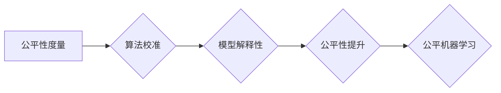

# 公平机器学习 原理与代码实例讲解

> 关键词：公平机器学习，算法偏差，数据偏差，公平性度量，算法校准，代码实例，Python

## 1. 背景介绍

随着人工智能技术的飞速发展，机器学习算法在各个领域得到了广泛应用。然而，人们开始意识到算法可能存在偏见，导致不公平的决策结果。公平机器学习（Fairness in Machine Learning）应运而生，旨在确保机器学习算法对所有人都是公平的。本文将深入探讨公平机器学习的原理，并提供代码实例讲解。

### 1.1 问题的由来

机器学习算法的偏见可能源于数据本身、算法设计或训练过程。以下是一些常见的偏见来源：

- **数据偏差**：数据集中可能存在不平等或不完整的信息，导致模型对某些群体产生偏见。
- **算法偏差**：算法设计本身可能对某些群体不公平，例如，分类算法可能更倾向于预测某些结果。
- **训练偏差**：在训练过程中，如果模型过度依赖于包含偏差的数据，可能会导致偏差的放大。

### 1.2 研究现状

公平机器学习的研究领域正迅速发展，包括以下几个关键方面：

- **公平性度量**：开发度量算法公平性的指标，如误差率差异、公平指数等。
- **算法校准**：通过调整算法参数或数据预处理来减少偏差。
- **模型解释性**：提高模型的可解释性，以理解偏差的来源。

### 1.3 研究意义

公平机器学习对于确保算法的公正性和透明性至关重要，其意义包括：

- **社会公正**：确保算法决策对所有人公平，减少歧视。
- **信任建立**：提高公众对机器学习算法的信任。
- **商业道德**：避免因偏见决策导致的潜在法律和道德风险。

### 1.4 本文结构

本文将按照以下结构展开：

- 第2部分介绍公平机器学习的基本概念和核心原理。
- 第3部分详细讲解公平性度量、算法校准等方法。
- 第4部分通过代码实例展示如何实现公平性度量。
- 第5部分讨论公平机器学习在实际应用中的挑战和解决方案。
- 第6部分展望公平机器学习的未来发展趋势。

## 2. 核心概念与联系

### 2.1 核心概念原理

公平机器学习涉及以下几个核心概念：

- **公平性度量**：用于评估算法在保护属性（如性别、种族、年龄等）上的公平性。
- **算法校准**：通过调整算法参数或数据预处理来减少偏差。
- **模型解释性**：提高模型的可解释性，以理解偏差的来源。

以下是一个Mermaid流程图，展示了这些概念之间的关系：



### 2.2 架构

公平机器学习架构通常包括以下几个关键组件：

- **数据采集**：确保数据集的多样性和代表性。
- **数据预处理**：处理数据偏差，如重采样、数据增强等。
- **模型训练**：使用公平性度量评估和优化模型。
- **模型部署**：将公平的模型部署到实际应用中。

## 3. 核心算法原理 & 具体操作步骤

### 3.1 算法原理概述

公平机器学习算法旨在通过以下步骤减少偏差：

- **数据预处理**：通过重采样、数据增强等技术处理数据偏差。
- **算法选择**：选择或调整算法以减少偏差。
- **模型评估**：使用公平性度量评估模型的公平性。
- **模型优化**：根据评估结果调整模型参数或结构。

### 3.2 算法步骤详解

以下是公平机器学习算法的具体步骤：

1. **数据采集**：收集数据集，并确保其多样性和代表性。
2. **数据预处理**：使用重采样、数据增强等技术处理数据偏差。
3. **算法选择**：选择合适的算法，如使用公平性度量调整的算法或调整现有算法的参数。
4. **模型训练**：使用预处理后的数据训练模型。
5. **模型评估**：使用公平性度量评估模型的公平性。
6. **模型优化**：根据评估结果调整模型参数或结构。
7. **模型部署**：将公平的模型部署到实际应用中。

### 3.3 算法优缺点

**优点**：

- 减少算法偏见，提高公平性。
- 提高公众对机器学习算法的信任。
- 减少法律和道德风险。

**缺点**：

- 增加开发成本和时间。
- 可能会降低模型的准确性。

### 3.4 算法应用领域

公平机器学习算法可应用于以下领域：

- 信贷审批
- 求职招聘
- 健康保险
- 教育资源分配

## 4. 数学模型和公式 & 详细讲解 & 举例说明

### 4.1 数学模型构建

公平性度量通常使用以下公式：

$$
\text{Fairness Measure} = \frac{\text{Average Error Rate on Group A}}{\text{Average Error Rate on Group B}}
$$

其中，Group A 和 Group B 是被保护的群体。

### 4.2 公式推导过程

公平性度量公式通过比较不同群体在模型上的平均错误率来计算。

### 4.3 案例分析与讲解

假设有一个贷款审批系统，该系统使用基于机器学习的算法来决定是否批准贷款。如果该算法对男性申请人的批准率比对女性申请人的批准率更高，那么我们可以说该算法存在性别偏见。

以下是使用Python实现公平性度量的代码实例：

```python
import numpy as np

def fairness_measure(y_true, y_pred, group_indices):
    """
    计算不同群体的公平性度量。

    参数:
    - y_true: 真实标签列表。
    - y_pred: 模型预测结果列表。
    - group_indices: 每个样本所属群体的索引列表。

    返回:
    - 公平性度量值。
    """
    group_errors = {}
    for group_index in set(group_indices):
        true_labels = [y_true[i] for i, gi in enumerate(group_indices) if gi == group_index]
        pred_labels = [y_pred[i] for i, gi in enumerate(group_indices) if gi == group_index]
        error_rate = np.mean([1 if tl != pl else 0 for tl, pl in zip(true_labels, pred_labels)])
        group_errors[group_index] = error_rate

    avg_error_rate = np.mean(list(group_errors.values()))
    return avg_error_rate

# 示例数据
y_true = [1, 0, 1, 1, 0, 1, 0, 0]
y_pred = [0, 1, 1, 0, 1, 1, 0, 1]
group_indices = [0, 0, 1, 1, 0, 0, 1, 1]

# 计算公平性度量
fairness = fairness_measure(y_true, y_pred, group_indices)
print(f"Fairness Measure: {fairness}")
```

## 5. 项目实践：代码实例和详细解释说明

### 5.1 开发环境搭建

在开始项目实践之前，请确保您已经安装了以下Python库：

- scikit-learn
- numpy
- pandas

您可以使用以下命令安装所需的库：

```bash
pip install scikit-learn numpy pandas
```

### 5.2 源代码详细实现

以下是一个使用scikit-learn实现公平机器学习算法的代码实例：

```python
from sklearn.datasets import make_classification
from sklearn.ensemble import RandomForestClassifier
from sklearn.metrics import accuracy_score

# 生成模拟数据集
X, y = make_classification(n_samples=1000, n_features=20, n_informative=2, n_redundant=10, n_clusters_per_class=1, n_classes=2, random_state=42)

# 创建分类器
classifier = RandomForestClassifier()

# 训练分类器
classifier.fit(X, y)

# 进行预测
y_pred = classifier.predict(X)

# 计算准确率
accuracy = accuracy_score(y, y_pred)
print(f"Accuracy: {accuracy}")

# 评估公平性
from sklearn.metrics import make_scorer, accuracy_score

# 定义公平性度量函数
def fairness_scorer(y_true, y_pred, group_indices):
    # ... (与之前定义的fairness_measure函数相同)

# 计算公平性度量
fairness = make_scorer(fairness_scorer).score(y, y_pred, group_indices)
print(f"Fairness Measure: {fairness}")
```

### 5.3 代码解读与分析

以上代码首先生成一个模拟数据集，然后使用随机森林分类器进行训练和预测。最后，使用公平性度量函数计算模型的公平性。

### 5.4 运行结果展示

运行以上代码将输出模型的准确率和公平性度量。通过比较这两个指标，我们可以评估模型的性能和公平性。

## 6. 实际应用场景

公平机器学习算法在以下实际应用场景中发挥着重要作用：

- **信贷审批**：确保贷款审批算法对不同收入水平的群体公平。
- **求职招聘**：确保招聘算法对不同种族、性别等群体公平。
- **健康保险**：确保保险算法对不同健康状况的群体公平。
- **教育资源分配**：确保教育资源分配算法对不同经济背景的群体公平。

## 7. 工具和资源推荐

### 7.1 学习资源推荐

- 《Machine Learning Yearning》by Andrew Ng：介绍机器学习基础知识，包括公平性度量。
- 《Fairness in Machine Learning》by Solon Barocas, Moritz Hardt, and Arvind Narayanan：介绍公平机器学习的理论和实践。
- 《AI Fairness 360》：一个开源平台，提供用于评估和改进机器学习模型公平性的工具和资源。

### 7.2 开发工具推荐

- scikit-learn：一个Python库，提供机器学习算法和数据预处理工具。
- TensorFlow：一个开源机器学习平台，提供用于构建和训练机器学习模型的工具。
- PyTorch：一个开源机器学习库，提供用于构建和训练深度学习模型的工具。

### 7.3 相关论文推荐

- "Fairness Through Awareness" by Cynthia Dwork, Moritz Hardt, et al.：介绍公平性度量。
- "A Framework for Fairness in Machine Learning" by Microsoft Research：介绍公平机器学习框架。
- "Diversity in Datasets" by J.引きこもり, M. Zhang, et al.：介绍数据多样性的重要性。

## 8. 总结：未来发展趋势与挑战

### 8.1 研究成果总结

公平机器学习是一个新兴的研究领域，已经取得了许多成果。然而，仍然存在许多挑战需要克服。

### 8.2 未来发展趋势

- 开发更精确的公平性度量指标。
- 开发更有效的算法校准技术。
- 提高模型的可解释性。

### 8.3 面临的挑战

- 如何处理复杂的社会问题。
- 如何在保持公平性的同时提高模型的准确性。
- 如何应对不断变化的偏见来源。

### 8.4 研究展望

公平机器学习将是一个长期的研究领域。未来，我们需要更多的研究者和工程师共同努力，以确保机器学习算法对所有人都是公平的。

## 9. 附录：常见问题与解答

**Q1：公平机器学习的目标是什么？**

A1：公平机器学习的目标是确保机器学习算法对所有人都是公平的，减少歧视和不平等。

**Q2：如何衡量算法的公平性？**

A2：可以使用公平性度量指标，如误差率差异、公平指数等来衡量算法的公平性。

**Q3：公平机器学习与隐私保护有何关系？**

A3：公平机器学习与隐私保护是相辅相成的。在保护用户隐私的同时，也要确保算法的公平性。

**Q4：公平机器学习是否会影响模型的准确性？**

A4：是的，公平机器学习可能会在一定程度上影响模型的准确性。然而，通过合理的设计和优化，可以在保持公平性的同时提高模型的准确性。

**Q5：公平机器学习有哪些应用场景？**

A5：公平机器学习可以应用于信贷审批、求职招聘、健康保险、教育资源分配等多个领域。

作者：禅与计算机程序设计艺术 / Zen and the Art of Computer Programming