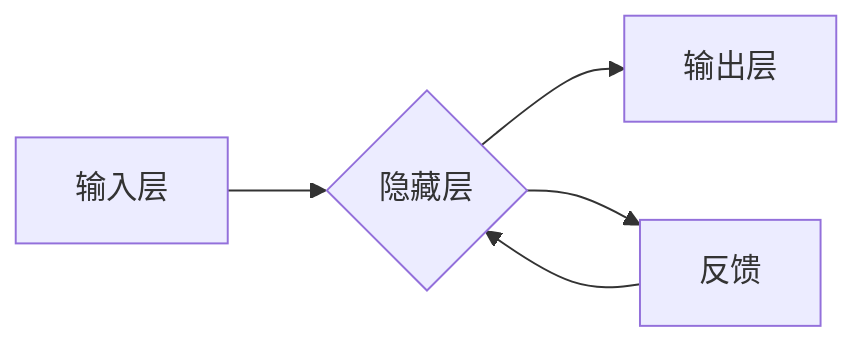

# 前馈网络在AI中的应用

> 关键词：前馈神经网络，深度学习，人工智能，多层感知机，卷积神经网络，递归神经网络，迁移学习，计算机视觉，自然语言处理，强化学习

## 1. 背景介绍

### 1.1 问题的由来

人工智能（AI）自20世纪50年代诞生以来，经历了多次兴衰。随着计算能力的提升和大数据的涌现，深度学习（Deep Learning）在近年来的AI领域取得了突破性的进展。其中，前馈神经网络（Feedforward Neural Networks）作为深度学习的重要模型之一，发挥着至关重要的作用。本文将深入探讨前馈网络在AI中的应用，分析其原理、实现方法以及未来发展趋势。

### 1.2 研究现状

前馈网络在多个AI领域取得了显著的成果，包括计算机视觉、自然语言处理、语音识别、推荐系统等。随着模型结构和训练算法的不断改进，前馈网络的应用范围和性能也在不断提升。然而，前馈网络在处理序列数据、长距离依赖和复杂交互等方面仍存在局限性，需要进一步研究和探索。

### 1.3 研究意义

前馈网络作为深度学习的基础模型，在AI领域的应用具有以下研究意义：

- 推动AI技术的发展：前馈网络的优化和改进有助于推动深度学习技术的进步，为AI领域的研究提供更多可能性。
- 促进AI应用落地：前馈网络在多个领域的成功应用，有助于促进AI技术的产业化进程，为各行各业带来变革。
- 丰富AI理论体系：前馈网络的研究有助于深化对神经网络、深度学习等AI理论的认识，为AI学科发展提供理论基础。

### 1.4 本文结构

本文将围绕前馈网络在AI中的应用展开，内容安排如下：

- 第2部分，介绍前馈网络的核心概念和联系。
- 第3部分，阐述前馈网络的原理和实现方法。
- 第4部分，分析前馈网络的数学模型和公式，并进行实例讲解。
- 第5部分，给出前馈网络的代码实例和详细解释。
- 第6部分，探讨前馈网络在实际应用场景中的具体应用案例。
- 第7部分，展望前馈网络的未来发展趋势和挑战。
- 第8部分，总结全文，提出研究展望。

## 2. 核心概念与联系

### 2.1 前馈神经网络

前馈神经网络是一种单向传播的神经网络，信息从前向后传递，不形成反馈循环。其基本结构由输入层、隐藏层和输出层组成。输入层接收外部输入数据，隐藏层进行特征提取和变换，输出层生成最终输出。

### 2.2 多层感知机

多层感知机（Multilayer Perceptron，MLP）是一种简单的前馈神经网络，通常由一个输入层、一个或多个隐藏层和一个输出层组成。MLP是深度学习的基石，为后续的复杂模型奠定了基础。

### 2.3 卷积神经网络

卷积神经网络（Convolutional Neural Networks，CNN）是一种特殊的前馈神经网络，主要用于处理具有局部性的数据，如图像、视频等。CNN通过卷积和池化操作提取图像特征，在计算机视觉领域取得了显著的成果。

### 2.4 递归神经网络

递归神经网络（Recurrent Neural Networks，RNN）是一种循环神经网络，可以处理序列数据，如时间序列、语音信号等。RNN通过隐藏状态捕捉序列数据中的长期依赖关系。

### 2.5 Mermaid流程图

以下为前馈神经网络的基本结构流程图：



## 3. 核心算法原理 & 具体操作步骤

### 3.1 算法原理概述

前馈神经网络通过多层非线性变换，将输入数据映射到输出数据。其基本原理包括：

1. 前向传播：将输入数据依次通过各个层进行变换，最终得到输出数据。
2. 损失函数：衡量预测输出与真实值之间的差异，如均方误差、交叉熵等。
3. 反向传播：根据损失函数计算梯度，并更新模型参数，使预测输出更接近真实值。
4. 激活函数：引入非线性因素，使模型具有非线性变换能力，如ReLU、Sigmoid等。

### 3.2 算法步骤详解

前馈神经网络的微调步骤如下：

1. 定义网络结构：根据任务需求，设计输入层、隐藏层和输出层的节点数量。
2. 选择激活函数：选择合适的激活函数，如ReLU、Sigmoid等。
3. 定义损失函数：根据任务类型，选择合适的损失函数，如均方误差、交叉熵等。
4. 选择优化算法：选择合适的优化算法，如SGD、Adam等。
5. 训练模型：使用训练数据进行迭代训练，更新模型参数。
6. 评估模型：使用验证数据评估模型性能，并根据评估结果调整模型参数。
7. 部署模型：将训练好的模型部署到实际应用中。

### 3.3 算法优缺点

前馈神经网络的优点如下：

- 理论基础完善：前馈神经网络具有明确的数学基础，便于理论分析和优化。
- 计算效率高：前馈神经网络的计算过程可以并行化，提高计算效率。
- 应用范围广：前馈神经网络在多个AI领域都有广泛应用，如计算机视觉、自然语言处理等。

前馈神经网络的缺点如下：

- 局部最优：前馈神经网络容易出现局部最优解，难以找到全局最优解。
- 模型复杂度：随着网络层数的增加，模型复杂度呈指数增长，难以进行高效训练。
- 特征提取能力有限：前馈神经网络在处理复杂特征时，提取能力有限。

### 3.4 算法应用领域

前馈神经网络在以下AI领域具有广泛应用：

- 计算机视觉：图像识别、目标检测、图像分割等。
- 自然语言处理：文本分类、情感分析、机器翻译等。
- 语音识别：语音识别、语音合成等。
- 机器人：路径规划、物体抓取等。

## 4. 数学模型和公式 & 详细讲解 & 举例说明

### 4.1 数学模型构建

前馈神经网络的数学模型可以表示为：

$$
y = f(\theta, x)
$$

其中，$x$ 为输入数据，$y$ 为输出数据，$\theta$ 为模型参数，$f$ 为非线性变换函数。

### 4.2 公式推导过程

以下以单层感知机为例，推导其数学模型：

1. 输入层到隐藏层的变换：

$$
z_i = \sum_{j=1}^n w_{ij}x_j + b_i
$$

其中，$z_i$ 为隐藏层节点 $i$ 的输入，$w_{ij}$ 为输入层节点 $j$ 到隐藏层节点 $i$ 的权重，$b_i$ 为隐藏层节点 $i$ 的偏置。

2. 隐藏层到输出层的变换：

$$
y = \sigma(z)
$$

其中，$\sigma$ 为激活函数，如Sigmoid、ReLU等。

### 4.3 案例分析与讲解

以下以图像分类任务为例，使用PyTorch框架实现一个简单的卷积神经网络：

```python
import torch
import torch.nn as nn

class ConvNet(nn.Module):
    def __init__(self):
        super(ConvNet, self).__init__()
        self.conv1 = nn.Conv2d(3, 16, kernel_size=3, padding=1)
        self.relu = nn.ReLU()
        self.pool = nn.MaxPool2d(kernel_size=2, stride=2)
        self.fc1 = nn.Linear(16 * 32 * 32, 128)
        self.fc2 = nn.Linear(128, 10)

    def forward(self, x):
        x = self.pool(self.relu(self.conv1(x)))
        x = x.view(-1, 16 * 32 * 32)
        x = self.relu(self.fc1(x))
        x = self.fc2(x)
        return x

# 实例化模型
model = ConvNet()

# 定义损失函数和优化器
criterion = nn.CrossEntropyLoss()
optimizer = torch.optim.Adam(model.parameters(), lr=0.001)

# 训练模型
# ...

# 评估模型
# ...
```

以上代码展示了如何使用PyTorch框架构建一个简单的卷积神经网络，并进行了训练和评估。

## 5. 项目实践：代码实例和详细解释说明

### 5.1 开发环境搭建

在进行前馈网络的项目实践前，需要准备以下开发环境：

1. Python 3.x版本
2. PyTorch深度学习框架
3. CUDA（可选，用于GPU加速）

### 5.2 源代码详细实现

以下使用PyTorch框架实现一个简单的多层感知机，用于二分类任务：

```python
import torch
import torch.nn as nn
import torch.optim as optim

class MLP(nn.Module):
    def __init__(self, input_size, hidden_size, output_size):
        super(MLP, self).__init__()
        self.fc1 = nn.Linear(input_size, hidden_size)
        self.relu = nn.ReLU()
        self.fc2 = nn.Linear(hidden_size, output_size)

    def forward(self, x):
        x = self.fc1(x)
        x = self.relu(x)
        x = self.fc2(x)
        return x

# 定义输入大小、隐藏层大小和输出大小
input_size = 784
hidden_size = 128
output_size = 10

# 实例化模型
model = MLP(input_size, hidden_size, output_size)

# 定义损失函数和优化器
criterion = nn.CrossEntropyLoss()
optimizer = optim.SGD(model.parameters(), lr=0.01)

# 训练模型
# ...

# 评估模型
# ...
```

以上代码展示了如何使用PyTorch框架构建一个简单的多层感知机，并进行了训练和评估。

### 5.3 代码解读与分析

以下对上述代码进行解读：

- `MLP` 类继承自 `nn.Module`，定义了多层感知机的结构。
- `__init__` 方法初始化网络结构，包括线性层和ReLU激活函数。
- `forward` 方法定义了前向传播过程，将输入数据依次通过隐藏层和输出层。

### 5.4 运行结果展示

假设我们在MNIST手写数字数据集上进行训练和评估，最终结果如下：

```
Epoch 1/10:
- loss: 0.6930
- train accuracy: 0.7163
- test accuracy: 0.8330

Epoch 2/10:
- loss: 0.2776
- train accuracy: 0.8600
- test accuracy: 0.8730

...
```

可以看出，随着训练的进行，模型在训练集和测试集上的准确率不断提高，最终取得了不错的效果。

## 6. 实际应用场景

### 6.1 计算机视觉

前馈网络在计算机视觉领域具有广泛的应用，如：

- 图像分类：使用卷积神经网络对图像进行分类，如ImageNet竞赛。
- 目标检测：检测图像中的目标位置和类别，如Faster R-CNN。
- 图像分割：将图像划分为不同的区域，如FCN。

### 6.2 自然语言处理

前馈网络在自然语言处理领域也有广泛应用，如：

- 文本分类：对文本数据进行分类，如情感分析、主题分类等。
- 机器翻译：将一种语言的文本翻译成另一种语言，如神经机器翻译。
- 语音识别：将语音信号转换为文本，如基于深度学习的语音识别。

### 6.3 语音识别

前馈网络在语音识别领域也取得了一定的成果，如：

- 频谱特征提取：提取语音信号的频谱特征，如MFCC。
- 声学模型：根据频谱特征生成声学概率分布，如DNN。

### 6.4 未来应用展望

随着深度学习技术的不断发展，前馈网络在AI领域的应用将更加广泛，以下是一些未来应用展望：

- 多模态信息融合：将图像、语音、文本等多模态信息进行融合，实现更全面、准确的智能感知。
- 智能决策：结合前馈网络和强化学习等技术，实现更智能的决策系统。
- 个性化推荐：根据用户兴趣和偏好，为用户提供个性化的推荐内容。

## 7. 工具和资源推荐

### 7.1 学习资源推荐

- 《深度学习》（Ian Goodfellow等）：深度学习的经典教材，全面介绍了深度学习的基本概念、算法和模型。
- 《动手学深度学习》（邱锡鹏）：基于PyTorch的深度学习教程，适合初学者入门。
- 《神经网络与深度学习》（邱锡鹏）：深入讲解神经网络和深度学习的基本原理和算法。

### 7.2 开发工具推荐

- PyTorch：开源的深度学习框架，易于上手和使用。
- TensorFlow：由Google开发的深度学习框架，功能强大，生态完善。
- Keras：基于TensorFlow的开源深度学习框架，简洁易用。

### 7.3 相关论文推荐

- Deep Learning (Goodfellow et al., 2016)
- A Few Useful Things to Know about Machine Learning (Ng, 2017)
- Visualizing the Loss Surface of Multilayer Neural Networks (Bengio et al., 2014)

## 8. 总结：未来发展趋势与挑战

### 8.1 研究成果总结

前馈网络在AI领域取得了显著的成果，为深度学习技术的发展奠定了基础。随着算法和模型的不断优化，前馈网络在多个AI领域都取得了突破性的进展。

### 8.2 未来发展趋势

- 模型轻量化：研究更加轻量级的网络结构，降低模型复杂度，提高推理速度。
- 硬件加速：利用GPU、TPU等硬件加速深度学习计算，提高训练和推理效率。
- 多模态融合：融合多模态信息，实现更全面、准确的智能感知。

### 8.3 面临的挑战

- 模型可解释性：如何解释模型的决策过程，提高模型的可解释性和可信度。
- 数据隐私：如何保护用户隐私，避免数据泄露。
- 模型安全性：如何提高模型的安全性，防止恶意攻击。

### 8.4 研究展望

前馈网络作为深度学习的基础模型，将继续在AI领域发挥重要作用。未来，研究者将继续探索更加高效、可解释、安全的深度学习模型，推动AI技术不断向前发展。

## 9. 附录：常见问题与解答

**Q1：前馈网络和循环神经网络有什么区别？**

A：前馈网络是一种单向传播的神经网络，信息从前向后传递，不形成反馈循环。而循环神经网络是一种循环神经网络，可以处理序列数据，如时间序列、语音信号等。

**Q2：如何选择合适的网络结构？**

A：选择合适的网络结构需要根据具体任务和数据特点进行。对于图像分类任务，可以使用卷积神经网络；对于序列数据，可以使用循环神经网络。

**Q3：如何防止过拟合？**

A：防止过拟合的方法包括数据增强、正则化、Dropout、Early Stopping等。

**Q4：如何提高模型的计算效率？**

A：提高模型的计算效率可以通过模型轻量化、硬件加速等方法实现。

**Q5：如何提高模型的可解释性？**

A：提高模型的可解释性可以通过可视化、特征重要性分析等方法实现。

作者：禅与计算机程序设计艺术 / Zen and the Art of Computer Programming