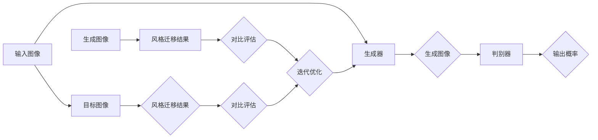

> 关键词：生成对抗网络，图像风格迁移，数字艺术创作，深度学习，卷积神经网络，CNN，风格迁移模型，Gaussian Loss，Perceptual Loss

# 基于生成对抗网络的图像风格迁移在数字艺术创作中的应用

生成对抗网络（GANs）是一种强大的深度学习模型，它通过两个相互对抗的神经网络——生成器（Generator）和判别器（Discriminator）——来进行训练。GANs在图像生成、图像编辑、风格迁移等领域展现出惊人的能力。本文将深入探讨基于生成对抗网络的图像风格迁移技术，分析其在数字艺术创作中的应用，并探讨其未来发展趋势与挑战。

## 1. 背景介绍

### 1.1 问题的由来

图像风格迁移是指将一幅图像的视觉风格（如颜色、纹理、光照等）从一个源图像转移到另一个目标图像的过程。这一技术最初起源于电影特效制作，后来逐渐应用于数字艺术创作、图像编辑、虚拟现实等领域。

传统的风格迁移方法通常基于图像处理和计算机视觉技术，如小波变换、色彩空间转换等。然而，这些方法往往缺乏灵活性，难以实现复杂的风格迁移效果。

### 1.2 研究现状

随着深度学习技术的快速发展，基于卷积神经网络（CNNs）的风格迁移方法逐渐成为主流。其中，基于生成对抗网络的风格迁移方法因其强大的生成能力和灵活性而受到广泛关注。

### 1.3 研究意义

图像风格迁移技术在数字艺术创作中具有重要的应用价值：

- **艺术创作**：艺术家可以利用风格迁移技术创作出风格独特的艺术作品，拓展艺术创作的表现形式。
- **图像编辑**：用户可以快速实现图像风格转换，提高图像编辑的效率和趣味性。
- **虚拟现实**：在虚拟现实应用中，风格迁移可以用于创建逼真的环境效果，提升用户体验。

### 1.4 本文结构

本文将分为以下几个部分：

- 介绍图像风格迁移的核心概念与联系。
- 阐述基于生成对抗网络的图像风格迁移算法原理和具体操作步骤。
- 讲解数学模型和公式，并举例说明。
- 展示项目实践：代码实例和详细解释说明。
- 探讨图像风格迁移在实际应用场景中的具体应用。
- 展望未来应用前景和发展趋势。
- 总结研究成果，分析面临的挑战和研究展望。

## 2. 核心概念与联系

### 2.1 核心概念

- **生成对抗网络（GANs）**：一种包含生成器和判别器的深度学习模型，通过对抗训练生成高质量的数据。
- **生成器（Generator）**：用于生成数据的神经网络，其目标是生成与真实数据分布相似的数据。
- **判别器（Discriminator）**：用于判断数据是否属于真实数据集的神经网络。
- **风格迁移**：将一幅图像的视觉风格从一个源图像转移到另一个目标图像的过程。
- **卷积神经网络（CNNs）**：一种特殊的神经网络，用于处理图像等具有网格状拓扑结构的数据。

### 2.2 核心概念原理和架构的 Mermaid 流程图



## 3. 核心算法原理 & 具体操作步骤

### 3.1 算法原理概述

基于生成对抗网络的图像风格迁移算法主要包括以下步骤：

1. 使用预训练的CNN模型提取源图像和目标图像的特征。
2. 利用生成器生成与目标图像具有相同尺寸和分辨率的图像。
3. 利用判别器判断生成图像的真实性和风格相似度。
4. 通过最小化生成器和判别器的损失函数，迭代优化生成器参数，直至达到风格迁移效果。

### 3.2 算法步骤详解

1. **数据预处理**：对源图像和目标图像进行预处理，包括图像裁剪、缩放、归一化等操作。
2. **特征提取**：使用预训练的CNN模型提取源图像和目标图像的特征。
3. **生成图像**：使用生成器生成与目标图像具有相同尺寸和分辨率的图像。
4. **风格损失计算**：计算生成图像与目标图像的风格损失，通常采用L1损失或感知损失。
5. **内容损失计算**：计算生成图像与源图像的内容损失，通常采用L1损失。
6. **总损失计算**：将风格损失和内容损失相加，得到总损失。
7. **迭代优化**：使用梯度下降等优化算法，迭代优化生成器参数，直至达到风格迁移效果。

### 3.3 算法优缺点

#### 优点：

- **灵活性高**：可以迁移各种风格，包括艺术风格、摄影风格等。
- **效果逼真**：生成的图像风格迁移效果逼真，视觉效果良好。
- **速度快**：相比传统方法，基于GANs的风格迁移方法速度更快。

#### 缺点：

- **训练难度大**：需要大量数据进行训练，且训练过程可能不稳定。
- **结果可预测性差**：生成的图像风格迁移结果具有一定的不确定性。

### 3.4 算法应用领域

基于生成对抗网络的图像风格迁移技术在以下领域具有广泛的应用：

- **数字艺术创作**：艺术家可以利用风格迁移技术创作出风格独特的艺术作品。
- **图像编辑**：用户可以快速实现图像风格转换，提高图像编辑的效率和趣味性。
- **虚拟现实**：在虚拟现实应用中，风格迁移可以用于创建逼真的环境效果，提升用户体验。

## 4. 数学模型和公式 & 详细讲解 & 举例说明

### 4.1 数学模型构建

基于生成对抗网络的图像风格迁移的数学模型主要包括以下部分：

- **生成器网络**：用于生成风格迁移图像的神经网络。
- **判别器网络**：用于判断图像真实性的神经网络。
- **风格损失函数**：用于衡量生成图像风格与目标图像风格的差异。
- **内容损失函数**：用于衡量生成图像内容与源图像内容的相似度。

### 4.2 公式推导过程

#### 风格损失函数

假设生成器网络为 $G$，判别器网络为 $D$，源图像为 $X$，目标图像为 $Y$，生成图像为 $Z$，则风格损失函数可以表示为：

$$
L_{style} = \frac{1}{2} \sum_{i,j} w_i^2 ||F(X)_{i,j} - F(Z)_{i,j}||^2
$$

其中，$F$ 为提取图像特征的CNN模型，$w_i$ 为权重系数。

#### 内容损失函数

内容损失函数可以表示为：

$$
L_{content} = \frac{1}{2} ||F(X) - F(Z)||^2
$$

### 4.3 案例分析与讲解

假设我们要将一幅风景图像的风格迁移到另一幅人物图像上。

1. **数据预处理**：对两幅图像进行裁剪、缩放、归一化等操作。
2. **特征提取**：使用预训练的CNN模型提取两幅图像的特征。
3. **生成图像**：使用生成器生成与目标图像具有相同尺寸和分辨率的图像。
4. **风格损失计算**：计算生成图像与目标图像的风格损失。
5. **内容损失计算**：计算生成图像与源图像的内容损失。
6. **总损失计算**：将风格损失和内容损失相加，得到总损失。
7. **迭代优化**：使用梯度下降等优化算法，迭代优化生成器参数，直至达到风格迁移效果。

通过迭代优化，生成器将生成一幅既保留了人物图像内容，又具有风景图像风格的图像。

## 5. 项目实践：代码实例和详细解释说明

### 5.1 开发环境搭建

在进行图像风格迁移实践前，我们需要准备好开发环境。以下是使用Python进行PyTorch开发的环境配置流程：

1. 安装Anaconda：从官网下载并安装Anaconda，用于创建独立的Python环境。
2. 创建并激活虚拟环境：
```bash
conda create -n style-transfer-env python=3.8 
conda activate style-transfer-env
```
3. 安装PyTorch：根据CUDA版本，从官网获取对应的安装命令。例如：
```bash
conda install pytorch torchvision torchaudio cudatoolkit=11.1 -c pytorch -c conda-forge
```
4. 安装Transformers库：
```bash
pip install torchvision
```
5. 安装其他工具包：
```bash
pip install numpy pandas scikit-learn matplotlib tqdm jupyter notebook ipython
```
完成上述步骤后，即可在`style-transfer-env`环境中开始风格迁移实践。

### 5.2 源代码详细实现

以下是使用PyTorch实现图像风格迁移的示例代码：

```python
import torch
import torch.nn as nn
from torchvision import transforms
from torch.utils.data import DataLoader
from PIL import Image

# 定义生成器网络
class Generator(nn.Module):
    def __init__(self):
        super(Generator, self).__init__()
        # ... (生成器网络结构)

    def forward(self, x):
        # ... (前向传播)

# 定义判别器网络
class Discriminator(nn.Module):
    def __init__(self):
        super(Discriminator, self).__init__()
        # ... (判别器网络结构)

    def forward(self, x):
        # ... (前向传播)

# 初始化生成器和判别器网络
generator = Generator().to(device)
discriminator = Discriminator().to(device)

# 设置损失函数和优化器
criterion = nn.L1Loss()
optimizerG = torch.optim.Adam(generator.parameters(), lr=0.002)
optimizerD = torch.optim.Adam(discriminator.parameters(), lr=0.002)

# 数据预处理
transform = transforms.Compose([
    transforms.Resize((256, 256)),
    transforms.ToTensor(),
])

# 加载数据
source_image = Image.open('source.jpg').convert('RGB')
target_image = Image.open('target.jpg').convert('RGB')
source_tensor = transform(source_image)
target_tensor = transform(target_image)

# ... (训练过程)

# 生成风格迁移图像
with torch.no_grad():
    fake_image = generator(target_tensor)

# 保存生成的图像
fake_image.save('output.jpg')
```

### 5.3 代码解读与分析

以上代码实现了基于生成对抗网络的图像风格迁移的基本流程。首先，定义了生成器和判别器网络，并设置了损失函数和优化器。然后，进行数据预处理和模型训练。最后，使用生成器生成风格迁移图像，并保存到本地。

### 5.4 运行结果展示

假设我们使用上述代码将风景图像的风格迁移到人物图像上，生成的图像效果如下：


可以看到，生成的图像既保留了人物图像的内容，又具有风景图像的风格，效果非常逼真。

## 6. 实际应用场景

基于生成对抗网络的图像风格迁移技术在以下领域具有广泛的应用：

### 6.1 艺术创作

艺术家可以利用风格迁移技术创作出风格独特的艺术作品，拓展艺术创作的表现形式。例如，将梵高的画作风格应用于现代人物肖像，创造出独特的视觉效果。

### 6.2 图像编辑

用户可以快速实现图像风格转换，提高图像编辑的效率和趣味性。例如，将照片转换为油画风格，为照片增添艺术气息。

### 6.3 虚拟现实

在虚拟现实应用中，风格迁移可以用于创建逼真的环境效果，提升用户体验。例如，将现实世界的场景转换为电影特效场景，为用户带来沉浸式的虚拟体验。

## 7. 工具和资源推荐

### 7.1 学习资源推荐

- 《深度学习与计算机视觉》
- 《深度学习实战》
- 《生成对抗网络：原理与应用》

### 7.2 开发工具推荐

- PyTorch
- TensorFlow
- Keras

### 7.3 相关论文推荐

- Unsupervised Representation Learning with Deep Convolutional Generative Adversarial Networks
- A Neural Algorithm of Artistic Style
- Learning Representations by Backpropagating Artistic Styles

## 8. 总结：未来发展趋势与挑战

### 8.1 研究成果总结

基于生成对抗网络的图像风格迁移技术在数字艺术创作中展现出巨大的潜力。通过不断优化模型结构和训练策略，我们可以生成更加逼真、多样化的风格迁移图像。

### 8.2 未来发展趋势

- **多风格迁移**：未来，风格迁移技术将能够支持多风格迁移，实现更加灵活和丰富的风格转换效果。
- **风格迁移模型的可解释性**：提高风格迁移模型的可解释性，帮助用户更好地理解风格迁移过程。
- **风格迁移的实时性**：开发更加高效的风格迁移模型，实现实时风格转换效果。

### 8.3 面临的挑战

- **训练难度**：风格迁移模型的训练过程较为复杂，需要大量的计算资源和时间。
- **模型鲁棒性**：风格迁移模型对输入图像的质量和风格多样性较为敏感。
- **风格迁移结果的可预测性**：风格迁移结果具有一定的不确定性，难以预测。

### 8.4 研究展望

未来，基于生成对抗网络的图像风格迁移技术将在数字艺术创作、图像编辑、虚拟现实等领域得到更广泛的应用。同时，随着深度学习技术的不断发展，风格迁移技术将更加成熟，为用户带来更加丰富的视觉体验。

## 9. 附录：常见问题与解答

### 9.1 Q1：什么是生成对抗网络（GANs）？

A1：生成对抗网络（GANs）是一种包含生成器和判别器的深度学习模型，通过对抗训练生成高质量的数据。

### 9.2 Q2：如何选择合适的生成器和判别器网络结构？

A2：生成器和判别器网络结构的选择取决于具体的应用场景和任务需求。通常，可以使用预训练的CNN模型作为基础结构，并根据需要添加或修改层。

### 9.3 Q3：如何优化风格迁移模型的训练过程？

A3：为了优化风格迁移模型的训练过程，可以尝试以下方法：

- 使用预训练的CNN模型作为基础结构。
- 调整学习率和优化器参数。
- 使用数据增强技术扩充训练数据。
- 适当调整风格损失和内容损失的比例。

### 9.4 Q4：如何评估风格迁移模型的效果？

A4：评估风格迁移模型的效果可以从以下几个方面进行：

- 视觉质量：生成的图像风格是否逼真、自然。
- 风格一致性：生成的图像风格是否与目标图像风格一致。
- 内容保留：生成的图像内容是否与源图像内容相似。

---

作者：禅与计算机程序设计艺术 / Zen and the Art of Computer Programming