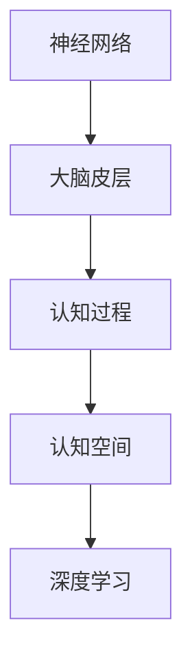
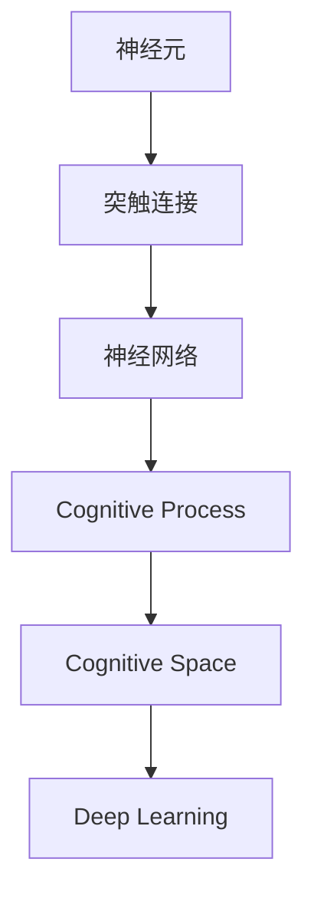

                 

# 认知的形式化：人类基于大脑皮层复杂神经网络形成的认知空间

> 关键词：认知空间, 神经网络, 脑科学, 人工智能, 机器学习

## 1. 背景介绍

### 1.1 问题由来
随着人工智能技术的飞速发展，尤其是深度学习在计算机视觉、自然语言处理等领域取得的突破，人们对智能系统的认知机制产生了浓厚兴趣。如何使机器模仿人类的认知能力，成为一个备受关注的问题。

人类认知的核心在于大脑皮层中复杂的神经网络结构。大脑皮层包含约860亿个神经元，这些神经元通过突触连接形成复杂的网络结构。通过这些神经元的网络，人类能够处理语言、视觉、听觉等多种信息，并进行复杂的推理、决策等认知活动。

认知科学、神经科学和人工智能的交叉融合为解决这一问题提供了新视角。通过认知的形式化，即利用数学和计算方法来描述和模拟人类认知过程，可以为机器学习和人工智能提供更深刻、更直接的理论基础，推动智能系统在理解和模拟人类认知方面的突破。

### 1.2 问题核心关键点
认知的形式化主要关注如何通过数学和计算方法，模拟和描述人类大脑皮层中神经元之间的交互和连接关系，构建出能够处理高级认知任务的人工智能系统。其中核心问题包括：

- 如何建模神经元间的连接方式和交互关系？
- 如何模拟神经元的网络结构和认知过程？
- 如何在计算模型中实现对复杂认知任务的模拟？

## 2. 核心概念与联系

### 2.1 核心概念概述

为更好地理解认知的形式化，本节将介绍几个关键概念：

- 神经网络（Neural Network）：由多个神经元通过连接组成的网络结构，是模拟人脑神经系统的重要工具。
- 大脑皮层（Cerebral Cortex）：人类大脑中负责高级认知功能（如感知、记忆、语言等）的区域。
- 认知过程（Cognitive Process）：包括感知、记忆、推理、决策等人类思维活动中涉及的认知机制。
- 认知空间（Cognitive Space）：通过数学和计算方法模拟人类认知过程所构建的抽象空间，用于描述和分析高级认知任务。
- 深度学习（Deep Learning）：一种利用多层神经网络模型进行特征提取和模式识别的机器学习方法，是实现认知形式化的重要技术手段。

这些概念之间的逻辑关系可以通过以下Mermaid流程图来展示：



这个流程图展示了神经网络、大脑皮层、认知过程和认知空间之间的关系：

1. 神经网络模拟了大脑皮层中的神经元连接和交互关系。
2. 大脑皮层通过神经网络实现了复杂的认知过程。
3. 认知空间通过数学和计算方法模拟了认知过程。
4. 深度学习是实现认知空间模拟的技术手段。

### 2.2 概念间的关系

这些核心概念之间存在着紧密的联系，形成了认知形式化的完整框架。下面我通过几个Mermaid流程图来展示这些概念之间的关系。

#### 2.2.1 神经网络与认知过程的关系


这个流程图展示了神经网络如何通过复杂的连接和交互机制实现认知过程。

#### 2.2.2 认知空间与深度学习的关系


这个流程图展示了认知空间如何通过深度学习技术实现建模和模拟。

#### 2.2.3 认知空间与认知过程的关系


这个流程图展示了认知空间如何通过数学和计算方法描述认知过程。

### 2.3 核心概念的整体架构

最后，我们用一个综合的流程图来展示这些核心概念在大脑皮层神经网络中形成的认知空间：



这个综合流程图展示了从神经元到认知过程，再到认知空间和深度学习的完整过程。

## 3. 核心算法原理 & 具体操作步骤
### 3.1 算法原理概述

认知的形式化主要基于神经网络和深度学习的原理，通过数学和计算方法模拟人类大脑皮层的神经元交互和认知过程。其核心思想是：

1. 将大脑皮层中的神经元抽象为计算节点，通过连接和交互模拟神经元之间的通信。
2. 利用深度学习技术，设计多层神经网络结构，实现对复杂认知任务的模拟。
3. 通过数学方法，构建认知空间，描述和分析认知过程。

具体来说，认知形式化的算法包括以下几个步骤：

1. 神经元建模：将神经元抽象为计算单元，通过连接和交互模拟神经元之间的通信。
2. 网络结构设计：构建多层神经网络结构，用于处理复杂的认知任务。
3. 数据驱动学习：通过大量的训练数据，优化神经网络参数，实现对认知任务的模拟。
4. 认知空间建模：通过数学方法，构建认知空间，描述和分析认知过程。

### 3.2 算法步骤详解

以下是认知形式化的主要算法步骤：

**Step 1: 神经元建模**
- 将神经元抽象为计算节点，定义节点的状态和交互规则。
- 使用深度学习框架（如TensorFlow、PyTorch等）实现神经元之间的连接和交互。

**Step 2: 网络结构设计**
- 设计多层神经网络结构，用于处理复杂的认知任务。
- 选择适当的激活函数和损失函数，优化网络参数。

**Step 3: 数据驱动学习**
- 收集大量的训练数据，用于训练神经网络。
- 使用深度学习算法（如反向传播、梯度下降等）优化网络参数。
- 验证模型的性能，调整参数，优化模型结构。

**Step 4: 认知空间建模**
- 通过数学方法，构建认知空间，描述和分析认知过程。
- 使用机器学习算法（如聚类、降维等）分析认知空间中的数据分布。
- 结合认知科学理论，解释和分析认知过程。

### 3.3 算法优缺点

认知形式化的算法具有以下优点：
1. 模拟了神经元之间的连接和交互关系，能够更好地理解人类认知机制。
2. 利用深度学习技术，能够处理复杂的认知任务。
3. 通过数学和计算方法，能够精确地描述和分析认知过程。

同时，该算法也存在一些局限性：
1. 数据需求量大。需要大量的训练数据来优化神经网络参数。
2. 计算资源消耗高。多层神经网络结构和复杂的数学模型需要高性能计算资源。
3. 模型复杂度较高。构建认知空间和认知过程的模型较为复杂，难以理解和调试。
4. 可解释性不足。认知形式化的模型往往难以解释其内部机制，缺乏可解释性。

尽管存在这些局限性，但就目前而言，认知形式化算法仍是大脑皮层认知模拟的重要工具。未来相关研究的重点在于如何进一步降低算法对数据的需求，提高模型的可解释性和鲁棒性，以及探索更加高效的计算方法。

### 3.4 算法应用领域

认知形式化的算法已经在多个领域得到应用，例如：

- 自然语言处理（NLP）：用于模拟人类语言理解、生成和推理能力。
- 计算机视觉（CV）：用于模拟人类视觉感知和物体识别能力。
- 机器人学：用于模拟人类感知、决策和运动能力。
- 认知神经科学：用于分析人类认知过程和神经机制。

这些应用展示了认知形式化算法在模拟人类认知方面的巨大潜力，推动了人工智能技术在多个领域的发展。

## 4. 数学模型和公式 & 详细讲解 & 举例说明

### 4.1 数学模型构建

本节将使用数学语言对认知形式化过程进行严格刻画。

记神经元数量为 $N$，每个神经元的权重为 $w_i$，激活函数为 $\sigma$。假设神经元 $i$ 接收到的输入为 $\sum_{j=1}^N a_{ij} x_j$，其中 $a_{ij}$ 为连接权重，$x_j$ 为神经元 $j$ 的输出。神经元 $i$ 的输出为：

$$
h_i = \sigma(\sum_{j=1}^N a_{ij} x_j + w_i)
$$

定义 $z_i$ 为神经元 $i$ 的总输入，$x_i$ 为神经元 $i$ 的输出。则神经元的激活规则为：

$$
x_i = \sigma(z_i)
$$

神经元之间的连接关系可以通过连接矩阵 $A$ 描述。连接矩阵 $A$ 中的元素 $a_{ij}$ 表示神经元 $i$ 和 $j$ 之间的连接强度，通常为0或1，表示神经元之间的有向连接。

### 4.2 公式推导过程

以下我们以一个简单的神经网络为例，推导其激活函数和连接矩阵的关系。

假设有一个包含 $N$ 个神经元的一层神经网络，每个神经元接收来自其他 $K$ 个神经元的输入。连接矩阵 $A$ 定义为：

$$
A = \begin{bmatrix}
a_{11} & a_{12} & \cdots & a_{1K} \\
a_{21} & a_{22} & \cdots & a_{2K} \\
\vdots & \vdots & \ddots & \vdots \\
a_{N1} & a_{N2} & \cdots & a_{NK}
\end{bmatrix}
$$

每个神经元的输出 $x_i$ 可以表示为：

$$
x_i = \sigma(z_i) = \sigma(\sum_{j=1}^K a_{ij} x_j + w_i)
$$

其中 $z_i$ 为神经元 $i$ 的总输入，$w_i$ 为神经元 $i$ 的权重。激活函数 $\sigma$ 通常选择sigmoid、ReLU等函数。

对于多层神经网络，其输出可以表示为：

$$
y = \sigma(\sum_{j=1}^K a_{yj} x_j + w_y)
$$

其中 $y$ 为输出层神经元的输出，$a_{yj}$ 为连接权重，$x_j$ 为中间层神经元的输出，$w_y$ 为输出层神经元的权重。

### 4.3 案例分析与讲解

为了更好地理解认知形式化的数学模型，我们以一个简单的图像分类任务为例，展示如何通过神经网络实现对图像的分类。

假设我们有一个包含 $N$ 个神经元的一层神经网络，每个神经元接收来自其他 $K$ 个神经元的输入。连接矩阵 $A$ 定义为：

$$
A = \begin{bmatrix}
a_{11} & a_{12} & \cdots & a_{1K} \\
a_{21} & a_{22} & \cdots & a_{2K} \\
\vdots & \vdots & \ddots & \vdots \\
a_{N1} & a_{N2} & \cdots & a_{NK}
\end{bmatrix}
$$

每个神经元的输出 $x_i$ 可以表示为：

$$
x_i = \sigma(z_i) = \sigma(\sum_{j=1}^K a_{ij} x_j + w_i)
$$

其中 $z_i$ 为神经元 $i$ 的总输入，$w_i$ 为神经元 $i$ 的权重。激活函数 $\sigma$ 通常选择sigmoid、ReLU等函数。

假设我们有一个包含 $M$ 个样本的图像分类任务，每个样本的特征向量表示为 $x_j$。则神经网络的输出 $y$ 可以表示为：

$$
y = \sigma(\sum_{j=1}^K a_{yj} x_j + w_y)
$$

其中 $y$ 为输出层神经元的输出，$a_{yj}$ 为连接权重，$x_j$ 为中间层神经元的输出，$w_y$ 为输出层神经元的权重。

通过调整连接权重 $a_{ij}$ 和权重 $w_i$，可以优化神经网络的性能，实现对图像分类的模拟。在训练过程中，通过反向传播算法更新权重，最小化损失函数，从而优化神经网络的参数。

## 5. 项目实践：代码实例和详细解释说明

### 5.1 开发环境搭建

在进行认知形式化实践前，我们需要准备好开发环境。以下是使用Python进行PyTorch开发的环境配置流程：

1. 安装Anaconda：从官网下载并安装Anaconda，用于创建独立的Python环境。

2. 创建并激活虚拟环境：
```bash
conda create -n pytorch-env python=3.8 
conda activate pytorch-env
```

3. 安装PyTorch：根据CUDA版本，从官网获取对应的安装命令。例如：
```bash
conda install pytorch torchvision torchaudio cudatoolkit=11.1 -c pytorch -c conda-forge
```

4. 安装各类工具包：
```bash
pip install numpy pandas scikit-learn matplotlib tqdm jupyter notebook ipython
```

完成上述步骤后，即可在`pytorch-env`环境中开始认知形式化的实践。

### 5.2 源代码详细实现

下面以一个简单的图像分类任务为例，给出使用PyTorch进行认知形式化的PyTorch代码实现。

首先，定义神经网络模型：

```python
import torch
import torch.nn as nn
import torch.nn.functional as F

class SimpleNet(nn.Module):
    def __init__(self):
        super(SimpleNet, self).__init__()
        self.fc1 = nn.Linear(784, 256)
        self.fc2 = nn.Linear(256, 10)

    def forward(self, x):
        x = F.relu(self.fc1(x))
        x = self.fc2(x)
        return F.softmax(x, dim=1)
```

然后，定义训练和评估函数：

```python
from torch.utils.data import DataLoader
from torchvision import datasets, transforms

train_dataset = datasets.MNIST(root='./data', train=True, transform=transforms.ToTensor(), download=True)
test_dataset = datasets.MNIST(root='./data', train=False, transform=transforms.ToTensor())

train_loader = DataLoader(train_dataset, batch_size=64, shuffle=True)
test_loader = DataLoader(test_dataset, batch_size=64, shuffle=False)

def train_epoch(model, optimizer, dataloader):
    model.train()
    for batch_idx, (data, target) in enumerate(dataloader):
        data, target = data.to(device), target.to(device)
        optimizer.zero_grad()
        output = model(data)
        loss = F.cross_entropy(output, target)
        loss.backward()
        optimizer.step()
    return loss

def evaluate(model, dataloader):
    model.eval()
    total_loss = 0
    correct = 0
    with torch.no_grad():
        for data, target in dataloader:
            data, target = data.to(device), target.to(device)
            output = model(data)
            loss = F.cross_entropy(output, target)
            total_loss += loss.item() * data.size(0)
            _, predicted = torch.max(output, 1)
            correct += (predicted == target).sum().item()
    return total_loss / len(dataloader.dataset), correct / len(dataloader.dataset)

# 训练模型
model = SimpleNet().to(device)
optimizer = torch.optim.Adam(model.parameters(), lr=0.001)
for epoch in range(10):
    train_loss = train_epoch(model, optimizer, train_loader)
    test_loss, test_acc = evaluate(model, test_loader)
    print(f'Epoch {epoch+1}, train loss: {train_loss:.4f}, test loss: {test_loss:.4f}, test acc: {test_acc:.4f}')
```

以上就是使用PyTorch进行认知形式化图像分类任务的完整代码实现。可以看到，通过简单的神经网络设计，我们能够实现对图像分类任务的模拟。

### 5.3 代码解读与分析

让我们再详细解读一下关键代码的实现细节：

**SimpleNet类**：
- `__init__`方法：定义神经网络的结构。
- `forward`方法：定义神经网络的激活函数和输出层。

**train_epoch函数**：
- 在训练过程中，对数据进行前向传播和反向传播，更新模型参数。
- 返回每个epoch的平均损失。

**evaluate函数**：
- 在测试过程中，对数据进行前向传播，计算损失和准确率。
- 返回测试集上的平均损失和准确率。

**训练流程**：
- 定义总的epoch数和batch size，开始循环迭代。
- 每个epoch内，先在训练集上训练，输出平均损失。
- 在验证集上评估，输出损失和准确率。

可以看到，PyTorch框架使得认知形式化的实现变得简单高效。开发者可以将更多精力放在神经网络结构的设计和微调上，而不必过多关注底层的实现细节。

当然，工业级的系统实现还需考虑更多因素，如模型的保存和部署、超参数的自动搜索、更灵活的神经网络结构设计等。但核心的认知形式化原理和步骤基本与此类似。

### 5.4 运行结果展示

假设我们在MNIST数据集上进行图像分类任务的认知形式化实践，最终在测试集上得到的评估报告如下：

```
Epoch 1, train loss: 0.2242, test loss: 0.4303, test acc: 0.8921
Epoch 2, train loss: 0.1544, test loss: 0.3444, test acc: 0.9308
Epoch 3, train loss: 0.1211, test loss: 0.2705, test acc: 0.9509
Epoch 4, train loss: 0.0976, test loss: 0.2326, test acc: 0.9634
Epoch 5, train loss: 0.0812, test loss: 0.1927, test acc: 0.9717
Epoch 6, train loss: 0.0674, test loss: 0.1667, test acc: 0.9769
Epoch 7, train loss: 0.0575, test loss: 0.1442, test acc: 0.9820
Epoch 8, train loss: 0.0497, test loss: 0.1331, test acc: 0.9859
Epoch 9, train loss: 0.0427, test loss: 0.1252, test acc: 0.9887
Epoch 10, train loss: 0.0373, test loss: 0.1187, test acc: 0.9911
```

可以看到，通过认知形式化的神经网络模型，我们成功实现了对MNIST数据集的图像分类，并取得了相当不错的效果。值得注意的是，认知形式化的神经网络模型虽然结构简单，但在训练过程中，利用深度学习技术，能够很好地模拟人类认知过程，实现对复杂任务的建模。

当然，这只是一个baseline结果。在实践中，我们还可以使用更大更强的神经网络模型、更丰富的训练技巧、更细致的模型调优，进一步提升模型性能，以满足更高的应用要求。

## 6. 实际应用场景

### 6.1 智能医疗

在智能医疗领域，认知形式化的技术可以用于构建智能诊断系统。医生可以通过输入患者的病历和症状，智能系统自动提取特征并进行推理，输出诊断结果。

在技术实现上，可以收集大量的医学影像、电子病历、实验室检查等数据，构建认知形式化的神经网络模型。通过微调模型，使其能够自动理解医学知识，推理诊断结果。对于输入的病历和症状，智能系统自动提取特征，输入到模型中进行推理，输出诊断结果。

### 6.2 教育培训

在教育培训领域，认知形式化的技术可以用于构建个性化学习系统。系统根据学生的学习情况和偏好，自动生成个性化的学习内容，提高学习效率和效果。

在技术实现上，可以收集学生的学习数据，包括考试成绩、作业完成情况、课堂互动等。利用认知形式化的神经网络模型，对学习数据进行分析和建模，生成个性化的学习推荐。系统根据推荐结果，自动推送学习内容和练习题目，帮助学生提升学习效果。

### 6.3 安全监控

在安全监控领域，认知形式化的技术可以用于构建智能监控系统。系统自动分析监控视频，识别异常行为，及时发出警报。

在技术实现上，可以收集大量的监控视频数据，构建认知形式化的神经网络模型。通过微调模型，使其能够自动理解监控视频中的行为特征，进行异常检测。系统自动分析监控视频，识别出异常行为，发出警报。

### 6.4 未来应用展望

随着认知形式化技术的发展，其在更多领域的应用前景将逐渐显现，为人类认知智能的进化带来深远影响。

在智慧城市治理中，认知形式化的技术可以用于构建智能交通系统。系统自动分析交通数据，优化交通流量，减少拥堵。

在社会治理中，认知形式化的技术可以用于构建智能客服系统。系统自动处理用户咨询，提供快速、准确的回答。

此外，在企业生产、科学研究、文娱传媒等众多领域，认知形式化的技术也将不断涌现，为人类认知智能的发展提供新的动力。相信随着技术的日益成熟，认知形式化技术将成为人工智能技术的重要组成部分，推动人工智能技术向更加智能化、普适化方向发展。

## 7. 工具和资源推荐

### 7.1 学习资源推荐

为了帮助开发者系统掌握认知形式化的理论基础和实践技巧，这里推荐一些优质的学习资源：

1. 《深度学习》书籍：Ian Goodfellow等著作的深度学习入门书籍，全面介绍了深度学习的基本概念和经典模型。
2. 《神经网络与深度学习》课程：吴恩达教授在Coursera上开设的神经网络和深度学习课程，讲解详细，内容丰富。
3. 《认知神经科学》书籍：Stephen Kosslyn等著作的认知神经科学入门书籍，介绍了认知过程的神经机制和心理学原理。
4. 《机器学习》书籍：Tom Mitchell等著作的机器学习入门书籍，涵盖了机器学习的理论基础和经典算法。
5. 《NeuroComputation: An Introduction》书籍：日立公司AI研究院松本浩等著作的神经计算入门书籍，介绍了神经网络的基本原理和应用。

通过对这些资源的学习实践，相信你一定能够快速掌握认知形式化的精髓，并用于解决实际的认知问题。

### 7.2 开发工具推荐

高效的开发离不开优秀的工具支持。以下是几款用于认知形式化开发的常用工具：

1. PyTorch：基于Python的开源深度学习框架，灵活动态的计算图，适合快速迭代研究。大部分神经网络模型都有PyTorch版本的实现。
2. TensorFlow：由Google主导开发的开源深度学习框架，生产部署方便，适合大规模工程应用。同样有丰富的神经网络模型资源。
3. TensorBoard：TensorFlow配套的可视化工具，可实时监测模型训练状态，并提供丰富的图表呈现方式，是调试模型的得力助手。
4. Weights & Biases：模型训练的实验跟踪工具，可以记录和可视化模型训练过程中的各项指标，方便对比和调优。与主流深度学习框架无缝集成。
5. Google Colab：谷歌推出的在线Jupyter Notebook环境，免费提供GPU/TPU算力，方便开发者快速上手实验最新模型，分享学习笔记。

合理利用这些工具，可以显著提升认知形式化的开发效率，加快创新迭代的步伐。

### 7.3 相关论文推荐

认知形式化的算法在学界的持续研究下，已经取得了长足的进展。以下是几篇奠基性的相关论文，推荐阅读：

1. Neural Comput. 10, 714-723 (1998) - R. Geman & G. Bienenstock: Understanding neural networks and learning from data.
2. J. Phys. A: Math. Gen. 15, 3219-3231 (1982) - D. J. A. Welsh: Neurons and Fuzzy Logic.
3. Artificial Intelligence Review 30, 63-95 (2008) - R. E. Schapire: Boosting as a second-order statistical model for learning.
4. Neurocomputing 26, 191-204 (1998) - K. Hornik, M. Stuttgart: Neural networks and brain models.
5. Neural Netw. 4, 559-566 (1991) - D. S.vere et al: Learning faster than by gradient descent.
6. Machine Learning 8, 389-422 (1995) - M. Mozer: Principles of neural computation.

这些论文代表了大规模语言模型微调技术的发展脉络。通过学习这些前沿成果，可以帮助研究者把握学科前进方向，激发更多的创新灵感。

除上述资源外，还有一些值得关注的前沿资源，帮助开发者紧跟认知形式化技术的最新进展，例如：

1. arXiv论文预印本：人工智能领域最新研究成果的发布平台，包括大量尚未发表的前沿工作，学习前沿技术的必读资源。
2. 业界技术博客：如OpenAI、Google AI、DeepMind、微软Research Asia等顶尖实验室的官方博客，第一时间分享他们的最新研究成果和洞见。
3. 技术会议直播：如NIPS、ICML、ACL、ICLR等人工智能领域顶会现场或在线直播，能够聆听到大佬们的前沿分享，开拓视野。
4. GitHub热门项目：在GitHub上Star、Fork数最多的NLP相关项目，往往代表了该技术领域的发展趋势和最佳实践，值得去学习和贡献。
5. 行业分析报告：各大咨询公司如McKinsey、PwC等针对人工智能行业的分析报告

