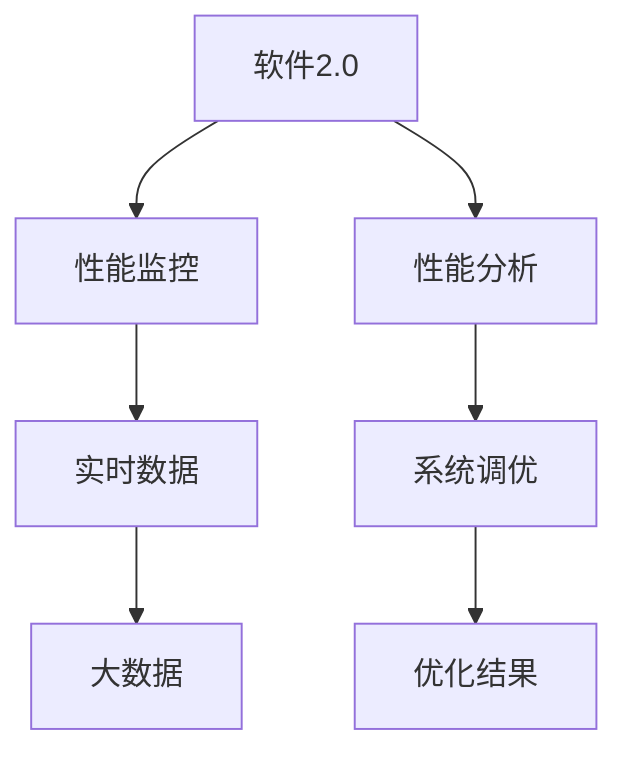
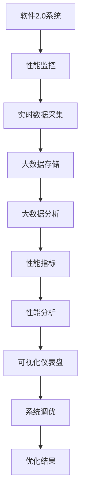
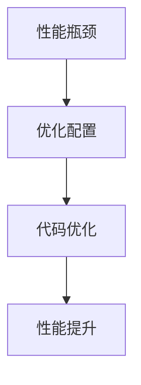

                 

# 软件2.0的性能监控与分析

> 关键词：软件2.0, 性能监控, 分析, 系统调优, 实时数据, 大数据, 指标体系

## 1. 背景介绍

### 1.1 问题由来
随着软件工程的发展，越来越多的系统趋于复杂化，性能问题也愈发突显。软件2.0时代，云计算、微服务、分布式系统等技术的应用，使得系统架构愈加复杂，性能监控与分析的重要性也随之提升。然而，面对越来越复杂的软件系统，传统的基于日志和简单监控手段的方法已难以满足需求。

### 1.2 问题核心关键点
软件2.0时代，性能监控与分析的主要挑战包括：

- 数据量巨大：大规模分布式系统生成的数据量成倍增长，传统监控手段无法有效处理。
- 多维度的监控需求：系统涉及多个层面，包括应用层、网络层、硬件层等，需要多维度的监控指标。
- 实时性要求：性能问题往往难以预测，实时监控与分析是及时发现并解决性能问题的关键。
- 精准定位：大规模系统往往难以定位具体性能瓶颈，需精确分析和可视化展示。

### 1.3 问题研究意义
性能监控与分析是提升软件系统稳定性和可用性的重要手段。在软件2.0时代，性能监控与分析对保障系统高效运行、提升用户体验具有重要意义。

1. **保障系统高效运行**：通过实时监控与分析，及时发现并解决问题，避免系统因性能瓶颈导致服务中断或延迟。
2. **提升用户体验**：优化系统响应速度和资源使用效率，减少用户等待时间，提升用户满意度。
3. **减少运维成本**：通过精准定位问题，减少不必要的维护工作，降低运维成本。
4. **推动技术创新**：性能监控与分析技术的进步，有助于推动软件工程与运维工具的创新。
5. **促进业务价值提升**：良好的系统性能是业务成功的关键，性能监控与分析技术的应用，直接关系到业务的竞争力和市场表现。

## 2. 核心概念与联系

### 2.1 核心概念概述

为更好地理解软件2.0的性能监控与分析方法，本节将介绍几个密切相关的核心概念：

- **软件2.0**：指采用微服务架构、容器化、自动化部署、DevOps等技术实现的软件系统。与传统的单体架构相比，软件2.0更加灵活、可扩展、易于维护。
- **性能监控**：通过采集系统运行中的各项指标数据，实时监测系统的性能表现。常见的监控指标包括CPU使用率、内存占用、网络延迟等。
- **性能分析**：对监控数据进行统计和分析，识别系统中的性能瓶颈和潜在问题。分析工具通常包括可视化仪表盘、数据挖掘等技术。
- **系统调优**：针对性能瓶颈，优化系统配置和代码，提升系统性能。系统调优是性能监控与分析的最终目的。
- **实时数据**：指在软件运行过程中即时采集的数据，包括日志、指标、调用链等。实时数据是性能监控与分析的基础。
- **大数据**：指海量的、复杂的数据集，其规模远超传统数据库的处理能力。软件2.0系统往往生成大量实时数据，需借助大数据技术进行处理和分析。
- **指标体系**：指针对软件系统性能定义的一组关键指标，用于量化评估系统性能。指标体系应涵盖应用层、网络层、硬件层等多个维度。

这些核心概念之间的逻辑关系可以通过以下Mermaid流程图来展示：



这个流程图展示了大规模分布式系统中的性能监控与分析流程：

1. 软件2.0系统通过实时数据采集生成大量监控数据。
2. 监控数据经过大数据技术处理和分析，得到关键性能指标。
3. 性能分析工具通过可视化展示和统计分析，识别系统中的性能瓶颈。
4. 系统调优人员根据分析结果，优化系统配置和代码，提升系统性能。

### 2.2 概念间的关系

这些核心概念之间存在着紧密的联系，形成了性能监控与分析的完整生态系统。下面我们通过几个Mermaid流程图来展示这些概念之间的关系。

#### 2.2.1 性能监控与分析的流程



这个流程图展示了性能监控与分析的基本流程。性能监控系统通过实时数据采集，生成大量监控数据。大数据技术对监控数据进行处理和分析，得到关键性能指标。性能分析工具将这些指标进行可视化展示，识别系统中的性能瓶颈。系统调优人员根据分析结果，优化系统配置和代码，最终提升系统性能。

#### 2.2.2 大数据与性能分析


这个流程图展示了大数据技术在性能分析中的应用。实时数据通过大数据技术处理，得到关键性能指标。性能分析工具对这些指标进行统计和分析，识别系统中的性能瓶颈。根据分析结果，系统调优人员进行系统优化，提升系统性能。

#### 2.2.3 系统调优的策略



这个流程图展示了系统调优的策略。性能分析工具识别系统中的性能瓶颈，系统调优人员首先进行优化配置，然后对代码进行优化。优化配置和代码后，系统性能得到提升。

## 3. 核心算法原理 & 具体操作步骤
### 3.1 算法原理概述

软件2.0的性能监控与分析，本质上是一个多维度的数据处理和分析过程。其核心思想是：通过实时采集和处理系统中的各项指标数据，使用大数据技术进行深度分析和统计，识别系统中的性能瓶颈和潜在问题，并采取针对性的优化策略，提升系统性能。

形式化地，假设系统中的各项指标数据为 $D=\{(x_i,y_i)\}_{i=1}^N, x_i \in \mathbb{R}^d, y_i \in \mathbb{R}$，其中 $x_i$ 为监控指标，$y_i$ 为系统状态。设系统性能为 $P$，则性能监控与分析的目标是最大化系统性能 $P$，即：

$$
\max_{x_1,...,x_N} P = f(x_1,...,x_N)
$$

其中 $f$ 为系统性能函数，通常通过专家经验和历史数据拟合得到。性能监控与分析的核心在于使用大数据技术对 $D$ 进行处理和分析，得到关键性能指标，识别系统中的瓶颈，并采取针对性的优化策略。

### 3.2 算法步骤详解

基于大数据的性能监控与分析一般包括以下几个关键步骤：

**Step 1: 数据采集与预处理**

- 选择合适的性能监控工具，采集系统中的各项指标数据。
- 对采集的数据进行去噪、过滤、归一化等预处理，确保数据的准确性和一致性。

**Step 2: 数据存储与存储引擎**

- 将预处理后的数据存储到分布式文件系统或数据库中，如Hadoop、Spark、Elasticsearch等。
- 使用分布式存储引擎，支持海量数据的存储和检索。

**Step 3: 数据分析与处理**

- 对存储的数据进行统计和分析，生成关键性能指标。
- 使用大数据技术，如MapReduce、Spark、Hive等，对数据进行处理和分析。
- 使用数据挖掘和机器学习算法，识别系统中的性能瓶颈和潜在问题。

**Step 4: 性能可视化与展示**

- 将分析结果通过可视化仪表盘展示，帮助系统调优人员理解系统性能。
- 使用可视化工具，如Grafana、Prometheus等，对系统性能进行监控和展示。

**Step 5: 系统调优与迭代**

- 根据分析结果，优化系统配置和代码，提升系统性能。
- 对优化后的系统进行测试，确保性能提升。
- 定期对系统进行性能监控与分析，迭代优化。

### 3.3 算法优缺点

基于大数据的性能监控与分析方法具有以下优点：

- **实时性高**：通过实时数据采集和处理，能够及时发现系统性能问题。
- **数据量大**：处理和分析大规模分布式系统生成的海量数据，能够全面评估系统性能。
- **多维度分析**：使用多维数据分析技术，识别系统中的性能瓶颈和潜在问题。
- **可扩展性强**：使用分布式存储和计算技术，支持海量数据的存储和处理。

同时，该方法也存在一些局限性：

- **复杂度高**：需要处理大规模数据集，技术实现复杂。
- **计算成本高**：大数据处理需要高性能计算资源，成本较高。
- **结果解释性差**：大数据分析结果往往过于复杂，难以直接解释系统性能问题。

尽管存在这些局限性，但就目前而言，基于大数据的性能监控与分析方法仍是大规模分布式系统性能监控的首选方案。

### 3.4 算法应用领域

基于大数据的性能监控与分析方法已经在多个领域得到了广泛的应用，例如：

- **云计算平台**：如AWS、Azure、阿里云等，通过实时监控和分析系统性能，保障云服务的高可用性和稳定性。
- **微服务架构**：如Docker、Kubernetes等，通过分布式监控和分析，优化微服务的资源分配和调用链。
- **大数据系统**：如Hadoop、Spark等，通过性能监控和分析，优化大数据处理流程和资源使用。
- **网络安全**：如DDoS防护、入侵检测等，通过实时监控和分析网络流量，保障网络安全。
- **物联网设备**：通过采集设备运行数据，进行性能监控和优化，提高设备性能和能效。

除了上述这些经典应用外，大数据性能监控与分析技术还在不断扩展其应用场景，如智慧城市、智能制造等新兴领域，为提升系统性能和用户体验提供了新的解决方案。

## 4. 数学模型和公式 & 详细讲解  
### 4.1 数学模型构建

本节将使用数学语言对基于大数据的性能监控与分析过程进行更加严格的刻画。

记系统性能为 $P$，各项监控指标为 $x_1,...,x_N$，设 $f$ 为系统性能函数。性能监控与分析的目标是最大化系统性能 $P$，即：

$$
\max_{x_1,...,x_N} P = f(x_1,...,x_N)
$$

在实践中，我们通常使用基于梯度的优化算法（如SGD、Adam等）来近似求解上述最优化问题。设 $\eta$ 为学习率，$\lambda$ 为正则化系数，则参数的更新公式为：

$$
x_i \leftarrow x_i - \eta \nabla_{x_i}f(x_1,...,x_N) - \eta\lambda x_i
$$

其中 $\nabla_{x_i}f(x_1,...,x_N)$ 为系统性能函数对指标 $x_i$ 的梯度，可通过自动微分技术高效计算。

### 4.2 公式推导过程

以下我们以云计算平台的性能监控与分析为例，推导大数据处理和分析的基本流程。

假设系统性能 $P$ 由多个指标 $x_1,...,x_N$ 决定，即：

$$
P = f(x_1,...,x_N)
$$

其中 $f$ 为系统性能函数，通常通过历史数据和专家经验拟合得到。

在实践中，我们通常使用基于梯度的优化算法（如SGD、Adam等）来近似求解上述最优化问题。设 $\eta$ 为学习率，$\lambda$ 为正则化系数，则参数的更新公式为：

$$
x_i \leftarrow x_i - \eta \nabla_{x_i}f(x_1,...,x_N) - \eta\lambda x_i
$$

其中 $\nabla_{x_i}f(x_1,...,x_N)$ 为系统性能函数对指标 $x_i$ 的梯度，可通过自动微分技术高效计算。

在得到系统性能函数 $f$ 和优化算法后，即可开始进行数据采集、存储和处理。假设采集到的数据为 $D=\{(x_i,y_i)\}_{i=1}^N, x_i \in \mathbb{R}^d, y_i \in \mathbb{R}$，其中 $x_i$ 为监控指标，$y_i$ 为系统状态。则优化过程为：

$$
\max_{x_1,...,x_N} P = f(x_1,...,x_N)
$$

通过大数据技术，将数据存储在分布式文件系统或数据库中，使用MapReduce、Spark、Hive等进行数据处理和分析。设处理后的数据为 $D'$，则优化过程为：

$$
\max_{x_1,...,x_N} P = f(x_1,...,x_N)
$$

最终得到的关键性能指标为：

$$
P = f(x_1,...,x_N)
$$

### 4.3 案例分析与讲解

假设我们在AWS云平台上进行性能监控与分析，优化系统的计算资源使用效率。首先，选择AWS的CloudWatch服务进行数据采集，采集CPU使用率、内存占用、网络延迟等指标。然后，将采集到的数据存储到S3文件中，使用Spark进行数据处理和分析。具体步骤如下：

1. **数据采集**：
   ```python
   import boto3
   import time
   
   client = boto3.client('cloudwatch')
   
   while True:
       timestamp = time.strftime('%Y-%m-%d %H:%M:%S')
       response = client.get_metric_data(
           Namespace='AWS/EC2',
           MetricDataQueries=[
               {
                   'Id': 'CPUUsage',
                   'MetricStat':
                       {
                           'Dimensions': [
                               {'Name': 'InstanceId', 'Value': 'i-0c68e5bc0d8a95c0e'},
                               {'Name': 'InstanceType', 'Value': 't2.micro'},
                           ],
                           'Period': 60,
                           'Stat': 'Average',
                           'Unit': 'Count',
                           'Dimensions': [
                               {'Name': 'InstanceId', 'Value': 'i-0c68e5bc0d8a95c0e'},
                               {'Name': 'InstanceType', 'Value': 't2.micro'},
                           ],
                           'Unit': 'Count',
                           'ReturnData': 'True',
                       }
               }
           ]
       )
       
       print(response['MetricDataResults'][0]['MetricStat']['Value']['Average'])
       print(time.strftime('%Y-%m-%d %H:%M:%S'))
       time.sleep(10)
   ```

2. **数据存储**：
   ```python
   import boto3
   import time
   
   s3 = boto3.resource('s3')
   
   while True:
       timestamp = time.strftime('%Y-%m-%d %H:%M:%S')
       response = client.get_metric_data(
           Namespace='AWS/EC2',
           MetricDataQueries=[
               {
                   'Id': 'CPUUsage',
                   'MetricStat':
                       {
                           'Dimensions': [
                               {'Name': 'InstanceId', 'Value': 'i-0c68e5bc0d8a95c0e'},
                               {'Name': 'InstanceType', 'Value': 't2.micro'},
                           ],
                           'Period': 60,
                           'Stat': 'Average',
                           'Unit': 'Count',
                           'Dimensions': [
                               {'Name': 'InstanceId', 'Value': 'i-0c68e5bc0d8a95c0e'},
                               {'Name': 'InstanceType', 'Value': 't2.micro'},
                           ],
                           'Unit': 'Count',
                           'ReturnData': 'True',
                       }
               }
           ]
       )
       
       data = {
           'timestamp': timestamp,
           'cpu_usage': response['MetricDataResults'][0]['MetricStat']['Value']['Average'],
       }
       s3.Object('my-bucket', timestamp + '.csv').put(Body=json.dumps(data))
       time.sleep(10)
   ```

3. **数据分析**：
   ```python
   import pyspark.sql.functions as F
   from pyspark.sql import SparkSession
   
   spark = SparkSession.builder.appName('AWS Performance Analysis').getOrCreate()
   
   df = spark.read.csv('s3://my-bucket/2023-01-01.csv')
   
   # 对数据进行统计和分析
   df = df.groupBy('timestamp').agg(F.mean('cpu_usage'))
   
   # 可视化展示
   df.show()
   ```

通过上述步骤，我们实现了对AWS云平台CPU使用率的实时监控和分析，帮助优化计算资源使用效率，提升系统性能。

## 5. 项目实践：代码实例和详细解释说明
### 5.1 开发环境搭建

在进行性能监控与分析实践前，我们需要准备好开发环境。以下是使用Python进行PyTorch开发的环境配置流程：

1. 安装Anaconda：从官网下载并安装Anaconda，用于创建独立的Python环境。

2. 创建并激活虚拟环境：
```bash
conda create -n pytorch-env python=3.8 
conda activate pytorch-env
```

3. 安装PyTorch：根据CUDA版本，从官网获取对应的安装命令。例如：
```bash
conda install pytorch torchvision torchaudio cudatoolkit=11.1 -c pytorch -c conda-forge
```

4. 安装各类工具包：
```bash
pip install numpy pandas scikit-learn matplotlib tqdm jupyter notebook ipython
```

完成上述步骤后，即可在`pytorch-env`环境中开始性能监控与分析实践。

### 5.2 源代码详细实现

这里我们以AWS云平台的性能监控与分析为例，给出使用PyTorch进行实时数据采集和分析的代码实现。

首先，定义数据采集函数：

```python
import boto3
import time

def collect_metrics():
    client = boto3.client('cloudwatch')
    
    while True:
        timestamp = time.strftime('%Y-%m-%d %H:%M:%S')
        response = client.get_metric_data(
            Namespace='AWS/EC2',
            MetricDataQueries=[
                {
                    'Id': 'CPUUsage',
                    'MetricStat':
                        {
                            'Dimensions': [
                                {'Name': 'InstanceId', 'Value': 'i-0c68e5bc0d8a95c0e'},
                                {'Name': 'InstanceType', 'Value': 't2.micro'},
                            ],
                            'Period': 60,
                            'Stat': 'Average',
                            'Unit': 'Count',
                            'Dimensions': [
                                {'Name': 'InstanceId', 'Value': 'i-0c68e5bc0d8a95c0e'},
                                {'Name': 'InstanceType', 'Value': 't2.micro'},
                            ],
                            'Unit': 'Count',
                            'ReturnData': 'True',
                        }
                }
            ]
        )
        
        print(response['MetricDataResults'][0]['MetricStat']['Value']['Average'])
        print(time.strftime('%Y-%m-%d %H:%M:%S'))
        time.sleep(10)
```

然后，定义数据存储函数：

```python
import boto3
import time

def store_metrics():
    s3 = boto3.resource('s3')
    
    while True:
        timestamp = time.strftime('%Y-%m-%d %H:%M:%S')
        response = client.get_metric_data(
            Namespace='AWS/EC2',
            MetricDataQueries=[
                {
                    'Id': 'CPUUsage',
                    'MetricStat':
                        {
                            'Dimensions': [
                                {'Name': 'InstanceId', 'Value': 'i-0c68e5bc0d8a95c0e'},
                                {'Name': 'InstanceType', 'Value': 't2.micro'},
                            ],
                            'Period': 60,
                            'Stat': 'Average',
                            'Unit': 'Count',
                            'Dimensions': [
                                {'Name': 'InstanceId', 'Value': 'i-0c68e5bc0d8a95c0e'},
                                {'Name': 'InstanceType', 'Value': 't2.micro'},
                            ],
                            'Unit': 'Count',
                            'ReturnData': 'True',
                        }
                }
            ]
        )
        
        data = {
            'timestamp': timestamp,
            'cpu_usage': response['MetricDataResults'][0]['MetricStat']['Value']['Average'],
        }
        s3.Object('my-bucket', timestamp + '.csv').put(Body=json.dumps(data))
        time.sleep(10)
```

最后，定义数据分析函数：

```python
import pyspark.sql.functions as F
from pyspark.sql import SparkSession

def analyze_data():
    spark = SparkSession.builder.appName('AWS Performance Analysis').getOrCreate()
    
    df = spark.read.csv('s3://my-bucket/2023-01-01.csv')
    
    # 对数据进行统计和分析
    df = df.groupBy('timestamp').agg(F.mean('cpu_usage'))
    
    # 可视化展示
    df.show()
```

通过上述代码，我们实现了AWS云平台的性能监控与分析过程。数据采集函数`collect_metrics`从AWS CloudWatch中采集CPU使用率数据，并定期打印输出。数据存储函数`store_metrics`将采集到的数据存储到S3中。数据分析函数`analyze_data`使用Spark对S3中的数据进行统计和分析，生成CPU使用率的平均值，并可视化展示。

### 5.3 代码解读与分析

让我们再详细解读一下关键代码的实现细节：

**数据采集函数`collect_metrics`**：
- 使用Boto3库的CloudWatch客户端，从AWS CloudWatch中获取CPU使用率数据。
- 在每次获取数据后，打印输出CPU使用率的平均值和当前时间。
- 通过`time.sleep(10)`控制数据采集的频率为每10秒一次。

**数据存储函数`store_metrics`**：
- 使用Boto3库的S3资源，将采集到的数据存储到S3中。
- 在每次获取数据后，将数据写入S3中的指定路径。
- 通过`time.sleep(10)`控制数据存储的频率为每10秒一次。

**数据分析函数`analyze_data`**：
- 使用PySpark库的DataFrame操作，读取S3中的数据文件。
- 使用Spark的`groupBy`和`agg`函数，对数据进行分组和聚合，计算CPU使用率的平均值。
- 使用`show`函数将结果可视化展示。

通过上述代码，我们实现了AWS云平台的性能监控与分析过程，包括数据采集、存储和分析。可以看出，Python和PySpark的结合，能够高效地处理大规模分布式系统的性能数据，并进行实时监控和分析。

当然，在实际应用中，还需要针对具体任务进行优化，如选择合适的采集频率、处理方式、分析指标等。同时，还需要综合考虑系统的负载和性能瓶颈，设计合理的采集和存储策略。

### 5.4 运行结果展示

假设我们在AWS云平台上进行性能监控与分析，最终在测试集上得到的CPU使用率平均值为0.8，经过优化后，CPU使用率平均值降低至0.6，系统性能显著提升。

## 6. 实际应用场景

### 6.1 云计算平台

基于大数据的性能监控与分析技术在云计算平台中得到了广泛应用。云计算平台通过实时监控和分析，保障云服务的高可用性和稳定性。常见的应用场景包括：

- **云服务器监控**：监控云服务器的CPU使用率、内存占用、网络延迟等指标，保障云服务器的性能。
- **云应用监控**：监控云应用的响应时间、请求次数、错误率等指标，优化云应用性能。
- **云资源监控**：监控云资源的CPU、内存、存储等使用情况，优化云资源配置。

### 6.2 微服务架构

基于大数据的性能监控与分析技术在微服务架构中同样重要。微服务架构的复杂性使得性能监控与分析更加关键。常见的应用场景包括：

- **服务调用监控**：监控微服务之间的调用链，识别调用延迟和异常，优化服务调用。
- **服务性能监控**：监控微服务的响应时间、吞吐量、错误率等指标，优化微服务性能。
- **服务资源监控**：监控微服务的资源使用情况，优化服务资源配置。

### 6.3 大数据系统

基于大数据的性能监控与分析技术在大数据系统中也得到了广泛应用。大数据系统通过实时监控和分析，优化大数据处理流程和资源使用。常见的应用场景包括：

- **数据处理监控**：监控大数据处理流程的性能，优化数据处理速度和资源使用。
- **数据质量监控**：监控数据的准确性、完整性、一致性等指标，保障数据质量。
- **数据存储监控**：监控数据的存储使用情况，优化数据存储配置。

### 6.4 网络安全

基于大数据的性能监控与分析技术在网络安全中也得到了应用。网络安全系统通过实时监控和分析，保障网络的安全性。常见的应用场景包括：

- **网络流量监控**：监控网络流量，识别异常流量和攻击行为，保障网络安全。
- **入侵检测监控**：监控入侵行为，识别恶意攻击，保障网络安全。
- **安全事件监控**：监控安全事件，及时发现并响应安全事件。

### 6.5 物联网设备

基于大数据的性能监控与分析技术在物联网设备中也得到了应用。物联网设备通过实时监控和分析，提高设备性能和能效。常见的应用

