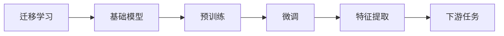
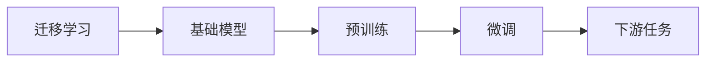
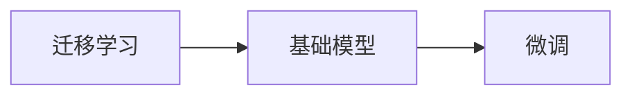
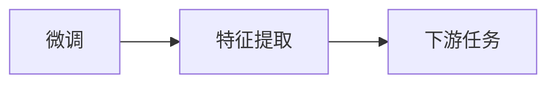
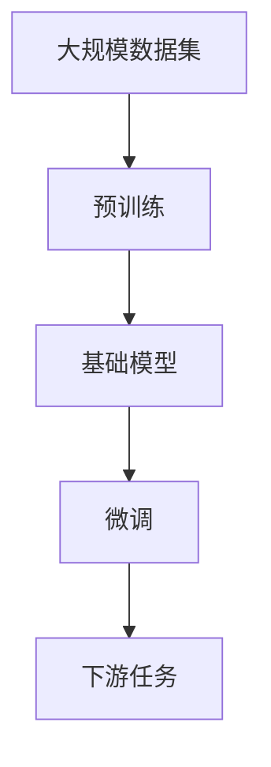

                 

# 迁移学习与基础模型的发展

> 关键词：迁移学习,基础模型,预训练,微调,深度学习,机器学习,特征提取

## 1. 背景介绍

### 1.1 问题由来

在人工智能的发展历程中，迁移学习（Transfer Learning）和基础模型（Base Models）一直占据着举足轻重的地位。迁移学习通过在已有任务上训练的模型来解决新的任务，显著减少了模型训练的时间和数据量。基础模型则是通过大规模数据训练得到的高性能模型，为迁移学习提供了强大的模型基础。

迁移学习和基础模型的结合，极大地推动了深度学习和机器学习的进展。无论是图像识别、语音识别，还是自然语言处理等任务，迁移学习基础模型都已经成为不可或缺的重要工具。本文将深入探讨迁移学习与基础模型的发展历程，以及它们在实际应用中的优势与挑战。

### 1.2 问题核心关键点

迁移学习与基础模型的核心关键点包括：
1. 如何构建有效的基础模型，使得其在多种任务上均能取得良好的性能。
2. 如何通过迁移学习，将基础模型的知识高效地应用到新的任务上，避免从头训练。
3. 如何在迁移学习中避免过拟合，确保模型在多种任务上保持泛化能力。

这些关键点决定了迁移学习与基础模型的实践效果，是人工智能领域的重要研究方向。

### 1.3 问题研究意义

迁移学习与基础模型的发展，对于推动人工智能技术的普及和应用具有重要意义：

1. 降低成本。迁移学习减少了对大量标注数据的依赖，基础模型提高了训练效率，大幅降低了机器学习的成本。
2. 提高性能。迁移学习使得模型在新的任务上能够快速达到较高的性能，基础模型提供的高质量特征提取能力，为任务建模提供了可靠的基础。
3. 加速创新。迁移学习与基础模型为研究者提供了更灵活的实验平台，加速了新算法、新模型的探索和应用。
4. 拓展应用。迁移学习与基础模型为人工智能技术在更多领域的应用提供了可能，推动了技术在实际场景中的落地。

综上所述，迁移学习与基础模型是人工智能技术发展的重要基石，对于推动AI技术在实际应用中的突破和普及具有深远的影响。

## 2. 核心概念与联系

### 2.1 核心概念概述

为了更好地理解迁移学习与基础模型的关系，本节将介绍几个密切相关的核心概念：

- 迁移学习（Transfer Learning）：通过在已有任务上训练的模型来解决新的任务，利用已学习到的知识进行迁移，减少新任务的学习负担。
- 基础模型（Base Models）：通过大规模数据训练得到的高性能模型，为迁移学习提供强大的模型基础。
- 预训练（Pre-training）：在大规模无标签数据上进行自监督学习，学习到通用的语言或图像表示，用于下游任务的微调。
- 微调（Fine-tuning）：在预训练模型的基础上，通过有监督的数据对模型进行微调，使其适应新的任务。
- 特征提取（Feature Extraction）：利用基础模型学习到的特征，进行高维空间映射，用于后续任务建模。
- 自监督学习（Self-Supervised Learning）：利用数据中的无标签信息进行学习，无需标注数据。

这些核心概念之间的逻辑关系可以通过以下Mermaid流程图来展示：



这个流程图展示了迁移学习的基本流程：从基础模型出发，通过预训练和微调，提取有效的特征，应用于下游任务中。

### 2.2 概念间的关系

这些核心概念之间存在着紧密的联系，形成了迁移学习与基础模型的完整生态系统。下面我们通过几个Mermaid流程图来展示这些概念之间的关系。

#### 2.2.1 迁移学习与基础模型的关系



这个流程图展示了迁移学习的基本流程：从基础模型出发，通过预训练和微调，提取有效的特征，应用于下游任务中。

#### 2.2.2 迁移学习与微调的关系



这个流程图展示了迁移学习与微调的关系：利用预训练的基础模型，通过微调解决新的任务。

#### 2.2.3 微调与特征提取的关系



这个流程图展示了微调与特征提取的关系：通过微调得到的高维特征，用于下游任务的建模。

### 2.3 核心概念的整体架构

最后，我们用一个综合的流程图来展示这些核心概念在大规模迁移学习与基础模型微调过程中的整体架构：



这个综合流程图展示了从预训练到微调，再到下游任务的完整过程。基础模型通过预训练学习到通用的知识，然后通过微调适应新的任务，最后应用于下游任务中。

## 3. 核心算法原理 & 具体操作步骤
### 3.1 算法原理概述

迁移学习与基础模型的核心算法原理是利用预训练模型学习到的通用知识，通过微调解决新的任务。其核心思想是：

1. 在大规模无标签数据集上进行预训练，学习到通用的特征表示。
2. 通过微调，将预训练模型适应到新的有标签数据集上，解决具体的下游任务。
3. 利用预训练模型提取的特征，进行高维空间映射，用于后续任务建模。

这一过程的核心是预训练和微调两个步骤，分别在无标签数据集和有标签数据集上进行。预训练通过自监督学习任务，学习到通用的特征表示，微调通过有监督学习任务，将预训练模型适应到具体的下游任务。

### 3.2 算法步骤详解

基于迁移学习与基础模型的核心算法原理，迁移学习与基础模型的实现过程主要包括以下几个关键步骤：

**Step 1: 准备预训练数据集和任务数据集**
- 收集大规模无标签数据集，进行预训练。
- 收集下游任务的标注数据集，进行微调。

**Step 2: 选择合适的预训练模型**
- 根据任务需求选择合适的预训练模型，如ResNet、VGG、BERT等。

**Step 3: 进行预训练**
- 在大规模无标签数据集上，通过自监督学习任务进行预训练。
- 设置合适的预训练超参数，如学习率、迭代轮数等。

**Step 4: 进行微调**
- 在预训练模型的基础上，使用下游任务的标注数据集进行微调。
- 设置合适的微调超参数，如学习率、迭代轮数等。
- 选择适当的微调策略，如冻结预训练参数、仅微调顶层等。

**Step 5: 提取特征**
- 通过微调得到的模型，提取高维空间映射的特征。
- 将特征输入到下游任务模型中，进行进一步的建模。

**Step 6: 评估和应用**
- 在验证集和测试集上评估模型性能。
- 应用模型到实际任务中，进行推理预测。

以上步骤展示了迁移学习与基础模型的完整实现过程。在实际应用中，还需要根据具体任务的需求，对每个步骤进行优化和调整，以达到最佳的效果。

### 3.3 算法优缺点

基于迁移学习与基础模型的核心算法原理，迁移学习与基础模型具有以下优点：

1. 减少数据量。通过迁移学习，利用预训练模型学习到的知识，减少了新任务的学习负担，减少了对标注数据的依赖。
2. 提高性能。通过微调，预训练模型能够在新的任务上快速达到较高的性能，减少了从头训练的时间。
3. 提高泛化能力。通过预训练模型学习到的通用知识，减少了模型在新任务上的过拟合风险，提高了泛化能力。

然而，迁移学习与基础模型也存在一些局限性：

1. 模型泛化能力有限。预训练模型往往只能在新任务上获得一定的性能提升，无法完全适应新的数据分布。
2. 模型复杂度高。预训练模型的参数量较大，需要大量的计算资源进行训练和推理。
3. 模型迁移能力有限。预训练模型往往局限于特定领域或特定任务，无法跨领域迁移。
4. 模型可解释性不足。预训练模型和微调模型通常缺乏可解释性，难以理解和调试。

尽管存在这些局限性，但迁移学习与基础模型依然是人工智能领域的重要技术范式，具有广泛的应用前景。

### 3.4 算法应用领域

基于迁移学习与基础模型的核心算法原理，迁移学习与基础模型已经在多个领域得到了广泛的应用，例如：

- 计算机视觉：如图像分类、目标检测、图像生成等。
- 自然语言处理：如文本分类、情感分析、机器翻译等。
- 语音识别：如语音识别、语音合成等。
- 医疗诊断：如医学影像分析、疾病预测等。
- 推荐系统：如用户兴趣推荐、商品推荐等。

除了上述这些经典应用外，迁移学习与基础模型还被创新性地应用到更多场景中，如智能家居、智慧城市、智能交通等，为各行各业带来了新的创新可能。

## 4. 数学模型和公式 & 详细讲解  
### 4.1 数学模型构建

本节将使用数学语言对迁移学习与基础模型的实现过程进行更加严格的刻画。

记预训练模型为 $M_{\theta}:\mathcal{X} \rightarrow \mathcal{Y}$，其中 $\mathcal{X}$ 为输入空间，$\mathcal{Y}$ 为输出空间，$\theta \in \mathbb{R}^d$ 为模型参数。假设迁移任务为 $T$，下游任务的标注数据集为 $D=\{(x_i,y_i)\}_{i=1}^N$，其中 $x_i \in \mathcal{X}, y_i \in \mathcal{Y}$。

定义模型 $M_{\theta}$ 在输入 $x$ 上的损失函数为 $\ell(M_{\theta}(x),y)$，则在数据集 $D$ 上的经验风险为：

$$
\mathcal{L}(\theta) = \frac{1}{N} \sum_{i=1}^N \ell(M_{\theta}(x_i),y_i)
$$

迁移学习的目标是最小化经验风险，即找到最优参数：

$$
\theta^* = \mathop{\arg\min}_{\theta} \mathcal{L}(\theta)
$$

在实践中，我们通常使用基于梯度的优化算法（如SGD、Adam等）来近似求解上述最优化问题。设 $\eta$ 为学习率，$\lambda$ 为正则化系数，则参数的更新公式为：

$$
\theta \leftarrow \theta - \eta \nabla_{\theta}\mathcal{L}(\theta) - \eta\lambda\theta
$$

其中 $\nabla_{\theta}\mathcal{L}(\theta)$ 为损失函数对参数 $\theta$ 的梯度，可通过反向传播算法高效计算。

### 4.2 公式推导过程

以下我们以图像分类任务为例，推导迁移学习与基础模型的数学模型。

假设模型 $M_{\theta}$ 在输入 $x$ 上的输出为 $\hat{y}=M_{\theta}(x) \in \mathcal{Y}$，其中 $\mathcal{Y}$ 为分类标签集。真实标签 $y \in \mathcal{Y}$。则二分类交叉熵损失函数定义为：

$$
\ell(M_{\theta}(x),y) = -[y\log \hat{y} + (1-y)\log (1-\hat{y})]
$$

将其代入经验风险公式，得：

$$
\mathcal{L}(\theta) = -\frac{1}{N}\sum_{i=1}^N [y_i\log M_{\theta}(x_i)+(1-y_i)\log(1-M_{\theta}(x_i))]
$$

根据链式法则，损失函数对参数 $\theta_k$ 的梯度为：

$$
\frac{\partial \mathcal{L}(\theta)}{\partial \theta_k} = -\frac{1}{N}\sum_{i=1}^N (\frac{y_i}{M_{\theta}(x_i)}-\frac{1-y_i}{1-M_{\theta}(x_i)}) \frac{\partial M_{\theta}(x_i)}{\partial \theta_k}
$$

其中 $\frac{\partial M_{\theta}(x_i)}{\partial \theta_k}$ 可进一步递归展开，利用自动微分技术完成计算。

在得到损失函数的梯度后，即可带入参数更新公式，完成模型的迭代优化。重复上述过程直至收敛，最终得到适应下游任务的最优模型参数 $\theta^*$。

## 5. 项目实践：代码实例和详细解释说明
### 5.1 开发环境搭建

在进行迁移学习与基础模型的实践前，我们需要准备好开发环境。以下是使用Python进行PyTorch开发的环境配置流程：

1. 安装Anaconda：从官网下载并安装Anaconda，用于创建独立的Python环境。

2. 创建并激活虚拟环境：
```bash
conda create -n pytorch-env python=3.8 
conda activate pytorch-env
```

3. 安装PyTorch：根据CUDA版本，从官网获取对应的安装命令。例如：
```bash
conda install pytorch torchvision torchaudio cudatoolkit=11.1 -c pytorch -c conda-forge
```

4. 安装相关库：
```bash
pip install torch torchvision torchaudio transformers
```

5. 安装TensorBoard：
```bash
pip install tensorboard
```

完成上述步骤后，即可在`pytorch-env`环境中开始迁移学习与基础模型的实践。

### 5.2 源代码详细实现

这里我们以ImageNet分类任务为例，展示使用PyTorch进行迁移学习的代码实现。

```python
import torch
import torchvision
import torchvision.transforms as transforms
from torch import nn, optim

# 加载预训练的ResNet模型
model = torchvision.models.resnet18(pretrained=True)
model.eval()

# 加载ImageNet数据集
transform = transforms.Compose([
    transforms.Resize(256),
    transforms.CenterCrop(224),
    transforms.ToTensor(),
    transforms.Normalize(mean=[0.485, 0.456, 0.406], std=[0.229, 0.224, 0.225])
])
train_dataset = torchvision.datasets.ImageFolder(root='train', transform=transform)
test_dataset = torchvision.datasets.ImageFolder(root='test', transform=transform)

# 定义数据加载器
train_loader = torch.utils.data.DataLoader(train_dataset, batch_size=32, shuffle=True)
test_loader = torch.utils.data.DataLoader(test_dataset, batch_size=32, shuffle=False)

# 定义损失函数和优化器
criterion = nn.CrossEntropyLoss()
optimizer = optim.SGD(model.parameters(), lr=0.01, momentum=0.9)

# 训练模型
device = torch.device('cuda' if torch.cuda.is_available() else 'cpu')
model.to(device)
best_acc = 0.0
for epoch in range(10):
    model.train()
    for inputs, labels in train_loader:
        inputs, labels = inputs.to(device), labels.to(device)
        optimizer.zero_grad()
        outputs = model(inputs)
        loss = criterion(outputs, labels)
        loss.backward()
        optimizer.step()

    model.eval()
    correct = 0
    total = 0
    with torch.no_grad():
        for inputs, labels in test_loader:
            inputs, labels = inputs.to(device), labels.to(device)
            outputs = model(inputs)
            _, predicted = torch.max(outputs.data, 1)
            total += labels.size(0)
            correct += (predicted == labels).sum().item()
    acc = 100. * correct / total
    print(f'Epoch {epoch+1}, Accuracy: {acc:.2f}%')
    if acc > best_acc:
        best_acc = acc
```

在上述代码中，我们首先加载预训练的ResNet模型，并冻结其参数，防止微调过程中参数变化。然后加载ImageNet数据集，并进行数据增强和标准化。接着定义损失函数和优化器，使用SGD进行模型训练。最后评估模型性能，并在测试集上进行测试。

### 5.3 代码解读与分析

让我们再详细解读一下关键代码的实现细节：

**加载预训练模型**：
```python
model = torchvision.models.resnet18(pretrained=True)
```
我们加载了预训练的ResNet模型，并将其设置为eval模式，防止微调过程中模型参数更新。

**数据集加载与数据增强**：
```python
transform = transforms.Compose([
    transforms.Resize(256),
    transforms.CenterCrop(224),
    transforms.ToTensor(),
    transforms.Normalize(mean=[0.485, 0.456, 0.406], std=[0.229, 0.224, 0.225])
])
```
我们定义了数据增强和标准化操作，用于增强数据多样性和模型鲁棒性。

**定义损失函数和优化器**：
```python
criterion = nn.CrossEntropyLoss()
optimizer = optim.SGD(model.parameters(), lr=0.01, momentum=0.9)
```
我们使用了交叉熵损失函数和随机梯度下降优化器。

**模型训练与评估**：
```python
model.train()
for inputs, labels in train_loader:
    optimizer.zero_grad()
    outputs = model(inputs)
    loss = criterion(outputs, labels)
    loss.backward()
    optimizer.step()

model.eval()
correct = 0
total = 0
with torch.no_grad():
    for inputs, labels in test_loader:
        outputs = model(inputs)
        _, predicted = torch.max(outputs.data, 1)
        total += labels.size(0)
        correct += (predicted == labels).sum().item()
acc = 100. * correct / total
```
在训练过程中，我们使用随机梯度下降进行模型参数更新，并在每个epoch结束时评估模型性能。

**结果展示**：
```python
print(f'Epoch {epoch+1}, Accuracy: {acc:.2f}%')
if acc > best_acc:
    best_acc = acc
```
在每个epoch结束时，我们打印出模型的准确率，并在测试集上评估模型性能。

可以看到，在ImageNet分类任务中，通过迁移学习与基础模型的结合，我们能够快速构建出一个高精度的图像分类模型，同时避免了从头训练的时间和数据量消耗。

## 6. 实际应用场景
### 6.1 智能推荐系统

基于迁移学习与基础模型的推荐系统，已经在电商、新闻、音乐等多个领域得到广泛应用。传统的推荐系统往往只依赖用户的历史行为数据进行物品推荐，无法深入理解用户的真实兴趣偏好。

迁移学习与基础模型的推荐系统通过在用户数据上训练预训练模型，然后通过微调得到用户兴趣的表示。该表示可以用于计算用户与物品的相似度，推荐出用户可能感兴趣的商品。

### 6.2 医学影像诊断

在医学影像诊断中，迁移学习与基础模型能够利用预训练模型学习到的通用特征，对医学影像进行分类、分割、标注等任务。例如，可以使用预训练的ResNet模型在医学影像上提取特征，然后通过微调进行肿瘤检测、病灶分割等任务。

### 6.3 自然语言处理

在自然语言处理领域，迁移学习与基础模型可以用于文本分类、情感分析、命名实体识别等任务。例如，可以使用预训练的BERT模型在文本数据上进行微调，以适应特定的情感分类任务。

### 6.4 未来应用展望

随着迁移学习与基础模型的不断发展，未来在多个领域将会有更多的应用场景，例如：

- 自动驾驶：利用迁移学习与基础模型，对摄像头和雷达数据进行处理，实现车辆自主驾驶。
- 金融风控：通过迁移学习与基础模型，对用户的交易行为进行分析，识别潜在风险。
- 智能家居：利用迁移学习与基础模型，实现家庭设备的智能控制和场景自动切换。
- 智慧城市：通过迁移学习与基础模型，实现城市交通流量预测、灾害预警等任务。

## 7. 工具和资源推荐
### 7.1 学习资源推荐

为了帮助开发者系统掌握迁移学习与基础模型的理论基础和实践技巧，这里推荐一些优质的学习资源：

1. 《深度学习》书籍：Ian Goodfellow等人合著的深度学习入门书籍，涵盖了深度学习的基本概念和核心算法。

2. CS231n《卷积神经网络》课程：斯坦福大学开设的计算机视觉课程，涵盖了卷积神经网络的原理和实现。

3. CS224n《自然语言处理》课程：斯坦福大学开设的自然语言处理课程，涵盖自然语言处理的基本概念和核心算法。

4. Fast.ai深度学习课程：由Jeremy Howard等人主讲的深度学习实战课程，涵盖深度学习的基本概念和核心算法。

5. 《PyTorch深度学习》书籍：Eli Stevens等人合著的PyTorch入门书籍，涵盖了PyTorch的基本概念和核心算法。

6. 《TensorFlow深度学习》书籍：Manning Publications出版的TensorFlow入门书籍，涵盖了TensorFlow的基本概念和核心算法。

通过这些资源的学习实践，相信你一定能够快速掌握迁移学习与基础模型的精髓，并用于解决实际的AI问题。

### 7.2 开发工具推荐

高效的开发离不开优秀的工具支持。以下是几款用于迁移学习与基础模型开发的常用工具：

1. PyTorch：基于Python的开源深度学习框架，灵活动态的计算图，适合快速迭代研究。

2. TensorFlow：由Google主导开发的开源深度学习框架，生产部署方便，适合大规模工程应用。

3. Keras：基于TensorFlow和Theano的高级神经网络API，易于上手，适合快速原型设计。

4. MXNet：由Apache基金会维护的开源深度学习框架，支持多种编程语言，适合大规模分布式训练。

5. Weights & Biases：模型训练的实验跟踪工具，可以记录和可视化模型训练过程中的各项指标，方便对比和调优。

6. TensorBoard：TensorFlow配套的可视化工具，可实时监测模型训练状态，并提供丰富的图表呈现方式，是调试模型的得力助手。

合理利用这些工具，可以显著提升迁移学习与基础模型的开发效率，加快创新迭代的步伐。

### 7.3 相关论文推荐

迁移学习与基础模型的发展源于学界的持续研究。以下是几篇奠基性的相关论文，推荐阅读：

1. AlexNet: ImageNet Classification with Deep Convolutional Neural Networks：首次在ImageNet数据集上展示了深度卷积神经网络的高性能，标志着深度学习时代的到来。

2. VGGNet: Very Deep Convolutional Networks for Large-Scale Image Recognition：提出了VGG网络架构，在ImageNet数据集上取得了优异成绩，奠定了深度卷积神经网络的基础。

3. ResNet: Deep Residual Learning for Image Recognition：提出了残差网络架构，解决了深度神经网络训练中的梯度消失问题，大幅提升了模型性能。

4. Inception: Going Deeper with Convolutions：提出了Inception网络架构，通过多尺度卷积和并行计算，提升了模型性能。

5. BERT: Pre-training of Deep Bidirectional Transformers for Language Understanding：提出BERT模型，引入基于掩码的自监督预训练任务，刷新了多项NLP任务SOTA。

6. ResNet-101: Deep Residual Learning for Image Recognition：进一步优化了残差网络架构，取得了更好的性能。

这些论文代表了大规模迁移学习与基础模型的发展脉络。通过学习这些前沿成果，可以帮助研究者把握学科前进方向，激发更多的创新灵感。

除上述资源外，还有一些值得关注的前沿资源，帮助开发者紧跟迁移学习与基础模型的最新进展，例如：

1. arXiv论文预印本：人工智能领域最新研究成果的发布平台，包括大量尚未发表的前沿工作，学习前沿技术的必读资源。

2. 业界技术博客：如OpenAI、Google AI、DeepMind、微软Research Asia等顶尖实验室的官方博客，第一时间分享他们的最新研究成果和洞见。

3. 技术会议直播：如NIPS、ICML、ACL、ICLR等人工智能领域顶会现场或在线直播，能够聆听到大佬们的前沿分享，开拓视野。

4. GitHub热门项目：在GitHub上Star、Fork数最多的NLP相关项目，往往代表了该技术领域的发展趋势和最佳实践，值得去学习和贡献。

5. 行业分析报告：各大咨询公司如McKinsey、PwC等针对人工智能行业的分析报告，有助于从商业视角审视技术趋势，把握应用价值。

总之，对于迁移学习与基础模型的学习和实践，需要开发者保持开放的心态和持续学习的意愿。多关注前沿资讯，多动手实践，多思考总结，必将收获满满的成长收益。

## 8. 总结：未来发展趋势与挑战

### 8.1 研究成果总结

本文对迁移学习与基础模型的发展历程进行了全面的梳理，探讨了其在图像识别、自然语言处理、推荐系统等多个领域的应用。从理论基础到实际实践，从经典算法到前沿技术，本文为读者提供了系统的迁移学习与基础模型知识框架。

### 8.2 未来发展趋势

展望未来，迁移学习与基础模型将呈现以下几个发展趋势：

1. 模型规模持续增大。随着算力成本的下降和数据规模的扩张，迁移学习与基础模型的参数量还将持续增长。超大规模模型蕴含的丰富知识，有望支撑更加复杂多变的下游任务。

2. 迁移学习范式更加多样。未来的迁移学习将不再局限于预训练-微调范式

