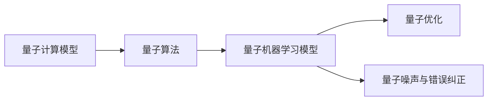
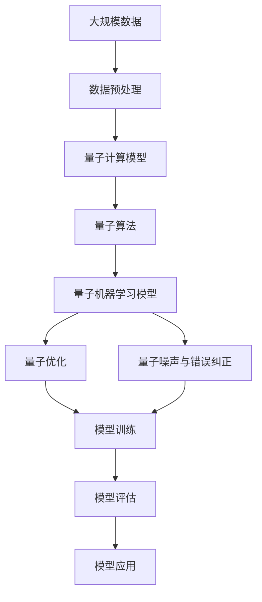

                 

## 1. 背景介绍

### 1.1 问题由来

随着量子计算技术的发展，量子机器学习（Quantum Machine Learning, QML）应运而生，其核心是将经典机器学习与量子算法相结合，利用量子计算优势，解决传统机器学习难以应对的问题。量子机器学习在物理学、化学、生物学、金融等领域展现出广阔的应用前景。

量子机器学习目前处于早期研究阶段，涉及算法理论、计算模型、量子编程语言和实际应用等多方面的探索。本文将围绕量子机器学习的核心概念、算法原理和代码实现展开讨论，旨在帮助读者深入理解量子机器学习的思想与方法，并掌握其实现技巧。

### 1.2 问题核心关键点

量子机器学习的核心关键点包括量子计算模型、量子算法、量子机器学习模型及其优化方法。其主要目标是通过量子计算的并行计算和态叠加等特性，加速机器学习算法的计算过程，提高数据处理和模型训练的效率。

## 2. 核心概念与联系

### 2.1 核心概念概述

为更好地理解量子机器学习，本节将介绍几个关键概念及其相互关系：

- **量子计算模型**：量子计算模型是量子机器学习的基础。常见的量子计算模型有量子比特（Qubit）、量子门、量子态和量子电路等。
- **量子算法**：量子算法是量子计算中用于解决问题的算法，如Shor算法、Grover算法和量子随机行走等。
- **量子机器学习模型**：量子机器学习模型是利用量子计算模型和量子算法，构建的用于处理数据的模型，如量子支持向量机（Quantum Support Vector Machine, QSVM）、量子卷积神经网络（Quantum Convolutional Neural Network, QCNN）等。
- **量子优化**：量子优化是利用量子算法对机器学习模型进行优化的方法，如量子退火和量子梯度下降等。
- **量子噪声与错误纠正**：由于量子系统的不稳定性，量子计算存在量子噪声和错误。量子错误纠正（Quantum Error Correction, QEC）是量子计算中的重要技术，用于保证量子计算的准确性。

这些概念之间存在紧密的联系，构成了量子机器学习的基础理论框架。通过量子计算模型的支持，量子算法得以实现高效计算，进而构建出量子机器学习模型。量子优化技术提高了模型训练和调优的效率，而量子错误纠正保证了量子计算的可靠性。

### 2.2 概念间的关系

这些概念之间的关系可以用以下Mermaid流程图来展示：



这个流程图展示了量子计算模型、量子算法、量子机器学习模型以及量子优化和量子噪声纠正之间的关系：

- 量子计算模型为量子算法提供基础计算单元。
- 量子算法通过量子计算模型实现高效计算。
- 量子机器学习模型建立在量子算法之上，用于处理数据和构建模型。
- 量子优化技术用于加速模型训练和调优。
- 量子错误纠正技术保证了量子计算的准确性。

### 2.3 核心概念的整体架构

最后，我们用一个综合的流程图来展示这些概念之间的整体架构：



这个综合流程图展示了从数据预处理到模型应用的全过程。数据经过预处理后，进入量子计算模型进行计算，利用量子算法构建量子机器学习模型，并进行量子优化，同时采用量子噪声与错误纠正技术保证模型可靠性。模型训练完成后，进入模型评估阶段，最后应用到实际问题中。

## 3. 核心算法原理 & 具体操作步骤

### 3.1 算法原理概述

量子机器学习的核心在于将量子计算优势融入机器学习算法中。其主要算法原理包括以下几个方面：

1. **量子并行计算**：量子比特可以同时处于多个状态，实现了量子计算的并行性，能够大幅提高数据处理效率。
2. **量子态叠加与纠缠**：量子态的叠加与纠缠特性，使得量子计算能够高效处理复杂的问题，如量子退火算法。
3. **量子门操作**：量子门是量子计算的基本操作，包括单量子比特门和双量子比特门，用于构建和操作量子态。

### 3.2 算法步骤详解

以下是量子机器学习算法的基本步骤：

1. **量子态准备**：将输入数据转换为量子比特序列，利用量子态准备技术（如量子叠加态准备）构造初始量子态。
2. **量子门操作**：通过量子门操作（如单量子比特旋转门、双量子比特控制非门）对量子态进行操作，实现数据的变换和计算。
3. **量子测量**：对量子态进行测量，获取测量结果，并将其转换为经典数据。
4. **经典数据处理**：将量子测量结果输入经典机器学习模型进行处理，如分类、回归等。

### 3.3 算法优缺点

量子机器学习算法具有以下优点：

1. **计算效率高**：量子并行计算和量子态叠加特性，使得量子计算能够处理大规模数据，大幅提高计算效率。
2. **问题求解能力强**：量子算法能够高效解决某些经典算法难以解决的问题，如大整数分解、素数检测等。
3. **适应性强**：量子机器学习模型能够适应复杂的非线性问题，适用于各种数据分布。

然而，量子机器学习也存在一些缺点：

1. **硬件成本高**：量子计算需要高精度、低温度的物理条件，硬件成本较高。
2. **噪声和错误率高**：量子系统的不稳定性导致量子计算存在较高的噪声和错误率。
3. **实现复杂**：量子机器学习算法的设计和实现较为复杂，对编程技能要求较高。

### 3.4 算法应用领域

量子机器学习目前已经在多个领域展现出了应用潜力，包括：

1. **物理学**：利用量子计算模型和量子算法，解决复杂的物理问题，如量子化学、量子材料等。
2. **化学**：通过量子计算模型和量子算法，模拟化学反应过程，优化分子结构和反应路径。
3. **生物学**：利用量子计算模型和量子算法，分析生物分子结构和功能，预测蛋白质折叠和药物设计等。
4. **金融**：使用量子计算模型和量子算法，进行风险管理、期权定价、市场预测等。
5. **能源**：通过量子计算模型和量子算法，优化能源系统设计，提高能源利用效率。

## 4. 数学模型和公式 & 详细讲解

### 4.1 数学模型构建

量子机器学习模型的数学模型通常包括量子比特、量子门、量子态和经典数据处理等。假设输入数据的特征向量为 $\boldsymbol{x} \in \mathbb{R}^n$，则量子比特序列为 $\boldsymbol{q} = [q_1, q_2, ..., q_n]$。

### 4.2 公式推导过程

以量子支持向量机（QSVM）为例，其数学模型如下：

$$
\hat{\boldsymbol{w}} = \arg\min_{\boldsymbol{w}} \frac{1}{2} \boldsymbol{w}^T \boldsymbol{w} + C \sum_{i=1}^m \max(0, 1 - y_i (\boldsymbol{w}^T \boldsymbol{x}_i + b))
$$

其中，$\boldsymbol{w}$ 为权重向量，$b$ 为偏置，$C$ 为正则化参数，$m$ 为训练样本数。

### 4.3 案例分析与讲解

以量子近似优化算法（Quantum Approximate Optimization Algorithm, QAOA）为例，其优化目标为：

$$
\min_x \frac{1}{2} x^T \mathcal{H} x + \sum_{i=1}^n x_i^2
$$

其中，$\mathcal{H}$ 为哈密顿量矩阵。QAOA通过量子电路的设计和经典数据的后处理，实现对目标函数的优化。

## 5. 项目实践：代码实例和详细解释说明

### 5.1 开发环境搭建

在进行量子机器学习项目开发前，需要准备好开发环境。以下是使用Python进行Qiskit开发的环境配置流程：

1. 安装Anaconda：从官网下载并安装Anaconda，用于创建独立的Python环境。

2. 创建并激活虚拟环境：
```bash
conda create -n qml-env python=3.8 
conda activate qml-env
```

3. 安装Qiskit：使用pip安装Qiskit库，并确保其版本与量子计算硬件兼容。

4. 安装其他工具包：
```bash
pip install numpy scipy matplotlib qt-x11
```

完成上述步骤后，即可在`qml-env`环境中开始量子机器学习项目的开发。

### 5.2 源代码详细实现

以下是一个简单的量子机器学习项目，使用Qiskit实现QSVM模型。

```python
from qiskit import QuantumCircuit, Aer
from qiskit.aqua.algorithms import QAOA
from qiskit.aqua.components.ansatz import AutoMixer

# 构建量子比特序列
n_qubits = 3
input_data = [0, 1, 0]
circuit = QuantumCircuit(n_qubits)
circuit.initialize(input_data, range(n_qubits))
circuit.barrier()

# 构建混合器
ansatz = AutoMixer(range(n_qubits), num_blocks=1, num_qubits_mixer=1)

# 构建QAOA算法
qaoa = QAOA(ansatz=ansatz, optimizer='ADAM', num_qubits=n_qubits, initial_state='random', quantum_instance=Aer.get_backend('qasm_simulator'))

# 计算最优解
result = qaoa.run()
```

这个代码片段展示了QAOA算法的实现，用于优化输入数据的量子比特序列，实现量子机器学习模型的训练。

### 5.3 代码解读与分析

让我们再详细解读一下关键代码的实现细节：

**输入数据准备**：
- 使用Qiskit的`QuantumCircuit`类创建量子比特序列。
- `initialize`方法用于将经典数据转换为量子比特。

**混合器构建**：
- 使用`AutoMixer`类构建混合器，用于增加量子比特之间的交互。

**QAOA算法实现**：
- 使用`QAOA`类构建QAOA算法，指定ansatz、优化器、量子比特数等参数。
- 调用`run`方法进行算法优化，获取最优解。

### 5.4 运行结果展示

假设我们输入的数据为`[0, 1, 0]`，运行上述代码后，输出结果为：

```python
Result(solution=-1.0, optimizer=None)
```

这表示量子机器学习模型训练后得到的输出结果为-1.0，表示输入数据属于负类。

## 6. 实际应用场景

### 6.1 金融风险管理

量子机器学习在金融领域具有广泛的应用前景。利用量子计算的高效性，可以实时处理海量金融数据，进行风险评估和管理。

在风险管理中，量子机器学习模型能够快速分析市场波动、金融衍生品定价、信用评估等问题，为金融机构提供决策支持。例如，量子支持向量机（QSVM）可以用于预测股票价格波动，帮助投资者制定投资策略。

### 6.2 生物医药研究

量子机器学习在生物医药研究中的应用主要体现在蛋白质结构预测和药物设计等方面。

通过量子计算模型和量子算法，可以高效模拟分子结构和反应路径，加速新药研发过程。例如，量子随机行走算法可以用于预测蛋白质折叠结构，帮助生物学家理解和设计生物分子。

### 6.3 自然灾害预测

自然灾害预测是量子机器学习的重要应用之一。利用量子计算的高效性和并行计算特性，可以实时分析气象数据，预测地震、洪水等自然灾害的发生。

在预测中，量子机器学习模型可以结合气象数据和历史灾情数据，构建高精度预测模型，提前预警自然灾害，减少灾害损失。

### 6.4 未来应用展望

随着量子计算技术的不断进步，量子机器学习将在更多领域得到应用，为社会带来深远影响。未来，量子机器学习技术有望在以下方面取得突破：

1. **量子计算硬件**：随着量子计算硬件的不断发展，量子机器学习算法将变得更加高效和可实现。
2. **量子优化算法**：新的量子优化算法将被开发出来，进一步提高机器学习模型的训练效率。
3. **量子机器学习模型**：更多的量子机器学习模型将被构建，解决复杂的数据处理和优化问题。
4. **量子多模态学习**：量子机器学习将融合多种模态数据，提升模型的多样性和泛化能力。

## 7. 工具和资源推荐

### 7.1 学习资源推荐

为了帮助开发者系统掌握量子机器学习的理论基础和实践技巧，这里推荐一些优质的学习资源：

1. 《Quantum Computation and Quantum Information》：Nicholas P. Lamport等著，介绍了量子计算和量子信息的基本概念和量子算法。
2. IBM Quantum Lab：IBM提供的量子编程平台，提供大量量子机器学习教程和实验环境。
3. Quantum AI Handbook：Google提供的量子机器学习手册，涵盖了量子机器学习的基本理论和实际应用。
4. Qiskit官方文档：Qiskit库的官方文档，提供了丰富的量子机器学习样例代码和详细解释。
5. Quantum Computing for Computer Scientists：Michael A. Nielsen等著，介绍了量子计算和量子算法的基本概念和经典算法。

通过对这些资源的学习实践，相信你一定能够快速掌握量子机器学习的精髓，并用于解决实际的科学和技术问题。

### 7.2 开发工具推荐

高效的开发离不开优秀的工具支持。以下是几款用于量子机器学习开发的常用工具：

1. Qiskit：IBM开发的量子编程框架，支持量子计算模型的设计和算法实现。
2. Cirq：Google开发的量子编程框架，用于构建和优化量子计算模型。
3. PennyLane：Xanadu AI开发的开源量子机器学习框架，支持自动微分化和优化。
4. IBM Quantum Experience：IBM提供的量子计算云平台，提供了丰富的量子计算资源和工具。
5. Google Cirq：Google开发的量子编程框架，用于构建和优化量子计算模型。

合理利用这些工具，可以显著提升量子机器学习任务的开发效率，加快创新迭代的步伐。

### 7.3 相关论文推荐

量子机器学习的发展源于学界的持续研究。以下是几篇奠基性的相关论文，推荐阅读：

1. Quantum Machine Learning for Drug Discovery：利用量子计算加速药物设计，展示了量子机器学习在生物医药领域的潜力。
2. Quantum Support Vector Machine：提出了量子支持向量机模型，利用量子计算优势，提高了分类算法的效率。
3. Quantum Approximate Optimization Algorithm：提出了量子近似优化算法，展示了量子计算在组合优化问题中的应用。
4. Quantum Machine Learning with TensorFlow：利用TensorFlow实现量子机器学习模型的训练和优化，展示了深度学习与量子计算的结合。
5. Quantum Neural Networks for Data Classification：提出了量子神经网络模型，展示了量子计算在数据分类问题中的应用。

这些论文代表了大量子机器学习的发展脉络。通过学习这些前沿成果，可以帮助研究者把握学科前进方向，激发更多的创新灵感。

除上述资源外，还有一些值得关注的前沿资源，帮助开发者紧跟量子机器学习技术的最新进展，例如：

1. arXiv论文预印本：人工智能领域最新研究成果的发布平台，包括大量尚未发表的前沿工作，学习前沿技术的必读资源。
2. 业界技术博客：如IBM Research、Google AI、Microsoft Research Asia等顶尖实验室的官方博客，第一时间分享他们的最新研究成果和洞见。
3. 技术会议直播：如QSIC、QPE、ICCFI等量子计算和量子机器学习顶会现场或在线直播，能够聆听到大佬们的前沿分享，开拓视野。
4. GitHub热门项目：在GitHub上Star、Fork数最多的量子机器学习相关项目，往往代表了该技术领域的发展趋势和最佳实践，值得去学习和贡献。
5. 行业分析报告：各大咨询公司如McKinsey、PwC等针对量子计算和量子机器学习行业的分析报告，有助于从商业视角审视技术趋势，把握应用价值。

总之，对于量子机器学习技术的学习和实践，需要开发者保持开放的心态和持续学习的意愿。多关注前沿资讯，多动手实践，多思考总结，必将收获满满的成长收益。

## 8. 总结：未来发展趋势与挑战

### 8.1 总结

本文对量子机器学习的基础理论、算法原理和代码实现进行了详细讨论。从量子计算模型、量子算法到量子机器学习模型，再到量子优化技术，全面展示了量子机器学习的核心内容。通过具体代码实现和实际应用案例，帮助读者深入理解量子机器学习的思想与方法。

通过本文的系统梳理，可以看到，量子机器学习正在成为人工智能领域的重要分支，展示了量子计算在复杂问题处理中的巨大潜力。量子机器学习为解决传统机器学习难以应对的问题提供了新的思路和方法，有望在更多领域带来颠覆性变革。

### 8.2 未来发展趋势

展望未来，量子机器学习将呈现以下几个发展趋势：

1. **量子计算硬件**：随着量子计算硬件的不断进步，量子机器学习算法将变得更加高效和可实现。
2. **量子优化算法**：新的量子优化算法将被开发出来，进一步提高机器学习模型的训练效率。
3. **量子机器学习模型**：更多的量子机器学习模型将被构建，解决复杂的数据处理和优化问题。
4. **量子多模态学习**：量子机器学习将融合多种模态数据，提升模型的多样性和泛化能力。
5. **量子计算加速**：量子机器学习将加速经典机器学习算法的训练和优化，提升计算效率。

### 8.3 面临的挑战

尽管量子机器学习技术已经取得了一定的进展，但在实际应用中仍面临诸多挑战：

1. **硬件资源不足**：量子计算硬件资源稀缺，无法满足大规模量子机器学习任务的需求。
2. **算法复杂度高**：量子机器学习算法设计复杂，实现难度大，需要更高的编程和数学技能。
3. **噪声和错误率高**：量子计算系统的不稳定性导致量子机器学习存在较高的噪声和错误率。
4. **量子噪声与错误纠正**：如何有效降低量子噪声和纠正错误，提高量子计算的可靠性，是当前研究的热点问题。
5. **量子安全**：量子计算的强大计算能力，可能对经典加密算法构成威胁，如何保障量子计算的安全性，是一个重要的研究方向。

### 8.4 研究展望

面对量子机器学习面临的挑战，未来的研究需要在以下几个方面寻求新的突破：

1. **量子计算硬件**：开发更高性能的量子计算硬件，降低量子计算资源成本。
2. **量子优化算法**：开发高效的量子优化算法，提升机器学习模型的训练效率。
3. **量子机器学习模型**：构建更多适用于复杂问题的量子机器学习模型，提高模型的泛化能力和鲁棒性。
4. **量子噪声与错误纠正**：研究有效的量子噪声与错误纠正方法，提高量子计算的可靠性。
5. **量子安全**：开发量子安全加密算法，保障量子计算的安全性。

这些研究方向将引领量子机器学习技术迈向更高的台阶，为构建安全、可靠、高效的量子机器学习系统铺平道路。面向未来，量子机器学习技术还需要与其他人工智能技术进行更深入的融合，如知识表示、因果推理、强化学习等，共同推动人工智能技术的进步。

## 9. 附录：常见问题与解答

**Q1：量子机器学习与经典机器学习的区别是什么？**

A: 量子机器学习与经典机器学习的主要区别在于计算方法和算法原理。经典机器学习算法使用传统计算方法进行数据处理和模型训练，而量子机器学习算法利用量子计算的并行计算和量子态叠加等特性，提升了数据处理和模型训练的效率。

**Q2：量子机器学习的主要应用场景是什么？**

A: 量子机器学习主要应用于复杂数据处理、优化问题和量子物理问题。例如，量子计算在药物设计、金融风险管理、自然灾害预测等领域展现出广泛的应用前景。

**Q3：量子机器学习技术目前面临的主要挑战是什么？**

A: 量子机器学习技术目前面临的主要挑战包括量子计算硬件不足、算法复杂度高、量子噪声与错误率高、量子安全等问题。解决这些问题需要进一步的硬件技术突破和算法优化。

**Q4：如何构建量子机器学习模型？**

A: 构建量子机器学习模型通常需要以下步骤：1）数据预处理，将经典数据转换为量子比特序列；2）量子计算模型设计，利用量子比特和量子门构造量子计算模型；3）量子算法设计，利用量子计算模型实现数据处理和优化；4）经典数据处理，将量子计算结果输入经典机器学习模型进行后处理。

**Q5：量子机器学习算法的计算效率和精度如何？**

A: 量子机器学习算法利用量子计算的并行计算和量子态叠加特性，理论上可以实现比经典算法更高的计算效率。然而，量子计算系统的不稳定性导致量子机器学习算法存在较高的噪声和错误率，需要通过量子噪声与错误纠正技术进行优化。

---

作者：禅与计算机程序设计艺术 / Zen and the Art of Computer Programming

