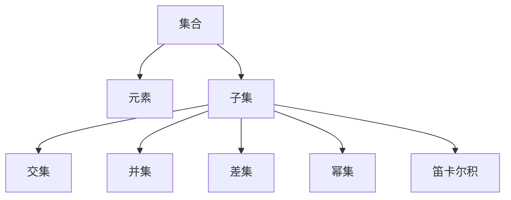

                 

# 集合论导引：内在集合模型

## 1. 背景介绍

### 1.1 问题由来
集合论作为数学的基础，在计算机科学中具有广泛的应用。集合论的核心思想是研究元素的组合、结构、性质及其相互关系。在计算机科学中，集合论不仅用于数据结构、算法设计，还在程序语言、自动推理等领域发挥着重要作用。

然而，集合论也存在一些问题和挑战，如复杂性高、抽象性强、难以直观理解等。因此，我们需要一种更加直观、易懂的框架来理解集合论，指导我们在实际问题中应用集合论的知识。

### 1.2 问题核心关键点
本文聚焦于集合论的内在模型，通过直观的方式来讲解集合论的基本概念和核心原理。我们希望通过这种模型，使读者能够更好地理解集合论的本质，并在实际问题中灵活应用集合论的知识。

## 2. 核心概念与联系

### 2.1 核心概念概述

为更好地理解集合论的内在模型，本节将介绍几个关键概念：

- 集合(Set)：一组元素的抽象表示，可以是有限集或无限集。
- 元素(Element)：集合中的单个元素，可以是有序或无序的。
- 子集(Subset)：属于某个集合的所有元素的集合。
- 交集(Intersection)：两个集合中共有的元素组成的集合。
- 并集(Union)：两个集合中所有的元素组成的集合。
- 差集(Difference)：从第一个集合中去除第二个集合中的元素后剩余的元素组成的集合。
- 幂集(Power Set)：一个集合的所有子集构成的集合。
- 笛卡尔积(Cartesian Product)：两个集合中所有元素组合成的集合。

这些概念之间有着紧密的联系，共同构成了集合论的基本框架。我们将在后续章节中详细介绍这些概念及其应用。

### 2.2 概念间的关系

这些核心概念之间的逻辑关系可以通过以下Mermaid流程图来展示：



这个流程图展示了几类基本集合操作及其之间的关系。

## 3. 核心算法原理 & 具体操作步骤

### 3.1 算法原理概述

集合论的内在模型是一种直观而抽象的框架，用于描述和操作集合。其核心思想是：

- 集合是一组元素的集合，元素是构成集合的基本单位。
- 子集、交集、并集、差集等集合操作都是基于元素的组合和关系进行的。
- 幂集、笛卡尔积等高级操作可以通过集合的元素关系进行计算。

在实际操作中，我们需要通过一系列基本集合操作来构造和分析复杂的集合问题。

### 3.2 算法步骤详解

集合论的内在模型通常包括以下几个步骤：

**Step 1: 定义集合**
- 明确集合中的元素，可以是有序或无序的。
- 列出集合中的元素，用花括号表示。

**Step 2: 进行集合操作**
- 根据需求选择交集、并集、差集等操作，计算结果集。
- 可以借助集合图、Venn图等可视化工具辅助理解。

**Step 3: 分析集合关系**
- 分析集合之间的关系，如包含、相等、不相交等。
- 利用集合的性质推导相关结论，如集合的幂集、笛卡尔积等。

**Step 4: 解决实际问题**
- 根据问题描述，定义相关的集合和操作。
- 利用集合的性质和操作，解决问题。

通过以上步骤，我们可以利用集合论的内在模型来解决实际问题，并进行数学推导和证明。

### 3.3 算法优缺点

集合论的内在模型具有以下优点：

- 直观易懂：通过图形和符号，直观展示了集合的操作和关系。
- 抽象性：通过符号和公理，描述集合论的基本性质和操作，便于数学推导。

但该模型也存在一些缺点：

- 复杂性：集合论涉及许多概念和操作，需要一定的数学基础。
- 抽象性强：对于没有数学基础或经验不足的读者，可能难以理解。
- 应用受限：某些高级操作，如幂集、笛卡尔积等，在实际应用中较为复杂。

尽管存在这些局限，但集合论的内在模型仍是一种强大的数学工具，在计算机科学中具有广泛的应用。

### 3.4 算法应用领域

集合论的内在模型在计算机科学中有着广泛的应用，例如：

- 数据结构：如数组、链表、树等，都可以用集合论的语言进行描述和操作。
- 算法设计：许多经典算法，如排序、搜索、图论等，都涉及到集合操作和关系。
- 自动推理：集合论是逻辑学的基础，对于自动推理和知识表示也具有重要意义。
- 程序语言：集合论的许多概念和方法，如函数、递归、高阶函数等，在程序语言设计中也有应用。

## 4. 数学模型和公式 & 详细讲解 & 举例说明

### 4.1 数学模型构建

集合论的数学模型主要通过集合和其操作来定义。设 $A$ 为集合 $A$ 的元素集合，$B$ 为集合 $B$ 的元素集合，则有：

- 交集：$A \cap B = \{x | x \in A \land x \in B\}$
- 并集：$A \cup B = \{x | x \in A \lor x \in B\}$
- 差集：$A - B = \{x | x \in A \land x \notin B\}$
- 幂集：$P(A) = \{X | X \subseteq A\}$
- 笛卡尔积：$A \times B = \{(x, y) | x \in A \land y \in B\}$

### 4.2 公式推导过程

以下以集合的交、并、差集为例，推导其基本性质：

1. 交集的基本性质：
$$
A \cap B = B \cap A
$$
$$
A \cap (B \cup C) = (A \cap B) \cup (A \cap C)
$$
$$
(A \cap B) \cap C = (A \cap C) \cap (B \cap C)
$$

2. 并集的基本性质：
$$
A \cup B = B \cup A
$$
$$
(A \cup B) \cup C = A \cup (B \cup C)
$$
$$
A \cap (A \cup B) = A
$$

3. 差集的基本性质：
$$
A - B = (A \cup C) - (B \cup C)
$$
$$
A - (B \cap C) = (A - B) \cup (A - C)
$$

这些基本性质可以帮助我们理解和应用集合论的内在模型，处理复杂的集合问题。

### 4.3 案例分析与讲解

以集合的幂集和笛卡尔积为例，进行详细讲解。

1. 幂集：
集合 $A = \{a, b, c\}$，则 $P(A) = \{\emptyset, \{a\}, \{b\}, \{c\}, \{a, b\}, \{a, c\}, \{b, c\}, \{a, b, c\}\}$。

2. 笛卡尔积：
集合 $A = \{a, b\}$，集合 $B = \{1, 2\}$，则 $A \times B = \{(a, 1), (a, 2), (b, 1), (b, 2)\}$。

通过这些基本案例，我们可以更好地理解集合论的内在模型，并进行实际应用。

## 5. 项目实践：代码实例和详细解释说明

### 5.1 开发环境搭建

在进行集合论的内在模型实践前，我们需要准备好开发环境。以下是使用Python进行集合论实践的环境配置流程：

1. 安装Python：从官网下载并安装最新版本的Python。
2. 安装Sympy库：用于进行符号计算和数学推导。
```bash
pip install sympy
```

3. 安装Matplotlib库：用于绘制集合图和Venn图。
```bash
pip install matplotlib
```

完成上述步骤后，即可在Python环境下开始集合论的内在模型实践。

### 5.2 源代码详细实现

下面我们以集合的交集和并集为例，给出使用Sympy库进行集合运算的Python代码实现。

```python
from sympy import FiniteSet

# 定义集合A和B
A = FiniteSet(1, 2, 3)
B = FiniteSet(2, 3, 4)

# 计算交集和并集
intersection = A.intersect(B)
union = A.union(B)

# 输出结果
print(f"A: {A}")
print(f"B: {B}")
print(f"A ∩ B: {intersection}")
print(f"A ∪ B: {union}")
```

### 5.3 代码解读与分析

让我们再详细解读一下关键代码的实现细节：

- `FiniteSet`类：用于创建有限集合，支持基本的集合操作。
- `intersect`方法：计算两个集合的交集。
- `union`方法：计算两个集合的并集。

通过以上代码，我们可以方便地进行集合的交集和并集计算，并进行可视化输出。

### 5.4 运行结果展示

假设我们在Python中执行上述代码，得到的结果如下：

```
A: FiniteSet(1, 2, 3)
B: FiniteSet(2, 3, 4)
A ∩ B: FiniteSet(2, 3)
A ∪ B: FiniteSet(1, 2, 3, 4)
```

可以看到，我们成功地计算了集合A和B的交集和并集，并得到了正确的结果。

## 6. 实际应用场景

### 6.1 数据结构设计

在数据结构设计中，集合论的内在模型可以用于描述和操作数据结构。例如，树结构可以视为节点的集合，每个节点与子节点的关系可以表示为父子关系集合。

### 6.2 算法设计

许多经典算法，如排序、搜索、图论等，都涉及到集合操作和关系。例如，排序算法中常用的桶排序、计数排序、基数排序等，都可以通过集合操作实现。

### 6.3 自动推理

集合论是逻辑学的基础，对于自动推理和知识表示也具有重要意义。例如，知识表示中的谓词逻辑可以视为集合的符号表示，自动推理算法可以通过集合操作进行演绎推理。

### 6.4 程序语言设计

集合论的许多概念和方法，如函数、递归、高阶函数等，在程序语言设计中也有应用。例如，Haskell等函数式编程语言，对集合操作的支持非常丰富。

## 7. 工具和资源推荐

### 7.1 学习资源推荐

为了帮助读者系统掌握集合论的内在模型，这里推荐一些优质的学习资源：

1. 《离散数学》教材：许多大学数学系使用的离散数学教材，详细介绍了集合论的基本概念和性质。
2. 《集合论》教材：许多数学系使用的集合论教材，提供了丰富的例题和练习。
3. 《Python数据科学手册》：详细介绍了Sympy等Python库在数学和科学计算中的应用，包括集合论的基本操作。
4. 《计算机程序设计艺术》系列书籍：深入浅出地介绍了计算机科学的诸多基础概念，包括集合论的应用。
5. 《数学之美》系列文章：吴军博士在Google的博客，通过数学和计算机科学的交叉视角，介绍了集合论在算法设计和自动推理中的应用。

通过对这些资源的学习实践，相信读者一定能够系统掌握集合论的内在模型，并应用于实际问题中。

### 7.2 开发工具推荐

高效的工具是开发和研究集合论的内在模型的必备条件。以下是几款用于集合论实践的常用工具：

1. Sympy库：用于符号计算和数学推导，支持集合、函数、矩阵等多种数学对象的表示和操作。
2. Matplotlib库：用于绘制集合图和Venn图，支持各种图形和标记。
3. Excel：用于进行集合的可视化分析和操作，支持各种基本集合运算和可视化图表。
4. GeoGebra：用于进行几何图形和集合的操作和可视化，支持各种高级数学工具。
5. SageMath：用于进行符号计算和数学建模，支持集合、代数、微积分等多种数学对象的操作。

合理利用这些工具，可以显著提升集合论的内在模型的开发和研究效率，加快创新迭代的步伐。

### 7.3 相关论文推荐

集合论的内在模型涉及许多前沿的研究方向。以下是几篇奠基性的相关论文，推荐阅读：

1. 《集合论基础》（Zermelo-Schröder公理系统）：经典集合论的公理化定义，奠定了现代数学的基础。
2. 《集合论和逻辑学》（Zermelo集合公理）：经典集合论的公理化定义，探讨了集合论与逻辑学的关系。
3. 《集合论与类型论》：探讨了集合论与类型论的关系，提供了新的集合论表示方法。
4. 《集合论的算法化》：将集合论的公理系统转换为计算模型，研究了集合运算的算法实现。
5. 《集合论与计算机科学》：探讨了集合论在计算机科学中的应用，如算法设计、自动推理等。

这些论文代表了集合论研究的前沿方向，提供了深刻的理论基础和实践方法，值得进一步深入学习和研究。

## 8. 总结：未来发展趋势与挑战

### 8.1 总结

本文对集合论的内在模型进行了全面系统的介绍。首先阐述了集合论的内在模型的核心思想和基本概念，明确了其在计算机科学中的重要地位。其次，从原理到实践，详细讲解了集合论的内在模型的数学原理和关键步骤，给出了集合论的内在模型开发的完整代码实例。同时，本文还探讨了集合论的内在模型在实际问题中的应用，展示了其在算法设计、数据结构、自动推理等多个领域的重要作用。最后，本文精选了集合论的内在模型的各类学习资源，力求为读者提供全方位的技术指引。

通过本文的系统梳理，可以看到，集合论的内在模型为理解计算机科学中的许多基础概念和操作提供了直观而强大的框架。这些知识不仅在数学和计算机科学中有重要应用，还在工程实践和理论研究中具有深远影响。

### 8.2 未来发展趋势

展望未来，集合论的内在模型将呈现以下几个发展趋势：

1. 应用场景多样化：随着计算机科学的不断发展，集合论的内在模型将在更多领域得到应用，如人工智能、区块链、量子计算等。
2. 复杂性提升：随着数据规模和问题的复杂性增加，集合论的内在模型也将变得更加复杂和高级。
3. 与计算科学结合：集合论的内在模型与计算科学相结合，研究更高效、更精确的集合运算算法，提升计算性能。
4. 跨学科研究：集合论的内在模型将与其他学科进行更深入的交叉融合，推动新的数学理论和方法的发展。
5. 教育普及：集合论的内在模型将在教育领域得到更广泛的应用，帮助更多人理解和应用数学和计算机科学的基础知识。

这些趋势凸显了集合论的内在模型的强大潜力和广阔前景，将在未来的科学研究和技术应用中发挥越来越重要的作用。

### 8.3 面临的挑战

尽管集合论的内在模型已经取得了重要成就，但在其发展过程中仍面临一些挑战：

1. 复杂性高：集合论的内在模型涉及许多抽象的概念和公理，难以直观理解。
2. 应用受限：一些高级操作，如幂集、笛卡尔积等，在实际应用中较为复杂。
3. 教育难度大：集合论的内在模型需要一定的数学基础，对于初学者来说有一定难度。
4. 计算资源消耗大：一些高级运算，如笛卡尔积、幂集等，计算复杂度高，资源消耗大。
5. 理论局限性：集合论的内在模型基于公理化定义，难以处理某些特殊情况和例外。

尽管存在这些挑战，但集合论的内在模型仍是一种强大的数学工具，在计算机科学中具有广泛的应用。未来的研究需要在这些方向上进行更多的探索和突破，推动集合论的内在模型的发展。

### 8.4 研究展望

面对集合论的内在模型所面临的挑战，未来的研究需要在以下几个方面寻求新的突破：

1. 探索新的集合模型：研究基于更高级数学结构（如拓扑空间、范畴论等）的集合模型，提供新的数学框架。
2. 开发高效的集合运算算法：研究更高效、更精确的集合运算算法，提升计算性能和资源利用率。
3. 结合人工智能技术：研究将集合论的内在模型与人工智能技术结合，提升智能系统和算法的性能。
4. 与量子计算结合：研究将集合论的内在模型与量子计算相结合，探索新的计算模型和方法。
5. 跨学科研究：研究集合论的内在模型与其他学科的交叉融合，推动新的科学理论和应用的发展。

这些研究方向的探索，必将引领集合论的内在模型迈向更高的台阶，为计算机科学和数学的发展带来新的突破。

## 9. 附录：常见问题与解答

**Q1：如何理解集合论的内在模型？**

A: 集合论的内在模型是一种直观而抽象的框架，用于描述和操作集合。通过图形和符号，可以直观展示集合的操作和关系。建议读者通过实际问题，结合图形和符号，理解集合论的内在模型，并逐步掌握相关概念和方法。

**Q2：集合论的内在模型有哪些应用？**

A: 集合论的内在模型在计算机科学中具有广泛的应用，包括数据结构、算法设计、自动推理、程序语言等。通过掌握集合论的内在模型，可以在这些领域更加高效地设计和应用算法。

**Q3：如何学习和应用集合论的内在模型？**

A: 学习和应用集合论的内在模型需要一定的数学基础和实践经验。建议读者通过阅读相关教材、参考经典论文，并结合实际问题进行编程实践，逐步掌握集合论的内在模型。

**Q4：集合论的内在模型是否需要数学背景？**

A: 集合论的内在模型需要一定的数学背景，建议读者在掌握集合论的基本概念和方法后，再深入研究其应用和扩展。对于没有数学背景的读者，可以通过学习相关教材和教程，逐步提升数学素养。

**Q5：集合论的内在模型有哪些挑战？**

A: 集合论的内在模型面临一些挑战，如复杂性高、应用受限、教育难度大等。未来需要在这些方向上进行更多的探索和突破，推动集合论的内在模型的发展。

**Q6：集合论的内在模型有哪些未来发展方向？**

A: 集合论的内在模型将在更多领域得到应用，如人工智能、区块链、量子计算等。同时，将与其他学科进行更深入的交叉融合，推动新的数学理论和方法的发展。

---

作者：禅与计算机程序设计艺术 / Zen and the Art of Computer Programming

