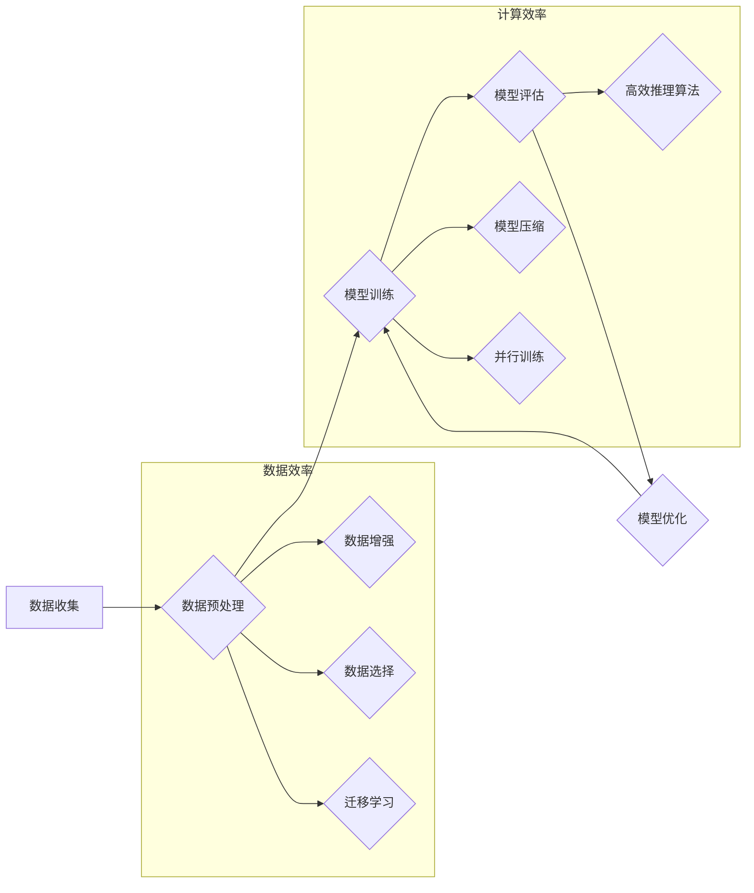

## AI 大模型原理与应用：data 和 compute 效率问题解决方案和挑战

> 关键词：大模型、数据效率、计算效率、模型压缩、量化、知识蒸馏、微调、应用场景

## 1. 背景介绍

近年来，深度学习领域取得了令人瞩目的进展，其中大模型（Large Language Models，LLMs）作为代表性技术，展现出强大的泛化能力和应用潜力。从 GPT-3 到 LaMDA，再到 PaLM 和 BLOOM，这些模型规模不断扩大，参数数量达到数十亿甚至千亿级别，在自然语言处理、计算机视觉、代码生成等领域取得了突破性成果。

然而，大模型的训练和部署也面临着巨大的挑战。首先，训练大模型需要海量数据和强大的计算资源，这对于大多数研究机构和企业来说都是难以负担的。其次，大模型的推理速度相对较慢，难以满足实时应用的需求。因此，如何提高大模型的 data 和 compute 效率，使其更易于训练、部署和应用，成为当前研究的热点问题。

## 2. 核心概念与联系

大模型的训练和应用的核心在于数据和计算资源的有效利用。

**数据效率**是指在给定数据量下，模型能够达到最佳性能的程度。提高数据效率的关键在于：

* **数据增强:** 通过对现有数据进行各种变换（如旋转、缩放、裁剪等），生成更多的数据样本，扩大训练数据集规模。
* **数据选择:** 选择与目标任务最相关的训练数据，过滤掉噪声和无关信息，提高训练效率。
* **迁移学习:** 利用预训练模型在其他任务上的知识，减少新任务所需的训练数据量。

**计算效率**是指在给定计算资源下，模型能够训练和推理的效率。提高计算效率的关键在于：

* **模型压缩:** 通过量化、剪枝等方法，减少模型参数数量，降低模型大小和计算量。
* **并行训练:** 将模型训练任务分解成多个子任务，并行执行，加速训练速度。
* **高效推理算法:** 使用更快的推理算法，例如量化推理、近似推理等，降低推理时间。

**Mermaid 流程图:**



## 3. 核心算法原理 & 具体操作步骤

### 3.1  算法原理概述

大模型训练的核心算法是基于梯度下降的优化算法，例如 stochastic gradient descent (SGD) 和 Adam。这些算法通过不断调整模型参数，使得模型预测结果与真实值之间的误差最小化。

### 3.2  算法步骤详解

1. **初始化模型参数:** 将模型参数随机初始化。
2. **前向传播:** 将输入数据输入模型，计算模型输出。
3. **计算损失函数:** 计算模型输出与真实值的误差，即损失函数值。
4. **反向传播:** 计算损失函数对每个模型参数的梯度。
5. **参数更新:** 根据梯度信息，更新模型参数。
6. **重复步骤2-5:** 迭代执行上述步骤，直到模型性能达到预定目标。

### 3.3  算法优缺点

**优点:**

* 能够训练出高性能的模型。
* 算法原理相对简单，易于理解和实现。

**缺点:**

* 训练过程可能非常耗时，需要大量的计算资源。
* 容易陷入局部最优解，难以找到全局最优解。

### 3.4  算法应用领域

梯度下降算法广泛应用于各种机器学习任务，包括：

* **图像识别:** 训练模型识别图像中的物体、场景等。
* **自然语言处理:** 训练模型进行文本分类、机器翻译、问答系统等。
* **语音识别:** 训练模型识别语音信号中的文字。

## 4. 数学模型和公式 & 详细讲解 & 举例说明

### 4.1  数学模型构建

大模型的训练过程可以看作是一个优化问题，目标是找到一个模型参数向量 $\theta$，使得模型在训练数据集上的损失函数最小化。

损失函数通常采用均方误差 (MSE) 或交叉熵 (Cross-Entropy) 等函数。

**均方误差 (MSE):**

$$
MSE(\theta) = \frac{1}{N} \sum_{i=1}^{N} (y_i - \hat{y}_i)^2
$$

其中，$N$ 是训练样本数量，$y_i$ 是真实值，$\hat{y}_i$ 是模型预测值。

**交叉熵 (Cross-Entropy):**

$$
Cross-Entropy(\theta) = -\frac{1}{N} \sum_{i=1}^{N} \sum_{j=1}^{C} y_{ij} \log(\hat{y}_{ij})
$$

其中，$C$ 是类别数量，$y_{ij}$ 是真实标签，$\hat{y}_{ij}$ 是模型预测概率。

### 4.2  公式推导过程

梯度下降算法的目标是通过迭代更新模型参数 $\theta$，使得损失函数值不断减小。

梯度下降算法的更新公式为：

$$
\theta = \theta - \eta \nabla_{\theta} Loss(\theta)
$$

其中，$\eta$ 是学习率，$\nabla_{\theta} Loss(\theta)$ 是损失函数对模型参数 $\theta$ 的梯度。

### 4.3  案例分析与讲解

假设我们训练一个图像分类模型，目标是识别图像中的猫和狗。

训练过程中，模型会根据输入图像预测猫和狗的概率。

损失函数会计算模型预测结果与真实标签之间的误差。

梯度下降算法会根据损失函数的梯度，更新模型参数，使得模型预测结果越来越接近真实标签。

## 5. 项目实践：代码实例和详细解释说明

### 5.1  开发环境搭建

* **操作系统:** Ubuntu 20.04
* **编程语言:** Python 3.8
* **深度学习框架:** TensorFlow 2.x
* **硬件环境:** GPU (推荐 NVIDIA GeForce RTX 3090)

### 5.2  源代码详细实现

```python
import tensorflow as tf

# 定义模型结构
model = tf.keras.models.Sequential([
    tf.keras.layers.Conv2D(32, (3, 3), activation='relu', input_shape=(224, 224, 3)),
    tf.keras.layers.MaxPooling2D((2, 2)),
    tf.keras.layers.Conv2D(64, (3, 3), activation='relu'),
    tf.keras.layers.MaxPooling2D((2, 2)),
    tf.keras.layers.Flatten(),
    tf.keras.layers.Dense(10, activation='softmax')
])

# 定义损失函数和优化器
loss_fn = tf.keras.losses.CategoricalCrossentropy()
optimizer = tf.keras.optimizers.Adam(learning_rate=0.001)

# 训练模型
model.compile(loss=loss_fn, optimizer=optimizer, metrics=['accuracy'])
model.fit(x_train, y_train, epochs=10)

# 评估模型
loss, accuracy = model.evaluate(x_test, y_test)
print(f'Loss: {loss}, Accuracy: {accuracy}')
```

### 5.3  代码解读与分析

* **模型结构:** 代码定义了一个简单的卷积神经网络模型，用于图像分类任务。
* **损失函数和优化器:** 使用交叉熵损失函数和 Adam 优化器进行模型训练。
* **训练过程:** 使用 `model.fit()` 函数训练模型，输入训练数据和标签，设置训练轮数 (epochs)。
* **评估过程:** 使用 `model.evaluate()` 函数评估模型在测试数据上的性能，输出损失值和准确率。

### 5.4  运行结果展示

训练完成后，模型会输出训练过程中的损失值和准确率曲线，以及在测试数据上的最终损失值和准确率。

## 6. 实际应用场景

大模型在各个领域都有广泛的应用场景，例如：

* **自然语言处理:** 机器翻译、文本摘要、问答系统、对话机器人等。
* **计算机视觉:** 图像识别、物体检测、图像生成、视频分析等。
* **代码生成:** 自动生成代码、代码补全、代码翻译等。
* **科学研究:** 蛋白质结构预测、药物发现、材料设计等。

### 6.4  未来应用展望

随着大模型技术的不断发展，未来将有更多新的应用场景出现，例如：

* **个性化教育:** 根据学生的学习情况，提供个性化的学习内容和辅导。
* **医疗诊断:** 辅助医生进行疾病诊断，提高诊断准确率。
* **金融风险管理:** 识别金融风险，降低金融损失。

## 7. 工具和资源推荐

### 7.1  学习资源推荐

* **书籍:**
    * Deep Learning by Ian Goodfellow, Yoshua Bengio, and Aaron Courville
    * Hands-On Machine Learning with Scikit-Learn, Keras & TensorFlow by Aurélien Géron
* **在线课程:**
    * TensorFlow Tutorials: https://www.tensorflow.org/tutorials
    * Deep Learning Specialization by Andrew Ng: https://www.deeplearning.ai/

### 7.2  开发工具推荐

* **深度学习框架:** TensorFlow, PyTorch, JAX
* **数据处理工具:** Pandas, NumPy
* **可视化工具:** Matplotlib, Seaborn

### 7.3  相关论文推荐

* Attention Is All You Need (Vaswani et al., 2017)
* BERT: Pre-training of Deep Bidirectional Transformers for Language Understanding (Devlin et al., 2018)
* GPT-3: Language Models are Few-Shot Learners (Brown et al., 2020)

## 8. 总结：未来发展趋势与挑战

### 8.1  研究成果总结

近年来，大模型在各个领域取得了显著的成果，展现出强大的应用潜力。

### 8.2  未来发展趋势

* **模型规模继续扩大:** 随着计算资源的不断提升，大模型的规模将继续扩大，模型能力将进一步提升。
* **模型效率提升:** 研究人员将继续探索提高大模型训练和推理效率的方法，例如模型压缩、量化、知识蒸馏等。
* **多模态大模型:** 将文本、图像、音频等多种模态信息融合到一个模型中，实现跨模态理解和生成。
* **可解释性增强:** 研究如何提高大模型的透明度和可解释性，使其更易于理解和信任。

### 8.3  面临的挑战

* **数据获取和标注:** 大模型训练需要海量数据，数据获取和标注成本高昂。
* **计算资源需求:** 大模型训练需要大量的计算资源，这对于大多数研究机构和企业来说都是难以负担的。
* **模型安全性和可靠性:** 大模型可能存在安全性和可靠性问题，例如模型攻击、数据泄露等。

### 8.4  研究展望

未来，大模型研究将继续朝着更强大、更高效、更安全、更可解释的方向发展。

## 9. 附录：常见问题与解答

**Q1: 如何选择合适的模型架构？**

**A1:** 模型架构的选择取决于具体的应用场景和数据特点。

**Q2: 如何提高模型训练效率？**

**A2:** 可以使用并行训练、模型压缩、数据增强等方法提高模型训练效率。

**Q