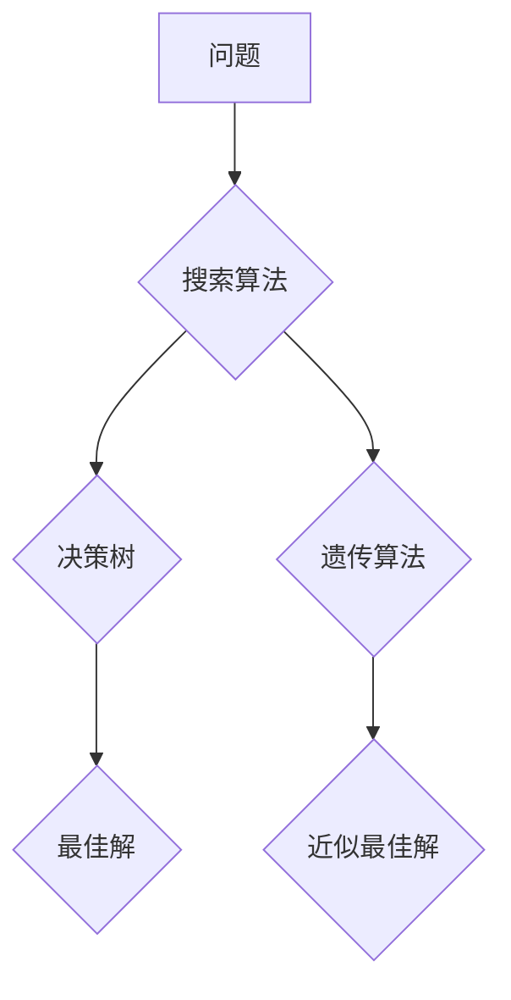

## AI人工智能核心算法原理与代码实例讲解：通用问题求解

> 关键词：人工智能、通用问题求解、搜索算法、深度学习、决策树、遗传算法、机器学习、算法原理、代码实例

## 1. 背景介绍

人工智能 (AI) 作为科技发展的重要方向，近年来取得了令人瞩目的进展。从语音识别到图像识别，从自动驾驶到医疗诊断，AI 正在深刻地改变着我们的生活。 然而，AI 的核心仍然在于算法。 

通用问题求解是人工智能领域的核心挑战之一。它指的是能够解决各种不同类型问题的智能系统。 

传统的编程方法依赖于明确的规则和步骤，难以应对复杂、多变的问题。而 AI 算法则通过学习和推理，能够从数据中发现模式，并根据模式做出决策。

本篇文章将深入探讨一些常用的通用问题求解算法，包括搜索算法、决策树、遗传算法等，并通过代码实例讲解其原理和应用。

## 2. 核心概念与联系

通用问题求解算法的核心是找到一种能够有效地探索解决方案空间的方法。 

**搜索算法** 是最基础的通用问题求解方法，它通过系统地搜索可能的解决方案，找到最优或满足条件的解。

**决策树** 是一种基于树状结构的算法，它通过一系列的判断条件，将问题分解成更小的子问题，最终找到解决方案。

**遗传算法** 是一种启发式算法，它模拟自然选择的过程，通过迭代优化，找到近似最优的解。

这些算法之间存在着密切的联系，它们可以相互补充，共同解决更复杂的问题。

**Mermaid 流程图:**



## 3. 核心算法原理 & 具体操作步骤

### 3.1  算法原理概述

**搜索算法** 的基本思想是通过穷举所有可能的解决方案，找到最优或满足条件的解。 常见的搜索算法包括：

* **深度优先搜索 (DFS)**：从根节点开始，沿着一条路径一直搜索下去，直到找到目标节点或到达叶子节点。
* **广度优先搜索 (BFS)**：从根节点开始，一层一层地搜索，直到找到目标节点。

**决策树** 的基本思想是将问题分解成一系列的判断条件，每个判断条件对应一个分支，最终找到满足条件的叶子节点。

**遗传算法** 的基本思想是模拟自然选择的过程，通过迭代优化，找到近似最优的解。 

### 3.2  算法步骤详解

**搜索算法:**

1. **定义搜索空间**: 确定所有可能的解决方案。
2. **选择初始节点**: 从搜索空间中选择一个初始节点。
3. **生成后继节点**: 根据搜索算法的规则，从当前节点生成所有可能的后续节点。
4. **评估节点**: 对每个后续节点进行评估，判断其是否满足目标条件。
5. **选择下一个节点**: 根据评估结果，选择一个最优或满足条件的后续节点作为当前节点。
6. **重复步骤 3-5**: 直到找到目标节点或搜索空间被完全探索。

**决策树:**

1. **选择特征**: 从所有特征中选择一个最能区分不同类别的特征。
2. **划分数据集**: 根据选择的特征，将数据集划分成多个子集。
3. **递归构建树**: 对每个子集重复步骤 1-2，直到满足停止条件。
4. **预测**: 根据决策树的结构，对新的数据进行预测。

**遗传算法:**

1. **初始化种群**: 生成一个初始的解集 (种群)。
2. **评估适应度**: 对每个解进行评估，计算其适应度值。
3. **选择**: 根据适应度值，选择一些优秀的解作为父代。
4. **交叉**: 从父代中选择两个解进行交叉操作，生成新的解。
5. **变异**: 对新的解进行变异操作，增加解的多样性。
6. **重复步骤 2-5**: 直到找到满足条件的解或达到最大迭代次数。

### 3.3  算法优缺点

**搜索算法:**

* **优点**: 能够找到最优解，适用于问题规模较小的情况。
* **缺点**: 效率低，当问题规模较大时，搜索空间会指数级增长。

**决策树:**

* **优点**: 易于理解和实现，能够处理分类和回归问题。
* **缺点**: 容易过拟合，对数据噪声敏感。

**遗传算法:**

* **优点**: 能够找到近似最优解，适用于复杂、多变的问题。
* **缺点**: 效率较低，需要大量的计算资源。

### 3.4  算法应用领域

**搜索算法**: 路径规划、游戏 AI、自然语言处理等。

**决策树**: 医疗诊断、信用评估、市场营销预测等。

**遗传算法**: 优化设计、机器学习模型训练、金融投资等。

## 4. 数学模型和公式 & 详细讲解 & 举例说明

### 4.1  数学模型构建

**搜索算法**: 可以用图论模型来表示搜索空间，节点代表可能的解决方案，边代表从一个节点到另一个节点的转换关系。

**决策树**: 可以用树状结构来表示决策过程，每个节点代表一个判断条件，每个分支代表一个可能的决策结果。

**遗传算法**: 可以用适应度函数来衡量解的优劣，适应度值越高，解越好。

### 4.2  公式推导过程

**搜索算法**: 

* **深度优先搜索**: 算法的时间复杂度为 O(b^d)，其中 b 是每个节点的平均分支数，d 是深度。
* **广度优先搜索**: 算法的时间复杂度为 O(b^d)，其中 b 是每个节点的平均分支数，d 是深度。

**决策树**: 

* **信息增益**: 用于评估特征对分类结果的贡献度。

$$
Gain(S,A) = Entropy(S) - \sum_{v \in Values(A)} \frac{|S_v|}{|S|} Entropy(S_v)
$$

其中：

* S 是数据集
* A 是特征
* Values(A) 是特征 A 的所有取值
* $S_v$ 是特征 A 取值为 v 的子集
* Entropy(S) 是数据集 S 的熵

### 4.3  案例分析与讲解

**搜索算法**: 

* 在迷宫问题中，搜索算法可以用来找到从起点到终点的路径。

**决策树**: 

* 在医疗诊断中，决策树可以用来根据患者的症状预测疾病类型。

**遗传算法**: 

* 在机器学习模型训练中，遗传算法可以用来优化模型参数，提高模型性能。

## 5. 项目实践：代码实例和详细解释说明

### 5.1  开发环境搭建

* Python 3.x
* Jupyter Notebook

### 5.2  源代码详细实现

```python
# 深度优先搜索算法
def dfs(graph, start, target):
    stack = [start]
    visited = set()
    while stack:
        node = stack.pop()
        if node == target:
            return True
        visited.add(node)
        for neighbor in graph[node]:
            if neighbor not in visited:
                stack.append(neighbor)
    return False

# 决策树算法
from sklearn.tree import DecisionTreeClassifier

# 训练决策树模型
X_train, y_train =...  # 训练数据
clf = DecisionTreeClassifier()
clf.fit(X_train, y_train)

# 预测
X_test =...  # 测试数据
y_pred = clf.predict(X_test)

# 遗传算法
from deap import base, creator, tools, algorithms

# 定义适应度函数
def fitness(individual):
    # 计算个体的适应度值
    return...

# 创建个体和种群
creator.create("FitnessMax", base.Fitness, weights=(1.0,))
creator.create("Individual", list, fitness=creator.FitnessMax)

toolbox = base.Toolbox()
toolbox.register("attr_float", random.uniform, 0, 1)
toolbox.register("individual", tools.initRepeat, creator.Individual, toolbox.attr_float, n=10)
toolbox.register("population", tools.initRepeat, list, toolbox.individual)
toolbox.register("evaluate", fitness)
toolbox.register("mate", tools.cxTwoPoint)
toolbox.register("mutate", tools.mutGaussian, mu=0, sigma=1, indpb=0.1)

# 运行遗传算法
pop = toolbox.population(n=100)
hof = tools.HallOfFame(1)
stats = tools.Statistics(lambda ind: ind.fitness.values)
stats.register("avg", numpy.mean)
stats.register("std", numpy.std)
algorithms.eaSimple(pop, toolbox, cxpb=0.5, mutpb=0.2, ngen=100, stats=stats, halloffame=hof)
```

### 5.3  代码解读与分析

* **深度优先搜索**: 算法使用栈数据结构来存储待访问节点，每次从栈顶取出节点进行访问，直到找到目标节点或栈为空。
* **决策树**: 使用 scikit-learn 库中的 DecisionTreeClassifier 类来构建决策树模型。
* **遗传算法**: 使用 DEAP 库来实现遗传算法。

### 5.4  运行结果展示

运行代码后，可以得到相应的搜索结果、决策结果和遗传算法的最佳解。

## 6. 实际应用场景

**搜索算法**:

* **导航系统**: 找到从起点到终点的最短路径。
* **游戏 AI**: 寻找最佳行动策略。

**决策树**:

* **医疗诊断**: 根据患者的症状预测疾病类型。
* **信用评估**: 评估借款人的信用风险。

**遗传算法**:

* **机器学习模型训练**: 优化模型参数，提高模型性能。
* **工程设计**: 优化设计方案，提高性能和效率。

### 6.4  未来应用展望

随着人工智能技术的不断发展，通用问题求解算法将在更多领域得到应用，例如：

* **自动驾驶**: 帮助车辆做出更安全、更智能的决策。
* **个性化推荐**: 提供更精准、更个性化的产品和服务推荐。
* **科学研究**: 加速科学发现和技术创新。

## 7. 工具和资源推荐

### 7.1  学习资源推荐

* **书籍**:
    * 《人工智能：现代方法》
    * 《机器学习》
    * 《深度学习》
* **在线课程**:
    * Coursera
    * edX
    * Udacity

### 7.2  开发工具推荐

* **Python**: 广泛应用于人工智能开发。
* **TensorFlow**: 深度学习框架。
* **PyTorch**: 深度学习框架。
* **Scikit-learn**: 机器学习库。

### 7.3  相关论文推荐

* **AlphaGo**: DeepMind 发布的围棋 AI 系统。
* **BERT**: Google 发布的自然语言处理模型。
* **GPT-3**: OpenAI 发布的文本生成模型。

## 8. 总结：未来发展趋势与挑战

### 8.1  研究成果总结

近年来，通用问题求解算法取得了显著进展，例如：

* 深度学习算法在图像识别、语音识别等领域取得了突破性进展。
* 进化算法在优化设计、机器学习模型训练等领域展现出强大的应用潜力。

### 8.2  未来发展趋势

* **更强大的通用 AI**: 开发能够解决更复杂、更广泛问题的通用 AI 系统。
* **更有效的算法**: 探索更有效的通用问题求解算法，提高算法效率和鲁棒性。
* **更广泛的应用**: 将通用问题求解算法应用于更多领域，例如医疗、教育、金融等。

### 