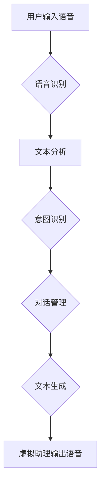

## Python深度学习实践：深度学习在虚拟助理中的应用

> 关键词：深度学习、虚拟助理、自然语言处理、语音识别、文本生成、Python、TensorFlow、PyTorch

## 1. 背景介绍

虚拟助理，如 Siri、Alexa 和 Google Assistant，已经成为我们生活中不可或缺的一部分。它们能够理解我们的语音指令，并执行相应的任务，例如设置提醒、播放音乐、查询天气预报等。深度学习技术的快速发展为虚拟助理的智能化提供了强大的支持。

深度学习算法能够从海量数据中学习复杂的模式，从而实现更精准的语音识别、自然语言理解和文本生成。这使得虚拟助理能够更好地理解我们的意图，并提供更自然、更人性化的交互体验。

## 2. 核心概念与联系

### 2.1 自然语言处理 (NLP)

自然语言处理是人工智能领域的一个重要分支，旨在使计算机能够理解、处理和生成人类语言。在虚拟助理中，NLP技术用于语音识别、文本分析、意图识别和对话管理等方面。

### 2.2 语音识别

语音识别是指将语音信号转换为文本的过程。深度学习算法，特别是循环神经网络 (RNN) 和卷积神经网络 (CNN)，在语音识别领域取得了显著的成果。

### 2.3 文本生成

文本生成是指根据给定的输入生成文本的过程。深度学习算法，例如生成对抗网络 (GAN) 和 Transformer，能够生成流畅、自然的文本，用于虚拟助理的回复和对话。

### 2.4 核心架构



## 3. 核心算法原理 & 具体操作步骤

### 3.1 算法原理概述

深度学习算法的核心是多层神经网络，通过学习数据中的特征和模式来实现各种任务。在虚拟助理中，常用的深度学习算法包括：

* **循环神经网络 (RNN)**：RNN能够处理序列数据，例如语音信号和文本，并学习其中的时间依赖关系。
* **卷积神经网络 (CNN)**：CNN擅长提取图像和音频信号中的特征，例如语音的频率成分和文本的词语结构。
* **生成对抗网络 (GAN)**：GAN由两个网络组成，一个生成器和一个鉴别器，通过对抗训练来生成逼真的文本和语音。
* **Transformer**：Transformer是一种新型的序列模型，能够处理长距离依赖关系，在自然语言处理任务中取得了优异的性能。

### 3.2 算法步骤详解

1. **数据收集和预处理**: 收集大量语音和文本数据，并进行预处理，例如语音转写、文本清洗和分词。
2. **模型构建**: 根据任务需求选择合适的深度学习算法，并构建相应的模型架构。
3. **模型训练**: 使用训练数据训练模型，调整模型参数以最小化预测误差。
4. **模型评估**: 使用测试数据评估模型性能，例如语音识别准确率和文本生成质量。
5. **模型部署**: 将训练好的模型部署到虚拟助理系统中，用于语音识别、文本分析、意图识别和对话管理等任务。

### 3.3 算法优缺点

| 算法 | 优点 | 缺点 |
|---|---|---|
| RNN | 处理序列数据有效 | 训练速度慢，难以处理长序列 |
| CNN | 提取特征能力强 | 难以处理长距离依赖关系 |
| GAN | 生成逼真的文本和语音 | 训练过程复杂，容易陷入局部最优 |
| Transformer | 处理长距离依赖关系有效 | 计算资源消耗大 |

### 3.4 算法应用领域

深度学习算法在虚拟助理领域有着广泛的应用，例如：

* **语音识别**: 将语音转换为文本，实现语音控制。
* **自然语言理解**: 理解用户的意图和需求，提供更精准的回复。
* **文本生成**: 生成自然流畅的文本回复，提升用户体验。
* **对话管理**: 管理对话流程，提供更智能的交互体验。

## 4. 数学模型和公式 & 详细讲解 & 举例说明

### 4.1 数学模型构建

深度学习模型通常由多个神经网络层组成，每一层都包含多个神经元。每个神经元接收来自上一层的输入，并通过激活函数进行处理，输出到下一层。

**神经网络层**:

* **输入层**:接收原始数据，例如语音信号或文本。
* **隐藏层**:提取数据的特征和模式。
* **输出层**:输出最终结果，例如识别出的文本或生成的文本。

**激活函数**:

激活函数用于引入非线性，使神经网络能够学习复杂的模式。常用的激活函数包括 sigmoid、ReLU 和 tanh。

### 4.2 公式推导过程

深度学习模型的训练过程基于梯度下降算法。目标函数通常是预测误差的平方和，梯度下降算法通过迭代更新模型参数，最小化目标函数的值。

**目标函数**:

$$J(\theta) = \frac{1}{2} \sum_{i=1}^{m} (h_\theta(x^{(i)}) - y^{(i)})^2$$

其中：

* $J(\theta)$ 是目标函数
* $\theta$ 是模型参数
* $h_\theta(x^{(i)})$ 是模型对输入 $x^{(i)}$ 的预测
* $y^{(i)}$ 是真实值

**梯度下降算法**:

$$\theta = \theta - \alpha \nabla J(\theta)$$

其中：

* $\alpha$ 是学习率
* $\nabla J(\theta)$ 是目标函数的梯度

### 4.3 案例分析与讲解

**语音识别**:

在语音识别任务中，深度学习模型将语音信号转换为文本。模型的输入是语音信号的特征，例如 Mel-frequency cepstral coefficients (MFCCs)。模型的输出是每个时间步的字符概率。

**文本生成**:

在文本生成任务中，深度学习模型根据给定的输入生成文本。模型的输入可以是文本片段、图像或其他数据。模型的输出是每个时间步的词概率。

## 5. 项目实践：代码实例和详细解释说明

### 5.1 开发环境搭建

* **操作系统**: Ubuntu 18.04 或更高版本
* **Python**: 3.6 或更高版本
* **深度学习框架**: TensorFlow 或 PyTorch
* **其他依赖**: numpy、pandas、matplotlib 等

### 5.2 源代码详细实现

```python
# 使用 TensorFlow 实现简单的文本生成模型

import tensorflow as tf

# 定义模型架构
model = tf.keras.Sequential([
    tf.keras.layers.Embedding(input_dim=vocab_size, output_dim=embedding_dim),
    tf.keras.layers.LSTM(units=lstm_units),
    tf.keras.layers.Dense(units=vocab_size, activation='softmax')
])

# 编译模型
model.compile(optimizer='adam', loss='sparse_categorical_crossentropy', metrics=['accuracy'])

# 训练模型
model.fit(x_train, y_train, epochs=epochs)

# 生成文本
seed_text = "The quick brown fox"
for _ in range(generate_length):
    predictions = model.predict(tf.expand_dims(seed_text, 0))
    predicted_index = tf.argmax(predictions[0]).numpy()
    predicted_word = word_index[predicted_index]
    seed_text += " " + predicted_word
```

### 5.3 代码解读与分析

* **Embedding 层**: 将单词转换为稠密的向量表示。
* **LSTM 层**: 处理文本序列，学习单词之间的依赖关系。
* **Dense 层**: 将 LSTM 的输出转换为每个单词的概率分布。
* **训练过程**: 使用训练数据训练模型，最小化预测误差。
* **文本生成**: 根据给定的种子文本，预测下一个单词，并重复该过程生成文本。

### 5.4 运行结果展示

运行代码后，模型将生成一段基于训练数据的文本。

## 6. 实际应用场景

### 6.1 智能客服

虚拟助理可以作为智能客服，自动回答用户常见问题，例如订单查询、退换货政策等。

### 6.2 语音控制

虚拟助理可以实现语音控制，例如控制智能家居设备、播放音乐、设置闹钟等。

### 6.3 个性化推荐

虚拟助理可以根据用户的历史行为和偏好，提供个性化的产品推荐和服务建议。

### 6.4 未来应用展望

随着深度学习技术的不断发展，虚拟助理的应用场景将更加广泛，例如：

* **医疗保健**: 辅助医生诊断疾病、提供健康咨询。
* **教育**: 提供个性化学习辅导、帮助学生完成作业。
* **娱乐**: 提供个性化娱乐推荐、陪伴用户聊天。

## 7. 工具和资源推荐

### 7.1 学习资源推荐

* **书籍**:
    * 《深度学习》 by Ian Goodfellow, Yoshua Bengio, and Aaron Courville
    * 《Python深度学习》 by François Chollet
* **在线课程**:
    * Coursera: Deep Learning Specialization
    * Udacity: Deep Learning Nanodegree
* **博客**:
    * TensorFlow Blog
    * PyTorch Blog

### 7.2 开发工具推荐

* **深度学习框架**: TensorFlow, PyTorch
* **语音识别库**: SpeechRecognition, Kaldi
* **自然语言处理库**: NLTK, spaCy

### 7.3 相关论文推荐

* **Attention Is All You Need**: https://arxiv.org/abs/1706.03762
* **BERT: Pre-training of Deep Bidirectional Transformers for Language Understanding**: https://arxiv.org/abs/1810.04805

## 8. 总结：未来发展趋势与挑战

### 8.1 研究成果总结

深度学习技术在虚拟助理领域取得了显著的成果，使得虚拟助理更加智能、更加人性化。

### 8.2 未来发展趋势

* **更强大的模型**: 研究更强大的深度学习模型，例如 Transformer 的变体，以提升虚拟助理的理解和生成能力。
* **多模态交互**: 虚拟助理将支持多模态交互，例如语音、文本、图像和视频，提供更丰富的交互体验。
* **个性化定制**: 虚拟助理将更加个性化，根据用户的喜好和需求进行定制。

### 8.3 面临的挑战

* **数据隐私**: 虚拟助理需要处理大量用户数据，如何保护用户隐私是一个重要的挑战。
* **模型可解释性**: 深度学习模型的决策过程难以理解，如何提高模型的可解释性是一个重要的研究方向。
* **伦理问题**: 虚拟助理的应用可能会带来一些伦理问题，例如算法偏见和责任归属，需要进行深入的探讨和研究。

### 8.4 研究展望

未来，虚拟助理将继续朝着更智能、更人性化、更安全的方向发展，为我们的生活带来更多便利和乐趣。


## 9. 附录：常见问题与解答

**Q1: 如何选择合适的深度学习框架？**

**A1:** TensorFlow 和 PyTorch 是两个最流行的深度学习框架，各有优缺点。TensorFlow 更适合于生产环境，PyTorch 更易于学习和使用。

**Q2: 如何处理语音信号中的噪音？**

**A2:** 可以使用语音增强算法，例如噪声抑制和语音分离，来减少语音信号中的噪音。

**Q3: 如何评估虚拟助理的性能？**

**A3:** 可以使用各种指标来评估虚拟助理的性能，例如语音识别准确率、文本生成质量、对话流畅度等。

**作者：禅与计算机程序设计艺术 / Zen and the Art of Computer Programming**