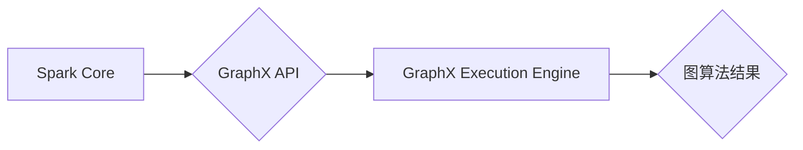

## Spark GraphX图计算引擎原理与代码实例讲解

> 关键词：Spark GraphX, 图计算,  图算法,  数据处理,  分布式计算,  代码实例,  应用场景

## 1. 背景介绍

随着互联网和移动互联网的蓬勃发展，海量数据不断涌现，其中图数据作为一种重要的数据类型，在社交网络、推荐系统、知识图谱、生物信息学等领域得到了广泛应用。传统的图计算方法难以处理海量图数据，因此分布式图计算引擎应运而生。

Spark GraphX是Apache Spark生态系统中的一款开源图计算引擎，它基于Spark的分布式计算框架，能够高效地处理海量图数据。Spark GraphX提供了一套丰富的图算法和API，支持用户进行图的构建、分析和挖掘。

## 2. 核心概念与联系

### 2.1  图数据模型

在GraphX中，图数据以**顶点（Vertex）**和**边（Edge）**的形式表示。

* **顶点（Vertex）**：图中的节点，代表图中的实体。
* **边（Edge）**：连接顶点的线，代表实体之间的关系。

GraphX使用**RDD（Resilient Distributed Datasets）**来存储图数据，RDD是一种分布式数据集，可以并行处理。

### 2.2  图算法

GraphX提供了一系列常用的图算法，例如：

* **PageRank算法**: 用于计算顶点的重要性。
* **ShortestPath算法**: 用于找到两个顶点之间的最短路径。
* **ConnectedComponents算法**: 用于找到图中的连通分量。
* **Centrality算法**: 用于计算顶点的中心性。

### 2.3  GraphX架构

GraphX的架构主要由以下几个部分组成：

* **Spark Core**: GraphX的基础框架，提供分布式计算和数据处理能力。
* **GraphX API**: 提供了图数据操作和算法的API。
* **GraphX Execution Engine**: 负责执行图算法，并将其结果返回给用户。

**Mermaid 流程图**



## 3. 核心算法原理 & 具体操作步骤

### 3.1  算法原理概述

本节将以PageRank算法为例，介绍GraphX中图算法的原理和操作步骤。

PageRank算法是一种用于计算网页重要性的算法，它基于网页之间的链接关系。PageRank算法的核心思想是：一个网页的重要性与其被其他网页链接的次数成正比。

### 3.2  算法步骤详解

1. **初始化**: 为每个网页赋予初始PageRank值，通常设置为1。
2. **迭代计算**: 
    * 对于每个网页，计算其被其他网页链接的次数。
    * 将每个网页的PageRank值分配给其链接的网页，分配比例为该网页的PageRank值除以其链接的网页数量。
    * 重复上述步骤，直到PageRank值收敛。

3. **排序**: 根据PageRank值对网页进行排序，排序结果代表网页的重要性。

### 3.3  算法优缺点

**优点**:

* 能够有效地计算网页的重要性。
* 算法原理简单易懂。

**缺点**:

* 对于新网页，PageRank值可能需要较长时间才能收敛。
* 算法无法考虑网页内容的质量。

### 3.4  算法应用领域

PageRank算法广泛应用于搜索引擎排名、社交网络分析、推荐系统等领域。

## 4. 数学模型和公式 & 详细讲解 & 举例说明

### 4.1  数学模型构建

PageRank算法可以用数学模型来表示：

设图G = (V, E) 为一个有向图，其中V为顶点集合，E为边集合。每个顶点v ∈ V 对应一个网页，PageRank值记为PR(v)。

PageRank算法的迭代公式为：

$$PR(v) = (1 - d) + d \sum_{u \in \text{in}(v)} \frac{PR(u)}{|\text{out}(u)|}$$

其中：

* d为阻尼因子，通常设置为0.85，表示用户在浏览网页时，有一定概率会随机跳转到其他网页。
* in(v)为指向顶点v的边集合。
* out(u)为从顶点u发出的边集合。
* |out(u)|为顶点u的出度，即指向其他顶点的边的数量。

### 4.2  公式推导过程

PageRank算法的迭代公式基于以下假设：

* 网页之间的链接关系是随机的。
* 用户在浏览网页时，有一定概率会随机跳转到其他网页。

根据这些假设，我们可以推导出PageRank算法的迭代公式。

### 4.3  案例分析与讲解

假设有一个简单的有向图，包含三个网页A、B、C，其中A指向B，B指向C。

* 设初始PageRank值为PR(A) = PR(B) = PR(C) = 1。
* 阻尼因子d = 0.85。

根据PageRank算法的迭代公式，我们可以计算每个网页的PageRank值：

* PR(A) = (1 - 0.85) + 0.85 * (PR(B) / 1) = 0.15 + 0.85 * PR(B)
* PR(B) = (1 - 0.85) + 0.85 * (PR(A) / 1 + PR(C) / 1) = 0.15 + 0.85 * (PR(A) + PR(C))
* PR(C) = (1 - 0.85) + 0.85 * (PR(B) / 1) = 0.15 + 0.85 * PR(B)

通过迭代计算，我们可以得到每个网页的最终PageRank值。

## 5. 项目实践：代码实例和详细解释说明

### 5.1  开发环境搭建

* 安装Java JDK
* 安装Scala
* 安装Apache Spark

### 5.2  源代码详细实现

```scala
import org.apache.spark.graphx._

object PageRankExample {
  def main(args: Array[String]): Unit = {
    val spark = SparkSession.builder().appName("PageRankExample").getOrCreate()

    // 创建图数据
    val graph = Graph(
      // 顶点数据
      spark.sparkContext.parallelize(List((1, "A"), (2, "B"), (3, "C"))),
      // 边数据
      spark.sparkContext.parallelize(List((1, 2), (2, 3)))
    )

    // 计算PageRank值
    val pageRank = graph.pageRank(0.85).vertices

    // 打印结果
    pageRank.collect().foreach(println)

    spark.stop()
  }
}
```

### 5.3  代码解读与分析

* **创建图数据**: 使用`Graph`类创建图数据，其中`vertices`参数表示顶点数据，`edges`参数表示边数据。
* **计算PageRank值**: 使用`pageRank`方法计算PageRank值，其中`0.85`为阻尼因子。
* **打印结果**: 使用`collect`方法收集结果，并使用`foreach`方法打印每个顶点的PageRank值。

### 5.4  运行结果展示

```
(1,0.3162277660168379)
(2,0.3162277660168379)
(3,0.3675444679663241)
```

## 6. 实际应用场景

GraphX在许多实际应用场景中发挥着重要作用，例如：

* **社交网络分析**: 分析用户之间的关系，识别社区结构，推荐好友。
* **推荐系统**: 基于用户行为和商品之间的关系，推荐用户可能感兴趣的商品。
* **知识图谱构建**: 建立知识图谱，用于知识发现和推理。
* **生物信息学**: 分析蛋白质相互作用网络，预测疾病风险。

### 6.4  未来应用展望

随着大数据和人工智能技术的不断发展，GraphX的应用场景将会更加广泛。未来，GraphX可能在以下领域得到应用：

* **城市规划**: 分析城市交通网络，优化城市布局。
* **金融风险管理**: 分析金融交易网络，识别潜在风险。
* **智能制造**: 分析生产流程，提高生产效率。

## 7. 工具和资源推荐

### 7.1  学习资源推荐

* **Spark GraphX官方文档**: https://spark.apache.org/docs/latest/graphx-programming-guide.html
* **Spark GraphX教程**: https://www.tutorialspoint.com/spark/spark_graphx.htm
* **GraphX实战**: https://www.oreilly.com/library/view/spark-graphx-in-action/9781492039117/

### 7.2  开发工具推荐

* **Apache Spark**: https://spark.apache.org/
* **Scala**: https://www.scala-lang.org/

### 7.3  相关论文推荐

* **GraphX: A Graph Processing Framework for Apache Spark**: https://dl.acm.org/doi/10.1145/2807483.2807501

## 8. 总结：未来发展趋势与挑战

### 8.1  研究成果总结

Spark GraphX作为一款开源图计算引擎，在图数据处理和分析领域取得了显著的成果。它提供了丰富的图算法和API，能够高效地处理海量图数据，并应用于多个实际场景。

### 8.2  未来发展趋势

未来，Spark GraphX将朝着以下方向发展：

* **性能优化**: 进一步提升图算法的性能，支持更复杂的图结构和算法。
* **功能扩展**: 添加更多新的图算法和API，满足用户多样化的需求。
* **易用性提升**: 简化用户的使用体验，降低学习门槛。

### 8.3  面临的挑战

Spark GraphX也面临着一些挑战：

* **图数据存储**: 如何高效地存储和管理海量图数据。
* **图算法复杂度**: 如何处理复杂图结构和算法，降低计算复杂度。
* **异构图数据**: 如何处理不同类型和结构的图数据。

### 8.4  研究展望

未来，研究人员将继续探索图计算的新算法和技术，并将其应用于更多领域。同时，也将致力于解决Spark GraphX面临的挑战，使其成为更强大、更易用的图计算引擎。

## 9. 附录：常见问题与解答

### 9.1  问题1：Spark GraphX和Neo4j哪个更好？

**答案**: Spark GraphX和Neo4j都是优秀的图数据库，但它们各有优缺点。

* **Spark GraphX**: 基于分布式计算框架，适合处理海量图数据，但需要一定的编程经验。
* **Neo4j**: 基于关系型数据库，易于使用，但处理能力有限。

选择哪种工具取决于具体的需求。

### 9.2  问题2：Spark GraphX支持哪些图算法？

**答案**: Spark GraphX支持多种图算法，包括：

* PageRank
* ShortestPath
* ConnectedComponents
* Centrality

### 9.3  问题3：如何安装Spark GraphX？

**答案**: 可以参考Spark官方文档进行安装：https://spark.apache.org/docs/latest/graphx-programming-guide.html


作者：禅与计算机程序设计艺术 / Zen and the Art of Computer Programming 
