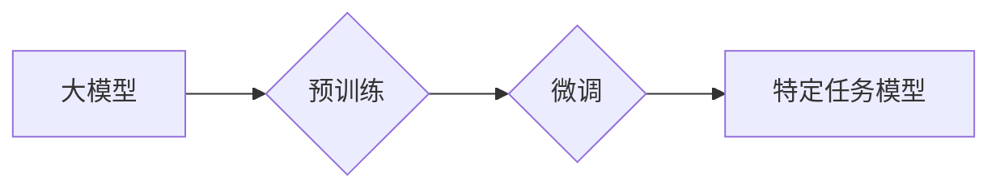

## 从零开始大模型开发与微调：大模型开启人工智能的新时代

> 关键词：大模型、深度学习、Transformer、微调、自然语言处理、计算机视觉

### 1. 背景介绍

人工智能（AI）近年来取得了飞速发展，其中大模型扮演着越来越重要的角色。大模型是指参数规模庞大、训练数据海量的人工智能模型，其强大的学习能力和泛化能力使其在自然语言处理、计算机视觉、语音识别等领域取得了突破性进展。

传统的机器学习模型通常需要针对特定任务进行训练，而大模型则可以进行预训练，学习到更广泛的知识和模式。通过微调，大模型可以快速适应新的任务和领域，降低了模型开发的门槛，加速了AI技术的应用。

### 2. 核心概念与联系

#### 2.1 大模型

大模型是指参数数量超过数十亿甚至千亿级别的深度学习模型。其规模庞大，训练数据量也十分巨大，需要强大的计算资源和技术支持。

#### 2.2 预训练

预训练是指在大量通用数据上训练大模型，使其学习到语言的语法、语义和知识结构。预训练后的模型可以作为其他任务的起点，通过微调来适应特定任务。

#### 2.3 微调

微调是指在预训练模型的基础上，使用少量特定任务的数据进行进一步训练，以提高模型在该任务上的性能。微调可以有效地利用预训练模型的知识，降低训练成本和时间。

#### 2.4 Transformer

Transformer是一种新型的深度学习架构，其核心是注意力机制，可以有效地捕捉文本中的长距离依赖关系。Transformer在自然语言处理领域取得了显著的成果，例如BERT、GPT-3等大模型都基于Transformer架构。

**Mermaid 流程图**



### 3. 核心算法原理 & 具体操作步骤

#### 3.1 算法原理概述

大模型的训练主要基于深度学习算法，其中Transformer架构是目前最流行的模型结构。Transformer通过注意力机制，可以有效地捕捉文本中的长距离依赖关系，从而学习到更深层次的语义信息。

#### 3.2 算法步骤详解

1. **数据预处理:** 将原始文本数据进行清洗、分词、标记等预处理操作，使其适合模型训练。
2. **模型构建:** 根据预定的模型架构，构建Transformer模型，并设置模型参数。
3. **模型训练:** 使用预处理后的数据训练模型，通过反向传播算法不断调整模型参数，使其能够准确地预测目标输出。
4. **模型评估:** 在验证集上评估模型性能，并根据评估结果调整训练参数和模型结构。
5. **模型微调:** 将预训练好的模型用于特定任务，使用少量特定任务数据进行微调，提高模型在该任务上的性能。

#### 3.3 算法优缺点

**优点:**

* 强大的学习能力：大模型可以学习到更广泛的知识和模式。
* 优秀的泛化能力：预训练模型可以快速适应新的任务和领域。
* 提升效率：微调可以降低模型训练成本和时间。

**缺点:**

* 计算资源需求高：训练大模型需要大量的计算资源和时间。
* 数据依赖性强：大模型的性能取决于训练数据的质量和数量。
* 可解释性差：大模型的决策过程难以理解和解释。

#### 3.4 算法应用领域

大模型在自然语言处理、计算机视觉、语音识别、机器翻译等领域都有广泛的应用。

* **自然语言处理:** 文本生成、机器翻译、问答系统、情感分析等。
* **计算机视觉:** 图像分类、目标检测、图像生成等。
* **语音识别:** 语音转文本、语音合成等。

### 4. 数学模型和公式 & 详细讲解 & 举例说明

#### 4.1 数学模型构建

大模型的数学模型通常基于深度神经网络，其核心是多层感知机（MLP）和注意力机制。

* **多层感知机 (MLP):** MLP由多个全连接层组成，每个层都有多个神经元。神经元之间通过权重连接，并使用激活函数进行非线性变换。

* **注意力机制:** 注意力机制可以学习到文本中不同词语之间的重要关系，并赋予它们不同的权重。

#### 4.2 公式推导过程

注意力机制的计算公式如下：

$$
\text{Attention}(Q, K, V) = \text{softmax}\left(\frac{Q K^T}{\sqrt{d_k}}\right) V
$$

其中：

* $Q$：查询矩阵
* $K$：键矩阵
* $V$：值矩阵
* $d_k$：键向量的维度
* $\text{softmax}$：softmax函数

#### 4.3 案例分析与讲解

例如，在机器翻译任务中，查询矩阵 $Q$ 来自源语言的词向量，键矩阵 $K$ 来自目标语言的词向量，值矩阵 $V$ 也来自目标语言的词向量。注意力机制可以学习到源语言和目标语言之间词语的对应关系，从而提高翻译的准确性。

### 5. 项目实践：代码实例和详细解释说明

#### 5.1 开发环境搭建

* Python 3.7+
* PyTorch 或 TensorFlow
* CUDA 和 cuDNN

#### 5.2 源代码详细实现

```python
import torch
import torch.nn as nn

class Transformer(nn.Module):
    def __init__(self, vocab_size, embedding_dim, num_heads, num_layers):
        super(Transformer, self).__init__()
        self.embedding = nn.Embedding(vocab_size, embedding_dim)
        self.transformer_layers = nn.ModuleList([
            nn.TransformerEncoderLayer(embedding_dim, num_heads)
            for _ in range(num_layers)
        ])
        self.linear = nn.Linear(embedding_dim, vocab_size)

    def forward(self, x):
        x = self.embedding(x)
        for layer in self.transformer_layers:
            x = layer(x)
        x = self.linear(x)
        return x
```

#### 5.3 代码解读与分析

* `__init__` 方法：初始化模型参数，包括词嵌入层、Transformer编码器层和输出层。
* `forward` 方法：定义模型的正向传播过程，将输入序列经过词嵌入层、Transformer编码器层和输出层，最终得到预测输出。

#### 5.4 运行结果展示

训练完成后，可以使用模型对新的文本序列进行预测，例如生成文本、翻译文本等。

### 6. 实际应用场景

#### 6.1 自然语言处理

* **文本生成:** 使用大模型生成高质量的文本，例如小说、诗歌、新闻报道等。
* **机器翻译:** 将文本从一种语言翻译成另一种语言，例如英语翻译成中文。
* **问答系统:** 构建能够理解用户问题并提供准确答案的问答系统。
* **情感分析:** 分析文本的情感倾向，例如判断文本是正面、负面还是中性。

#### 6.2 计算机视觉

* **图像分类:** 将图像分类到不同的类别，例如识别猫、狗、汽车等。
* **目标检测:** 在图像中检测到特定目标，并标注其位置和类别。
* **图像生成:** 生成新的图像，例如生成人脸、风景、物体等。

#### 6.3 语音识别

* **语音转文本:** 将语音信号转换为文本，例如语音助手、会议记录等。
* **语音合成:** 将文本转换为语音信号，例如语音播报、虚拟助手等。

#### 6.4 未来应用展望

大模型的应用前景广阔，未来将应用于更多领域，例如：

* **医疗保健:** 辅助医生诊断疾病、预测患者风险。
* **教育:** 个性化学习、智能辅导。
* **金融:** 风险评估、欺诈检测。

### 7. 工具和资源推荐

#### 7.1 学习资源推荐

* **书籍:**
    * 《深度学习》
    * 《自然语言处理》
    * 《Transformer模型》
* **在线课程:**
    * Coursera
    * edX
    * fast.ai

#### 7.2 开发工具推荐

* **PyTorch:** 深度学习框架
* **TensorFlow:** 深度学习框架
* **Hugging Face Transformers:** 预训练模型库

#### 7.3 相关论文推荐

* **Attention Is All You Need:** https://arxiv.org/abs/1706.03762
* **BERT: Pre-training of Deep Bidirectional Transformers for Language Understanding:** https://arxiv.org/abs/1810.04805
* **GPT-3: Language Models are Few-Shot Learners:** https://arxiv.org/abs/2005.14165

### 8. 总结：未来发展趋势与挑战

#### 8.1 研究成果总结

大模型在自然语言处理、计算机视觉等领域取得了显著的成果，其强大的学习能力和泛化能力推动了人工智能技术的快速发展。

#### 8.2 未来发展趋势

* **模型规模进一步扩大:** 随着计算资源的不断提升，大模型的规模将继续扩大，学习能力将进一步增强。
* **多模态大模型:** 将文本、图像、音频等多种模态数据融合到一起，构建更强大的多模态大模型。
* **可解释性研究:** 加强对大模型的解释性研究，使其决策过程更加透明和可理解。

#### 8.3 面临的挑战

* **计算资源需求:** 训练大模型需要大量的计算资源，成本较高。
* **数据安全和隐私:** 大模型的训练需要海量数据，如何保证数据安全和隐私是一个重要挑战。
* **伦理问题:** 大模型的应用可能带来一些伦理问题，例如算法偏见、信息操纵等，需要引起重视和研究。

#### 8.4 研究展望

未来，大模型研究将继续朝着更强大、更安全、更可解释的方向发展，为人工智能技术的应用带来更多可能性。

### 9. 附录：常见问题与解答

* **Q: 如何选择合适的预训练模型？**

A: 选择预训练模型需要根据具体的应用场景和任务需求进行选择。例如，自然语言理解任务可以选择BERT、GPT等模型，图像识别任务可以选择ResNet、EfficientNet等模型。

* **Q: 如何进行大模型的微调？**

A: 微调大模型需要使用少量特定任务数据，调整模型的某些参数，使其能够更好地适应该任务。

* **Q: 如何评估大模型的性能？**

A: 大模型的性能可以通过各种指标进行评估，例如准确率、召回率、F1-score等。

作者：禅与计算机程序设计艺术 / Zen and the Art of Computer Programming


