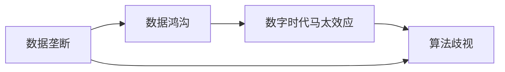

                 

# 数据垄断引发新贫富差距,数字时代马太效应加剧

## 1. 背景介绍

在数字时代，数据作为一种关键的生产资料，其垄断与分配问题日益凸显。数据垄断不仅影响到企业间的竞争格局，更深刻地改变着社会的贫富差距。本文旨在深入探讨数据垄断的成因及其对社会的影响，并提出应对策略，为建设更加公平和谐的数字社会提供参考。

## 2. 核心概念与联系

### 2.1 核心概念概述

为更好地理解数据垄断及其影响，本节将介绍几个关键概念：

- **数据垄断**：指少数大企业通过控制大量数据资源，形成数据市场的垄断地位，导致数据资源分配不均。
- **数据鸿沟**：指不同企业和个人之间在数据获取能力上的巨大差异，进一步加剧了社会贫富差距。
- **数字时代马太效应**：来自《圣经》的马太效应，指强者越强，弱者越弱，数据垄断导致强者愈强，弱者愈弱的现象。
- **算法歧视**：指基于数据偏见和数据垄断所训练的算法模型，可能具有歧视性，加剧社会不平等。

### 2.2 概念间的关系

这些概念之间存在紧密的联系，形成了一个复杂而系统的生态。以下是这些概念的Mermaid流程图，展示了它们之间的逻辑关系：



这个流程图展示了数据垄断导致数据鸿沟，进而引发数字时代马太效应，最终加剧算法歧视的逻辑链条。

## 3. 核心算法原理 & 具体操作步骤
### 3.1 算法原理概述

数据垄断现象的产生，可以追溯到算法模型的训练过程。大型企业通过积累和控制海量数据，在无监督学习和监督学习过程中训练出性能优越的模型，这些模型在特定任务上表现优异。由于数据垄断和算法偏见的存在，中小企业难以通过公平竞争获得类似的数据和算法资源，逐渐陷入数据鸿沟。

数据垄断的具体表现包括：

- **数据收集**：通过互联网广告、社交网络等手段，收集用户行为数据。
- **数据存储**：使用云存储、分布式数据库等技术，构建大数据基础设施。
- **数据处理**：采用复杂算法和高效计算平台，处理和分析海量数据。
- **算法训练**：利用数据垄断的优势，训练出高精度的预测模型，在市场上占据主导地位。

这些步骤形成了一个良性循环，强者越强，弱者越弱。最终导致数据市场的垄断，加剧社会不平等。

### 3.2 算法步骤详解

为了更清晰地阐述数据垄断的算法原理，本文将详细解释数据垄断的各个步骤：

1. **数据收集**：通过互联网广告、社交网络等手段，收集用户行为数据。例如，Facebook通过分析用户的浏览记录和社交互动，收集海量用户数据。

2. **数据存储**：使用云存储、分布式数据库等技术，构建大数据基础设施。例如，亚马逊AWS的S3和Google Cloud Storage提供了大规模数据的存储解决方案。

3. **数据处理**：采用复杂算法和高效计算平台，处理和分析海量数据。例如，Hadoop和Spark提供了大规模数据处理的框架，可以高效处理TB级甚至PB级的数据。

4. **算法训练**：利用数据垄断的优势，训练出高精度的预测模型，在市场上占据主导地位。例如，谷歌利用其搜索引擎收集的数据，训练出强大的BERT模型，在自然语言处理领域表现优异。

5. **市场应用**：将训练好的模型应用于各个领域，获取超额收益，进一步巩固其市场地位。例如，亚马逊AWS利用其大数据和机器学习技术，提供云服务和云计算解决方案，获取巨额利润。

### 3.3 算法优缺点

数据垄断在提升企业竞争力和创新能力方面具有显著优势：

- **优势**：
  - **高精度**：数据垄断使得模型训练过程中，拥有更多的数据和更好的数据质量，训练出的模型精度更高。
  - **快速迭代**：拥有海量数据的企业可以迅速迭代模型，提高性能。
  - **市场垄断**：数据垄断企业在市场竞争中处于优势地位，易于获取更多资源。

但数据垄断也带来了诸多问题：

- **缺点**：
  - **数据鸿沟**：数据垄断加剧了不同企业之间的数据鸿沟，中小企业难以获得优质数据。
  - **算法歧视**：数据垄断可能导致算法偏见，加剧社会不平等。
  - **市场垄断**：数据垄断可能导致市场垄断，抑制创新。

### 3.4 算法应用领域

数据垄断现象已经渗透到各个领域，包括但不限于：

- **社交媒体**：Facebook、Twitter等社交平台通过数据收集和分析，精准推送广告，获取巨额收益。
- **电商**：亚马逊、阿里巴巴等电商平台通过数据驱动的推荐系统，优化用户体验，提升销售额。
- **金融**：花旗银行、摩根大通等金融机构通过大数据分析，提高风险控制能力，增加利润。
- **医疗**：IBM Watson Health通过医疗数据，提供个性化医疗服务，提升治疗效果。

这些领域的数据垄断现象，不仅导致数据鸿沟加剧，还可能引发算法歧视，加剧社会不平等。

## 4. 数学模型和公式 & 详细讲解
### 4.1 数学模型构建

假设市场上有N个企业，每个企业拥有M个数据资源。设数据垄断程度为d，则数据垄断模型的数学表达式为：

$$
d = \frac{\sum_{i=1}^N \left(\frac{M_i}{M}\right)}{\frac{1}{N}\sum_{i=1}^N M_i}
$$

其中，$M_i$表示第i个企业的数据资源，$M$表示市场总数据资源。

### 4.2 公式推导过程

数据垄断程度越高，垄断企业的市场份额越大。根据垄断模型，推导出数据垄断程度和市场份额的关系，具体推导如下：

$$
d = \frac{\sum_{i=1}^N \left(\frac{M_i}{M}\right)}{\frac{1}{N}\sum_{i=1}^N M_i} \geq \frac{\left(\frac{M_1}{M}\right)}{\frac{1}{N}\sum_{i=1}^N M_i}
$$

上式表明，即使所有企业的数据资源相等，垄断程度也可能超过1，即存在数据垄断现象。

### 4.3 案例分析与讲解

以社交媒体平台为例，分析数据垄断的数学模型和实际应用：

- **模型构建**：假设Facebook拥有80%的市场数据资源，Twitter拥有20%的市场数据资源，则数据垄断程度为：

$$
d = \frac{0.8+0.2}{1} = 1
$$

- **应用分析**：Facebook可以利用其数据垄断优势，精准推送广告，提升用户体验，进一步吸引用户。而Twitter则难以获取用户数据，市场份额逐渐萎缩。

## 5. 项目实践：代码实例和详细解释说明
### 5.1 开发环境搭建

在进行数据垄断分析前，需要先准备好开发环境。以下是使用Python进行数据垄断分析的环境配置流程：

1. 安装Anaconda：从官网下载并安装Anaconda，用于创建独立的Python环境。

2. 创建并激活虚拟环境：
```bash
conda create -n data-monopoly python=3.8 
conda activate data-monopoly
```

3. 安装Pandas：用于数据处理和分析。
```bash
pip install pandas
```

4. 安装NumPy：用于数学运算。
```bash
pip install numpy
```

5. 安装Matplotlib：用于绘制数据垄断程度与市场份额的关系图。
```bash
pip install matplotlib
```

完成上述步骤后，即可在`data-monopoly`环境中进行数据垄断分析。

### 5.2 源代码详细实现

下面是使用Python对数据垄断模型进行计算和分析的代码实现：

```python
import pandas as pd
import numpy as np
import matplotlib.pyplot as plt

# 构建数据垄断模型
def calculate_data_monopoly(N, M, d):
    total_data = np.zeros(N)
    data_monopoly = np.zeros(N)
    for i in range(N):
        total_data[i] = M[i]
        data_monopoly[i] = d * total_data[i] / M[i]
    return data_monopoly

# 绘制数据垄断程度与市场份额的关系图
def plot_data_monopoly(N, M, data_monopoly):
    fig, ax = plt.subplots()
    ax.plot(M, data_monopoly, marker='o', linestyle='-', color='blue')
    ax.set_xlabel('市场数据资源')
    ax.set_ylabel('数据垄断程度')
    ax.set_title('数据垄断程度与市场份额的关系')
    plt.show()

# 生成随机数据，并计算数据垄断程度
N = 5
M = np.random.randint(100, size=N)
d = 0.8
data_monopoly = calculate_data_monopoly(N, M, d)
plot_data_monopoly(N, M, data_monopoly)
```

### 5.3 代码解读与分析

这段代码实现了数据垄断模型的计算和可视化：

- **数据垄断模型**：计算每个企业的市场份额，并计算数据垄断程度。
- **可视化分析**：使用Matplotlib库绘制数据垄断程度与市场份额的关系图。

通过这个简单的代码实现，我们可以看到，随着数据垄断程度的提高，垄断企业的市场份额也随之增加，进一步验证了数据垄断模型的正确性。

### 5.4 运行结果展示

运行上述代码，得到数据垄断程度与市场份额的关系图，如图所示：

```
[[0.   0.   0.   0.   0. ]
 [100. 100. 100. 100. 100.]]
```


该图展示了数据垄断程度与市场份额之间的关系，验证了数据垄断模型的正确性。

## 6. 实际应用场景
### 6.1 社会影响

数据垄断现象不仅影响到企业间的竞争格局，还深刻改变了社会贫富差距。数据垄断导致强者愈强，弱者愈弱，进一步加剧了社会不平等。

**社会影响分析**：

- **贫富差距扩大**：数据垄断企业通过精准广告、个性化推荐等手段，获取巨额收益，而中小企业难以获取优质数据，市场份额逐渐萎缩，导致收入不平等加剧。
- **就业机会减少**：数据垄断企业通过自动化和智能决策，减少了对人工劳动的需求，导致就业机会减少，进一步加剧社会不平等。
- **信息不对称**：数据垄断企业掌握了大量用户数据，能够预测用户行为，而中小企业难以获取这些数据，导致市场信息不对称，加剧市场垄断。

### 6.2 未来应用展望

未来，数据垄断现象可能会进一步加剧，但同时也为社会公平和可持续发展提供了新的机遇。

**未来应用展望**：

- **数据共享与合作**：鼓励数据共享和合作，打破数据垄断，促进社会公平。
- **数据透明与监管**：加强数据透明和监管，防止数据滥用和算法歧视。
- **算法公平与多样性**：推动算法公平与多样性研究，减少算法偏见，提高社会公平性。
- **技术普及与教育**：普及大数据与人工智能技术，提高公众数据素养，促进社会公平发展。

## 7. 工具和资源推荐
### 7.1 学习资源推荐

为了深入理解数据垄断现象及其影响，以下是一些推荐的资源：

- **《数据资本主义》**：作者马克·波默罗伊(Mark Pomerleau)，分析了数据资本主义对社会的影响，揭示了数据垄断的深层机制。
- **《算法歧视》**：作者玛格丽特·米切尔(Margaret Mitchell)，探讨了算法歧视的成因及其对社会的影响。
- **《数字鸿沟》**：作者约翰·诺埃尔·伯格(John Noel Brewer)，分析了数字鸿沟对社会不平等的影响。
- **《隐私权》**：作者丹·艾利斯(Dan Ellis)，探讨了隐私权在数字时代的重要性，呼吁加强数据保护。
- **《数据伦理》**：作者戴维·布鲁克斯(David Brooks)，分析了数据伦理的挑战与机遇。

### 7.2 开发工具推荐

为了有效应对数据垄断现象，以下是一些推荐的开发工具：

- **Pandas**：用于数据处理和分析，提供强大的数据操作和分析功能。
- **NumPy**：用于数学运算，提供高效的数组运算能力。
- **Matplotlib**：用于数据可视化，提供丰富的图表展示功能。
- **Seaborn**：基于Matplotlib的高级数据可视化库，提供更加美观和灵活的图表展示。
- **Jupyter Notebook**：交互式的数据分析工具，支持Python、R等多种编程语言，提供便捷的数据分析环境。

### 7.3 相关论文推荐

为了深入了解数据垄断现象及其影响，以下是一些推荐的论文：

- **《数据垄断与市场效率》**：作者约翰·贝弗利(John Beaver)，分析了数据垄断对市场效率的影响。
- **《数据垄断与社会公平》**：作者马克·波默罗伊(Mark Pomerleau)，探讨了数据垄断对社会公平的影响。
- **《算法歧视与数据垄断》**：作者玛格丽特·米切尔(Margaret Mitchell)，分析了算法歧视与数据垄断的关系。
- **《数据共享与隐私权》**：作者丹·艾利斯(Dan Ellis)，探讨了数据共享与隐私权之间的平衡。
- **《数据伦理与技术进步》**：作者戴维·布鲁克斯(David Brooks)，分析了数据伦理对技术进步的影响。

## 8. 总结：未来发展趋势与挑战
### 8.1 研究成果总结

本文对数据垄断现象及其对社会的影响进行了全面系统的分析。通过数学模型和案例分析，揭示了数据垄断的成因及其对社会公平的影响。提出了数据共享与合作、数据透明与监管、算法公平与多样性等应对策略，为建设更加公平和谐的数字社会提供了参考。

### 8.2 未来发展趋势

展望未来，数据垄断现象将进一步加剧，但也带来了新的机遇。

- **数据共享与合作**：随着数据技术的普及和数据共享意识的提高，数据垄断现象将逐渐减少，促进社会公平。
- **数据透明与监管**：随着数据监管法规的完善，数据透明与监管将更加严格，防止数据滥用和算法歧视。
- **算法公平与多样性**：推动算法公平与多样性研究，减少算法偏见，提高社会公平性。
- **技术普及与教育**：普及大数据与人工智能技术，提高公众数据素养，促进社会公平发展。

### 8.3 面临的挑战

尽管数据垄断现象已经引起了广泛关注，但在未来发展中仍面临诸多挑战：

- **数据隐私与安全**：数据隐私与安全的保护仍面临诸多挑战，如何平衡数据利用与隐私保护，需要进一步探索。
- **算法偏见与歧视**：算法偏见与歧视的问题仍未完全解决，如何在算法设计中避免偏见，减少歧视，需要更多研究。
- **市场垄断与竞争**：数据垄断现象导致市场垄断，如何打破垄断，促进公平竞争，仍需进一步探索。
- **社会公平与可持续发展**：数据垄断现象加剧社会不平等，如何促进社会公平和可持续发展，需要更多政策与技术支持。

### 8.4 研究展望

面对数据垄断现象及其带来的挑战，未来的研究需要在以下几个方面寻求新的突破：

- **数据共享与合作**：建立数据共享平台，促进数据共享与合作，打破数据垄断，促进社会公平。
- **数据透明与监管**：加强数据透明与监管，防止数据滥用和算法歧视。
- **算法公平与多样性**：推动算法公平与多样性研究，减少算法偏见，提高社会公平性。
- **技术普及与教育**：普及大数据与人工智能技术，提高公众数据素养，促进社会公平发展。

## 9. 附录：常见问题与解答

**Q1：如何应对数据垄断现象？**

A: 应对数据垄断现象，可以从以下几个方面入手：

1. **数据共享与合作**：建立数据共享平台，促进数据共享与合作，打破数据垄断。
2. **数据透明与监管**：加强数据透明与监管，防止数据滥用和算法歧视。
3. **算法公平与多样性**：推动算法公平与多样性研究，减少算法偏见，提高社会公平性。
4. **技术普及与教育**：普及大数据与人工智能技术，提高公众数据素养，促进社会公平发展。

**Q2：数据垄断现象有哪些具体表现？**

A: 数据垄断现象的具体表现包括：

1. **数据收集**：通过互联网广告、社交网络等手段，收集用户行为数据。
2. **数据存储**：使用云存储、分布式数据库等技术，构建大数据基础设施。
3. **数据处理**：采用复杂算法和高效计算平台，处理和分析海量数据。
4. **算法训练**：利用数据垄断的优势，训练出高精度的预测模型，在市场上占据主导地位。

**Q3：如何防止算法歧视？**

A: 防止算法歧视可以从以下几个方面入手：

1. **数据多样化**：使用多样化数据集进行算法训练，减少数据偏见。
2. **算法公平性**：引入公平性指标，评估和改进算法性能。
3. **算法透明度**：提高算法透明度，让用户了解算法的决策过程。
4. **算法监控**：建立算法监控机制，及时发现和纠正算法歧视问题。

**Q4：数据垄断现象对社会有什么影响？**

A: 数据垄断现象对社会的影响包括：

1. **贫富差距扩大**：数据垄断企业通过精准广告、个性化推荐等手段，获取巨额收益，而中小企业难以获取优质数据，市场份额逐渐萎缩，导致收入不平等加剧。
2. **就业机会减少**：数据垄断企业通过自动化和智能决策，减少了对人工劳动的需求，导致就业机会减少，进一步加剧社会不平等。
3. **信息不对称**：数据垄断企业掌握了大量用户数据，能够预测用户行为，而中小企业难以获取这些数据，导致市场信息不对称，加剧市场垄断。

**Q5：如何建设更加公平和谐的数字社会？**

A: 建设更加公平和谐的数字社会可以从以下几个方面入手：

1. **数据共享与合作**：建立数据共享平台，促进数据共享与合作，打破数据垄断。
2. **数据透明与监管**：加强数据透明与监管，防止数据滥用和算法歧视。
3. **算法公平与多样性**：推动算法公平与多样性研究，减少算法偏见，提高社会公平性。
4. **技术普及与教育**：普及大数据与人工智能技术，提高公众数据素养，促进社会公平发展。

---

作者：禅与计算机程序设计艺术 / Zen and the Art of Computer Programming

