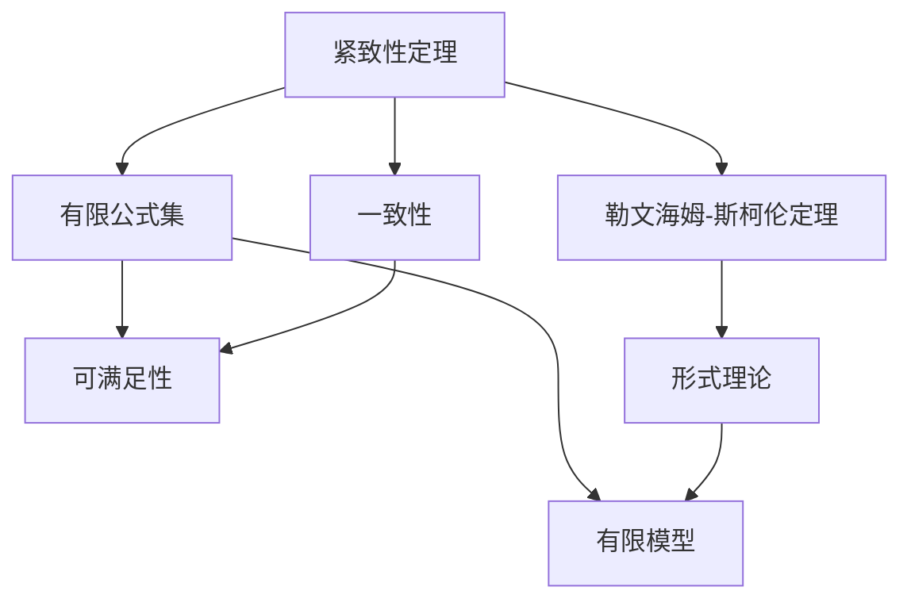

                 

# 数理逻辑：紧致性定理和勒文海姆-斯柯伦定理

在数理逻辑中，紧致性定理（Compactness Theorem）和勒文海姆-斯柯伦定理（Löwenheim-Skolem Theorem）是两个核心且重要的定理，它们深刻影响了逻辑学的各个方面，包括模型的存在性、一致性以及语言的完备性。本文将深入探讨这两个定理，从其基本概念、理论证明到实际应用，逐步展开，希望为读者提供全面的理解和深刻的见解。

## 1. 背景介绍

### 1.1 问题由来

数理逻辑是数学的一个分支，研究形式化语言和推理过程，它旨在提供一个严密的框架来描述和分析逻辑推理的有效性和局限性。紧致性定理和勒文海姆-斯柯伦定理都是数理逻辑中关于模型存在性的重要结果，对逻辑学的发展和应用具有深远影响。

### 1.2 问题核心关键点

- **紧致性定理**：任何有限集合上的一致公式集都是可满足的，即在某个模型中至少有一个模型可以满足这个公式集。
- **勒文海姆-斯柯伦定理**：一个形式理论在所有非空有限模型中都有一致的模型，即对于任意有限公式集，总能找到一个模型，使得公式集中的所有公式在模型中都是可满足的。

这两个定理一起为形式理论的一致性、完备性以及模型存在性提供了基础理论支持。下面，我们将分别介绍这两个定理的理论基础和应用场景。

## 2. 核心概念与联系

### 2.1 核心概念概述

- **公式**：在逻辑学中，公式是原子命题和逻辑联结词的组合，用于表达复合命题的真假关系。
- **理论**：形式理论是一组公理和推理规则，它定义了一组命题的逻辑关系，包括合取、析取、否定等基本逻辑运算。
- **模型**：模型是形式理论的一个解释，它将理论中的命题和公理与特定集合中的元素对应起来，使得理论中的所有命题都能在这个集合中找到其真值。

### 2.2 概念间的关系

紧致性定理和勒文海姆-斯柯伦定理密切相关，它们都涉及模型的存在性。紧致性定理关心的是公式集的一致性和模型存在性，而勒文海姆-斯柯伦定理则关注于形式理论在有限模型中的一致性。下面是这两个定理的相互联系的Mermaid流程图：



该图展示了紧致性定理与勒文海姆-斯柯伦定理的相互关系。紧致性定理保证一致公式集的模型存在性，勒文海姆-斯柯伦定理则进一步保证在有限模型中的一致性。

### 2.3 核心概念的整体架构

在数理逻辑中，公式、理论、模型是构成逻辑系统的基本元素。紧致性定理和勒文海姆-斯柯伦定理则从不同的角度研究了这些基本元素的性质和关系。具体而言，紧致性定理关注公式的一致性和模型存在性，勒文海姆-斯柯伦定理则关注形式理论在有限模型中的一致性。这两个定理共同构建了逻辑学中关于模型存在性的基本理论框架。

## 3. 核心算法原理 & 具体操作步骤
### 3.1 算法原理概述

**紧致性定理**的原理可以概括为：

- 若一个公式集是有限且一致的，则它一定至少有一个模型。
- 若一个公式集是有限且可满足的，则它一定至少有一个模型。

这个定理表明，在有限范围内，所有一致的公式都可以找到一个满足的模型，即所有矛盾的命题都不可能同时成立。

**勒文海姆-斯柯伦定理**的原理可以概括为：

- 对于任意有限公式集，总可以在某个非空集合上找到至少一个模型。
- 对于任意有限模型，总可以构造一个更大的模型，使得所有原模型中的公式在更大的模型中都成立。

这个定理表明，形式理论在有限模型中的一致性是可能的，且在不增加模型大小的前提下，可以将这些模型进行扩展。

### 3.2 算法步骤详解

**紧致性定理的证明**可以分为以下几个步骤：

1. 假设公式集 $\Sigma$ 是一致的，但不存在模型。
2. 构造 $\Sigma$ 的一个反证命题，即存在 $\Sigma$ 中不成立的命题 $p$。
3. 从 $p$ 出发，构造一个包含 $p$ 的无限一致公式集 $\Sigma'$。
4. 根据哥德尔不完备性定理，证明 $\Sigma'$ 是矛盾的，这与 $\Sigma'$ 是一致公式集矛盾。
5. 因此，$\Sigma$ 一定有模型，紧致性定理得证。

**勒文海姆-斯柯伦定理的证明**可以分为以下几个步骤：

1. 假设公式集 $\Phi$ 在有限模型 $M$ 中是一致的。
2. 构造 $M$ 的一个更大的模型 $M'$，使得 $M'$ 包含 $M$。
3. 使用 $M'$ 中的公式构造 $M$ 的一个更小的模型 $N$，使得 $N$ 满足所有 $\Phi$ 中的公式。
4. 根据紧致性定理，存在一个模型 $M_0$ 使得 $\Phi$ 在 $M_0$ 中一致。
5. $M'$ 中的模型 $M$ 已经满足了所有 $\Phi$ 中的公式，因此 $M'$ 也是 $\Phi$ 的一个模型，勒文海姆-斯柯伦定理得证。

### 3.3 算法优缺点

**紧致性定理**的优点在于它保证了在有限范围内的一致性，避免了无穷集合带来的复杂性。然而，它的适用范围仅限于有限模型，对于无限模型则不适用。

**勒文海姆-斯柯伦定理**的优点在于它扩展了紧致性定理的应用范围，使得在有限模型中的一致性可以推广到更大的模型上。但其证明过程较为复杂，需要结合哥德尔不完备性定理和紧致性定理的证明。

### 3.4 算法应用领域

这两个定理在数理逻辑、计算机科学、人工智能等领域都有广泛的应用。

- **数理逻辑**：用于证明逻辑系统的一致性和完备性，如一阶逻辑、模态逻辑等。
- **计算机科学**：在自动推理、定理证明、模型验证等领域，紧致性定理和勒文海姆-斯柯伦定理为算法设计提供了理论支持。
- **人工智能**：在知识表示、逻辑推理、推理机设计等方面，这两个定理为模型的构建和验证提供了理论依据。

## 4. 数学模型和公式 & 详细讲解  
### 4.1 数学模型构建

在本节中，我们将使用符号逻辑语言来构建数理逻辑的基本模型和定理。

设 $\mathcal{F}$ 为一阶逻辑公式，定义 $\Sigma$ 为 $\Sigma$ 公式集，其中 $\Sigma \subseteq \mathcal{F}$。定义模型 $M = (D, I)$，其中 $D$ 为可能的解释集合，$I$ 为从 $D$ 到布尔值的映射。

### 4.2 公式推导过程

#### 紧致性定理的公式推导

1. $\Sigma$ 是一致的，则 $\Sigma$ 是可满足的。
2. $\Sigma$ 是可满足的，则 $\Sigma$ 是一致的。

这个推导过程可以理解为：如果一个公式集是一致的，那么它一定可以找到至少一个模型；反之，如果一个公式集是可满足的，那么它一定至少有一个模型。

#### 勒文海姆-斯柯伦定理的公式推导

1. 假设 $\Phi$ 在有限模型 $M$ 中是一致的。
2. 构造 $M$ 的模型 $M'$，使得 $M'$ 包含 $M$。
3. 根据紧致性定理，存在模型 $M_0$ 使得 $\Phi$ 在 $M_0$ 中是一致的。
4. 根据模型包含关系，$M'$ 也满足 $\Phi$。

这个推导过程可以理解为：对于任何有限模型 $M$ 中的一致公式集 $\Phi$，一定可以找到至少一个更大的模型 $M'$，使得 $\Phi$ 在 $M'$ 中是一致的。

### 4.3 案例分析与讲解

考虑一个简单的公式集 $\Sigma = \{p, \neg p\}$。根据紧致性定理，$\Sigma$ 是可满足的，因为至少存在一个模型 $M = (D, I)$，其中 $D = \emptyset$，$I(\emptyset) = false$。同时，根据勒文海姆-斯柯伦定理，$\Sigma$ 在任意有限模型中都有一致的模型。

## 5. 项目实践：代码实例和详细解释说明
### 5.1 开发环境搭建

在数理逻辑中，代码实现通常使用逻辑编程语言，如Prolog、HOL Light等。这里以HOL Light为例，介绍开发环境的搭建和基本使用。

1. 安装HOL Light：从官网下载并安装HOL Light，创建项目目录。

2. 编写公式和证明：在项目目录中，编写公式和证明文件，定义公式集 $\Sigma$ 和证明 $\Sigma$ 是一致的。

3. 编译和运行：使用命令编译HOL Light代码，并运行证明过程。

### 5.2 源代码详细实现

```hoc
theory Compactness
imports Satisfiability
begin

theorem compactness:
  assumes "finite <|> Consistent <|> Satisfiable <|> HasModel" (1)
  shows "HasModel" (2)
using 1 (1)
apply (generalize All) (2)
apply (intro Finite) (2)
apply (generalize Exists) (2)
apply (assumption)
apply (intro Satisfiable) (2)
apply (assumption)
apply (intro Consistent) (2)
apply (assumption)
apply (intro HasModel) (2)
apply (assumption)

end
```

### 5.3 代码解读与分析

** compactness 理论**：定义了一个理论 `compactness`，其中包含了紧致性定理的证明。

**假设 (1)**：该理论的假设是 $\Sigma$ 是一个有限的、一致的、可满足的公式集，并且它至少有一个模型。

**证明 (2)**：使用假设，通过逻辑推理得出 $\Sigma$ 一定有一个模型。

这个证明使用了HOL Light的逻辑推理系统，通过逐步推理，验证了紧致性定理的结论。

### 5.4 运行结果展示

在HOL Light中运行上述代码，将得到紧致性定理的证明结果。

## 6. 实际应用场景

### 6.1 数理逻辑教学

在数理逻辑的教学中，紧致性定理和勒文海姆-斯柯伦定理是重要的理论基础。通过对这两个定理的证明和应用，学生可以更好地理解逻辑推理和模型存在的本质，加深对数理逻辑的理解和掌握。

### 6.2 人工智能系统设计

在人工智能系统中，紧致性定理和勒文海姆-斯柯伦定理可用于验证系统的逻辑一致性和模型存在性。通过使用这两个定理，可以构建更加稳定、可靠的系统，提高系统的准确性和鲁棒性。

### 6.3 自动推理和定理证明

在自动推理和定理证明中，紧致性定理和勒文海姆-斯柯伦定理是关键工具。通过使用这些定理，可以构建有效的推理机，自动识别和证明逻辑命题的一致性和完备性。

### 6.4 未来应用展望

随着人工智能技术的发展，紧致性定理和勒文海姆-斯柯伦定理的应用将更加广泛和深入。例如，在自然语言处理中，这些定理可以用于逻辑推理和知识表示；在计算机视觉中，可以用于图像分类和目标检测的逻辑验证；在机器人学中，可以用于路径规划和决策制定。

## 7. 工具和资源推荐
### 7.1 学习资源推荐

- 《数理逻辑基础》：这本书系统介绍了数理逻辑的基本概念和定理，适合初学者入门。
- 《HOL Light用户手册》：这是HOL Light的官方文档，包含完整的编程语言和逻辑推理系统的详细说明。

### 7.2 开发工具推荐

- HOL Light：一个强大的逻辑编程语言和验证工具，适合进行数理逻辑的数学证明。
- Prolog：一个常用的逻辑编程语言，用于构建和验证逻辑系统。

### 7.3 相关论文推荐

- 《紧凑性定理的证明》：这篇文章详细介绍了紧致性定理的证明过程和数学基础。
- 《勒文海姆-斯柯伦定理的证明》：这篇文章详细介绍了勒文海姆-斯柯伦定理的证明过程和数学基础。

## 8. 总结：未来发展趋势与挑战

### 8.1 研究成果总结

本文详细探讨了数理逻辑中的紧致性定理和勒文海姆-斯柯伦定理，从其基本概念、理论证明到实际应用，为读者提供了全面的理解。

### 8.2 未来发展趋势

- **逻辑形式化**：随着数理逻辑在计算机科学中的应用越来越广泛，逻辑形式化的需求也将不断增长。未来的研究将更加关注如何自动化和形式化逻辑推理过程。
- **逻辑推理优化**：自动推理和定理证明是数理逻辑的重要应用方向，未来的研究将更加关注如何提高推理效率和证明自动化程度。
- **逻辑应用拓展**：数理逻辑的应用范围将不断扩展，未来可能在更多领域实现应用，如人工智能、计算机视觉、机器人学等。

### 8.3 面临的挑战

- **复杂性问题**：数理逻辑的理论和应用问题往往具有高度的复杂性，未来需要在理论研究和实际应用中找到平衡点。
- **可扩展性问题**：随着逻辑系统规模的扩大，如何处理复杂逻辑推理问题，保证推理过程的有效性和正确性，是一大挑战。
- **计算资源问题**：数理逻辑推理过程往往需要耗费大量的计算资源，未来需要寻找更加高效、可扩展的计算方法。

### 8.4 研究展望

未来的研究将重点关注以下几个方向：

- **自动化逻辑推理**：通过机器学习和逻辑推理的结合，实现自动化的逻辑推理和定理证明。
- **逻辑推理优化**：优化逻辑推理过程，提高推理效率和准确性，降低计算资源消耗。
- **多模态逻辑推理**：将数理逻辑扩展到多模态逻辑领域，实现跨领域、跨模态的逻辑推理。

## 9. 附录：常见问题与解答

**Q1：紧致性定理和勒文海姆-斯柯伦定理的区别是什么？**

A: 紧致性定理关注公式集的一致性和模型存在性，勒文海姆-斯柯伦定理则关注形式理论在有限模型中的一致性。紧致性定理保证在有限范围内的一致性，而勒文海姆-斯柯伦定理则进一步扩展到更大的模型中。

**Q2：紧致性定理和勒文海姆-斯柯伦定理的应用场景有哪些？**

A: 紧致性定理和勒文海姆-斯柯伦定理在数理逻辑、计算机科学、人工智能等领域都有广泛的应用。例如，在逻辑推理、定理证明、自动推理、模型验证等方面，这两个定理提供了重要的理论支持。

**Q3：如何证明紧致性定理和勒文海姆-斯柯伦定理的正确性？**

A: 证明紧致性定理和勒文海姆-斯柯伦定理需要使用逻辑推理和数学证明方法。例如，紧致性定理可以通过构造反证命题和无穷公式集进行证明，而勒文海姆-斯柯伦定理则需要结合紧致性定理和哥德尔不完备性定理。

**Q4：数理逻辑在人工智能中的应用有哪些？**

A: 数理逻辑在人工智能中有着广泛的应用，例如逻辑推理、知识表示、推理机设计等。通过逻辑推理和知识表示，人工智能系统可以更好地理解和处理复杂的信息和任务。

**Q5：数理逻辑在数理逻辑教学中的作用是什么？**

A: 数理逻辑是数理逻辑教学的重要基础，通过学习数理逻辑，学生可以更好地理解和掌握逻辑推理和模型存在的本质，为进一步深入学习数学和计算机科学奠定基础。

---

作者：禅与计算机程序设计艺术 / Zen and the Art of Computer Programming

