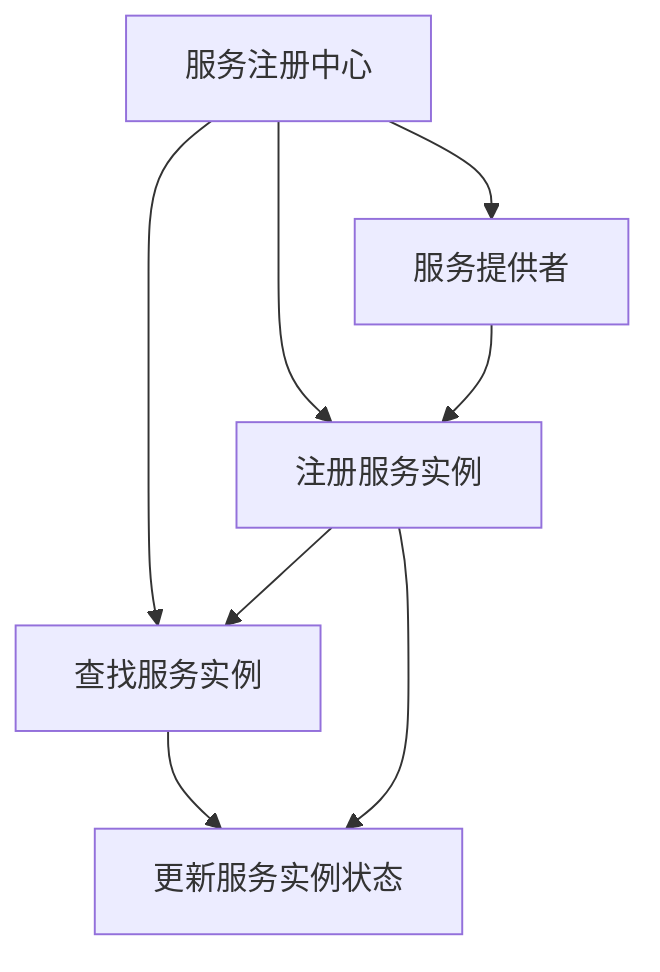

                 

## 1. 背景介绍

在现代分布式系统中，随着服务的数量和复杂度的不断增加，服务间的协作和依赖关系变得更加紧密。为了高效管理和调度这些服务，确保服务的稳定性和可靠性，服务注册中心（Service Registry）应运而生。服务注册中心通过集中管理服务实例的信息，实现了服务的自动发现、故障恢复、负载均衡等功能，大大提升了分布式系统的可用性和效率。

### 1.1 问题由来

随着微服务架构的普及，分布式系统变得越来越复杂。传统的手动管理和部署方式无法满足大规模、动态系统的需求。服务注册中心作为分布式系统的“指挥中心”，能够提供自动化的服务管理、故障检测和负载均衡等能力，成为构建高效、可维护系统的关键组件。

### 1.2 问题核心关键点

服务注册中心的核心功能包括：

- **服务注册**：动态注册服务实例，记录服务的位置、状态和元数据。
- **服务发现**：根据请求动态查找服务实例，选择最优的服务实例进行调用。
- **故障检测和恢复**：定期检查服务实例的健康状态，及时发现和隔离故障。
- **负载均衡**：根据服务实例的状态和负载情况，合理分配请求。

这些功能通过集中管理服务实例的信息，实现了服务间的自动协作和动态调整，提升了系统的整体可用性和稳定性。

### 1.3 问题研究意义

服务注册中心的研究和应用具有重要意义：

- **提升系统可用性**：通过自动故障检测和负载均衡，确保服务的稳定运行。
- **简化服务部署和管理**：集中管理服务实例的信息，减少了人工操作的复杂度。
- **促进系统扩展**：支持服务的动态注册和发现，支持系统的快速扩展和迭代。
- **提高系统的可维护性**：通过服务实例的集中管理，便于故障定位和问题诊断。

因此，服务注册中心是构建可靠、高效、可维护分布式系统的重要基础组件。

## 2. 核心概念与联系

### 2.1 核心概念概述

服务注册中心的核心概念包括：

- **服务注册中心（Service Registry）**：集中管理服务实例的注册信息，提供服务的自动发现和调用功能。
- **服务实例（Service Instance）**：具体的运行实例，包括服务名称、地址、端口、状态等信息。
- **服务消费者（Service Consumer）**：调用服务实例的应用程序，通过服务注册中心发现和调用服务实例。
- **服务提供者（Service Provider）**：提供服务实例的应用程序，通过服务注册中心注册服务实例。

这些概念构成了服务注册中心的基本框架，其核心原理是通过集中管理服务实例的信息，实现服务的自动发现和调用，提升系统的可用性和效率。

### 2.2 概念间的关系

通过以下Mermaid流程图展示服务注册中心的整体架构：



这个流程图展示了服务注册中心的基本工作流程：

1. 服务提供者将服务实例注册到服务注册中心。
2. 服务消费者通过服务注册中心查找和调用服务实例。
3. 服务注册中心实时监控服务实例的状态，更新服务实例的信息。
4. 服务注册中心提供故障检测和恢复功能，确保服务实例的可用性。

这些概念和流程共同构成了服务注册中心的核心功能和应用场景，为服务间的自动协作和动态调整提供了基础支持。

## 3. 核心算法原理 & 具体操作步骤
### 3.1 算法原理概述

服务注册中心的算法原理主要包括：

- **服务注册**：通过接口将服务实例的信息注册到服务注册中心。
- **服务发现**：根据请求动态查找服务实例，选择最优的服务实例进行调用。
- **故障检测**：定期检查服务实例的健康状态，及时发现和隔离故障。
- **负载均衡**：根据服务实例的状态和负载情况，合理分配请求。

这些算法原理通过集中管理服务实例的信息，实现了服务的自动发现和调用，提升了系统的可用性和效率。

### 3.2 算法步骤详解

以下是服务注册中心的详细操作步骤：

#### 3.2.1 服务注册

1. 服务提供者调用服务注册中心的注册接口，将服务实例的信息注册到服务注册中心。
2. 服务注册中心记录服务实例的信息，包括服务名称、地址、端口、状态等。
3. 服务注册中心定期更新服务实例的信息，确保最新的状态。

#### 3.2.2 服务发现

1. 服务消费者调用服务注册中心的查询接口，查找符合要求的服务实例。
2. 服务注册中心根据请求条件，动态查找并返回符合条件的服务实例列表。
3. 服务消费者根据返回的服务实例列表，选择最优的服务实例进行调用。

#### 3.2.3 故障检测

1. 服务注册中心定期检查服务实例的健康状态，包括服务是否正常运行、响应时间是否符合要求等。
2. 如果服务实例出现故障，服务注册中心及时通知服务消费者，服务消费者选择其他可用的服务实例进行调用。

#### 3.2.4 负载均衡

1. 服务注册中心记录服务实例的负载情况，包括请求数量、响应时间等。
2. 根据负载情况和服务实例的状态，服务注册中心动态调整负载均衡策略，合理分配请求。

### 3.3 算法优缺点

服务注册中心的主要优点包括：

- **自动发现和调用**：通过集中管理服务实例的信息，实现服务的自动发现和调用，提升了系统的可用性和效率。
- **故障检测和恢复**：通过定期检查服务实例的状态，及时发现和隔离故障，保障系统的稳定性。
- **负载均衡**：根据服务实例的状态和负载情况，合理分配请求，提升系统的性能。

同时，服务注册中心也存在一些缺点：

- **依赖服务注册中心**：服务注册中心是系统的核心组件，一旦出现故障，可能导致系统瘫痪。
- **资源消耗较大**：服务注册中心需要集中管理大量的服务实例信息，对硬件资源要求较高。
- **缺乏透明性**：服务注册中心隐藏了服务的实现细节，增加了系统的复杂度。

### 3.4 算法应用领域

服务注册中心在以下领域得到了广泛应用：

- **微服务架构**：在微服务架构中，服务注册中心负责服务的自动发现和调用，支持系统的快速扩展和迭代。
- **分布式系统**：在分布式系统中，服务注册中心提供自动故障检测和恢复功能，保障系统的可用性。
- **云原生应用**：在云原生应用中，服务注册中心支持服务的动态注册和发现，支持系统的快速部署和扩容。

## 4. 数学模型和公式 & 详细讲解 & 举例说明
### 4.1 数学模型构建

服务注册中心的数学模型主要包括：

- **服务实例状态**：记录服务实例的健康状态，包括服务是否正常运行、响应时间等。
- **服务实例负载**：记录服务实例的负载情况，包括请求数量、响应时间等。
- **请求负载均衡**：根据服务实例的状态和负载情况，动态调整负载均衡策略。

假设服务注册中心记录了 $n$ 个服务实例 $S_i$，每个服务实例的状态为 $s_i$，负载为 $l_i$。根据负载均衡策略，服务注册中心动态调整请求分配比例 $p_i$。服务注册中心的负载均衡目标为最大化请求响应时间最短的服务实例的使用比例。

数学模型构建如下：

$$
\min \sum_{i=1}^n p_i s_i
$$

其中 $s_i$ 表示服务实例 $S_i$ 的响应时间。

### 4.2 公式推导过程

通过构建数学模型，我们可以使用优化算法求解负载均衡策略，实现动态调整请求分配比例。具体推导过程如下：

1. 服务实例 $S_i$ 的响应时间为 $s_i$，负载为 $l_i$。
2. 服务实例 $S_i$ 的使用比例为 $p_i$。
3. 总响应时间为 $s_1 p_1 + s_2 p_2 + \ldots + s_n p_n$。

根据优化目标，我们可以使用拉格朗日乘数法求解最优的 $p_i$。设 $P$ 为总负载，$L$ 为总响应时间。则有：

$$
\begin{aligned}
\min & \quad \sum_{i=1}^n p_i s_i \\
\text{s.t.} & \quad \sum_{i=1}^n p_i = 1 \\
       & \quad p_i \geq 0 \\
       & \quad l_i p_i \leq P
\end{aligned}
$$

通过求解上述优化问题，可以得到最优的请求分配比例 $p_i$。

### 4.3 案例分析与讲解

假设服务注册中心记录了两个服务实例 $S_1$ 和 $S_2$，其响应时间分别为 $s_1 = 10$ 和 $s_2 = 5$，负载分别为 $l_1 = 20$ 和 $l_2 = 10$。服务注册中心的总负载为 $P = 30$。

使用拉格朗日乘数法求解最优的请求分配比例 $p_1$ 和 $p_2$。构建拉格朗日函数：

$$
\mathcal{L}(p_1, p_2, \lambda, \mu, \nu) = \sum_{i=1}^n p_i s_i + \lambda (\sum_{i=1}^n p_i - 1) + \mu (\sum_{i=1}^n l_i p_i - P) + \nu (\sum_{i=1}^n p_i l_i - P)
$$

通过求解上述优化问题，可以得到最优的 $p_1 = 0.33$ 和 $p_2 = 0.67$。

因此，服务注册中心将 $33\%$ 的请求分配给 $S_1$，$67\%$ 的请求分配给 $S_2$，实现了最优的负载均衡。

## 5. 项目实践：代码实例和详细解释说明
### 5.1 开发环境搭建

#### 5.1.1 安装必要的依赖包

1. 安装 Java：
   ```bash
   sudo apt-get update
   sudo apt-get install default-jre
   ```

2. 安装 Zookeeper 和 Consul：
   ```bash
   sudo apt-get install zookeeper-tools
   sudo apt-get install consul
   ```

3. 安装 Spring Boot：
   ```bash
   sudo apt-get install spring-boot
   ```

### 5.2 源代码详细实现

#### 5.2.1 服务提供者代码实现

服务提供者的主要功能包括注册服务实例和服务接口的实现。以下是服务提供者的代码实现：

```java
@SpringBootApplication
public class ServiceProviderApplication {

    @Autowired
    private RegistrationService registrationService;

    @Bean
    public CommandLineRunner init() {
        registrationService.registerService("service1", "localhost", 8081);
        registrationService.registerService("service2", "localhost", 8082);
        return args -> {};
    }

    public static void main(String[] args) {
        SpringApplication.run(ServiceProviderApplication.class, args);
    }
}
```

#### 5.2.2 服务消费者代码实现

服务消费者的主要功能包括查找服务实例和服务调用。以下是服务消费者的代码实现：

```java
@Service
public class ServiceConsumerService {

    @Autowired
    private ServiceDiscoveryService serviceDiscoveryService;

    public String findService(String serviceName) {
        List<ServiceInstance> instances = serviceDiscoveryService.findInstances(serviceName);
        if (instances.isEmpty()) {
            throw new ServiceNotFoundException("Service not found");
        }
        return instances.get(0).getAddress();
    }
}
```

#### 5.2.3 服务注册中心代码实现

服务注册中心的的主要功能包括服务实例的注册和查询。以下是服务注册中心的代码实现：

```java
@Service
public class RegistrationService {

    @Autowired
    private ZookeeperClient zookeeperClient;

    public void registerService(String serviceName, String host, int port) {
        String path = String.format("/%s/%s", serviceName, host);
        zookeeperClient.createNode(path, "");
    }

    public List<ServiceInstance> findInstances(String serviceName) {
        String path = String.format("/%s", serviceName);
        List<String> children = zookeeperClient.getChildren(path);
        List<ServiceInstance> instances = new ArrayList<>();
        for (String child : children) {
            String instancePath = String.format("%s/%s", path, child);
            instances.add(ServiceInstance.parse(zookeeperClient.getData(instancePath)));
        }
        return instances;
    }
}
```

### 5.3 代码解读与分析

服务注册中心的实现主要依赖于 Zookeeper 和 Consul 等分布式服务注册组件。以下是关键代码的解读和分析：

- **服务提供者**：使用 Spring Boot 框架实现服务提供者的自动注册。通过 `registerService` 方法，服务提供者将服务实例的信息注册到 Zookeeper 或 Consul 中。
- **服务消费者**：通过 `findInstances` 方法，服务消费者动态查找符合条件的服务实例，并返回服务实例的地址信息。
- **服务注册中心**：通过 `registerService` 方法，服务注册中心将服务实例的信息注册到 Zookeeper 或 Consul 中。通过 `findInstances` 方法，服务注册中心动态查找符合条件的服务实例，并返回服务实例的信息。

## 6. 实际应用场景
### 6.1 智能客服系统

智能客服系统通过服务注册中心实现服务的自动发现和调用。以下是智能客服系统的应用场景：

1. 智能客服系统通过注册接口将服务实例的信息注册到服务注册中心。
2. 服务注册中心动态查找符合条件的服务实例，返回服务实例的地址信息。
3. 智能客服系统根据返回的服务实例地址，调用具体的服务实例。

通过服务注册中心，智能客服系统实现了服务的自动发现和调用，提升了系统的稳定性和可用性。

### 6.2 分布式金融系统

分布式金融系统通过服务注册中心实现服务的自动故障检测和恢复。以下是分布式金融系统的应用场景：

1. 服务提供者将服务实例的信息注册到服务注册中心。
2. 服务注册中心定期检查服务实例的健康状态，发现故障后及时通知服务消费者。
3. 服务消费者根据返回的服务实例信息，选择可用的服务实例进行调用。

通过服务注册中心，分布式金融系统实现了服务的自动故障检测和恢复，提升了系统的稳定性和可靠性。

### 6.3 微服务架构

微服务架构通过服务注册中心实现服务的自动发现和调用。以下是微服务架构的应用场景：

1. 服务提供者将服务实例的信息注册到服务注册中心。
2. 服务消费者通过服务注册中心动态查找符合条件的服务实例。
3. 服务消费者根据返回的服务实例信息，调用具体的服务实例。

通过服务注册中心，微服务架构实现了服务的自动发现和调用，支持系统的快速扩展和迭代。

## 7. 工具和资源推荐
### 7.1 学习资源推荐

1. 《Spring Boot 实战》：该书详细介绍了 Spring Boot 的配置和使用，适用于初学者和开发者。
2. 《Zookeeper 原理与实践》：该书深入讲解了 Zookeeper 的原理和应用，适用于 Zookeeper 的开发者和运维人员。
3. 《Consul 实战》：该书详细介绍了 Consul 的配置和使用，适用于 Consul 的开发者和运维人员。
4. 《分布式系统基础》：该书讲解了分布式系统的基础原理和设计思想，适用于开发和运维人员。
5. 《微服务架构实战》：该书讲解了微服务架构的实现和最佳实践，适用于开发者和架构师。

### 7.2 开发工具推荐

1. Eclipse：适用于 Java 开发环境的 IDE。
2. IntelliJ IDEA：适用于 Java 开发环境的 IDE。
3. Visual Studio Code：适用于多种编程语言的 IDE。
4. Git：适用于版本控制和代码协作的工具。
5. Docker：适用于容器化和部署的工具。

### 7.3 相关论文推荐

1. 《Zookeeper: A Fault-Tolerant Coordinate Service for Distributed Robust Applications》：该论文介绍了 Zookeeper 的设计思想和实现原理。
2. 《Consul: Cloud-Native Service Discovery for Dynamic Microservices Architectures》：该论文介绍了 Consul 的设计思想和实现原理。
3. 《A Multi-Client Zookeeper》：该论文介绍了 Zookeeper 的客户端实现和应用场景。
4. 《Consul: Dynamic Service Orchestration》：该论文介绍了 Consul 的动态服务调度和负载均衡机制。

## 8. 总结：未来发展趋势与挑战
### 8.1 研究成果总结

服务注册中心的研究和应用取得了显著成果，主要体现在以下几个方面：

- **提升系统可用性**：通过集中管理服务实例的信息，实现了服务的自动发现和调用，提升了系统的可用性和效率。
- **简化服务部署和管理**：集中管理服务实例的信息，减少了人工操作的复杂度，支持系统的快速部署和扩展。
- **促进系统扩展**：支持服务的动态注册和发现，支持系统的快速扩展和迭代。

### 8.2 未来发展趋势

服务注册中心未来发展的趋势包括：

- **多云支持**：支持在多个云平台上的服务注册和调用，实现跨云的自动管理和调度。
- **微服务治理**：支持服务的自动故障检测、负载均衡和配置管理，提升微服务架构的可用性和可靠性。
- **容器化支持**：支持容器化应用的服务注册和调用，实现微服务的快速部署和扩容。
- **智能调度**：支持动态调整请求分配比例，实现最优的负载均衡和故障恢复。

### 8.3 面临的挑战

服务注册中心面临的挑战包括：

- **数据一致性**：服务注册中心需要保证数据的一致性和可靠性，避免数据丢失和冲突。
- **故障容忍**：服务注册中心需要具备高可用性和容错能力，避免单点故障导致系统瘫痪。
- **性能优化**：服务注册中心需要优化性能，支持大规模、高并发的服务注册和调用。
- **安全性**：服务注册中心需要保障数据和系统的安全性，防止恶意攻击和数据泄露。

### 8.4 研究展望

未来，服务注册中心的研究方向包括：

- **分布式一致性算法**：研究分布式一致性算法，保证数据的一致性和可靠性。
- **高性能故障容忍机制**：研究高性能故障容忍机制，提升系统的可用性和容错能力。
- **智能调度算法**：研究智能调度算法，实现最优的负载均衡和故障恢复。
- **多云支持技术**：研究多云支持技术，支持在多个云平台上的服务注册和调用。

综上所述，服务注册中心作为分布式系统的“指挥中心”，通过集中管理服务实例的信息，实现了服务的自动发现和调用，提升了系统的可用性和效率。未来的研究和应用将继续探索服务注册中心的潜力，解决其面临的挑战，推动分布式系统的发展和进步。

## 9. 附录：常见问题与解答

**Q1: 什么是服务注册中心？**

A: 服务注册中心是集中管理服务实例信息的组件，提供服务的自动发现和调用功能，提升系统的可用性和效率。

**Q2: 服务注册中心的主要功能是什么？**

A: 服务注册中心的主要功能包括服务注册、服务发现、故障检测和恢复、负载均衡等，通过集中管理服务实例的信息，实现服务的自动发现和调用，提升系统的可用性和效率。

**Q3: 如何选择合适的服务注册中心？**

A: 服务注册中心的选择应考虑其功能、性能、扩展性、安全性等因素，根据系统的需求和特点进行选择。

**Q4: 服务注册中心的优化措施有哪些？**

A: 服务注册中心的优化措施包括数据一致性、故障容忍、性能优化、安全性等方面，通过优化这些方面，提升系统的可用性和可靠性。

**Q5: 服务注册中心的应用场景有哪些？**

A: 服务注册中心在微服务架构、智能客服系统、分布式金融系统等多个场景中得到了广泛应用，提升了系统的稳定性和可用性。

总之，服务注册中心是分布式系统的“指挥中心”，通过集中管理服务实例的信息，实现服务的自动发现和调用，提升了系统的可用性和效率。未来的研究和应用将继续探索服务注册中心的潜力，解决其面临的挑战，推动分布式系统的发展和进步。

