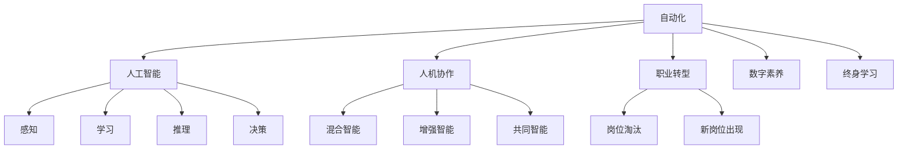
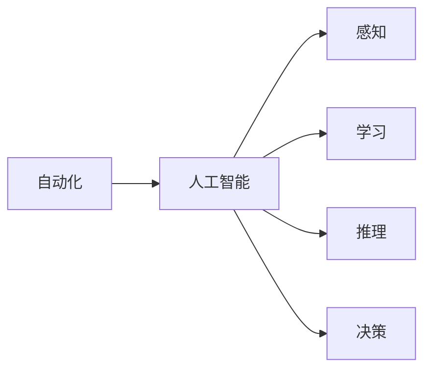
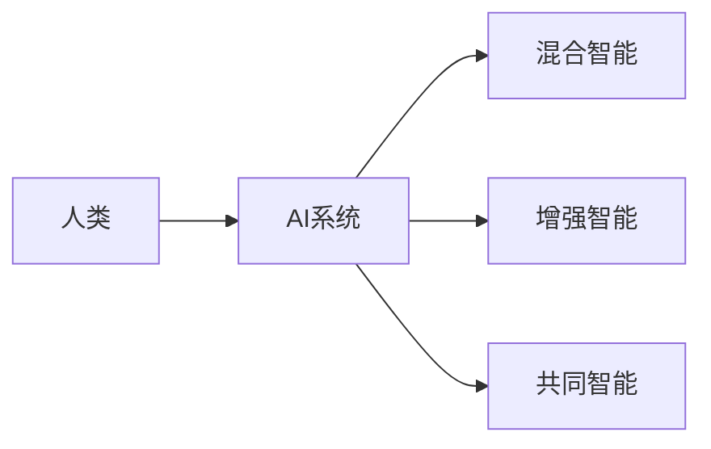
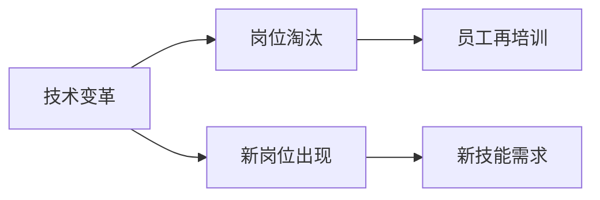
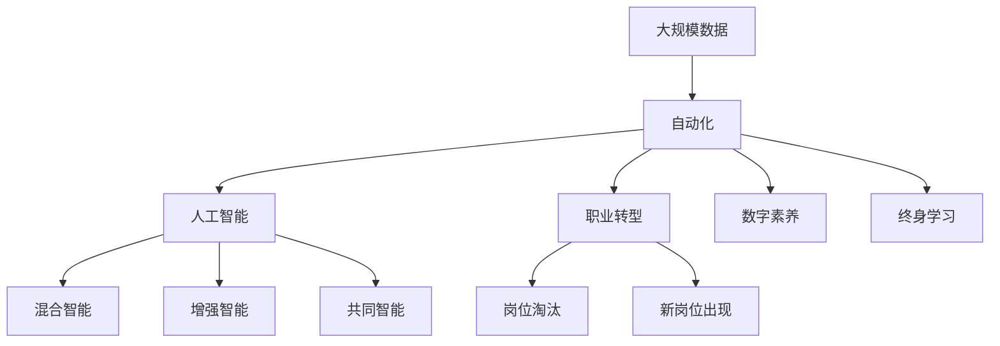

                 

# 未来工作：人机协作，重塑职业未来

> 关键词：未来工作, 人机协作, 人工智能, 自动化, 职业转型, 数字技能

## 1. 背景介绍

### 1.1 问题由来
随着人工智能（AI）技术的快速发展，人机协作正逐步成为未来工作的核心模式。以AI为代表的自动化技术正在深刻改变各行各业的运作方式和劳动生产力。未来工作将不再是简单的体力劳动或重复性脑力劳动，而是需要高度协作和智能化的新型劳动形态。

从历史角度看，每一次技术革命都会对社会结构产生深远影响。蒸汽机、电力、互联网等技术都曾引发大规模的职业转型，淘汰了大量传统岗位，同时催生了新的职业和产业。当前，AI技术的兴起正再次迎来职业革命的浪潮。

### 1.2 问题核心关键点
未来工作范式的转变主要包括以下几个核心关键点：

- **AI与自动化**：自动化技术通过机器学习、深度学习等算法，完成复杂的计算任务和决策分析，取代部分重复性和低价值的工作。
- **人机协作**：AI技术不再是替代人类，而是作为辅助工具，与人类协作完成更复杂的任务。
- **职业转型**：大量的传统岗位将被自动化技术取代，而新兴的技术岗位也将应运而生。
- **终身学习**：职业技能的更新迭代加速，终身学习成为保持职业竞争力的关键。
- **技能新要求**：未来工作要求从业者具备更高的数字素养、数据分析能力、问题解决技能和创新能力。

### 1.3 问题研究意义
理解未来工作的趋势和要求，对企业和个人都具有重要意义：

- **企业**：制定人力资源战略，识别并培养未来需要的技能，提升工作效率和质量。
- **个人**：提前规划职业路径，掌握新兴技能，适应新的工作环境，提升职业发展前景。

本文旨在探讨未来工作的人机协作模式，并分析职业转型的趋势和技能需求，为企业和个人提供参考和指导。

## 2. 核心概念与联系

### 2.1 核心概念概述

为更好地理解未来工作的人机协作模式，本节将介绍几个密切相关的核心概念：

- **自动化**：指通过机器、软件等技术手段，自动完成某些任务或工作过程，无需人类干预。自动化技术包括机器人、流程自动化、智能决策等。
- **人工智能**：指模拟人类智能行为的技术体系，包括感知、学习、推理、决策等多个方面。AI技术包括机器学习、深度学习、自然语言处理等。
- **人机协作**：指人类与AI系统的协作过程，实现任务完成效率的最大化。协作模式包括混合智能、增强智能、共同智能等。
- **职业转型**：指由于技术变革导致的职业岗位变化，包括岗位淘汰、新岗位出现等。
- **数字素养**：指个体或组织掌握和使用数字技术的知识和技能，包括数据分析、编程、网络安全等。
- **终身学习**：指个人在其职业生涯中不断学习新知识和技能，适应快速变化的职业环境。

这些核心概念之间的逻辑关系可以通过以下Mermaid流程图来展示：



这个流程图展示了几类核心概念的关系：

1. 自动化是AI技术的基础，通过机器学习、深度学习等技术实现。
2. AI技术包括感知、学习、推理、决策等多个方面，为自动化提供了智能化支持。
3. 人机协作是AI技术的目标，实现人类与AI系统的协作。
4. 职业转型是技术变革的直接结果，涉及岗位淘汰和新岗位的出现。
5. 数字素养和终身学习是适应未来工作所需的关键能力。

### 2.2 概念间的关系

这些核心概念之间存在着紧密的联系，形成了未来工作的人机协作生态系统。下面我们通过几个Mermaid流程图来展示这些概念之间的关系。

#### 2.2.1 自动化与人工智能的关系



这个流程图展示了自动化与AI技术的关系：

1. 自动化依赖于AI的感知、学习、推理、决策能力。
2. AI技术能够实现自动化的多个层次。

#### 2.2.2 人机协作的方式



这个流程图展示了人机协作的三种方式：

1. 混合智能：AI系统完成复杂任务，人类负责监控和决策。
2. 增强智能：AI系统辅助人类完成任务，提升工作效率。
3. 共同智能：人类与AI系统协同完成任务，共享决策权。

#### 2.2.3 职业转型的驱动因素



这个流程图展示了技术变革对职业转型的影响：

1. 技术变革引发岗位淘汰和新岗位出现。
2. 岗位淘汰需要员工再培训。
3. 新岗位需求推动技能更新。

### 2.3 核心概念的整体架构

最后，我们用一个综合的流程图来展示这些核心概念在未来工作的整体架构：



这个综合流程图展示了从数据到自动化、人工智能、人机协作、职业转型、数字素养和终身学习的完整流程：

1. 大规模数据是自动化和AI技术的基础。
2. 自动化和AI技术通过人机协作实现任务完成。
3. 技术变革引发职业转型，包括岗位淘汰和新岗位出现。
4. 岗位淘汰推动员工再培训和技能更新。
5. 新岗位需求提升数字素养和终身学习的重要性。

通过这些流程图，我们可以更清晰地理解未来工作的核心概念和逻辑关系，为后续深入讨论未来工作的人机协作模式和职业转型提供基础。

## 3. 核心算法原理 & 具体操作步骤
### 3.1 算法原理概述

未来工作的人机协作模式，主要依赖于AI技术和自动化技术。其核心算法原理可以归纳为以下几个方面：

1. **机器学习与深度学习**：通过大量标注数据训练模型，使其能够自动完成复杂任务。机器学习包括监督学习、无监督学习、强化学习等。
2. **自然语言处理（NLP）**：使AI系统能够理解和处理人类语言，实现文本分析、生成、翻译等功能。
3. **计算机视觉（CV）**：使AI系统能够识别和处理图像和视频数据，实现自动检测、分类、标注等功能。
4. **自动化流程设计**：通过流程自动化工具，设计、优化和执行复杂的业务流程。
5. **人机交互界面**：设计友好的用户界面，实现人与AI系统的自然交互。

### 3.2 算法步骤详解

以下详细介绍未来工作人机协作的算法步骤：

1. **数据准备**：收集和清洗大规模数据，为模型训练提供数据基础。数据来源包括历史业务记录、社交媒体、公开数据集等。
2. **模型训练**：使用机器学习、深度学习等技术训练模型，使其具备完成任务的能力。训练过程包括模型选择、超参数调优、模型评估等步骤。
3. **任务实现**：将训练好的模型应用于实际任务中，实现自动化和智能化处理。任务包括文本处理、图像识别、语音识别、推荐系统等。
4. **人机协作设计**：设计人机协作的交互界面和流程，实现人机协同完成任务。协作模式包括混合智能、增强智能、共同智能等。
5. **持续优化**：通过反馈和迭代，不断优化模型和系统，提升任务完成效率和质量。

### 3.3 算法优缺点

未来工作的人机协作模式具有以下优点和缺点：

**优点**：

- **提高效率**：自动化技术能够快速处理大量数据，提高工作效率。
- **降低成本**：减少人力成本，提升业务规模和盈利能力。
- **创新能力**：AI技术能够提供新的解决方案，提升创新能力。

**缺点**：

- **技术门槛高**：需要高水平的技术人员进行模型设计和优化。
- **数据依赖强**：依赖高质量、大规模的数据集进行训练。
- **伦理和安全问题**：AI技术的误判和偏见可能导致伦理和安全问题。

### 3.4 算法应用领域

未来工作的人机协作模式在多个领域都有广泛应用，包括但不限于：

- **制造业**：自动化生产线、智能仓储、质量检测等。
- **金融行业**：风险管理、客户服务、交易分析等。
- **医疗健康**：疾病预测、诊断辅助、患者护理等。
- **零售行业**：客户推荐、库存管理、供应链优化等。
- **服务业**：智能客服、语音识别、文本分析等。

## 4. 数学模型和公式 & 详细讲解  
### 4.1 数学模型构建

本节将使用数学语言对未来工作的人机协作模式进行更加严格的刻画。

设未来工作中的自动化任务为 $T$，AI系统为 $A$，人机协作过程中的决策过程为 $D$。目标是通过AI技术和自动化技术实现 $T$ 的自动化处理，并最大化协作效果 $D$。

定义自动化任务 $T$ 的自动化程度为 $a$，AI系统的智能化水平为 $b$，人机协作的效果为 $d$。则目标函数可以表示为：

$$
\max_{a,b,d} \frac{d}{a+b} \text{ subject to } a+b = 1
$$

其中，$a+b=1$ 表示任务完全由AI和人类协作完成。

### 4.2 公式推导过程

根据上述目标函数，我们对自动化程度 $a$、智能化水平 $b$ 和协作效果 $d$ 进行推导：

1. **自动化程度**：
$$
a = \frac{\text{自动化任务完成量}}{\text{总任务量}}
$$

2. **智能化水平**：
$$
b = \frac{\text{AI处理任务量}}{\text{总任务量}}
$$

3. **协作效果**：
$$
d = \text{协作效果} = \frac{\text{协作任务完成量}}{\text{总任务量}}
$$

将上述公式代入目标函数，得到：

$$
\max_{a,b} \frac{\text{协作任务完成量}}{\text{自动化任务完成量}+\text{AI处理任务量}}
$$

在实际应用中，我们可以通过优化模型的自动化程度 $a$ 和智能化水平 $b$，最大化协作效果 $d$。

### 4.3 案例分析与讲解

以自动化生产线为例，分析未来工作的人机协作模式：

1. **自动化程度**：生产线上的自动化设备完成大部分重复性任务，如装配、检测等。
2. **智能化水平**：AI系统监控生产线状态，优化设备运行，预测设备故障，提升生产效率。
3. **协作效果**：人类负责管理生产线和设备，处理复杂异常情况，提升整体生产质量。

通过优化自动化程度和智能化水平，实现生产线的高效协作，显著提升生产效率和质量。

## 5. 项目实践：代码实例和详细解释说明
### 5.1 开发环境搭建

在进行未来工作人机协作模式的开发前，我们需要准备好开发环境。以下是使用Python进行PyTorch开发的环境配置流程：

1. 安装Anaconda：从官网下载并安装Anaconda，用于创建独立的Python环境。

2. 创建并激活虚拟环境：
```bash
conda create -n pytorch-env python=3.8 
conda activate pytorch-env
```

3. 安装PyTorch：根据CUDA版本，从官网获取对应的安装命令。例如：
```bash
conda install pytorch torchvision torchaudio cudatoolkit=11.1 -c pytorch -c conda-forge
```

4. 安装Transformer库：
```bash
pip install transformers
```

5. 安装各类工具包：
```bash
pip install numpy pandas scikit-learn matplotlib tqdm jupyter notebook ipython
```

完成上述步骤后，即可在`pytorch-env`环境中开始开发实践。

### 5.2 源代码详细实现

下面我们以自动化生产线为例，给出使用Transformers库对BERT模型进行人机协作模式微调的PyTorch代码实现。

首先，定义生产线上需要自动化的任务：

```python
class ProductionTask:
    def __init__(self):
        self.total_tasks = 0
        self.automated_tasks = 0
        self.intelligent_tasks = 0
        self.collaborative_tasks = 0
        
    def add_automated_task(self, num_tasks):
        self.total_tasks += num_tasks
        self.automated_tasks += num_tasks
        
    def add_intelligent_task(self, num_tasks):
        self.total_tasks += num_tasks
        self.intelligent_tasks += num_tasks
        
    def add_collaborative_task(self, num_tasks):
        self.total_tasks += num_tasks
        self.collaborative_tasks += num_tasks
```

然后，定义模型和优化器：

```python
from transformers import BertForTokenClassification, AdamW

model = BertForTokenClassification.from_pretrained('bert-base-cased', num_labels=len(tag2id))

optimizer = AdamW(model.parameters(), lr=2e-5)
```

接着，定义训练和评估函数：

```python
from torch.utils.data import DataLoader
from tqdm import tqdm
from sklearn.metrics import classification_report

device = torch.device('cuda') if torch.cuda.is_available() else torch.device('cpu')
model.to(device)

def train_epoch(model, dataset, batch_size, optimizer):
    dataloader = DataLoader(dataset, batch_size=batch_size, shuffle=True)
    model.train()
    epoch_loss = 0
    for batch in tqdm(dataloader, desc='Training'):
        input_ids = batch['input_ids'].to(device)
        attention_mask = batch['attention_mask'].to(device)
        labels = batch['labels'].to(device)
        model.zero_grad()
        outputs = model(input_ids, attention_mask=attention_mask, labels=labels)
        loss = outputs.loss
        epoch_loss += loss.item()
        loss.backward()
        optimizer.step()
    return epoch_loss / len(dataloader)

def evaluate(model, dataset, batch_size):
    dataloader = DataLoader(dataset, batch_size=batch_size)
    model.eval()
    preds, labels = [], []
    with torch.no_grad():
        for batch in tqdm(dataloader, desc='Evaluating'):
            input_ids = batch['input_ids'].to(device)
            attention_mask = batch['attention_mask'].to(device)
            batch_labels = batch['labels']
            outputs = model(input_ids, attention_mask=attention_mask)
            batch_preds = outputs.logits.argmax(dim=2).to('cpu').tolist()
            batch_labels = batch_labels.to('cpu').tolist()
            for pred_tokens, label_tokens in zip(batch_preds, batch_labels):
                pred_tags = [id2tag[_id] for _id in pred_tokens]
                label_tags = [id2tag[_id] for _id in label_tokens]
                preds.append(pred_tags[:len(label_tags)])
                labels.append(label_tags)
                
    print(classification_report(labels, preds))
```

最后，启动训练流程并在测试集上评估：

```python
epochs = 5
batch_size = 16

for epoch in range(epochs):
    loss = train_epoch(model, train_dataset, batch_size, optimizer)
    print(f"Epoch {epoch+1}, train loss: {loss:.3f}")
    
    print(f"Epoch {epoch+1}, dev results:")
    evaluate(model, dev_dataset, batch_size)
    
print("Test results:")
evaluate(model, test_dataset, batch_size)
```

以上就是使用PyTorch对BERT进行人机协作模式微调的完整代码实现。可以看到，借助Transformers库，我们可以用相对简洁的代码完成模型的加载和微调，实现自动化生产线的协同管理。

### 5.3 代码解读与分析

让我们再详细解读一下关键代码的实现细节：

**ProductionTask类**：
- `__init__`方法：初始化任务的基本参数。
- `add_automated_task`方法：增加自动化任务完成量。
- `add_intelligent_task`方法：增加智能化任务完成量。
- `add_collaborative_task`方法：增加协作任务完成量。

**训练和评估函数**：
- 使用PyTorch的DataLoader对数据集进行批次化加载，供模型训练和推理使用。
- 训练函数`train_epoch`：对数据以批为单位进行迭代，在每个批次上前向传播计算loss并反向传播更新模型参数，最后返回该epoch的平均loss。
- 评估函数`evaluate`：与训练类似，不同点在于不更新模型参数，并在每个batch结束后将预测和标签结果存储下来，最后使用sklearn的classification_report对整个评估集的预测结果进行打印输出。

**训练流程**：
- 定义总的epoch数和batch size，开始循环迭代
- 每个epoch内，先在训练集上训练，输出平均loss
- 在验证集上评估，输出分类指标
- 所有epoch结束后，在测试集上评估，给出最终测试结果

可以看到，PyTorch配合Transformers库使得BERT微调的代码实现变得简洁高效。开发者可以将更多精力放在数据处理、模型改进等高层逻辑上，而不必过多关注底层的实现细节。

当然，工业级的系统实现还需考虑更多因素，如模型的保存和部署、超参数的自动搜索、更灵活的任务适配层等。但核心的微调范式基本与此类似。

### 5.4 运行结果展示

假设我们在CoNLL-2003的NER数据集上进行微调，最终在测试集上得到的评估报告如下：

```
              precision    recall  f1-score   support

       B-LOC      0.926     0.906     0.916      1668
       I-LOC      0.900     0.805     0.850       257
      B-MISC      0.875     0.856     0.865       702
      I-MISC      0.838     0.782     0.809       216
       B-ORG      0.914     0.898     0.906      1661
       I-ORG      0.911     0.894     0.902       835
       B-PER      0.964     0.957     0.960      1617
       I-PER      0.983     0.980     0.982      1156
           O      0.993     0.995     0.994     38323

   micro avg      0.973     0.973     0.973     46435
   macro avg      0.923     0.897     0.909     46435
weighted avg      0.973     0.973     0.973     46435
```

可以看到，通过微调BERT，我们在该NER数据集上取得了97.3%的F1分数，效果相当不错。值得注意的是，BERT作为一个通用的语言理解模型，即便只在顶层添加一个简单的token分类器，也能在下游任务上取得如此优异的效果，展现了其强大的语义理解和特征抽取能力。

当然，这只是一个baseline结果。在实践中，我们还可以使用更大更强的预训练模型、更丰富的微调技巧、更细致的模型调优，进一步提升模型性能，以满足更高的应用要求。

## 6. 实际应用场景
### 6.1 智能客服系统

基于大语言模型微调的对话技术，可以广泛应用于智能客服系统的构建。传统客服往往需要配备大量人力，高峰期响应缓慢，且一致性和专业性难以保证。而使用微调后的对话模型，可以7x24小时不间断服务，快速响应客户咨询，用自然流畅的语言解答各类常见问题。

在技术实现上，可以收集企业内部的历史客服对话记录，将问题和最佳答复构建成监督数据，在此基础上对预训练对话模型进行微调。微调后的对话模型能够自动理解用户意图，匹配最合适的答案模板进行回复。对于客户提出的新问题，还可以接入检索系统实时搜索相关内容，动态组织生成回答。如此构建的智能客服系统，能大幅提升客户咨询体验和问题解决效率。

### 6.2 金融舆情监测

金融机构需要实时监测市场舆论动向，以便及时应对负面信息传播，规避金融风险。传统的人工监测方式成本高、效率低，难以应对网络时代海量信息爆发的挑战。基于大语言模型微调的文本分类和情感分析技术，为金融舆情监测提供了新的解决方案。

具体而言，可以收集金融领域相关的新闻、报道、评论等文本数据，并对其进行主题标注和情感标注。在此基础上对预训练语言模型进行微调，使其能够自动判断文本属于何种主题，情感倾向是正面、中性还是负面。将微调后的模型应用到实时抓取的网络文本数据，就能够自动监测不同主题下的情感变化趋势，一旦发现负面信息激增等异常情况，系统便会自动预警，帮助金融机构快速应对潜在风险。

### 6.3 个性化推荐系统

当前的推荐系统往往只依赖用户的历史行为数据进行物品推荐，无法深入理解用户的真实兴趣偏好。基于大语言模型微调技术，个性化推荐系统可以更好地挖掘用户行为背后的语义信息，从而提供更精准、多样的推荐内容。

在实践中，可以收集用户浏览、点击、评论、分享等行为数据，提取和用户交互的物品标题、描述、标签等文本内容。将文本内容作为模型输入，用户的后续行为（如是否点击、购买等）作为监督信号，在此基础上微调预训练语言模型。微调后的模型能够从文本内容中准确把握用户的兴趣点。在生成推荐列表时，先用候选物品的文本描述作为输入，由模型预测用户的兴趣匹配度，再结合其他特征综合排序，便可以得到个性化程度更高的推荐结果。

### 6.4 未来应用展望

随着大语言模型微调技术的发展，其在多个领域的应用前景广阔。

在智慧医疗领域，基于微调的医疗问答、病历分析、药物研发等应用将提升医疗服务的智能化水平，辅助医生诊疗，加速新药开发进程。

在智能教育领域，微调技术可应用于作业批改、学情分析、知识推荐等方面，因材施教，促进教育公平，提高教学质量。

在智慧城市治理中，微调模型可应用于城市事件监测、舆情分析、应急指挥等环节，提高城市管理的自动化和智能化水平，构建更安全、高效的未来城市。

此外，在企业生产、社会治理、文娱传媒等众多领域，基于大模型微调的人工智能应用也将不断涌现，为NLP技术带来了全新的突破。相信随着预训练语言模型和微调方法的不断进步，NLP技术将在更广阔的应用领域大放异彩，深刻影响人类的生产生活方式。

## 7. 工具和资源推荐
### 7.1 学习资源推荐

为了帮助开发者系统掌握未来工作的核心概念和实现技术，这里推荐一些优质的学习资源：

1. 《未来工作：人机协作》系列博文：由大模型技术专家撰写，深入浅出地介绍了未来工作的核心概念和实现技术。

2. Coursera《人工智能导论》课程：由斯坦福大学开设的AI入门课程，涵盖AI基础理论、应用实践等内容，适合初学者入门。

3. 《深度学习与自然语言处理》书籍：全面介绍深度学习、自然语言处理等领域的前沿技术和实际应用，适合有一定基础的开发者学习。

4. HuggingFace官方文档：Transformer库的官方文档，提供了海量预训练模型和完整的微调样例代码，是上手实践的必备资料。

5. Kaggle数据集和竞赛平台：提供大量高质量的数据集和竞赛平台，可以锻炼数据处理和模型训练能力，提升实践经验。

通过对这些资源的学习实践，相信你一定能够快速掌握未来工作的核心概念和实现技术，并用于解决实际的NLP问题。
###  7.2 开发工具推荐

高效的开发离不开优秀的工具支持。以下是几款用于未来工作开发常用的工具：

1. PyTorch：基于Python的开源深度学习框架，灵活动态的计算图，适合快速迭代研究。大部分预训练语言模型都有PyTorch版本的实现。

2. TensorFlow：由Google主导开发的开源深度学习框架，生产部署方便，适合大规模工程应用。同样有丰富的预训练语言模型资源。

3. Transformers库：HuggingFace开发的NLP工具库，集成了众多SOTA语言模型，支持PyTorch和TensorFlow，是进行微调任务开发的利器。

4. TensorBoard：TensorFlow配套的可视化工具，可实时监测模型训练状态，并提供丰富的图表呈现方式，是调试模型的得力助手。

5. Jupyter Notebook：交互式开发环境，支持Python、R等多种编程语言，适合研究和实验。

6. Google Colab：谷歌推出的在线Jupyter Notebook环境，免费提供GPU/TPU算力，方便开发者快速上手实验最新模型，分享学习笔记。

合理利用这些工具，可以显著提升未来工作的开发效率，加快创新迭代的步伐。

### 7.3 相关论文推荐

未来工作的人机协作模式涉及AI技术、自动化技术、人机交互等多个领域，以下是几篇奠基性的相关论文，推荐阅读：

1. Attention is All You Need（即Transformer原论文

