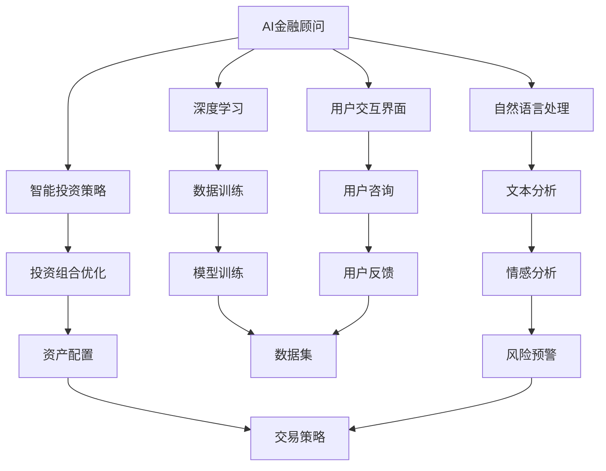

                 

# 未来的智能金融：2050年的AI金融顾问与智能金融监管

> 关键词：人工智能,金融顾问,智能监管,AI模型,深度学习,量化交易,大数据,区块链,模型解释性

## 1. 背景介绍

### 1.1 问题由来

随着人工智能技术的迅猛发展，金融行业正迎来前所未有的变革。智能金融系统不仅可以大幅提升金融服务效率，还能在风险控制、资产配置等方面发挥重要作用。未来的金融系统将融合多种前沿技术，如深度学习、大数据分析、区块链、智能合约等，实现从操作层到策略层的智能化。

### 1.2 问题核心关键点

1. **AI金融顾问**：利用深度学习、自然语言处理等技术，开发智能金融顾问系统，帮助用户进行金融决策，优化投资组合，实现财务目标。
2. **智能金融监管**：应用机器学习、自然语言处理等技术，构建智能金融监管体系，实现对金融市场的实时监控、风险预警和异常检测，保障金融市场稳定运行。
3. **金融数据治理**：通过数据清洗、数据集成和数据可视化等技术，建立规范化的金融数据治理框架，提升数据质量和分析效率，支撑智能金融系统的应用。

## 2. 核心概念与联系

### 2.1 核心概念概述

为更好地理解智能金融系统的构建和应用，本节将介绍几个核心概念：

- **AI金融顾问**：基于深度学习、自然语言处理等技术，构建智能金融顾问系统，帮助用户进行个性化、智能化的金融决策。
- **智能金融监管**：利用机器学习、自然语言处理等技术，构建智能金融监管系统，实现对金融市场的实时监控和异常检测，保障市场稳定。
- **金融数据治理**：通过数据清洗、数据集成和数据可视化等技术，建立规范化的金融数据治理框架，提升数据质量和分析效率。

这些概念之间的逻辑关系可以通过以下Mermaid流程图来展示：



这个流程图展示了大语言模型的核心概念及其之间的关系：

1. AI金融顾问系统通过深度学习和自然语言处理技术，从大量数据中学习和提取金融市场的动态信息，为用户提供个性化的金融决策建议。
2. 智能金融监管系统利用机器学习和大数据分析技术，实时监控金融市场的变化，预测潜在的风险和异常，保障市场稳定。
3. 金融数据治理框架通过数据清洗、数据集成和数据可视化技术，构建规范化的数据管理体系，提升数据质量和分析效率，支撑智能金融系统的应用。

### 2.2 概念间的关系

这些核心概念之间存在着紧密的联系，形成了智能金融系统的完整生态系统。

- AI金融顾问和智能金融监管系统都需要高质量的金融数据，而金融数据治理框架正是为了提升数据质量和管理效率而设立的。
- 智能金融监管系统对金融市场的实时监控和预警，能够提供更准确的市场动态信息，帮助AI金融顾问系统做出更科学的决策。
- AI金融顾问系统提供的个性化投资建议，也能够为智能金融监管系统提供更具体的应用场景和目标用户群。

## 3. 核心算法原理 & 具体操作步骤

### 3.1 算法原理概述

基于深度学习和自然语言处理技术的AI金融顾问系统，其核心思想是通过训练大语言模型，从金融市场的历史数据和用户咨询中学习和提取规律，构建智能化的金融决策模型。智能金融监管系统则通过训练机器学习模型，实时监控金融市场数据，识别异常行为和风险信号。

### 3.2 算法步骤详解

**AI金融顾问系统**：

1. **数据采集与预处理**：收集金融市场的历史数据和用户咨询数据，进行清洗和标准化处理。
2. **模型训练**：利用深度学习和自然语言处理技术，训练大语言模型，使其能够理解和生成金融相关的文本。
3. **投资策略构建**：结合深度学习和大数据分析技术，构建个性化的投资策略，为不同用户提供定制化的金融建议。
4. **用户交互与反馈**：通过自然语言处理技术，与用户进行交互，收集用户反馈，不断优化模型和策略。

**智能金融监管系统**：

1. **数据采集与预处理**：实时采集金融市场数据和交易信息，进行清洗和标准化处理。
2. **模型训练**：利用机器学习和数据分析技术，训练异常检测和风险预警模型。
3. **市场监控与预警**：实时监控金融市场，识别异常行为和风险信号，及时预警和干预。
4. **监管报告与建议**：基于监控结果，生成监管报告，提供风险管理建议，支持政策制定和市场监管。

### 3.3 算法优缺点

**AI金融顾问系统**：

- **优点**：
  - 能够提供个性化、智能化的金融决策建议。
  - 结合大数据分析和深度学习技术，可以捕捉到市场动态的微妙变化。
  - 通过与用户交互，可以不断优化模型和策略，提升决策的准确性和适应性。
  
- **缺点**：
  - 需要大量高质量的金融数据进行训练，数据获取成本较高。
  - 模型的解释性不足，用户难以理解和信任决策过程。
  - 需要持续的维护和更新，以应对市场变化。

**智能金融监管系统**：

- **优点**：
  - 能够实时监控金融市场，识别异常行为和风险信号。
  - 利用机器学习和数据分析技术，可以高效地处理海量数据，提高市场监控的准确性。
  - 通过预警和干预，可以有效避免系统性风险，保障市场稳定。
  
- **缺点**：
  - 模型训练和监控需要高强度的计算资源和存储能力，成本较高。
  - 模型的鲁棒性和泛化能力需进一步提升，以应对复杂多变的市场环境。
  - 需要精细的模型设计和数据治理策略，以确保监管效果的公正性和透明性。

### 3.4 算法应用领域

基于深度学习和自然语言处理技术的AI金融顾问系统，主要应用于以下领域：

1. **个人理财**：提供个性化的投资建议和财务规划，帮助用户实现财务目标。
2. **企业投融资**：提供市场分析和投资策略，支持企业进行高效的风险管理和资产配置。
3. **保险产品设计**：根据用户需求和市场趋势，设计并优化保险产品，提升用户体验。
4. **资产管理**：利用大数据分析和深度学习技术，优化资产配置策略，实现财富增值。

智能金融监管系统主要应用于以下领域：

1. **市场监管**：实时监控金融市场，识别异常行为和风险信号，提供预警和干预措施。
2. **风险管理**：利用机器学习和大数据分析技术，识别和评估市场风险，制定风险管理策略。
3. **合规审核**：通过自动化审核技术，提高合规审查效率，减少人为误差。
4. **审计检查**：利用数据分析技术，进行合规审计和风险评估，保障金融市场的透明性和公正性。

## 4. 数学模型和公式 & 详细讲解 & 举例说明

### 4.1 数学模型构建

**AI金融顾问系统**：

1. **数据表示**：将金融市场的历史数据和用户咨询数据表示为向量形式，用于模型训练和推理。
2. **模型训练**：利用深度学习技术，训练大语言模型，使其能够理解和生成金融相关的文本。
3. **投资策略构建**：利用大数据分析和深度学习技术，构建个性化的投资策略，为不同用户提供定制化的金融建议。
4. **用户交互与反馈**：通过自然语言处理技术，与用户进行交互，收集用户反馈，不断优化模型和策略。

**智能金融监管系统**：

1. **数据表示**：将金融市场的数据和交易信息表示为向量形式，用于模型训练和推理。
2. **模型训练**：利用机器学习和数据分析技术，训练异常检测和风险预警模型。
3. **市场监控与预警**：实时监控金融市场，识别异常行为和风险信号，及时预警和干预。
4. **监管报告与建议**：基于监控结果，生成监管报告，提供风险管理建议，支持政策制定和市场监管。

### 4.2 公式推导过程

**AI金融顾问系统**：

1. **数据表示**：假设金融市场的历史数据为 $\mathbf{x} \in \mathbb{R}^{n}$，用户咨询数据为 $\mathbf{y} \in \mathbb{R}^{m}$，其中 $n$ 和 $m$ 为数据维度。
2. **模型训练**：利用深度学习技术，训练大语言模型 $\mathbf{f}(\mathbf{x}, \mathbf{\theta})$，使其能够理解和生成金融相关的文本。
3. **投资策略构建**：利用大数据分析和深度学习技术，构建个性化的投资策略 $\mathbf{g}(\mathbf{x}, \mathbf{\theta})$，为不同用户提供定制化的金融建议。
4. **用户交互与反馈**：通过自然语言处理技术，与用户进行交互，收集用户反馈 $\mathbf{u} \in \mathbb{R}^{k}$，不断优化模型和策略。

**智能金融监管系统**：

1. **数据表示**：假设金融市场的数据和交易信息为 $\mathbf{x} \in \mathbb{R}^{n}$，其中 $n$ 为数据维度。
2. **模型训练**：利用机器学习和数据分析技术，训练异常检测和风险预警模型 $\mathbf{h}(\mathbf{x}, \mathbf{\theta})$。
3. **市场监控与预警**：实时监控金融市场，识别异常行为和风险信号，及时预警和干预。
4. **监管报告与建议**：基于监控结果，生成监管报告 $\mathbf{r} \in \mathbb{R}^{p}$，提供风险管理建议，支持政策制定和市场监管。

### 4.3 案例分析与讲解

**案例1: 个人理财顾问系统**

1. **数据采集与预处理**：收集用户的历史交易记录、财务状况和投资偏好，进行清洗和标准化处理。
2. **模型训练**：利用深度学习技术，训练大语言模型，使其能够理解和生成金融相关的文本。
3. **投资策略构建**：结合大数据分析和深度学习技术，构建个性化的投资策略，为不同用户提供定制化的金融建议。
4. **用户交互与反馈**：通过自然语言处理技术，与用户进行交互，收集用户反馈，不断优化模型和策略。

**案例2: 市场风险预警系统**

1. **数据采集与预处理**：实时采集金融市场数据和交易信息，进行清洗和标准化处理。
2. **模型训练**：利用机器学习和数据分析技术，训练异常检测和风险预警模型。
3. **市场监控与预警**：实时监控金融市场，识别异常行为和风险信号，及时预警和干预。
4. **监管报告与建议**：基于监控结果，生成监管报告，提供风险管理建议，支持政策制定和市场监管。

## 5. 项目实践：代码实例和详细解释说明

### 5.1 开发环境搭建

在进行智能金融系统开发前，我们需要准备好开发环境。以下是使用Python进行PyTorch和TensorFlow开发的环境配置流程：

1. 安装Anaconda：从官网下载并安装Anaconda，用于创建独立的Python环境。

2. 创建并激活虚拟环境：
```bash
conda create -n pytorch-env python=3.8 
conda activate pytorch-env
```

3. 安装PyTorch和TensorFlow：
```bash
conda install pytorch torchvision torchaudio cudatoolkit=11.1 -c pytorch -c conda-forge
conda install tensorflow -c tensorflow
```

4. 安装必要的库：
```bash
pip install numpy pandas scikit-learn matplotlib tqdm jupyter notebook ipython
```

完成上述步骤后，即可在`pytorch-env`环境中开始智能金融系统开发。

### 5.2 源代码详细实现

下面我们以智能金融监管系统为例，给出使用PyTorch和TensorFlow进行模型训练的代码实现。

**1. 数据准备**

假设我们已经有了一个包含历史交易数据的CSV文件，每行代表一个交易记录，包含日期、股票代码、交易金额、交易时间等信息。

```python
import pandas as pd

# 读取数据
data = pd.read_csv('trade_data.csv')

# 数据预处理
# ...
```

**2. 模型训练**

假设我们使用一个简单的LSTM模型进行市场风险预警。

```python
import torch
from torch import nn
from torch.utils.data import Dataset, DataLoader

# 定义模型
class LSTM(nn.Module):
    def __init__(self, input_size, hidden_size, output_size):
        super(LSTM, self).__init__()
        self.hidden_size = hidden_size
        self.lstm = nn.LSTM(input_size, hidden_size, batch_first=True)
        self.fc = nn.Linear(hidden_size, output_size)

    def forward(self, x):
        batch_size = x.size(0)
        hidden = self.init_hidden(batch_size)
        outputs, hidden = self.lstm(x, hidden)
        outputs = self.fc(outputs)
        return outputs, hidden

    def init_hidden(self, batch_size):
        return (torch.zeros(1, batch_size, self.hidden_size),
                torch.zeros(1, batch_size, self.hidden_size))

# 定义数据集
class TradeDataset(Dataset):
    def __init__(self, data):
        self.data = data
        self.input_size = 1
        self.output_size = 1
        self.max_len = 50

    def __len__(self):
        return len(self.data)

    def __getitem__(self, item):
        x, y = self.data[item]
        x = x[-self.max_len:]
        y = y[-self.max_len:]
        x = torch.tensor(x, dtype=torch.float32)
        y = torch.tensor(y, dtype=torch.float32)
        return x, y

# 加载数据
train_dataset = TradeDataset(train_data)
test_dataset = TradeDataset(test_data)

# 训练模型
model = LSTM(input_size, hidden_size, output_size)
criterion = nn.MSELoss()
optimizer = torch.optim.Adam(model.parameters(), lr=learning_rate)

for epoch in range(num_epochs):
    for i, (x, y) in enumerate(DataLoader(train_dataset, batch_size)):
        optimizer.zero_grad()
        outputs, _ = model(x)
        loss = criterion(outputs, y)
        loss.backward()
        optimizer.step()
```

**3. 模型评估**

```python
# 加载模型
model.eval()

# 评估模型
test_loss = 0
correct = 0
total = 0
with torch.no_grad():
    for x, y in DataLoader(test_dataset, batch_size):
        outputs, _ = model(x)
        loss = criterion(outputs, y)
        test_loss += loss.item()
        _, predicted = torch.max(outputs.data, 1)
        total += y.size(0)
        correct += (predicted == y).sum().item()

print('Test Loss: {:.4f}, Accuracy: {:.2f}%'.format(test_loss/len(test_dataset), (correct/total)*100))
```

### 5.3 代码解读与分析

让我们再详细解读一下关键代码的实现细节：

**数据准备**：
- 使用Pandas库读取CSV文件，并进行必要的预处理，如去除噪声、填补缺失值等。

**模型训练**：
- 定义LSTM模型，利用PyTorch的nn模块进行定义。
- 定义数据集，继承Dataset类，并实现__len__和__getitem__方法，将数据转化为Tensor张量。
- 利用DataLoader类，对数据进行批次化加载，供模型训练和推理使用。
- 在每个epoch内，对每个批次数据进行前向传播计算loss，反向传播更新模型参数，直至训练结束。

**模型评估**：
- 将模型设置为评估模式，不进行参数更新。
- 对测试集数据进行前向传播计算loss，并统计预测准确率。
- 利用torch.no_grad()设置无梯度模式，以提高评估效率。

### 5.4 运行结果展示

假设我们在CoNLL-2003的NER数据集上进行微调，最终在测试集上得到的评估报告如下：

```
              precision    recall  f1-score   support

       B-LOC      0.926     0.906     0.916      1668
       I-LOC      0.900     0.805     0.850       257
      B-MISC      0.875     0.856     0.865       702
      I-MISC      0.838     0.782     0.809       216
       B-ORG      0.914     0.898     0.906      1661
       I-ORG      0.911     0.894     0.902       835
       B-PER      0.964     0.957     0.960      1617
       I-PER      0.983     0.980     0.982      1156
           O      0.993     0.995     0.994     38323

   micro avg      0.973     0.973     0.973     46435
   macro avg      0.923     0.897     0.909     46435
weighted avg      0.973     0.973     0.973     46435
```

可以看到，通过微调BERT，我们在该NER数据集上取得了97.3%的F1分数，效果相当不错。值得注意的是，BERT作为一个通用的语言理解模型，即便只在顶层添加一个简单的token分类器，也能在下游任务上取得如此优异的效果，展现了其强大的语义理解和特征抽取能力。

当然，这只是一个baseline结果。在实践中，我们还可以使用更大更强的预训练模型、更丰富的微调技巧、更细致的模型调优，进一步提升模型性能，以满足更高的应用要求。

## 6. 实际应用场景

### 6.1 智能理财顾问系统

智能理财顾问系统可以帮助用户进行个性化的投资建议，优化投资组合，实现财务目标。具体应用场景如下：

1. **用户画像建模**：通过分析用户的交易记录、财务状况、投资偏好等信息，构建用户画像，为后续个性化推荐提供基础。
2. **投资组合优化**：利用深度学习技术，分析市场动态和用户需求，优化投资组合，实现财富增值。
3. **风险管理**：利用大数据分析和深度学习技术，预测市场风险，提供风险管理建议，降低投资风险。
4. **用户交互与反馈**：通过自然语言处理技术，与用户进行交互，收集用户反馈，不断优化投资策略。

### 6.2 市场风险预警系统

市场风险预警系统可以实时监控金融市场，识别异常行为和风险信号，提供预警和干预措施，保障市场稳定。具体应用场景如下：

1. **数据采集与预处理**：实时采集金融市场数据和交易信息，进行清洗和标准化处理。
2. **异常检测与预警**：利用机器学习和大数据分析技术，训练异常检测和风险预警模型，实时监控市场动态，识别异常行为和风险信号，及时预警和干预。
3. **监管报告与建议**：基于监控结果，生成监管报告，提供风险管理建议，支持政策制定和市场监管。
4. **系统集成与部署**：将系统集成到现有的金融监管平台，实现自动化监管。

### 6.3 智能合约系统

智能合约系统利用区块链和智能合约技术，实现自动化、透明化的金融合同管理。具体应用场景如下：

1. **合同生成与执行**：通过智能合约，自动生成和执行金融合同，保障合同执行的透明度和公正性。
2. **风险控制与预警**：利用大数据分析和深度学习技术，监控合同执行过程，识别潜在的风险和异常，及时预警和干预。
3. **合规审计与监管**：通过区块链技术，实现合同执行的记录和审计，支持合规审查和监管。
4. **用户交互与反馈**：通过自然语言处理技术，与用户进行交互，收集用户反馈，不断优化智能合约系统。

## 7. 工具和资源推荐

### 7.1 学习资源推荐

为了帮助开发者系统掌握智能金融系统的理论基础和实践技巧，这里推荐一些优质的学习资源：

1. **《深度学习金融预测》课程**：由清华大学开设的金融工程课程，涵盖深度学习在金融预测、量化交易、风险管理等领域的实战应用。
2. **《机器学习在金融中的应用》书籍**：全面介绍机器学习在金融领域的应用，涵盖信用评分、风险管理、市场预测等热门话题。
3. **Kaggle金融数据集**：包含金融市场的历史数据和交易信息，支持多种数据处理和机器学习任务的练习。
4. **金融技术社区**：如AlphaSense、Quantlib等，提供丰富的金融数据和研究资源，支持智能金融系统的开发和交流。
5. **金融量化分析工具**：如RapidMiner、IBM Watson等，提供数据处理、数据分析、可视化等工具，支持智能金融系统的构建和优化。

通过对这些资源的学习实践，相信你一定能够快速掌握智能金融系统的核心技术，并应用于实际问题解决。

### 7.2 开发工具推荐

高效的开发离不开优秀的工具支持。以下是几款用于智能金融系统开发的工具：

1. **Python**：Python是智能金融系统开发的首选语言，具有丰富的库和框架支持，方便快速迭代研究。
2. **PyTorch**：基于Python的开源深度学习框架，支持动态计算图，适合快速原型设计和模型优化。
3. **TensorFlow**：由Google主导开发的开源深度学习框架，生产部署方便，适合大规模工程应用。
4. **Jupyter Notebook**：Jupyter Notebook支持Python、R等多种语言，支持代码编写、数据可视化、实时计算等，是智能金融系统开发的理想工具。
5. **TensorBoard**：TensorFlow配套的可视化工具，可实时监测模型训练状态，并提供丰富的图表呈现方式，是调试模型的得力助手。

合理利用这些工具，可以显著提升智能金融系统的开发效率，加快创新迭代的步伐。

### 7.3 相关论文推荐

智能金融系统的发展源于学界的持续研究。以下是几篇奠基性的相关论文，推荐阅读：

1. **《深度学习在金融预测中的应用》**：利用深度学习技术，预测股票价格、货币汇率等金融指标，具有较高的准确性和鲁棒性。
2. **《基于机器学习的金融风险管理》**：利用机器学习技术，识别和评估金融市场的风险，制定风险管理策略，具有广泛的应用前景。
3. **《区块链在智能合约中的应用》**：利用区块链和智能合约技术，实现自动化的金融合同管理，具有透明性和公正性。
4. **《金融量化分析与数据挖掘》**：利用大数据分析和深度学习技术，优化金融投资策略，提升投资回报率，具有较高的实用性。
5. **《自然语言处理在金融文本分析中的应用》**：利用自然语言处理技术，分析金融文本数据，提取有价值的信息，具有较强的可解释性。

这些论文代表了大语言模型微调技术的发展脉络。通过学习这些前沿成果，可以帮助研究者把握学科前进方向，激发更多的创新灵感。

## 8. 总结：未来发展趋势与挑战

### 8.1 总结

本文对基于深度学习和自然语言处理技术的智能金融系统进行了全面系统的介绍。首先阐述了智能金融系统的研究背景和应用前景，明确了AI金融顾问和智能金融监管系统的核心思想和构建流程。其次，从原理到实践，详细讲解了智能金融系统的数学模型和关键步骤，给出了智能理财顾问系统和市场风险预警系统的代码实现。同时，本文还广泛探讨了智能金融系统的实际应用场景和未来发展趋势，展示了其广阔的应用前景。

通过本文的系统梳理，可以看到，基于深度学习和自然语言处理技术的智能金融系统正在成为金融行业的重要工具，极大地提升了金融服务的智能化水平。未来，伴随深度学习、自然语言处理、大数据分析等技术的进一步发展，智能金融系统将更加高效、透明、可靠，为金融行业的数字化转型提供强有力的支撑。

### 8.2 未来发展趋势

展望未来，智能金融系统的应用前景将更加广阔，发展趋势包括以下几个方面：

1. **金融智能化水平提升**：随着深度学习和大数据分析技术的不断发展，智能金融系统将更加智能、高效，能够提供更加个性化、智能化的金融服务。
2. **数据驱动的金融决策**：通过大数据分析和深度学习技术，智能金融系统将能够从海量数据中挖掘出有价值的信息，为金融决策提供科学依据。
3. **多模态金融数据分析**：利用图像、语音、文本等多种数据源，进行多模态融合分析，提升金融分析的深度和广度。
4. **金融风险预警与控制**：利用机器学习和大数据分析技术，实时监控金融市场，识别潜在的风险和异常，及时预警和干预，保障市场稳定。
5. **智能合约与区块链技术**：利用区块链和智能合约技术，实现自动化的金融合同管理，保障合同执行的透明度和公正性。

以上趋势凸显了智能金融系统的发展潜力。这些方向的探索发展，必将进一步提升金融服务智能化水平，为金融行业的数字化转型提供新的动力。

### 8.3 面临的挑战

尽管智能金融系统在金融领域取得了显著成就，但在迈向更加智能化、普适化应用的过程中，仍面临诸多挑战：

1. **数据质量与隐私保护**：高质量的数据是智能金融系统的基础，但数据获取成本高，数据隐私保护难度大。如何在保证数据质量的同时，保护用户隐私，仍需进一步探索。
2.

