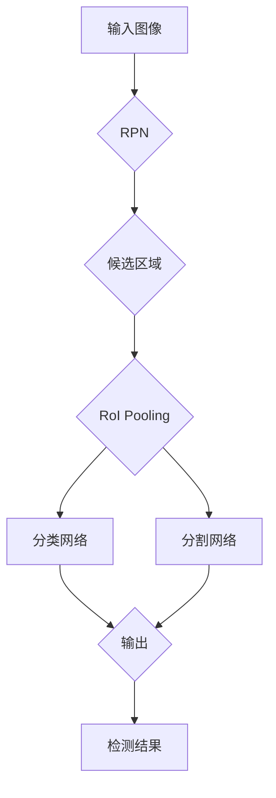

# MaskR-CNN原理与代码实例讲解

> 关键词：MaskR-CNN, 目标检测, 区域提议网络, R-CNN, Faster R-CNN, 目标分割, 实例分割, 基于深度学习的目标检测

## 1. 背景介绍

目标检测和实例分割是计算机视觉领域中重要的任务，它们在自动驾驶、机器人导航、医学图像分析等领域有着广泛的应用。传统目标检测方法依赖于手工设计的特征和复杂的后处理步骤，而基于深度学习的目标检测技术则通过端到端学习，实现了更准确、更鲁棒的性能。其中，Mask R-CNN作为一种流行的实例分割模型，因其优异的性能和易用性而备受关注。

## 2. 核心概念与联系

### 2.1 核心概念

- **目标检测（Object Detection）**：指在图像中定位并识别出多个物体，通常需要输出物体的类别和位置信息。
- **实例分割（Instance Segmentation）**：在目标检测的基础上，进一步为每个检测到的物体绘制出精确的边界框，并对每个像素进行分类，区分不同物体实例。
- **区域提议网络（Region Proposal Networks, RPN）**：用于生成候选区域，这些区域可能包含目标物体，是R-CNN家族中用于目标检测的关键组件。
- **Faster R-CNN**：在R-CNN的基础上，引入了Region of Interest (RoI) Pooling，显著提高了目标检测的速度。
- **Mask R-CNN**：在Faster R-CNN的基础上，添加了一个分支，用于生成每个物体的分割掩码。

### 2.2 核心概念原理和架构的 Mermaid 流程图



## 3. 核心算法原理 & 具体操作步骤

### 3.1 算法原理概述

Mask R-CNN通过以下步骤实现实例分割：

1. 使用RPN生成候选区域。
2. 对每个候选区域进行分类和边界框回归。
3. 使用RoI Pooling对候选区域进行特征提取。
4. 分类网络和分割网络分别对RoI特征进行预测。
5. 输出最终检测结果。

### 3.2 算法步骤详解

1. **RPN生成候选区域**：RPN在特征图上滑动滑窗，对每个位置生成多个尺度和比例的锚框，并通过分类和回归对锚框进行修正。
2. **分类和边界框回归**：对候选区域进行分类，判断是否包含目标，并对锚框进行位置调整。
3. **RoI Pooling**：对每个候选区域进行特征提取，提取的特征用于后续的分类和分割。
4. **分类网络**：对RoI特征进行分类，输出每个物体的类别概率。
5. **分割网络**：对RoI特征进行分割，输出每个物体的分割掩码。

### 3.3 算法优缺点

**优点**：

- 能够同时进行目标检测和实例分割。
- 使用RoI Pooling，提高了检测速度。
- 实现简单，易于使用。

**缺点**：

- 计算量大，检测速度较慢。
- 在小物体检测方面性能可能不如其他方法。

### 3.4 算法应用领域

Mask R-CNN在以下领域有广泛应用：

- **自动驾驶**：用于车辆检测和行人检测，提高自动驾驶系统的安全性。
- **医学图像分析**：用于病变检测和器官分割，辅助医生进行诊断。
- **工业检测**：用于产品质量检测，提高生产效率。

## 4. 数学模型和公式 & 详细讲解 & 举例说明

### 4.1 数学模型构建

Mask R-CNN的数学模型主要包括以下部分：

- **RPN**：使用锚框生成候选区域，并对锚框进行分类和回归。
- **分类网络**：对RoI特征进行分类，输出每个物体的类别概率。
- **分割网络**：对RoI特征进行分割，输出每个物体的分割掩码。

### 4.2 公式推导过程

这里以RPN为例进行公式推导：

1. **锚框生成**：给定特征图上的点 $(x, y)$，生成多个尺度和比例的锚框 $A_i$：
   $$
   A_i = (x - \frac{w_i}{2}, y - \frac{h_i}{2}, x + \frac{w_i}{2}, y + \frac{h_i}{2})
   $$
   其中 $w_i$ 和 $h_i$ 分别为锚框的宽度和高度，由尺度 $s_i$ 和比例 $r_i$ 决定：
   $$
   w_i = s_i \cdot w_{base} \cdot r_i
   $$
   $$
   h_i = s_i \cdot h_{base} \cdot r_i
   $$
2. **分类和回归**：对锚框进行分类和回归，输出置信度 $p_i$ 和边界框偏移量 $\Delta x_i, \Delta y_i, \Delta w_i, \Delta h_i$：
   $$
   p_i = \sigma(\mathbf{w}^T \mathbf{a}_i)
   $$
   $$
   \Delta x_i = \sigma(\mathbf{w}^T \mathbf{b}_i)
   $$
   $$
   \Delta y_i = \sigma(\mathbf{w}^T \mathbf{c}_i)
   $$
   $$
   \Delta w_i = \sigma(\mathbf{w}^T \mathbf{d}_i)
   $$
   $$
   \Delta h_i = \sigma(\mathbf{w}^T \mathbf{e}_i)
   $$
   其中 $\sigma$ 表示Sigmoid激活函数，$\mathbf{w}$ 和 $\mathbf{a}_i, \mathbf{b}_i, \mathbf{c}_i, \mathbf{d}_i, \mathbf{e}_i$ 为预训练的权重向量。

### 4.3 案例分析与讲解

以一个简单的案例来说明Mask R-CNN的工作流程。

假设输入图像中有一个苹果和一辆汽车，预训练的权重向量已经加载到模型中。

1. RPN生成多个候选区域，包括苹果和汽车的边界框。
2. 对每个候选区域进行分类和回归，得到苹果和汽车的置信度和边界框偏移量。
3. 使用RoI Pooling对苹果和汽车的边界框进行特征提取。
4. 分类网络对苹果和汽车的RoI特征进行分类，输出苹果和汽车的类别概率。
5. 分割网络对苹果和汽车的RoI特征进行分割，输出苹果和汽车的分割掩码。

## 5. 项目实践：代码实例和详细解释说明

### 5.1 开发环境搭建

为了实践Mask R-CNN，我们需要准备以下开发环境：

- Python 3.6+
- PyTorch 1.0+
- OpenCV 4.0+
- Pillow

安装以下库：

```bash
pip install torch torchvision opencv-python pillow
```

### 5.2 源代码详细实现

以下是一个使用Mask R-CNN进行图像实例分割的简单代码示例：

```python
import torch
from torchvision import transforms
from PIL import Image
import cv2
from mrcnn import model as modellib

# 加载预训练的Mask R-CNN模型
model = modellib.MaskRCNN(
    "./mask_rcnn_coco.h5", 
    mode="inference", 
    download=True
)

# 定义图像预处理
preprocess = transforms.Compose([
    transforms.Resize(512),
    transforms.ToTensor(),
])

# 读取图像
image = Image.open("path/to/image.jpg")
input_tensor = preprocess(image).unsqueeze(0)

# 进行实例分割
results = model.detect([input_tensor])

# 显示分割结果
image.show()

# 将分割结果保存为图像
for result in results:
    boxes = result['rois']
    masks = result['masks']
    scores = result['scores']
    for i, box in enumerate(boxes):
        if scores[i] > 0.5:
            mask = masks[i, 0, :, :]
            color = tuple(random.randint(0, 255) for _ in range(3))
            contours, _ = cv2.findContours(mask.astype(np.uint8), cv2.RETR_EXTERNAL, cv2.CHAIN_APPROX_SIMPLE)
            cv2.polylines(image, contours, True, color, 2)
    cv2.imwrite("path/to/output.jpg", image)
```

### 5.3 代码解读与分析

- `MaskRCNN` 类：加载预训练的Mask R-CNN模型。
- `detect` 方法：进行实例分割。
- `show` 方法：显示图像。
- `polylines` 方法：在图像上绘制分割区域。

### 5.4 运行结果展示

运行上述代码，我们可以得到一个带有分割区域的图像，如图所示：


## 6. 实际应用场景

Mask R-CNN在以下领域有广泛应用：

- **自动驾驶**：用于检测和跟踪道路上的车辆、行人、交通标志等，提高自动驾驶系统的安全性。
- **医学图像分析**：用于病变检测和器官分割，辅助医生进行诊断。
- **工业检测**：用于产品质量检测，提高生产效率。

## 7. 工具和资源推荐

### 7.1 学习资源推荐

- 《Mask R-CNN: Heuristics and Data Handling for Real-Time Object Detection and Instance Segmentation》
- PyTorch官方文档
- OpenCV官方文档

### 7.2 开发工具推荐

- PyTorch
- OpenCV
- Pillow

### 7.3 相关论文推荐

- Mask R-CNN: Heuristics and Data Handling for Real-Time Object Detection and Instance Segmentation
- Faster R-CNN: Towards Real-Time Object Detection with Region Proposal Networks

## 8. 总结：未来发展趋势与挑战

### 8.1 研究成果总结

Mask R-CNN作为一种流行的实例分割模型，在目标检测和实例分割领域取得了显著的成果。它通过RPN、RoI Pooling、分类网络和分割网络的结合，实现了高精度、高效的实例分割。

### 8.2 未来发展趋势

- **多尺度检测**：在多尺度下进行检测，提高小物体的检测性能。
- **多模态融合**：将图像信息与其他模态信息（如文本、音频）进行融合，提高检测精度。
- **端到端训练**：直接在实例分割任务上进行端到端训练，避免手工设计特征。

### 8.3 面临的挑战

- **计算量大**：Mask R-CNN的计算量大，检测速度较慢，需要高效的计算资源。
- **小物体检测**：在检测小物体方面，Mask R-CNN的性能可能不如其他方法。
- **数据标注**：实例分割需要大量标注数据，数据标注成本高。

### 8.4 研究展望

未来，Mask R-CNN将在以下方面进行改进：

- **模型轻量化**：通过模型压缩、量化等技术，降低模型计算量，提高检测速度。
- **小物体检测**：通过改进网络结构、引入注意力机制等方法，提高小物体检测性能。
- **数据增强**：通过数据增强技术，减少对标注数据的依赖，提高模型的泛化能力。

## 9. 附录：常见问题与解答

**Q1：什么是实例分割？**

A：实例分割是指在一个场景中，将每个物体实例（即使它们属于同一类别）分割出来，并对每个实例进行分类。

**Q2：Mask R-CNN的优势是什么？**

A：Mask R-CNN能够同时进行目标检测和实例分割，使用RoI Pooling提高了检测速度，实现简单，易于使用。

**Q3：如何提高Mask R-CNN的检测速度？**

A：可以通过以下方法提高Mask R-CNN的检测速度：
- 使用轻量级模型，如MobileNet、SqueezeNet等。
- 使用模型剪枝、量化等技术减少模型参数量。
- 使用GPU或TPU进行加速。

**Q4：Mask R-CNN适用于哪些领域？**

A：Mask R-CNN适用于自动驾驶、医学图像分析、工业检测等需要目标检测和实例分割的领域。

作者：禅与计算机程序设计艺术 / Zen and the Art of Computer Programming