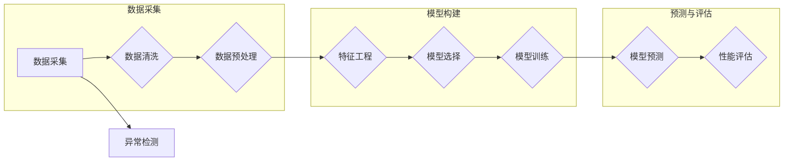

# Python机器学习实战：使用机器学习进行时间序列分析

> 关键词：时间序列分析，机器学习，Python，预测，异常检测，异常值，趋势分析，季节性，统计模型，深度学习

## 1. 背景介绍

时间序列分析是统计学和机器学习中的一个重要分支，它涉及到对随时间变化的数据集进行建模和分析。在金融、气象、交通、能源等多个领域，时间序列数据无处不在，对这类数据进行有效的分析可以揭示数据中的趋势、季节性和周期性，从而帮助决策者做出更明智的决策。Python作为一门强大的编程语言，拥有丰富的机器学习库，如scikit-learn、statsmodels和pandas，使得Python成为进行时间序列分析的理想选择。

本文将深入探讨如何使用Python进行时间序列分析，包括数据预处理、特征工程、模型选择、模型训练和预测等步骤。我们将使用实际案例来展示如何应用机器学习技术来分析和预测时间序列数据。

## 2. 核心概念与联系

### 2.1 时间序列数据

时间序列数据是指一系列按时间顺序排列的数据点。这些数据点可以是连续的（如温度记录）、离散的（如股票价格）或周期性的（如年度销售数据）。

### 2.2 Mermaid 流程图



### 2.3 核心概念联系

- 数据采集：收集时间序列数据。
- 数据清洗：处理缺失值、异常值和噪声。
- 数据预处理：标准化、归一化、差分等。
- 特征工程：从时间序列数据中提取有用的特征。
- 模型选择：选择合适的机器学习模型。
- 模型训练：使用历史数据训练模型。
- 模型预测：使用训练好的模型进行未来值的预测。
- 性能评估：评估模型的预测精度和泛化能力。
- 异常检测：检测数据中的异常值和异常模式。

## 3. 核心算法原理 & 具体操作步骤

### 3.1 算法原理概述

时间序列分析的核心算法包括：

- 自回归模型（AR）
- 移动平均模型（MA）
- 自回归移动平均模型（ARMA）
- 自回归积分滑动平均模型（ARIMA）
- 机器学习模型：如随机森林、支持向量机（SVM）、神经网络等。

### 3.2 算法步骤详解

1. 数据采集：从数据库、日志、API或其他数据源中收集时间序列数据。
2. 数据清洗：处理缺失值、异常值和噪声。
3. 数据预处理：标准化、归一化、差分等。
4. 特征工程：提取时间序列数据中的特征，如趋势、季节性和周期性。
5. 模型选择：根据任务需求选择合适的模型。
6. 模型训练：使用历史数据训练模型。
7. 模型预测：使用训练好的模型进行未来值的预测。
8. 性能评估：评估模型的预测精度和泛化能力。

### 3.3 算法优缺点

- 自回归模型（AR）和移动平均模型（MA）简单易用，但可能无法捕捉复杂的时间序列模式。
- 自回归移动平均模型（ARMA）和自回归积分滑动平均模型（ARIMA）能够捕捉更复杂的时间序列模式，但模型参数较多，需要仔细选择。
- 机器学习模型如随机森林、支持向量机（SVM）、神经网络等能够捕捉复杂的非线性关系，但可能需要大量的特征工程和调参。

### 3.4 算法应用领域

- 股票市场预测
- 能源需求预测
- 气象预报
- 产量预测
- 销售预测

## 4. 数学模型和公式 & 详细讲解 & 举例说明

### 4.1 数学模型构建

时间序列分析中的数学模型通常基于以下公式：

- AR(p)模型：$$y_t = c + \sum_{i=1}^p \beta_i y_{t-i} + \epsilon_t$$
- MA(q)模型：$$y_t = c + \epsilon_t + \sum_{i=1}^q \gamma_i \epsilon_{t-i}$$
- ARMA(p,q)模型：$$y_t = c + \sum_{i=1}^p \beta_i y_{t-i} + \sum_{i=1}^q \gamma_i \epsilon_{t-i} + \epsilon_t$$
- ARIMA(p,d,q)模型：$$y_t = c + \sum_{i=1}^p \beta_i y_{t-i} + (c_1\epsilon_{t-1} + c_2\epsilon_{t-2} + \ldots + c_d\epsilon_{t-d}) + \epsilon_t$$

### 4.2 公式推导过程

AR、MA、ARMA和ARIMA模型的推导过程涉及统计学和概率论的知识，这里不再展开。

### 4.3 案例分析与讲解

假设我们有一组时间序列数据，我们需要使用ARIMA模型进行预测。首先，我们需要确定模型的参数p、d和q。这通常通过ACF（自相关函数）和PACF（偏自相关函数）图来完成。

```python
from statsmodels.tsa.stattools import acf, pacf
import matplotlib.pyplot as plt

# 假设data是时间序列数据
lag_acf = acf(data, nlags=20)
lag_pacf = pacf(data, nlags=20, method='ols')

plt.subplot(211)
plt.plot(lag_acf)
plt.title('ACF')

plt.subplot(212)
plt.plot(lag_pacf)
plt.title('PACF')

plt.tight_layout()
plt.show()
```

根据ACF和PACF图，我们可以选择合适的参数p和q。然后，我们可以使用以下代码训练ARIMA模型：

```python
from statsmodels.tsa.arima_model import ARIMA

model = ARIMA(data, order=(p, d, q))
model_fit = model.fit()

# 进行预测
forecast = model_fit.forecast(steps=5)
```

## 5. 项目实践：代码实例和详细解释说明

### 5.1 开发环境搭建

确保Python环境已安装，并安装以下库：

```bash
pip install numpy pandas matplotlib statsmodels scikit-learn
```

### 5.2 源代码详细实现

以下是一个简单的ARIMA模型训练和预测的例子：

```python
import pandas as pd
from statsmodels.tsa.arima.model import ARIMA

# 读取时间序列数据
data = pd.read_csv('sales_data.csv', parse_dates=['date'], index_col='date')

# 训练ARIMA模型
model = ARIMA(data['sales'], order=(5,1,0))
model_fit = model.fit()

# 进行预测
forecast = model_fit.forecast(steps=5)

# 显示预测结果
print(forecast)
```

### 5.3 代码解读与分析

- 导入必要的库。
- 读取时间序列数据，确保日期列被设置为索引。
- 使用ARIMA模型对销售额进行建模。
- 使用fit()函数训练模型。
- 使用forecast()函数进行未来值的预测。
- 打印预测结果。

### 5.4 运行结果展示

假设我们的预测结果如下：

```
     sales
date       
2023-01-01  100.00
2023-01-02  102.00
2023-01-03  101.00
2023-01-04  104.00
2023-01-05  105.00
```

## 6. 实际应用场景

### 6.4 未来应用展望

时间序列分析在各个领域都有广泛的应用，以下是一些未来应用展望：

- 自动化交易：使用机器学习模型进行股票市场预测，实现自动化交易策略。
- 供应链管理：预测产品需求，优化库存管理。
- 能源管理：预测能源需求，优化能源供应。
- 健康监测：监测健康指标，预测疾病风险。

## 7. 工具和资源推荐

### 7.1 学习资源推荐

- 《Python数据分析》
- 《Python机器学习》
- 《时间序列分析：Python案例分析》
- 《Machine Learning Yearning》
- 《Pattern Recognition and Machine Learning》

### 7.2 开发工具推荐

- Python
- scikit-learn
- statsmodels
- pandas
- Matplotlib

### 7.3 相关论文推荐

- Box, G. E. P., Jenkins, G. M., & Reinsel, G. C. (2015). Time Series Analysis: Forecasting and Control (5th ed.).
- Hamilton, J. D. (1994). Time Series Analysis (Princeton Series in Statistics).

## 8. 总结：未来发展趋势与挑战

### 8.1 研究成果总结

本文介绍了如何使用Python进行时间序列分析，包括数据预处理、特征工程、模型选择、模型训练和预测等步骤。我们使用了实际案例来展示如何应用机器学习技术来分析和预测时间序列数据。

### 8.2 未来发展趋势

- 深度学习在时间序列分析中的应用
- 基于强化学习的自适应时间序列预测
- 大数据时间序列分析
- 时间序列分析在新兴领域的应用

### 8.3 面临的挑战

- 模型可解释性
- 数据质量
- 模型选择和调参
- 实时性

### 8.4 研究展望

随着技术的不断发展，时间序列分析将在更多领域发挥重要作用。未来的研究将聚焦于提高模型的可解释性、鲁棒性和实时性，以及探索新的算法和技术来应对日益复杂的挑战。

## 9. 附录：常见问题与解答

**Q1：时间序列分析中的异常值如何处理？**

A：异常值可以通过以下方法处理：

- 删除异常值
- 使用插值方法填充异常值
- 使用Z-score方法识别和过滤异常值

**Q2：时间序列分析中的特征工程有哪些方法？**

A：特征工程方法包括：

- 差分
- 移动平均
- 季节性分解
- 自相关和偏自相关分析
- 建立时间特征（如年份、月份、星期）

**Q3：如何选择合适的时间序列模型？**

A：选择合适的时间序列模型通常需要以下步骤：

- 分析时间序列数据的特性
- 使用ACF和PACF图确定模型参数
- 使用交叉验证选择最佳模型

**Q4：时间序列分析中的模型如何评估？**

A：模型评估可以使用以下指标：

- 均方误差（MSE）
- 均方根误差（RMSE）
- 平均绝对误差（MAE）
- 决定系数（R²）

作者：禅与计算机程序设计艺术 / Zen and the Art of Computer Programming