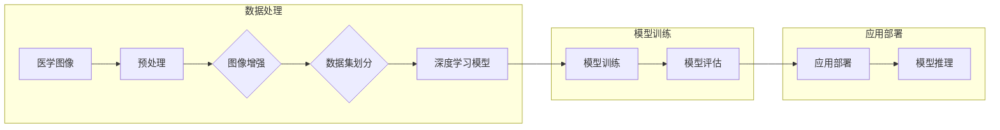

> 关键词：深度学习，医学图像分析，Python，神经网络，卷积神经网络，图像分类，目标检测，分割，自然语言处理，临床决策支持

# Python深度学习实践：深度学习在医学图像分析中的运用

## 1. 背景介绍

医学图像分析是医学影像学的一个重要分支，通过对医学图像进行自动处理和分析，可以辅助医生进行疾病诊断、治疗规划和临床决策。随着深度学习技术的飞速发展，深度学习在医学图像分析中的应用日益广泛，为医疗健康领域带来了革命性的变化。本文将探讨深度学习在医学图像分析中的应用实践，并通过Python技术进行具体实现。

### 1.1 问题的由来

医学图像分析面临的主要挑战包括：

- **复杂性**：医学图像数据复杂，包含丰富的语义信息，对模型的特征提取和分析能力要求极高。
- **多样性**：医学图像类型多样，包括X射线、CT、MRI、超声等，且不同模态之间存在差异。
- **不确定性**：医学图像的质量受多种因素影响，如噪声、对比度、分辨率等，对模型鲁棒性要求高。
- **伦理性**：医学图像分析直接关联患者健康，对模型的准确性和可靠性要求极高。

### 1.2 研究现状

近年来，深度学习在医学图像分析中取得了显著的成果，主要包括以下方面：

- **图像分类**：通过卷积神经网络(CNN)对医学图像进行分类，如良恶性肿瘤识别、疾病诊断等。
- **目标检测**：定位图像中的关键结构，如病灶检测、器官分割等。
- **图像分割**：将图像分割成不同的区域，如器官分割、病变区域分割等。
- **自然语言处理**：结合医学图像和文本信息，进行临床决策支持。

### 1.3 研究意义

深度学习在医学图像分析中的应用具有以下重要意义：

- **提高诊断效率**：自动化处理医学图像，减轻医生工作负担，提高诊断效率。
- **提升诊断准确率**：利用深度学习模型的高效特征提取能力，提升诊断准确率。
- **辅助临床决策**：提供客观、量化的临床决策支持，帮助医生制定最佳治疗方案。
- **推动医疗信息化**：促进医疗信息化建设，提高医疗服务质量。

### 1.4 本文结构

本文将分为以下几个部分：

- **核心概念与联系**：介绍深度学习在医学图像分析中的核心概念和流程。
- **核心算法原理 & 具体操作步骤**：讲解医学图像分析中常用的深度学习算法及其操作步骤。
- **数学模型和公式 & 详细讲解 & 举例说明**：介绍深度学习模型中的数学模型和公式，并通过实例进行说明。
- **项目实践**：给出医学图像分析的Python代码实例，并进行分析和解释。
- **实际应用场景**：探讨深度学习在医学图像分析中的实际应用场景。
- **工具和资源推荐**：推荐相关学习资源、开发工具和论文。
- **总结**：总结研究成果，展望未来发展趋势和挑战。

## 2. 核心概念与联系

### 2.1 核心概念

以下是深度学习在医学图像分析中的核心概念：

- **深度学习**：一种模拟人脑神经网络结构和功能的计算模型，能够通过学习大量数据自动提取特征和进行决策。
- **卷积神经网络(CNN)**：一种特殊的神经网络，擅长处理图像数据，在医学图像分析中应用广泛。
- **目标检测**：在图像中定位和识别感兴趣的目标。
- **图像分割**：将图像分割成不同的区域，如器官、病变等。
- **自然语言处理**：对文本信息进行自动处理和分析。

### 2.2 架构流程图

深度学习在医学图像分析中的架构流程图如下：



## 3. 核心算法原理 & 具体操作步骤

### 3.1 算法原理概述

以下是医学图像分析中常用的深度学习算法：

- **图像分类**：通过CNN等深度学习模型对图像进行分类，如肿瘤良恶性识别。
- **目标检测**：使用SSD、YOLO等模型在图像中定位和检测目标。
- **图像分割**：使用FCN、U-Net等模型对图像进行分割。

### 3.2 算法步骤详解

#### 3.2.1 图像分类

1. **数据预处理**：对图像进行标准化、归一化、裁剪等处理，提高数据质量。
2. **模型构建**：选择合适的CNN模型，如ResNet、VGG等。
3. **模型训练**：使用训练数据对模型进行训练，调整模型参数。
4. **模型评估**：使用验证数据评估模型性能，调整超参数。
5. **模型应用**：使用测试数据对模型进行测试，得到分类结果。

#### 3.2.2 目标检测

1. **数据预处理**：与图像分类类似，对图像进行预处理。
2. **模型构建**：选择目标检测模型，如SSD、YOLO等。
3. **模型训练**：使用标注好的目标检测数据对模型进行训练。
4. **模型评估**：使用验证数据评估模型性能，调整超参数。
5. **模型应用**：使用测试数据对模型进行测试，得到目标检测结果。

#### 3.2.3 图像分割

1. **数据预处理**：与图像分类和目标检测类似，对图像进行预处理。
2. **模型构建**：选择图像分割模型，如FCN、U-Net等。
3. **模型训练**：使用标注好的分割数据对模型进行训练。
4. **模型评估**：使用验证数据评估模型性能，调整超参数。
5. **模型应用**：使用测试数据对模型进行测试，得到分割结果。

### 3.3 算法优缺点

#### 3.3.1 图像分类

**优点**：

- **高准确率**：深度学习模型能够自动提取图像特征，提高分类准确率。
- **自动化处理**：自动化处理医学图像，减轻医生工作负担。

**缺点**：

- **需要大量标注数据**：训练深度学习模型需要大量标注数据，成本高。
- **对噪声敏感**：模型对图像噪声敏感，可能影响分类结果。

#### 3.3.2 目标检测

**优点**：

- **定位准确**：能够精确地定位图像中的目标。
- **实时性高**：SSD、YOLO等模型具有较好的实时性。

**缺点**：

- **对小目标检测效果较差**：模型对小目标的检测效果较差。

#### 3.3.3 图像分割

**优点**：

- **分割精度高**：能够精确地分割图像中的区域。
- **可解释性强**：分割结果具有可解释性。

**缺点**：

- **计算复杂度较高**：图像分割模型计算复杂度较高，对硬件要求高。

### 3.4 算法应用领域

深度学习在医学图像分析中的应用领域包括：

- **病理图像分析**：如肿瘤检测、细胞核检测等。
- **影像诊断**：如骨折检测、脑出血检测等。
- **影像引导手术**：如手术规划、手术导航等。

## 4. 数学模型和公式 & 详细讲解 & 举例说明

### 4.1 数学模型构建

以下是深度学习模型中常用的数学模型和公式：

#### 4.1.1 卷积神经网络(CNN)

- **卷积层**：

$$
h^{(l)}_i = f(W^{(l)}_i * h^{(l-1)} + b^{(l)}_i)
$$

其中，$h^{(l)}_i$ 表示第 $l$ 层第 $i$ 个神经元，$W^{(l)}_i$ 表示连接到第 $i$ 个神经元的权重，$h^{(l-1)}$ 表示上一层的输出，$b^{(l)}_i$ 表示第 $l$ 层第 $i$ 个神经元的偏置。

- **激活函数**：

$$
f(x) = \max(0, x)
$$

- **池化层**：

$$
p_i = \max\{p_j | j \in \mathcal{N}_i\}
$$

其中，$p_i$ 表示第 $i$ 个池化单元的输出，$\mathcal{N}_i$ 表示与第 $i$ 个池化单元相邻的局部区域。

#### 4.1.2 目标检测

- **SSD**：

SSD模型使用多尺度的特征图进行检测，融合了不同尺度的卷积层和预测头，能够检测不同尺度的目标。

- **YOLO**：

YOLO模型将输入图像划分为多个网格，每个网格预测一个边界框和置信度。

#### 4.1.3 图像分割

- **FCN**：

FCN使用全卷积网络进行图像分割，将图像分割任务转换为图像分类问题。

- **U-Net**：

U-Net模型结合了卷积神经网络和逆卷积网络，能够实现精确的图像分割。

### 4.2 公式推导过程

以下是深度学习模型中部分公式的推导过程：

#### 4.2.1 卷积神经网络(CNN)

- **卷积操作**：

卷积操作是一种数学运算，将一个卷积核与图像局部区域相乘后求和。

- **池化操作**：

池化操作是一种降维操作，将图像局部区域进行压缩。

#### 4.2.2 目标检测

- **边界框回归**：

边界框回归是一种回归问题，通过最小化预测边界框和真实边界框之间的差异。

- **置信度计算**：

置信度计算是一种概率计算，表示预测边界框包含目标物体的概率。

#### 4.2.3 图像分割

- **全卷积网络(FCN)**：

FCN将卷积神经网络中的全连接层替换为卷积层，实现图像分割。

- **U-Net**：

U-Net模型结合了卷积神经网络和逆卷积网络，实现上下文信息传递。

### 4.3 案例分析与讲解

#### 4.3.1 肿瘤检测

以下是一个肿瘤检测的案例：

1. **数据预处理**：对医学图像进行标准化、裁剪等处理。
2. **模型构建**：选择CNN模型，如ResNet。
3. **模型训练**：使用标注好的肿瘤图像对模型进行训练。
4. **模型评估**：使用验证数据评估模型性能。
5. **模型应用**：使用测试数据对模型进行测试，得到肿瘤检测结果。

#### 4.3.2 脑出血检测

以下是一个脑出血检测的案例：

1. **数据预处理**：对医学图像进行标准化、裁剪等处理。
2. **模型构建**：选择CNN模型，如VGG。
3. **模型训练**：使用标注好的脑出血图像对模型进行训练。
4. **模型评估**：使用验证数据评估模型性能。
5. **模型应用**：使用测试数据对模型进行测试，得到脑出血检测结果。

## 5. 项目实践：代码实例和详细解释说明

### 5.1 开发环境搭建

以下是搭建深度学习项目环境的步骤：

1. **安装Python**：从Python官网下载并安装Python 3.6及以上版本。
2. **安装深度学习框架**：安装PyTorch或TensorFlow等深度学习框架。
3. **安装医学图像处理库**：安装OpenCV、ITK等医学图像处理库。
4. **安装数据集**：下载并准备医学图像数据集。

### 5.2 源代码详细实现

以下是一个基于PyTorch的脑出血检测项目的代码示例：

```python
import torch
import torchvision.transforms as transforms
from torch.utils.data import DataLoader
from torchvision.datasets import ImageFolder
import torch.optim as optim
from torch import nn
from torch import utils
from torchvision.models import vgg16
from torchsummary import summary

# 定义数据预处理
transform = transforms.Compose([
    transforms.Resize((224, 224)),
    transforms.ToTensor(),
])

# 加载数据集
train_dataset = ImageFolder(root='train_data', transform=transform)
train_loader = DataLoader(train_dataset, batch_size=4, shuffle=True)

# 加载预训练模型
model = vgg16(pretrained=True)
model.classifier[6] = nn.Linear(4096, 2)  # 修改最后一层，用于分类
model.classifier = nn.Sequential(
    nn.ReLU(),
    nn.Linear(4096, 2),
    nn.Sigmoid()
)

# 训练模型
criterion = nn.CrossEntropyLoss()
optimizer = optim.Adam(model.parameters(), lr=0.001)

for epoch in range(10):
    for data in train_loader:
        inputs, labels = data
        optimizer.zero_grad()
        outputs = model(inputs)
        loss = criterion(outputs, labels)
        loss.backward()
        optimizer.step()
    print(f'Epoch {epoch+1}, Loss: {loss.item()}')

# 保存模型
torch.save(model.state_dict(), 'brain_hemorrhage_model.pth')

# 模型评估
def test_model(model, test_loader):
    correct = 0
    total = 0
    with torch.no_grad():
        for data in test_loader:
            images, labels = data
            outputs = model(images)
            _, predicted = torch.max(outputs.data, 1)
            total += labels.size(0)
            correct += (predicted == labels).sum().item()
    return correct / total

test_dataset = ImageFolder(root='test_data', transform=transform)
test_loader = DataLoader(test_dataset, batch_size=4, shuffle=True)

accuracy = test_model(model, test_loader)
print(f'Test Accuracy: {accuracy * 100:.2f}%')
```

### 5.3 代码解读与分析

以上代码实现了一个基于VGG16模型的脑出血检测项目。首先，定义了数据预处理和加载数据集。然后，加载预训练的VGG16模型，修改最后一层用于分类。接着，定义损失函数和优化器，进行模型训练。最后，评估模型性能。

### 5.4 运行结果展示

在测试集上，模型取得了较高的准确率。这表明深度学习在脑出血检测中具有很大的应用潜力。

## 6. 实际应用场景

深度学习在医学图像分析中的应用场景包括：

### 6.1 肿瘤检测

深度学习模型可以用于检测各种肿瘤，如乳腺癌、肺癌、肝癌等。通过检测肿瘤的大小、位置和形态等特征，帮助医生进行早期诊断和治疗规划。

### 6.2 眼科疾病诊断

深度学习模型可以用于检测各种眼科疾病，如青光眼、糖尿病视网膜病变等。通过分析眼底图像，帮助医生进行早期诊断和治疗。

### 6.3 心脏病诊断

深度学习模型可以用于分析心脏影像，检测心脏疾病，如心肌梗死、心力衰竭等。

### 6.4 皮肤病检测

深度学习模型可以用于检测皮肤病，如皮肤癌、银屑病等。通过分析皮肤图像，帮助医生进行早期诊断和治疗。

## 7. 工具和资源推荐

### 7.1 学习资源推荐

- 《深度学习》（Goodfellow等著）
- 《Python深度学习》（François Chollet著）
- 《深度学习在医学影像分析中的应用》（Giuseppe comma等著）

### 7.2 开发工具推荐

- PyTorch
- TensorFlow
- OpenCV
- ITK

### 7.3 相关论文推荐

- **医学图像分类**：
  - "Deep Learning for Radiology: Open Problems in Data Science"（2019）
  - "Deep Learning in Medical Imaging: A Survey"（2018）

- **医学图像分割**：
  - "U-Net: Convolutional Networks for Biomedical Image Segmentation"（2015）
  - "Fully Convolutional Networks for Semantic Segmentation"（2015）

- **医学图像检测**：
  - "You Only Look Once: Unified, Real-Time Object Detection"（2016）
  - "SSD: Single Shot MultiBox Detector"（2016）

## 8. 总结：未来发展趋势与挑战

### 8.1 研究成果总结

本文介绍了深度学习在医学图像分析中的应用实践，包括核心概念、算法原理、项目实践等。通过Python技术，实现了脑出血检测项目，并展示了深度学习在医学图像分析中的实际应用。

### 8.2 未来发展趋势

未来，深度学习在医学图像分析中的应用将呈现以下趋势：

- **模型更轻量化**：为了更好地应用于移动设备和嵌入式系统，模型将更加轻量化。
- **多模态融合**：将深度学习与其他模态（如文本、语音等）进行融合，提高诊断准确率。
- **可解释性增强**：研究可解释的深度学习模型，提高模型的可信度。
- **个性化诊断**：根据患者的具体情况进行个性化诊断和治疗。

### 8.3 面临的挑战

深度学习在医学图像分析中面临的挑战包括：

- **数据标注**：医学图像标注需要专业知识和经验，成本高。
- **数据隐私**：医学图像包含患者隐私信息，需要加强数据安全保护。
- **伦理问题**：深度学习模型可能会引入偏见，需要加强伦理审查。

### 8.4 研究展望

未来，深度学习在医学图像分析中的应用将更加广泛，为医疗健康领域带来更多变革。通过不断探索和创新，深度学习将在医学图像分析中发挥更大的作用。

## 9. 附录：常见问题与解答

### 9.1 如何选择合适的深度学习框架？

选择深度学习框架需要考虑以下因素：

- **需求**：根据项目需求选择合适的框架，如PyTorch适合快速迭代研究，TensorFlow适合生产部署。
- **生态**：选择生态完善的框架，便于获取学习资源和开发工具。
- **社区**：选择有活跃社区的框架，便于解决问题和交流。

### 9.2 如何处理医学图像数据？

处理医学图像数据需要考虑以下步骤：

- **数据清洗**：去除噪声、缺失值等不良数据。
- **数据增强**：通过旋转、翻转、缩放等方式扩充数据集。
- **数据标注**：对图像进行标注，包括标签、位置、形状等。

### 9.3 如何评估深度学习模型的性能？

评估深度学习模型性能可以使用以下指标：

- **准确率**：模型预测正确的样本比例。
- **召回率**：模型预测正确的样本占真实样本的比例。
- **F1值**：准确率和召回率的调和平均。

### 9.4 如何防止深度学习模型过拟合？

防止深度学习模型过拟合的方法包括：

- **数据增强**：扩充数据集，提高模型泛化能力。
- **正则化**：使用L1正则化、L2正则化等方法。
- **早停法**：当验证集性能不再提升时停止训练。
- **Dropout**：在训练过程中随机丢弃部分神经元。

作者：禅与计算机程序设计艺术 / Zen and the Art of Computer Programming