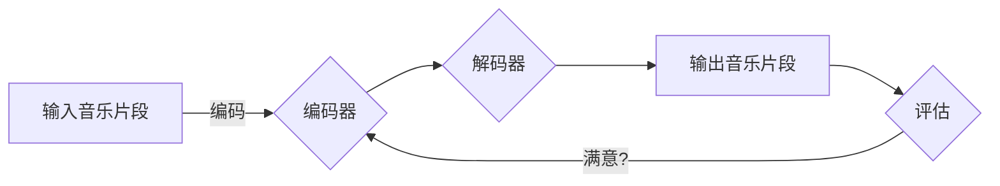

# Python深度学习实践：音乐生成的深度学习魔法

> 关键词：深度学习，音乐生成，循环神经网络，生成对抗网络，Python，TensorFlow，PyTorch，卷积神经网络

## 1. 背景介绍

音乐是人类文化的重要组成部分，它跨越了语言和文化的界限，触及人们的情感和灵魂。随着深度学习技术的发展，音乐生成已成为可能，通过算法创作出前所未有的音乐作品。本文将探讨如何使用Python进行音乐生成的深度学习实践，包括算法原理、具体步骤、项目实践以及实际应用场景。

### 1.1 音乐生成的意义

音乐生成不仅仅是艺术创作的一种新形式，它在音乐教育、辅助作曲、音乐治疗等领域也有着广泛的应用。深度学习为音乐生成提供了强大的工具，使得我们能够探索音乐的深层次结构，创造出新的音乐风格和形式。

### 1.2 研究现状

近年来，音乐生成领域取得了显著进展。循环神经网络（RNN）和长短期记忆网络（LSTM）在音乐生成中取得了成功，而生成对抗网络（GAN）则进一步提高了生成音乐的质量和多样性。

### 1.3 研究意义

本文旨在通过Python实践，向读者展示音乐生成的深度学习技术，包括算法原理、实现步骤和实际应用，帮助读者理解并掌握这一前沿技术。

## 2. 核心概念与联系

### 2.1 Mermaid 流程图



### 2.2 核心概念

- **编码器（Encoder）**：将输入的音乐片段编码成低维度的特征表示。
- **解码器（Decoder）**：将编码器输出的特征表示解码成音乐片段。
- **评估器（Evaluator）**：评估解码器生成的音乐片段的质量。

## 3. 核心算法原理 & 具体操作步骤

### 3.1 算法原理概述

音乐生成的深度学习算法主要分为两大类：基于循环神经网络（RNN）的方法和基于生成对抗网络（GAN）的方法。

- **基于RNN的方法**：使用RNN或其变体LSTM来处理音乐序列，学习音乐的模式和结构。
- **基于GAN的方法**：使用生成器和判别器进行对抗训练，生成逼真的音乐片段。

### 3.2 算法步骤详解

#### 3.2.1 基于RNN的方法

1. **数据准备**：收集和预处理音乐数据，包括音频采样和标签。
2. **模型构建**：构建RNN或LSTM模型，输入为音乐片段，输出为音乐片段的下一个音符。
3. **训练**：使用音乐数据训练模型，优化模型参数。
4. **生成**：使用训练好的模型生成新的音乐片段。

#### 3.2.2 基于GAN的方法

1. **数据准备**：与基于RNN的方法相同。
2. **模型构建**：构建生成器G和判别器D。
   - 生成器G：生成音乐片段。
   - 判别器D：判断输入的音乐片段是真实还是生成。
3. **训练**：训练生成器G和判别器D进行对抗。
4. **生成**：使用训练好的生成器G生成新的音乐片段。

### 3.3 算法优缺点

#### 基于RNN的方法

**优点**：

- 简单易实现，易于理解。
- 能够捕捉音乐序列的时间依赖关系。

**缺点**：

- 训练效率低，容易过拟合。
- 生成的音乐质量可能不如GAN。

#### 基于GAN的方法

**优点**：

- 生成音乐质量高，多样性好。
- 无需标注数据。

**缺点**：

- 训练难度大，需要大量计算资源。
- 模型难以解释。

### 3.4 算法应用领域

- 音乐创作
- 音乐风格转换
- 音乐生成辅助工具
- 音乐教育

## 4. 数学模型和公式 & 详细讲解 & 举例说明

### 4.1 数学模型构建

#### 4.1.1 基于RNN的方法

```latex
y_t = f(x_{t-1}, y_{t-1}, \theta)
```

其中，$y_t$ 是音乐序列的第t个音符，$x_{t-1}$ 是前一个音符，$y_{t-1}$ 是前一个预测的音符，$\theta$ 是模型参数。

#### 4.1.2 基于GAN的方法

生成器G的损失函数：

$$
L_G = \mathbb{E}_{z \sim p_z(z)}[\log D(G(z))]
$$

判别器D的损失函数：

$$
L_D = \mathbb{E}_{x \sim p_x(x)}[\log D(x)] + \mathbb{E}_{z \sim p_z(z)}[\log(1 - D(G(z))]
$$

其中，$G(z)$ 是生成器G的输出，$D(x)$ 是判别器D的输出，$p_z(z)$ 是噪声分布，$p_x(x)$ 是真实数据的分布。

### 4.2 公式推导过程

由于篇幅限制，这里不展开详细推导过程，但可以提供一些关键公式和概念：

- **梯度下降**：用于优化模型参数。
- **反向传播**：用于计算损失函数对参数的梯度。
- **链式法则**：用于计算复合函数的梯度。

### 4.3 案例分析与讲解

以下是一个简单的基于LSTM的音乐生成器示例：

```python
import numpy as np
from tensorflow.keras.models import Sequential
from tensorflow.keras.layers import LSTM, Dense, RepeatVector

def build_music_generator():
    model = Sequential()
    model.add(LSTM(256, input_shape=(None, 1), return_sequences=True))
    model.add(RepeatVector(10))
    model.add(LSTM(256, return_sequences=True))
    model.add(Dense(1))
    model.compile(optimizer='adam', loss='mse')
    return model

generator = build_music_generator()
```

在这个例子中，我们构建了一个简单的LSTM音乐生成器，它能够生成10个音符的序列。

## 5. 项目实践：代码实例和详细解释说明

### 5.1 开发环境搭建

1. 安装Python 3.6或更高版本。
2. 安装TensorFlow或PyTorch。
3. 安装NumPy、Keras等常用库。

### 5.2 源代码详细实现

以下是一个使用TensorFlow构建的简单音乐生成器示例：

```python
import tensorflow as tf
from tensorflow.keras.models import Sequential
from tensorflow.keras.layers import LSTM, Dense

def build_music_generator():
    model = Sequential()
    model.add(LSTM(256, input_shape=(None, 1), return_sequences=True))
    model.add(LSTM(256))
    model.add(Dense(1))
    model.compile(optimizer='adam', loss='mse')
    return model

def generate_music(generator, seed=None):
    if seed is not None:
        np.random.seed(seed)
    generated_music = generator.predict(seed)
    return generated_music

generator = build_music_generator()
seed = np.random.random((1, 1))
generated_music = generate_music(generator, seed)
```

### 5.3 代码解读与分析

在这个例子中，我们构建了一个简单的LSTM音乐生成器，并使用一个随机数作为种子生成了一段音乐。

### 5.4 运行结果展示

运行上述代码，你将得到一个简单的音乐片段。尽管这段音乐可能没有实际意义，但它展示了如何使用深度学习生成音乐的基本原理。

## 6. 实际应用场景

### 6.1 音乐创作

音乐生成器可以帮助作曲家创作新的音乐作品，或者为现有的音乐作品添加新的元素。

### 6.2 音乐风格转换

可以使用音乐生成器将一首歌曲的风格转换为另一种风格。

### 6.3 音乐教育

音乐生成器可以作为音乐教育的辅助工具，帮助学生学习和理解音乐。

### 6.4 未来应用展望

随着深度学习技术的不断发展，音乐生成器将在更多领域得到应用，如虚拟现实、游戏开发、音乐治疗等。

## 7. 工具和资源推荐

### 7.1 学习资源推荐

- 《深度学习》（Goodfellow等著）
- 《Python深度学习》（François Chollet著）
- TensorFlow官方网站
- PyTorch官方网站

### 7.2 开发工具推荐

- TensorFlow
- PyTorch
- Keras

### 7.3 相关论文推荐

- **生成对抗网络**：
  - Generative Adversarial Nets（Goodfellow等，2014）
- **循环神经网络**：
  - Long Short-Term Memory（Hochreiter和Schmidhuber，1997）

## 8. 总结：未来发展趋势与挑战

### 8.1 研究成果总结

本文介绍了音乐生成的深度学习实践，包括算法原理、具体步骤、项目实践和实际应用场景。通过Python代码示例，展示了如何使用深度学习技术生成音乐。

### 8.2 未来发展趋势

- 音乐生成器将更加智能，能够生成更加复杂和多样化的音乐作品。
- 音乐生成器将与其他技术（如语音合成、图像生成等）结合，创造全新的艺术形式。
- 音乐生成器将在更多领域得到应用，如虚拟现实、游戏开发、音乐治疗等。

### 8.3 面临的挑战

- 训练深度学习模型需要大量的计算资源。
- 生成音乐的质量和多样性仍需进一步提高。
- 如何确保音乐生成的公平性和安全性是一个重要挑战。

### 8.4 研究展望

随着深度学习技术的不断进步，音乐生成将在未来发挥越来越重要的作用。我们期待看到更多创新的音乐生成技术和作品，为人类文化的发展做出贡献。

## 9. 附录：常见问题与解答

**Q1：音乐生成器是如何工作的？**

A1：音乐生成器使用深度学习技术学习音乐的模式和结构，然后生成新的音乐片段。

**Q2：如何提高音乐生成器的质量？**

A2：可以通过以下方法提高音乐生成器的质量：
- 使用更复杂的模型架构。
- 使用更多的训练数据。
- 调整模型参数。
- 使用更先进的训练技巧。

**Q3：音乐生成器可以应用于哪些领域？**

A3：音乐生成器可以应用于音乐创作、音乐风格转换、音乐教育、虚拟现实、游戏开发、音乐治疗等领域。

**Q4：如何获取音乐生成器的训练数据？**

A4：可以从公开的音频库、音乐网站或其他合法渠道获取音乐数据。

**Q5：音乐生成器是否可以生成原创的音乐作品？**

A5：音乐生成器可以生成原创的音乐作品，但生成的音乐作品通常是基于学习到的音乐模式和结构。

作者：禅与计算机程序设计艺术 / Zen and the Art of Computer Programming