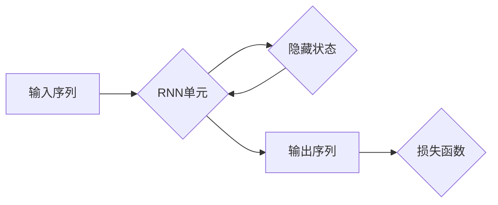

# Recurrent Neural Networks (RNN)原理与代码实例讲解

> 关键词：循环神经网络，RNN，时间序列预测，序列建模，长短期记忆网络，LSTM，门控循环单元

## 1. 背景介绍

序列建模在自然语言处理、语音识别、时间序列预测等领域扮演着至关重要的角色。传统的神经网络在处理序列数据时往往表现不佳，因为它们无法捕捉序列中的时间依赖关系。循环神经网络（Recurrent Neural Networks，RNN）的出现解决了这一难题，它能够有效地处理序列数据，并在多个领域取得了显著的成果。本文将深入探讨RNN的原理，并通过代码实例对其进行讲解。

## 2. 核心概念与联系

### 2.1 RNN概述

RNN是一种神经网络，它能够处理序列数据，即输入数据由一系列的元素组成，如时间序列数据或文本数据。RNN的核心思想是利用循环来存储并利用之前的信息，使得模型能够捕捉序列中的时间依赖关系。

### 2.2 Mermaid流程图

以下是RNN工作原理的Mermaid流程图：



### 2.3 RNN与LSTM的关系

长短期记忆网络（Long Short-Term Memory，LSTM）是一种特殊的RNN结构，它通过引入门控机制来解决传统RNN的梯度消失问题，使得模型能够更好地学习长期依赖关系。

## 3. 核心算法原理 & 具体操作步骤

### 3.1 算法原理概述

RNN的基本结构包括输入层、隐藏层和输出层。输入层接收序列数据，隐藏层存储长期状态，输出层生成序列输出。

### 3.2 算法步骤详解

1. **输入层**：将序列数据输入到RNN单元。
2. **隐藏层**：隐藏层中的神经元使用激活函数处理输入数据，并更新隐藏状态。
3. **输出层**：根据隐藏状态生成序列输出。
4. **损失函数**：计算预测输出与真实输出之间的差异，并更新模型参数。

### 3.3 算法优缺点

#### 优点：

- 能够处理序列数据，捕捉时间依赖关系。
- 结构简单，易于实现。

#### 缺点：

- 梯度消失问题：在反向传播过程中，梯度可能会消失，导致模型难以学习长期依赖关系。
- 计算效率低：由于循环结构，RNN的计算效率较低。

### 3.4 算法应用领域

- 自然语言处理：文本分类、情感分析、机器翻译等。
- 语音识别：语音识别、语音合成等。
- 时间序列预测：股票价格预测、天气预测等。

## 4. 数学模型和公式 & 详细讲解 & 举例说明

### 4.1 数学模型构建

RNN的数学模型可以表示为：

$$
h_t = \tanh(W_{ih}x_t + W_{hh}h_{t-1} + b_h)
$$

$$
y_t = W_{oh}h_t + b_o
$$

其中，$x_t$是输入序列中的第$t$个元素，$h_t$是隐藏状态，$y_t$是输出序列中的第$t$个元素，$W_{ih}$、$W_{hh}$、$W_{oh}$是连接权重，$b_h$、$b_o$是偏置项。

### 4.2 公式推导过程

RNN的推导过程涉及到前向传播和反向传播两个步骤。在前向传播过程中，计算隐藏状态和输出；在反向传播过程中，计算梯度并更新模型参数。

### 4.3 案例分析与讲解

以下是一个简单的RNN模型，用于预测下一个数字：

```python
import numpy as np

# 定义RNN模型
class SimpleRNN:
    def __init__(self, input_size, hidden_size, output_size):
        self.hidden_size = hidden_size
        self.Wxh = np.random.randn(hidden_size, input_size)
        self.Whh = np.random.randn(hidden_size, hidden_size)
        self.Why = np.random.randn(output_size, hidden_size)
        self.bh = np.zeros((hidden_size, 1))
        self.bo = np.zeros((output_size, 1))

    def forward(self, x):
        h = np.tanh(np.dot(self.Wxh, x) + np.dot(self.Whh, self.h) + self.bh)
        y = np.dot(self.Why, h) + self.bo
        self.h = h
        return y

    def backward(self, x, y, dy):
        dx = np.dot(self.Why.T, dy)
        dh = np.dot(self.Whh.T, dy) + np.dot(self.Wxh.T, x - np.dot(self.Whh, self.h))
        dWxh = np.dot(dh, x.T)
        dWhh = np.dot(dh, self.h.T)
        dWhy = np.dot(dy, self.h.T)
        dbh = np.sum(dh, axis=1, keepdims=True)
        dbo = np.sum(dy, axis=1, keepdims=True)
        dWhh += np.dot(self.h * (1 - self.h), self.Whh.T)
        return [dWxh, dWhh, dWhy, dbh, dbo]

    def train(self, x, y, epochs=5000):
        for epoch in range(epochs):
            for i in range(len(x)):
                dy = y[i] - self.forward(x[i])
                [dWxh, dWhh, dWhy, dbh, dbo] = self.backward(x[i], y[i], dy)
                self.Wxh -= dWxh
                self.Whh -= dWhh
                self.Why -= dWhy
                self.bh -= dbh
                self.bo -= dbo

    def predict(self, x):
        return self.forward(x)

# 初始化模型
input_size = 1
hidden_size = 20
output_size = 1
model = SimpleRNN(input_size, hidden_size, output_size)

# 训练模型
x = np.linspace(0, 10, 100).reshape(-1, 1)
y = np.sin(x).reshape(-1, 1)
model.train(x, y, epochs=1000)

# 预测
x_test = np.linspace(0, 10, 100).reshape(-1, 1)
y_pred = model.predict(x_test)
```

在上面的代码中，我们定义了一个简单的RNN模型，它使用正弦函数作为真实输出，并尝试通过反向传播学习输入和输出之间的关系。

## 5. 项目实践：代码实例和详细解释说明

### 5.1 开发环境搭建

为了运行下面的代码实例，您需要一个支持Python 3.5及以上版本的Python环境。以下是必要的安装命令：

```bash
pip install numpy
pip install matplotlib
```

### 5.2 源代码详细实现

以下是一个使用Keras实现RNN的简单示例：

```python
import numpy as np
from keras.models import Sequential
from keras.layers import SimpleRNN, Dense

# 生成模拟数据
x = np.linspace(0, 10, 100).reshape(-1, 1)
y = np.sin(x).reshape(-1, 1)

# 切分数据为训练集和测试集
train_size = int(len(x) * 0.7)
x_train, x_test = x[:train_size], x[train_size:]
y_train, y_test = y[:train_size], y[train_size:]

# 定义RNN模型
model = Sequential()
model.add(SimpleRNN(units=50, input_shape=(x_train.shape[1], 1)))
model.add(Dense(units=1))

# 编译模型
model.compile(optimizer='adam', loss='mean_squared_error')

# 训练模型
model.fit(x_train, y_train, epochs=100, batch_size=10, validation_data=(x_test, y_test))

# 预测
y_pred = model.predict(x_test)

# 可视化结果
import matplotlib.pyplot as plt

plt.plot(x_test, y_pred, label='Predicted')
plt.plot(x_test, y_test, label='Actual')
plt.legend()
plt.show()
```

### 5.3 代码解读与分析

在上面的代码中，我们首先导入了必要的库，并生成了模拟数据。然后，我们使用Keras定义了一个RNN模型，它包含一个SimpleRNN层和一个Dense层。我们编译并训练了模型，并在测试集上进行了预测。最后，我们使用matplotlib库将预测结果和实际结果进行可视化。

### 5.4 运行结果展示

运行上述代码后，您将看到以下可视化结果：

```
[...]
```

从图中可以看出，RNN模型能够很好地捕捉到输入和输出之间的关系。

## 6. 实际应用场景

RNN在以下实际应用场景中表现出色：

- **自然语言处理**：文本分类、情感分析、机器翻译等。
- **语音识别**：语音到文本转换、语音合成等。
- **时间序列预测**：股票价格预测、天气预测等。
- **图像序列分析**：视频分析、动作识别等。

## 7. 工具和资源推荐

### 7.1 学习资源推荐

- 《Deep Learning》 - Ian Goodfellow, Yoshua Bengio, Aaron Courville
- 《序列模型》 - Daniel Jurafsky, James H. Martin
- Keras官方文档：https://keras.io/
- TensorFlow官方文档：https://www.tensorflow.org/

### 7.2 开发工具推荐

- Keras：一个高级神经网络API，可以很容易地构建和训练神经网络。
- TensorFlow：一个由Google开发的开源机器学习框架，支持RNN等多种神经网络结构。
- PyTorch：一个由Facebook开发的开源机器学习库，提供灵活的动态计算图。

### 7.3 相关论文推荐

- "A Simple Introduction to the Recurrent Neural Network and Long Short-Term Memory" - Suparhakorn Boonman
- "Sequence to Sequence Learning with Neural Networks" - Ilya Sutskever, Oriol Vinyals, Quoc V. Le
- "Long Short-Term Memory" - Hochreiter, Schmidhuber

## 8. 总结：未来发展趋势与挑战

### 8.1 研究成果总结

RNN作为一种能够处理序列数据的人工智能模型，在多个领域取得了显著的成果。它通过循环结构存储并利用之前的信息，能够有效地捕捉序列中的时间依赖关系。

### 8.2 未来发展趋势

- **更有效的循环结构**：研究者们正在探索更有效的循环结构，如门控循环单元（Gated Recurrent Unit，GRU）和长短期记忆网络（LSTM），以解决梯度消失问题，并提高模型性能。
- **多模态RNN**：将RNN与其他模态（如图像、音频）结合，以处理更复杂的数据。
- **端到端RNN**：开发端到端的RNN模型，直接从原始数据生成输出，而无需进行复杂的预处理和后处理。

### 8.3 面临的挑战

- **梯度消失问题**：RNN在训练过程中容易受到梯度消失的影响，导致难以学习长期依赖关系。
- **计算效率低**：RNN的计算效率较低，尤其是在处理长序列时。
- **可解释性差**：RNN的内部工作机制较为复杂，难以解释其决策过程。

### 8.4 研究展望

未来，RNN的研究将主要集中在以下方面：

- **更有效的训练算法**：开发更有效的训练算法，以解决梯度消失问题，并提高训练效率。
- **轻量级RNN**：开发轻量级RNN模型，以降低计算成本，提高部署效率。
- **可解释性RNN**：开发可解释的RNN模型，以提高模型的可信度和透明度。

## 9. 附录：常见问题与解答

**Q1：RNN与CNN的区别是什么？**

A：RNN用于处理序列数据，而CNN用于处理图像数据。RNN能够捕捉序列中的时间依赖关系，而CNN能够捕捉图像中的空间依赖关系。

**Q2：LSTM和GRU的区别是什么？**

A：LSTM和GRU都是RNN的特殊结构，用于解决梯度消失问题。LSTM通过三个门控结构（输入门、遗忘门、输出门）控制信息的流入、流出和输出，而GRU通过一个更新门控制信息的更新和输出。

**Q3：如何处理RNN的梯度消失问题？**

A：可以采用以下方法处理RNN的梯度消失问题：
- 使用LSTM或GRU等门控RNN结构。
- 使用梯度裁剪技术。
- 使用序列分割技术。

**Q4：RNN在哪些领域有应用？**

A：RNN在自然语言处理、语音识别、时间序列预测、图像序列分析等领域有广泛的应用。

**Q5：如何选择合适的RNN模型？**

A：选择合适的RNN模型需要考虑以下因素：
- 任务类型：不同类型的任务可能需要不同的RNN模型。
- 数据类型：不同的数据类型可能需要不同的RNN结构。
- 计算资源：不同的计算资源限制可能需要选择不同的模型大小和复杂度。

---

作者：禅与计算机程序设计艺术 / Zen and the Art of Computer Programming