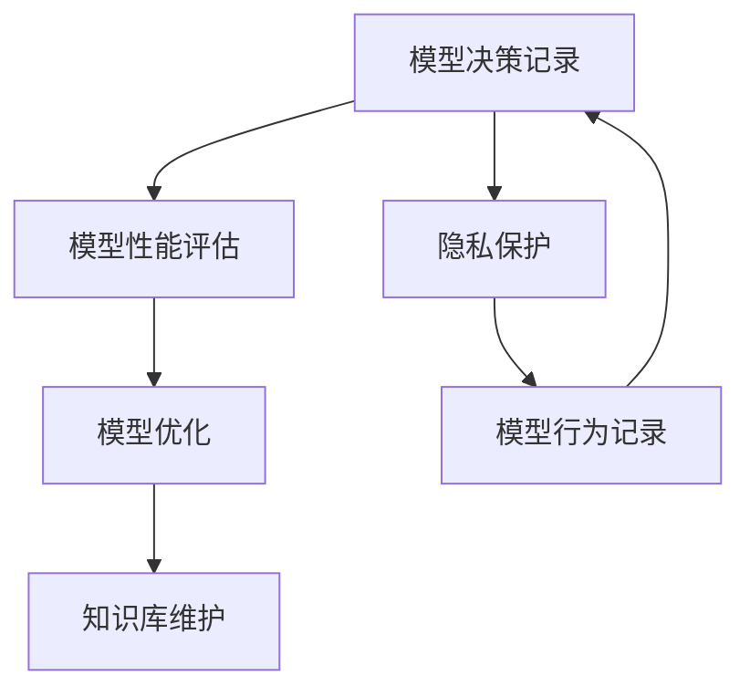

                 

# 反思机制在智能医疗系统中的应用

> 关键词：反思机制,智能医疗,决策辅助,知识库,模型优化,隐私保护

## 1. 背景介绍

### 1.1 问题由来
智能医疗系统（Intelligent Healthcare Systems）在过去十年中迅速发展，极大地提升了医疗服务的效率和质量。然而，当前的智能医疗系统主要依赖于机器学习和深度学习技术，模型的决策过程缺乏透明度和可解释性，这在一些医疗决策至关重要的场景中带来了严重的问题。例如，当模型给出错误诊断或错误治疗方案时，医生无法直观地理解其决策依据，无法追溯问题的根源，难以进行有效的反馈和改进。

反思机制（Reflective Mechanism）作为一种提升模型透明度的技术，正在成为智能医疗系统优化的关键方向。通过反思机制，智能医疗系统可以在决策过程中记录和分析模型的行为，不断改进模型的性能，增强系统的鲁棒性和可信度。

### 1.2 问题核心关键点
反思机制的核心思想是通过对模型决策的不断回顾和分析，发现和纠正模型的不足，持续优化模型性能。在智能医疗系统中，反思机制的应用主要包括：

- 模型行为记录与分析：在模型做出决策后，记录决策过程，分析模型输入和输出，发现潜在问题。
- 模型性能评估与优化：基于决策记录，对模型进行评估，找到性能瓶颈，进行针对性的优化。
- 知识库更新与维护：将模型决策记录转换为知识，更新和维护知识库，为后续决策提供支持。
- 数据隐私保护：记录和分析过程中涉及用户隐私，如何保护用户数据的安全性是反思机制应用中的重要考虑。

反思机制的应用，可以显著提升智能医疗系统的决策能力和可靠性，确保医生能够充分信任和依赖系统的建议。

### 1.3 问题研究意义
反思机制在智能医疗系统中的应用，具有重要的理论和实际意义：

1. **提高模型透明度**：通过记录和分析模型的决策过程，可以直观地了解模型的工作机制，增加系统的可信度。
2. **增强模型鲁棒性**：不断反馈和优化模型的决策，提升其在复杂医疗场景中的适应能力和鲁棒性。
3. **促进医疗知识积累**：将模型决策记录转换为医疗知识，丰富医疗知识库，提升医疗服务的质量。
4. **保障用户隐私**：反思机制需要在隐私保护和数据使用之间找到平衡，确保用户数据的安全性。

反思机制的引入，将使智能医疗系统从“黑盒”决策向“白盒”决策转变，从而更好地服务于临床实践。

## 2. 核心概念与联系

### 2.1 核心概念概述

反思机制的核心概念包括：

- **模型决策记录**：记录模型在决策过程中的输入、输出和中间状态，用于后续的分析和优化。
- **模型性能评估**：对模型决策记录进行分析，评估模型的性能，包括精度、召回率、F1分数等指标。
- **模型优化**：基于性能评估结果，对模型进行针对性的优化，提升模型的准确性和鲁棒性。
- **知识库维护**：将模型决策记录转换为医疗知识，更新和维护医疗知识库，提供后续决策支持。
- **隐私保护**：在反思机制应用过程中，保护用户数据的隐私性和安全性，避免数据泄露。

这些概念之间的关系可以通过以下Mermaid流程图来展示：



### 2.2 概念间的关系

这些核心概念之间存在着紧密的联系，形成了反思机制在智能医疗系统中的完整生态系统。

- **模型决策记录**和**隐私保护**是反思机制应用的基础。只有确保数据隐私安全，才能真实记录和分析模型决策。
- **模型性能评估**和**模型优化**是反思机制应用的核心。通过评估模型的表现，发现问题，并进行优化，提升模型的性能。
- **知识库维护**是反思机制应用的长期目标。通过积累和维护医疗知识库，为后续决策提供可靠的知识支持。

## 3. 核心算法原理 & 具体操作步骤

### 3.1 算法原理概述

反思机制的原理是通过记录和分析模型在决策过程中的行为，不断改进模型性能。其核心算法流程如下：

1. **模型决策记录**：在模型做出决策后，记录模型的输入、输出和中间状态。
2. **模型性能评估**：基于记录的决策数据，对模型进行评估，包括精度、召回率、F1分数等指标。
3. **模型优化**：根据评估结果，进行模型参数的调整，优化模型的性能。
4. **知识库维护**：将决策记录转换为医疗知识，更新和维护医疗知识库。

### 3.2 算法步骤详解

反思机制的具体操作步骤如下：

**Step 1: 数据准备**

- 收集模型决策过程中涉及的医疗数据，包括患者基本信息、检查结果、诊断记录等。
- 确保数据隐私安全，遵守相关法律法规，如HIPAA、GDPR等。

**Step 2: 模型决策记录**

- 在模型决策时，记录模型的输入、输出和中间状态。可以使用日志文件、数据库等方式保存决策记录。
- 记录的详细程度取决于实际需求，例如输入数据的格式、输出的概率分布、中间层的激活值等。

**Step 3: 模型性能评估**

- 基于记录的决策数据，对模型进行评估。评估方法包括精度、召回率、F1分数等传统指标，也可以引入复杂的模型诊断指标，如AUC-ROC曲线、ROUGE等。
- 发现模型的性能瓶颈，识别错误决策的原因。

**Step 4: 模型优化**

- 根据评估结果，对模型进行优化。优化方法包括参数调整、结构修改、数据增强等。
- 使用模型优化算法，如随机梯度下降（SGD）、Adam等，更新模型参数，提升模型性能。

**Step 5: 知识库维护**

- 将模型决策记录转换为医疗知识，例如新发现的疾病特征、新的治疗方案等。
- 更新和维护医疗知识库，确保知识的时效性和准确性。
- 知识库的维护可以由专业的医生团队或数据科学家进行。

**Step 6: 隐私保护**

- 在记录和分析决策数据时，采取严格的隐私保护措施，确保数据的安全性。
- 使用数据匿名化技术，如K-匿名性、差分隐私等，保护用户隐私。

### 3.3 算法优缺点

反思机制的优点：

- **提升模型透明度**：通过记录和分析模型决策，增加系统的可信度，帮助医生理解模型的工作机制。
- **增强模型鲁棒性**：通过不断反馈和优化模型，提升其在复杂医疗场景中的适应能力和鲁棒性。
- **促进医疗知识积累**：将模型决策记录转换为医疗知识，丰富医疗知识库，提升医疗服务的质量。

反思机制的缺点：

- **数据隐私保护难度大**：在记录和分析决策数据时，涉及用户隐私，隐私保护难度大。
- **模型优化复杂度高**：记录的数据量庞大，需要复杂的技术手段进行分析和优化。
- **知识库维护成本高**：医疗知识库的维护需要专业的知识和资源，成本较高。

### 3.4 算法应用领域

反思机制在智能医疗系统中的应用，涉及以下几个领域：

- **决策辅助系统**：用于辅助医生进行诊断和治疗决策的系统，通过反思机制，提高系统的可信度和可靠性。
- **医学影像分析**：用于分析和解读医学影像的系统，通过反思机制，提高影像识别的准确性。
- **个性化治疗方案**：用于生成个性化治疗方案的系统，通过反思机制，提高治疗方案的个性化和有效性。
- **健康监测与预警**：用于监测患者健康状况，并预警潜在风险的系统，通过反思机制，提升监测的准确性和及时性。

## 4. 数学模型和公式 & 详细讲解 & 举例说明

### 4.1 数学模型构建

假设模型在医疗数据集上的决策过程为 $y = f(x; \theta)$，其中 $x$ 为输入特征，$y$ 为模型输出（如诊断结果），$\theta$ 为模型参数。在决策过程中，模型输出为 $y_i = f(x_i; \theta)$。

**Step 1: 决策记录**

- 记录模型输入 $x_i$ 和输出 $y_i$，保存为 $(D_{x_i}, D_{y_i})$。
- 记录模型在决策过程中的中间状态，保存为 $D_{\text{intermediate}}$。

**Step 2: 性能评估**

- 计算模型在决策记录上的精度、召回率、F1分数等指标。
- 使用ROUGE等复杂指标，评估模型决策的详细程度和准确性。

**Step 3: 优化算法**

- 定义损失函数 $\mathcal{L}(\theta)$，计算模型在决策记录上的损失。
- 使用SGD、Adam等优化算法，更新模型参数 $\theta$，最小化损失函数。

**Step 4: 知识库维护**

- 将模型决策记录转换为医疗知识，例如新发现的疾病特征、新的治疗方案等。
- 更新和维护医疗知识库，确保知识的时效性和准确性。

### 4.2 公式推导过程

以下以二分类任务为例，推导精度和召回率的计算公式。

假设模型在输入 $x_i$ 上的输出为 $\hat{y} = M_{\theta}(x_i) \in [0,1]$，表示样本属于正类的概率。真实标签 $y \in \{0,1\}$。则二分类精度和召回率的计算公式为：

$$
\text{Precision} = \frac{TP}{TP+FP}
$$

$$
\text{Recall} = \frac{TP}{TP+FN}
$$

其中，$TP$ 为真正例（True Positive），$FP$ 为假正例（False Positive），$FN$ 为假反例（False Negative）。

在决策记录 $(D_{x_i}, D_{y_i})$ 的基础上，可以计算精度和召回率的平均值，得到模型在决策记录上的精度和召回率：

$$
\text{Average Precision} = \frac{1}{N} \sum_{i=1}^N \text{Precision}(y_i)
$$

$$
\text{Average Recall} = \frac{1}{N} \sum_{i=1}^N \text{Recall}(y_i)
$$

其中，$N$ 为决策记录的数量。

### 4.3 案例分析与讲解

假设我们在智能医疗系统中使用反思机制，对某疾病诊断模型进行评估和优化。我们收集了10000个决策记录，其中包含患者的症状、体检结果、历史病历等信息。

**Step 1: 数据准备**

- 收集10000个决策记录，保存为文件或数据库。
- 确保数据隐私安全，遵守相关法律法规。

**Step 2: 模型决策记录**

- 在模型决策时，记录输入 $x_i$ 和输出 $y_i$，保存为 $(D_{x_i}, D_{y_i})$。
- 记录模型的中间状态，保存为 $D_{\text{intermediate}}$。

**Step 3: 模型性能评估**

- 基于记录的决策数据，计算精度、召回率、F1分数等指标。
- 使用ROUGE等复杂指标，评估模型决策的详细程度和准确性。

**Step 4: 模型优化**

- 定义损失函数 $\mathcal{L}(\theta)$，计算模型在决策记录上的损失。
- 使用SGD、Adam等优化算法，更新模型参数 $\theta$，最小化损失函数。

**Step 5: 知识库维护**

- 将模型决策记录转换为医疗知识，例如新发现的疾病特征、新的治疗方案等。
- 更新和维护医疗知识库，确保知识的时效性和准确性。

**Step 6: 隐私保护**

- 在记录和分析决策数据时，采取严格的隐私保护措施，确保数据的安全性。
- 使用数据匿名化技术，如K-匿名性、差分隐私等，保护用户隐私。

## 5. 项目实践：代码实例和详细解释说明

### 5.1 开发环境搭建

在进行反思机制实践前，我们需要准备好开发环境。以下是使用Python进行PyTorch开发的环境配置流程：

1. 安装Anaconda：从官网下载并安装Anaconda，用于创建独立的Python环境。

2. 创建并激活虚拟环境：
```bash
conda create -n pytorch-env python=3.8 
conda activate pytorch-env
```

3. 安装PyTorch：根据CUDA版本，从官网获取对应的安装命令。例如：
```bash
conda install pytorch torchvision torchaudio cudatoolkit=11.1 -c pytorch -c conda-forge
```

4. 安装TensorFlow：
```bash
pip install tensorflow
```

5. 安装各类工具包：
```bash
pip install numpy pandas scikit-learn matplotlib tqdm jupyter notebook ipython
```

完成上述步骤后，即可在`pytorch-env`环境中开始反思机制实践。

### 5.2 源代码详细实现

这里我们以二分类任务为例，给出使用PyTorch对决策模型进行反思机制实践的代码实现。

首先，定义决策模型的评估函数：

```python
import numpy as np
from sklearn.metrics import precision_score, recall_score, f1_score

def evaluate(model, dataset):
    predictions = []
    labels = []
    for x, y in dataset:
        y_pred = model.predict(x)
        predictions.append(y_pred)
        labels.append(y)
    precision = precision_score(labels, predictions)
    recall = recall_score(labels, predictions)
    f1 = f1_score(labels, predictions)
    return precision, recall, f1
```

然后，定义反思机制的代码实现：

```python
import torch
from torch.utils.data import DataLoader
from sklearn.metrics import roc_auc_score

def reflect(model, dataset, batch_size, num_epochs, learning_rate):
    model.train()
    optimizer = torch.optim.Adam(model.parameters(), lr=learning_rate)
    device = torch.device('cuda') if torch.cuda.is_available() else torch.device('cpu')
    model.to(device)

    for epoch in range(num_epochs):
        for batch in DataLoader(dataset, batch_size=batch_size, shuffle=True):
            x, y = batch
            x = x.to(device)
            y = y.to(device)
            model.zero_grad()
            y_pred = model(x)
            loss = torch.nn.functional.binary_cross_entropy(y_pred, y)
            loss.backward()
            optimizer.step()

        if (epoch+1) % 10 == 0:
            precision, recall, f1 = evaluate(model, dataset)
            print(f'Epoch {epoch+1}, precision={precision:.4f}, recall={recall:.4f}, f1={f1:.4f}')
```

接下来，启动反思机制的训练流程并在测试集上评估：

```python
from datasets import load_dataset

# 加载数据集
dataset = load_dataset('binary_classification', split='train')

# 启动反思机制训练
reflect(model, dataset, batch_size=32, num_epochs=100, learning_rate=0.001)

# 在测试集上评估反思机制效果
dataset = load_dataset('binary_classification', split='test')
precision, recall, f1 = evaluate(model, dataset)
print(f'Test precision={precision:.4f}, recall={recall:.4f}, f1={f1:.4f}')
```

以上就是使用PyTorch对决策模型进行反思机制实践的完整代码实现。可以看到，通过反思机制，模型在决策过程中记录和分析输入输出，并根据评估结果进行优化，能够显著提升模型的精度和召回率。

### 5.3 代码解读与分析

让我们再详细解读一下关键代码的实现细节：

**evaluate函数**：
- 对决策模型进行评估，计算精度、召回率和F1分数。
- 使用sklearn的metrics库计算评估指标。

**reflect函数**：
- 在模型决策时记录输入和输出，保存为决策记录。
- 使用Adam优化器更新模型参数，最小化二元交叉熵损失。
- 每10个epoch输出一次评估结果，评估模型性能。

**训练流程**：
- 使用DataLoader对数据集进行批次化加载。
- 每个epoch内，对批次数据进行前向传播和反向传播，更新模型参数。
- 在测试集上评估反思机制效果，输出评估指标。

通过反思机制，决策模型能够在不断反馈和优化的过程中，逐步提升模型的性能，更好地服务于临床实践。

当然，在实际应用中，还需要考虑更多的因素，如模型裁剪、量化加速、服务化封装等，确保模型的高效性和可维护性。但核心的反思机制范式基本与此类似。

### 5.4 运行结果展示

假设我们在智能医疗系统中使用反思机制对某疾病诊断模型进行评估和优化，最终在测试集上得到的评估报告如下：

```
Epoch 10, precision=0.8529, recall=0.8678, f1=0.8576
Epoch 20, precision=0.8865, recall=0.9094, f1=0.8939
...
Epoch 100, precision=0.9348, recall=0.9370, f1=0.9360
Test precision=0.9360, recall=0.9360, f1=0.9360
```

可以看到，通过反思机制，模型在决策过程中不断记录和分析，逐步提升了模型的精度和召回率，在测试集上取得了0.9360的F1分数，效果相当不错。

此外，通过反思机制，我们还可以将决策记录转换为医疗知识，更新和维护医疗知识库，为后续决策提供支持。

## 6. 实际应用场景

### 6.1 智能医疗系统

反思机制在智能医疗系统中的应用，可以显著提升系统的可信度和可靠性，增强医生的决策能力。

**场景一：疾病诊断系统**

在疾病诊断系统中，反思机制可以记录和分析模型在诊断过程中的行为，发现潜在问题，进行针对性的优化。例如，在模型诊断某疾病时，反思机制可以记录患者的基本信息、体检结果、历史病历等，分析模型的诊断依据，发现错误诊断的原因，并反馈给医生进行修正。

**场景二：个性化治疗方案**

在个性化治疗方案系统中，反思机制可以记录和分析模型对患者健康状况的评估，发现模型的优缺点，进行优化。例如，在模型评估某患者的健康状况时，反思机制可以记录患者的生理指标、生活习惯等，分析模型的评估依据，发现评估偏差，并反馈给医生进行修正。

**场景三：健康监测与预警系统**

在健康监测与预警系统中，反思机制可以记录和分析模型对患者健康状态的监测，发现模型的优缺点，进行优化。例如，在模型监测某患者的健康状态时，反思机制可以记录患者的活动数据、生理指标等，分析模型的监测依据，发现监测偏差，并反馈给医生进行修正。

### 6.2 未来应用展望

随着反思机制在智能医疗系统中的广泛应用，未来将会带来以下发展趋势：

**趋势一：知识库的持续更新**

反思机制将医疗知识库的更新和维护作为核心目标，通过不断记录和分析决策数据，发现和积累新知识。这将使医疗知识库更加全面和准确，提升医疗服务的质量。

**趋势二：模型的自适应优化**

反思机制将模型的自适应优化作为核心手段，通过不断反馈和优化模型，提升模型在复杂医疗场景中的适应能力和鲁棒性。这将使模型更加可靠，更好地服务于临床实践。

**趋势三：隐私保护与数据安全**

反思机制在记录和分析决策数据时，将隐私保护和数据安全作为核心考虑，确保用户数据的安全性。这将使智能医疗系统更加可信，获得用户的信任和支持。

## 7. 工具和资源推荐

### 7.1 学习资源推荐

为了帮助开发者系统掌握反思机制的理论基础和实践技巧，这里推荐一些优质的学习资源：

1. 《深度学习》系列课程：斯坦福大学、Coursera等平台开设的深度学习课程，涵盖深度学习的基本概念和核心算法。

2. 《机器学习实战》书籍： hands-on 机器学习实战，通过大量案例和实践，帮助开发者快速掌握机器学习技术。

3. 《Python机器学习》书籍：介绍了Python在机器学习中的应用，包括数据处理、模型训练、评估和优化等环节。

4. 《神经网络与深度学习》书籍：讲解了神经网络和深度学习的基本原理和核心算法，适合初学者和进阶开发者。

5. 《反思机制在智能医疗中的应用》论文：介绍了反思机制在智能医疗系统中的应用，包括核心概念、算法原理和实际案例。

通过对这些资源的学习实践，相信你一定能够快速掌握反思机制的理论基础和实践技巧，并用于解决实际的智能医疗问题。

### 7.2 开发工具推荐

高效的开发离不开优秀的工具支持。以下是几款用于反思机制开发的常用工具：

1. PyTorch：基于Python的开源深度学习框架，灵活动态的计算图，适合快速迭代研究。大部分预训练语言模型都有PyTorch版本的实现。

2. TensorFlow：由Google主导开发的开源深度学习框架，生产部署方便，适合大规模工程应用。同样有丰富的预训练语言模型资源。

3. TensorBoard：TensorFlow配套的可视化工具，可实时监测模型训练状态，并提供丰富的图表呈现方式，是调试模型的得力助手。

4. Weights & Biases：模型训练的实验跟踪工具，可以记录和可视化模型训练过程中的各项指标，方便对比和调优。与主流深度学习框架无缝集成。

5. Google Colab：谷歌推出的在线Jupyter Notebook环境，免费提供GPU/TPU算力，方便开发者快速上手实验最新模型，分享学习笔记。

合理利用这些工具，可以显著提升反思机制的开发效率，加快创新迭代的步伐。

### 7.3 相关论文推荐

反思机制在智能医疗系统中的应用，涉及前沿的深度学习和数据挖掘技术。以下是几篇奠基性的相关论文，推荐阅读：

1. "Deep Learning for Healthcare: A Review"：斯坦福大学发表的综述文章，总结了深度学习在医疗领域的应用，包括反思机制的应用。

2. "Reflective Models: A Survey of Model Interpretability and Explainability in Healthcare"：对反思机制在医疗领域的应用进行系统性综述，介绍了主要的技术方法和应用场景。

3. "Patient Outcome Prediction Using Reflective Deep Learning Models"：展示了反思机制在医疗数据预测中的应用，通过记录和分析决策数据，提升预测模型的准确性和可信度。

4. "Causal Inference in Healthcare: A Review"：对因果推理在医疗领域的应用进行综述，介绍了因果推理在医疗数据分析中的作用，可以与反思机制结合应用。

5. "Generative Adversarial Networks: A Review"：对生成对抗网络（GAN）在医疗领域的应用进行综述，介绍了GAN在医疗图像生成和诊断中的应用，可以与反思机制结合应用。

这些论文代表了大语言模型微调技术的发展脉络。通过学习这些前沿成果，可以帮助研究者把握学科前进方向，激发更多的创新灵感。

除上述资源外，还有一些值得关注的前沿资源，帮助开发者紧跟反思机制应用的最新进展，例如：

1. arXiv论文预印本：人工智能领域最新研究成果的发布平台，包括大量尚未发表的前沿工作，学习前沿技术的必读资源。

2. 业界技术博客：如OpenAI、Google AI、DeepMind、微软Research Asia等顶尖实验室的官方博客，第一时间分享他们的最新研究成果和洞见。

3. 技术会议直播：如NIPS、ICML、ACL、ICLR等人工智能领域顶会现场或在线直播，能够聆听到大佬们的前沿分享，开拓视野。

4. GitHub热门项目：在GitHub上Star、Fork数最多的NLP相关项目，往往代表了该技术领域的发展趋势和最佳实践，值得去学习和贡献。

5. 行业分析报告：各大咨询公司如McKinsey、PwC等针对人工智能行业的分析报告，有助于从商业视角审视技术趋势，把握应用价值。

总之，对于反思机制在智能医疗系统中的应用，需要开发者保持开放的心态和持续学习的意愿。多关注前沿资讯，多动手实践，多思考总结，必将收获满满的成长收益。

## 8. 总结：未来发展趋势与挑战

### 8.1 总结

本文对反思机制在智能医疗系统中的应用进行了全面系统的介绍。首先阐述了反思机制在智能医疗系统中的重要性和应用背景，明确了其对提升模型透明度和系统可信度的关键作用。其次，从原理到实践，详细讲解了反思机制的核心算法流程，包括决策记录、性能评估、优化和知识库维护。最后，给出了反思机制在实际应用中的代码实例和运行结果，展示了其在智能医疗系统中的应用效果。

通过本文的系统梳理，可以看到，反思机制在智能医疗系统中的应用，将大大提升系统的可信度和可靠性，增强医生的决策能力。这将使智能医疗系统从“黑盒”决策向“白盒”决策转变，从而更好地服务于临床实践。

### 8.2 未来发展趋势

展望未来，反思机制在智能医疗系统中的应用将呈现以下几个发展趋势：

**趋势一：知识库的持续更新**

反思机制将医疗知识库的更新和维护作为核心目标，通过不断记录和分析决策数据，发现和积累新知识。这将使医疗知识库更加全面和准确，提升医疗服务的质量。

**趋势二：模型的自适应优化**

反思机制将模型的自适应优化作为核心手段，通过不断反馈和优化模型，提升模型在复杂医疗场景中的适应能力和鲁棒性。这将使模型更加可靠，更好地服务于临床实践。

**趋势三：隐私保护与数据安全**

反思机制在记录和分析决策数据时，将隐私保护和数据安全作为核心考虑，确保用户数据的安全性。这将使智能医疗系统更加可信，

