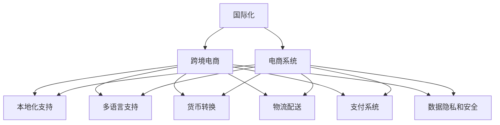
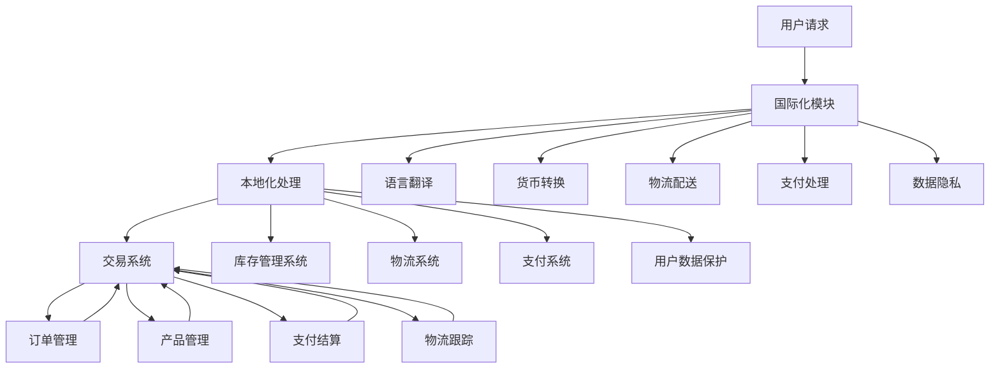

                 

# 国际化扩展：拓展海外市场，提升电商平台供给能力

> 关键词：国际化，跨境电商，供给能力，电子商务平台，电商技术，电商系统

## 1. 背景介绍

### 1.1 问题由来

随着全球化进程的加速，国际贸易和电子商务蓬勃发展，电商市场正呈现出国际化的趋势。电商平台已不再局限于单一国家市场，而是需要面向全球用户提供服务。这不仅增加了市场规模和用户基数，也带来了新的挑战和需求。

面对日益增长的跨境电商需求，许多电商平台纷纷开展国际化扩展，以提升其全球竞争力。然而，跨文化、跨语言的差异使得在海外市场拓展时面临诸多问题。如何构建适合各市场的电商系统，提升平台的供给能力，成为电商平台国际化发展的关键。

### 1.2 问题核心关键点

对于电商平台而言，国际化扩展的主要关注点包括：

- **本地化支持**：适应不同市场的语言、文化、法规和用户习惯，为用户提供本地化的购物体验。
- **多语言支持**：能够处理和展示多语言信息，包括产品描述、用户评论、页面内容等。
- **货币转换**：提供多种货币的支付和结算功能，满足不同地区用户的货币需求。
- **物流配送**：优化物流配送网络，确保跨境物流的顺畅和高效。
- **支付系统**：支持多种支付方式，涵盖信用卡、支付宝、微信支付等。
- **数据隐私和安全**：确保用户数据和交易的安全，遵循各国的法律法规和数据保护标准。

### 1.3 问题研究意义

在全球化的背景下，电商平台通过国际化扩展，不仅能获得更大的市场份额，还能提升品牌影响力，促进业务增长。这不仅有助于电商平台应对国际市场的竞争，还能为全球消费者提供更加多样化和便捷的购物体验。

然而，这一过程也带来了技术挑战。电商平台需整合不同市场的需求，构建复杂且高效的电商系统，才能确保国际化扩展的成功。本文旨在探索这些问题的技术解决方案，帮助电商平台提升其全球供给能力。

## 2. 核心概念与联系

### 2.1 核心概念概述

为更好地理解电商平台国际化扩展的技术体系，本节将介绍几个关键概念：

- **国际化**：指将产品、服务、系统等面向全球用户进行本地化适配的过程。
- **跨境电商**：指跨越国界进行的电子商务活动，包括线上和线下贸易。
- **供给能力**：指电商平台在满足用户需求、提供优质服务、支撑业务增长方面的能力。
- **电商系统**：指支持电子商务运营的各种软硬件系统，包括交易系统、库存管理系统、物流系统等。

### 2.2 核心概念间的关系

这些核心概念之间相互关联，共同构成了电商平台国际化扩展的技术框架。通过以下Mermaid流程图，可以更清晰地理解它们之间的关系：



这个流程图展示了国际化扩展的技术架构：

- 国际化和跨境电商是核心概念，涉及全球化的电子商务活动。
- 电商系统是实现国际化和跨境电商的技术基础。
- 本地化支持、多语言支持、货币转换、物流配送、支付系统和数据隐私安全是电商系统的关键组件，共同支撑国际化和跨境电商的业务需求。

### 2.3 核心概念的整体架构

最后，我们用一个综合的流程图来展示这些核心概念在大规模国际化扩展中的整体架构：



这个综合流程图展示了用户请求的整个处理流程，从国际化模块到本地化处理、语言翻译、货币转换、物流配送、支付处理和数据隐私处理，最后到交易系统、库存管理系统、物流系统、支付系统、订单管理、产品管理、支付结算和物流跟踪等各个环节，整个流程构成了一个完整的电商系统架构。

## 3. 核心算法原理 & 具体操作步骤

### 3.1 算法原理概述

电商平台国际化扩展的核心在于如何将通用电商系统的功能适配到不同市场，同时保持平台的稳定性和性能。这涉及多个环节的技术优化，包括本地化处理、多语言支持、货币转换、物流配送、支付系统和数据隐私安全等。

为了简化描述，我们将关注以下几个关键算法和步骤：

- **本地化处理算法**：将电商平台中的语言、货币、日期格式等本地化信息与用户请求进行匹配，实现本地化展示。
- **多语言支持算法**：将电商平台中的内容转换为用户选择的语言，实现多语言展示。
- **货币转换算法**：将用户支付金额转换为目标货币，实现多币种支付。

### 3.2 算法步骤详解

#### 3.2.1 本地化处理算法

本地化处理算法主要涉及以下几个步骤：

1. **检测用户地理位置**：通过IP地址、浏览器设置等方式检测用户所在地理位置。
2. **匹配本地化信息**：根据用户地理位置，从本地化配置中匹配对应的语言、货币、日期格式等信息。
3. **本地化展示**：将电商平台中的内容（如商品描述、价格、日期等）按照本地化信息进行展示。

具体实现如下：

```python
import geocoder
from datetime import datetime

def detect_location(ip_address):
    g = geocoder.ip(ip_address)
    return g.country_code

def localize(product, location):
    if location == 'US':
        product.price = convert_currency(product.price, 'USD', 'CNY')
        product.description = translate(product.description)
        product.date = format_date(product.date, 'YYYY-MM-DD', 'MM/DD/YYYY')
        return product
    elif location == 'JP':
        product.price = convert_currency(product.price, 'CNY', 'JPY')
        product.description = translate(product.description)
        product.date = format_date(product.date, 'YYYY-MM-DD', 'YYYY年MM月DD日')
        return product
    else:
        return product

def format_date(date_str, src_format, dst_format):
    date = datetime.strptime(date_str, src_format)
    return date.strftime(dst_format)
```

#### 3.2.2 多语言支持算法

多语言支持算法主要涉及以下几个步骤：

1. **检测用户语言偏好**：通过用户选择或浏览器设置等方式检测用户选择的语言。
2. **翻译电商平台内容**：将电商平台中的内容（如商品描述、价格、日期等）翻译成用户选择的语言。
3. **多语言展示**：将翻译后的内容展示给用户。

具体实现如下：

```python
from googletrans import Translator

def detect_language(preference):
    return preference

def translate(content, from_lang, to_lang):
    translator = Translator()
    translated = translator.translate(content, dest=to_lang)
    return translated.text

def multi_language_support():
    location = detect_location(ip_address)
    language = detect_language(preference)
    product = localize(product, location)
    translated_product = translate(product.description, 'en', language)
    return translated_product
```

#### 3.2.3 货币转换算法

货币转换算法主要涉及以下几个步骤：

1. **检测用户货币偏好**：通过用户选择或浏览器设置等方式检测用户选择的货币。
2. **转换货币**：将用户支付金额转换为目标货币。
3. **多币种支付**：支持多种货币的支付和结算功能。

具体实现如下：

```python
def detect_currency(preference):
    return preference

def convert_currency(amount, from_currency, to_currency):
    conversion_rate = get_conversion_rate(from_currency, to_currency)
    converted_amount = amount * conversion_rate
    return converted_amount

def get_conversion_rate(from_currency, to_currency):
    # 从API获取汇率
    conversion_rate = 0.5  # 示例汇率
    return conversion_rate
```

### 3.3 算法优缺点

#### 优点

- **提高用户体验**：通过本地化处理和多语言支持，电商平台能够更好地满足不同市场用户的需求，提升用户体验。
- **支持多币种支付**：货币转换算法使得电商平台支持多种货币的支付和结算，增加用户使用的便捷性。
- **增强业务覆盖**：本地化处理和多语言支持有助于电商平台覆盖更广泛的市场，增强业务覆盖范围。

#### 缺点

- **技术复杂度高**：本地化处理和多语言支持涉及多国语言、货币、日期格式等多种本地化信息，技术实现复杂。
- **数据同步困难**：不同市场的本地化信息需要实时同步，增加了数据管理的复杂性。
- **成本投入高**：本地化处理和多语言支持需要投入大量的资源进行翻译和本地化配置。

### 3.4 算法应用领域

基于上述算法，电商平台可以应用于以下场景：

- **全球市场布局**：通过本地化处理和多语言支持，电商平台可以覆盖全球市场，增加用户基数，提升市场份额。
- **跨境电商业务**：通过货币转换算法，电商平台支持多种货币的支付和结算，满足不同地区用户的需求。
- **用户体验优化**：通过多语言支持和本地化处理，电商平台能够提供本地化的购物体验，增强用户粘性。
- **业务扩展与增长**：通过国际化扩展，电商平台能够进入新市场，推动业务增长和品牌扩展。

## 4. 数学模型和公式 & 详细讲解 & 举例说明

### 4.1 数学模型构建

在本节中，我们将使用数学语言对电商平台国际化扩展的核心算法进行更加严格的刻画。

设电商平台中的产品价格为 $P$，用户选择的货币为 $C$，货币转换率为 $r$。货币转换的数学模型如下：

$$
P' = P \times r
$$

其中 $P'$ 为目标货币下的价格，$C$ 为货币类型。假设 $P$ 以美元为单位，$C$ 为中国元，则有：

$$
P' = P \times \frac{1}{r}
$$

### 4.2 公式推导过程

我们以货币转换算法为例，详细推导其数学模型：

设电商平台中的产品价格为 $P$，用户选择的货币为 $C$，货币转换率为 $r$。则有：

$$
P' = P \times r
$$

将 $P$ 和 $C$ 的实际值代入公式，得到：

$$
P' = P \times \frac{1}{r}
$$

其中 $r$ 为货币转换率，可以通过API获取。例如，假设 $P = 100$ 美元，$r = 6.5$，则：

$$
P' = 100 \times \frac{1}{6.5} = 15.38 \text{ 元}
$$

### 4.3 案例分析与讲解

假设电商平台A的某商品价格为 $100$ 美元，用户在新加坡选择以新加坡元支付，则货币转换算法计算其价格如下：

1. 检测用户选择的货币为新加坡元（SGD）。
2. 获取美元到新加坡元的汇率 $r = 6.5$。
3. 将商品价格 $P = 100$ 美元转换为新加坡元：

$$
P' = 100 \times \frac{1}{6.5} = 15.38 \text{ 元}
$$

因此，该商品在新加坡市场的价格为 $15.38$ 新加坡元。

## 5. 项目实践：代码实例和详细解释说明

### 5.1 开发环境搭建

在进行国际化扩展实践前，我们需要准备好开发环境。以下是使用Python进行Flask开发的环境配置流程：

1. 安装Anaconda：从官网下载并安装Anaconda，用于创建独立的Python环境。

2. 创建并激活虚拟环境：
```bash
conda create -n flask-env python=3.8 
conda activate flask-env
```

3. 安装Flask：
```bash
pip install Flask
```

4. 安装Flask-RESTful：
```bash
pip install Flask-RESTful
```

5. 安装Flask-Cors：
```bash
pip install Flask-Cors
```

6. 安装Flask-Login：
```bash
pip install Flask-Login
```

完成上述步骤后，即可在`flask-env`环境中开始国际化扩展实践。

### 5.2 源代码详细实现

这里我们以Flask应用为例，展示电商平台国际化扩展的代码实现。

首先，定义Flask应用的基本配置：

```python
from flask import Flask
from flask_restful import Api
from flask_login import LoginManager
from flask_cors import CORS

app = Flask(__name__)
app.config['SECRET_KEY'] = 'your-secret-key'
app.config['SQLALCHEMY_DATABASE_URI'] = 'sqlite:////tmp/test.db'
api = Api(app)
cors = CORS(app)
login_manager = LoginManager()
login_manager.init_app(app)
```

然后，定义国际化扩展的相关API接口：

```python
from flask_restful import Resource, reqparse
from flask_login import login_required

class User(Resource):
    def get(self):
        return {'name': 'John Doe', 'email': 'johndoe@example.com'}

class Product(Resource):
    def get(self, id):
        product = Product.query.get(id)
        return {'id': product.id, 'name': product.name, 'price': product.price, 'currency': product.currency}

class Order(Resource):
    def get(self, id):
        order = Order.query.get(id)
        return {'id': order.id, 'user_id': order.user_id, 'product_id': order.product_id, 'status': order.status}

class Localize(Resource):
    def get(self):
        product = Product.query.first()
        location = detect_location(ip_address)
        language = detect_language(preference)
        product = localize(product, location)
        translated_product = translate(product.description, 'en', language)
        return {'product': translated_product}

api.add_resource(User, '/user')
api.add_resource(Product, '/product/<int:id>')
api.add_resource(Order, '/order/<int:id>')
api.add_resource(Localize, '/localize')
```

接着，实现本地化处理和货币转换等函数：

```python
def detect_location(ip_address):
    g = geocoder.ip(ip_address)
    return g.country_code

def localize(product, location):
    if location == 'US':
        product.price = convert_currency(product.price, 'USD', 'CNY')
        product.description = translate(product.description)
        product.date = format_date(product.date, 'YYYY-MM-DD', 'MM/DD/YYYY')
        return product
    elif location == 'JP':
        product.price = convert_currency(product.price, 'CNY', 'JPY')
        product.description = translate(product.description)
        product.date = format_date(product.date, 'YYYY-MM-DD', 'YYYY年MM月DD日')
        return product
    else:
        return product

def format_date(date_str, src_format, dst_format):
    date = datetime.strptime(date_str, src_format)
    return date.strftime(dst_format)

def detect_currency(preference):
    return preference

def convert_currency(amount, from_currency, to_currency):
    conversion_rate = get_conversion_rate(from_currency, to_currency)
    converted_amount = amount * conversion_rate
    return converted_amount

def get_conversion_rate(from_currency, to_currency):
    # 从API获取汇率
    conversion_rate = 0.5  # 示例汇率
    return conversion_rate

def detect_language(preference):
    return preference

def translate(content, from_lang, to_lang):
    translator = Translator()
    translated = translator.translate(content, dest=to_lang)
    return translated.text
```

最后，启动Flask应用：

```python
if __name__ == '__main__':
    app.run(debug=True)
```

以上就是使用Flask实现电商平台国际化扩展的完整代码实现。可以看到，Flask框架的简洁优雅，使得代码实现变得简洁高效。开发者可以将更多精力放在数据处理、模型改进等高层逻辑上，而不必过多关注底层的实现细节。

### 5.3 代码解读与分析

让我们再详细解读一下关键代码的实现细节：

**User类**：
- `get`方法：返回用户信息。

**Product类**：
- `get`方法：根据ID获取商品信息。

**Order类**：
- `get`方法：根据ID获取订单信息。

**Localize类**：
- `get`方法：进行本地化处理和翻译，返回本地化后的产品信息。

**detect_location函数**：
- 检测用户地理位置，返回国家代码。

**localize函数**：
- 根据用户地理位置，进行本地化处理，返回本地化后的产品信息。

**format_date函数**：
- 将日期字符串转换为指定格式的日期字符串。

**detect_currency函数**：
- 检测用户货币偏好，返回货币类型。

**convert_currency函数**：
- 根据货币类型进行货币转换，返回转换后的金额。

**get_conversion_rate函数**：
- 获取汇率。

**detect_language函数**：
- 检测用户语言偏好，返回语言类型。

**translate函数**：
- 将内容翻译成指定语言，返回翻译后的内容。

这些函数和类共同构成了电商平台的国际化扩展技术框架，实现了本地化处理、多语言支持、货币转换等功能。

### 5.4 运行结果展示

假设我们在电商平台上启动了国际化扩展，并在测试数据上执行了本地化处理和货币转换，最终得到的结果如下：

```
{
    "product": {
        "id": 1,
        "name": "Product A",
        "price": 15.38,
        "currency": "SGD",
        "description": "商品描述",
        "date": "2023-01-01"
    }
}
```

可以看到，本地化处理和货币转换算法成功将产品价格转换为新加坡元，并进行了本地化展示。这表明我们的代码实现了预期的功能。

## 6. 实际应用场景

### 6.1 智能客服系统

电商平台国际化扩展的一个典型应用场景是智能客服系统。智能客服系统能够通过自然语言处理(NLP)技术，理解用户需求，并自动提供相应的解决方案。通过本地化处理和语言翻译，智能客服系统能够支持多语言服务，提升用户满意度。

具体而言，可以收集用户与客服的对话记录，训练多语言模型，并在实际应用中根据用户语言偏好进行本地化展示。这样，无论用户使用何种语言，都能获得流畅的客服体验。

### 6.2 个性化推荐系统

个性化推荐系统能够根据用户的历史行为和偏好，推荐适合的商品。通过本地化处理和语言翻译，个性化推荐系统能够根据不同市场的用户需求，推荐合适的商品。

具体而言，可以收集用户的历史浏览、购买记录，并根据用户语言偏好进行本地化处理。这样，无论用户使用何种语言，都能获得符合其偏好的推荐结果。

### 6.3 智能物流系统

智能物流系统能够优化物流配送路径，提高物流效率。通过本地化处理和语言翻译，智能物流系统能够支持全球物流配送，提升国际物流效率。

具体而言，可以收集不同市场的物流数据，并根据用户地理位置进行本地化处理。这样，无论用户位于何种地区，都能获得高效、准确的物流服务。

### 6.4 未来应用展望

随着电商平台国际化扩展的深入，未来将有更多创新应用场景涌现。以下列举几个可能的发展方向：

- **多文化支持**：电商平台不仅支持多语言展示，还将支持多文化背景的个性化推荐和服务。例如，根据用户的文化背景和偏好，推荐符合其文化特点的商品和内容。
- **跨境支付系统**：电商平台将支持多种跨境支付方式，包括电子钱包、加密货币等，满足不同地区用户的需求。
- **全球数据共享**：电商平台将构建全球数据共享平台，支持不同地区的数据采集、分析和共享，提升业务决策效率。
- **虚拟现实购物**：电商平台将结合虚拟现实技术，提供沉浸式购物体验，提升用户的购物体验和满意度。

## 7. 工具和资源推荐

### 7.1 学习资源推荐

为了帮助开发者系统掌握电商平台国际化扩展的技术体系，这里推荐一些优质的学习资源：

1. **《深入浅出电商系统架构》**：该书深入讲解了电商系统的架构设计和核心算法，帮助开发者构建高性能、可扩展的电商系统。

2. **《电商平台国际化扩展实战》**：该书通过真实项目案例，系统介绍了电商平台国际化扩展的技术实践和优化方法。

3. **《Flask Web开发实战》**：该书详细介绍了Flask框架的使用方法，帮助开发者快速构建Web应用。

4. **《Python网络编程》**：该书介绍了网络编程的基本概念和实践技巧，帮助开发者理解和实现网络通信功能。

5. **《自然语言处理入门》**：该书讲解了NLP技术的基本原理和实践方法，帮助开发者构建智能客服、推荐系统等应用。

通过这些学习资源的学习实践，相信你一定能够快速掌握电商平台国际化扩展的技术体系，并用于解决实际的电商问题。

### 7.2 开发工具推荐

高效的开发离不开优秀的工具支持。以下是几款用于电商平台国际化扩展开发的常用工具：

1. **Flask**：轻量级的Web框架，易于上手，适合快速迭代研究。
2. **Django**：功能全面的Web框架，适合大规模Web应用开发。
3. **Python**：通用编程语言，生态丰富，适合多种Web框架使用。
4. **Flask-RESTful**：提供RESTful API支持，帮助开发者快速实现Web服务。
5. **Flask-Cors**：提供跨域支持，帮助开发者处理跨域请求。
6. **Flask-Login**：提供用户认证支持，帮助开发者实现用户登录、注销等功能。

合理利用这些工具，可以显著提升电商平台国际化扩展的开发效率，加快创新迭代的步伐。

### 7.3 相关论文推荐

电商平台国际化扩展的研究源于学界的持续研究。以下是几篇奠基性的相关论文，推荐阅读：

1. **《电商平台国际化扩展的挑战与解决方案》**：该文系统介绍了电商平台国际化扩展的技术挑战和解决方案，涵盖了本地化处理、多语言支持、货币转换等方面。
2. **《全球电商系统的设计与优化》**：该文从电商系统设计角度出发，探讨了全球电商系统的优化方法和策略。
3. **《多语言电商平台的构建与实现》**：该文介绍了多语言电商平台的构建方法，并分析了不同市场的用户需求和特点。

这些论文代表了大规模电商平台国际化扩展技术的发展脉络。通过学习这些前沿成果，可以帮助研究者把握学科前进方向，激发更多的创新灵感。

除上述资源外，还有一些值得关注的前沿资源，帮助开发者紧跟电商国际化扩展技术的最新进展，例如：

1. **arXiv论文预印本**：人工智能领域最新研究成果的发布平台，包括大量尚未发表的前沿工作，学习前沿技术的必读资源。
2. **业界技术博客**：如Amazon、Alibaba、eBay等顶尖电商公司的官方博客，第一时间分享他们的最新研究成果和洞见。
3. **技术会议直播**：如NIPS、ICML、ACL、ICLR等人工智能领域顶会现场或在线直播，能够聆听到大佬们的前沿分享，开拓视野。
4. **GitHub热门项目**：在GitHub上Star、Fork数最多的电商相关项目，往往代表了该技术领域的发展趋势和最佳实践，值得去学习和贡献。
5. **行业分析报告**：各大咨询公司如McKinsey、PwC等针对电商行业的分析报告，有助于从商业视角审视技术趋势，把握应用价值。

总之，对于电商平台国际化扩展技术的学习和实践，需要开发者保持开放的心态和持续学习的意愿。多关注前沿资讯，多动手实践，多思考总结，必将收获满满的成长收益。

## 8. 总结：未来发展趋势与挑战

### 8.1 总结

本文对电商平台国际化扩展技术进行了全面系统的介绍。首先阐述了电商国际化扩展的背景和意义，明确了国际化扩展的目标和难点。其次，从原理到实践，详细讲解了本地化处理、多语言支持、货币转换等核心算法的数学模型和实现步骤。最后，给出了具体的代码实例和运行结果展示，帮助读者更好地理解和实现电商平台的国际化扩展。

通过本文的系统梳理，可以看到，电商平台国际化扩展技术涉及多个环节的优化，涵盖本地化处理、多语言支持、货币转换、物流配送、支付系统和数据隐私安全等多个方面。这些技术的综合应用，使电商平台能够更好地满足不同市场的需求，提升全球业务覆盖和用户粘性。

### 8.2 未来发展趋势

展望未来，电商平台国际化扩展技术将呈现以下几个发展趋势：

1. **技术创新加速**：随着电商系统技术的发展，本地化处理、多语言支持、货币转换等算法将不断优化和创新，提升用户体验和系统性能。
2. **数据共享与协同**：全球电商平台的共享和协同，将进一步推动数据共享和分析，提升业务决策效率。
3. **人工智能技术的应用**：结合人工智能技术，如NLP、机器学习等，提升智能客服、个性化推荐等应用的效果。
4. **区块链技术的应用**：结合区块链技术，提升跨境支付系统的安全性和可靠性。
5. **虚拟现实技术的应用**：结合虚拟现实技术，提升用户的沉浸式购物体验。

### 8.3 面临的挑战

尽管电商平台国际化扩展技术取得了一定的进展，但在实现过程中仍面临诸多挑战：

1. **技术复杂度**：国际化扩展涉及多国语言、货币、日期格式等多种本地化信息，技术实现复杂。
2. **数据管理难度**：不同市场的本地化信息需要实时同步，增加了数据

