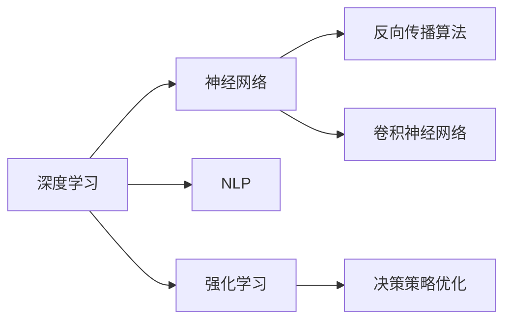
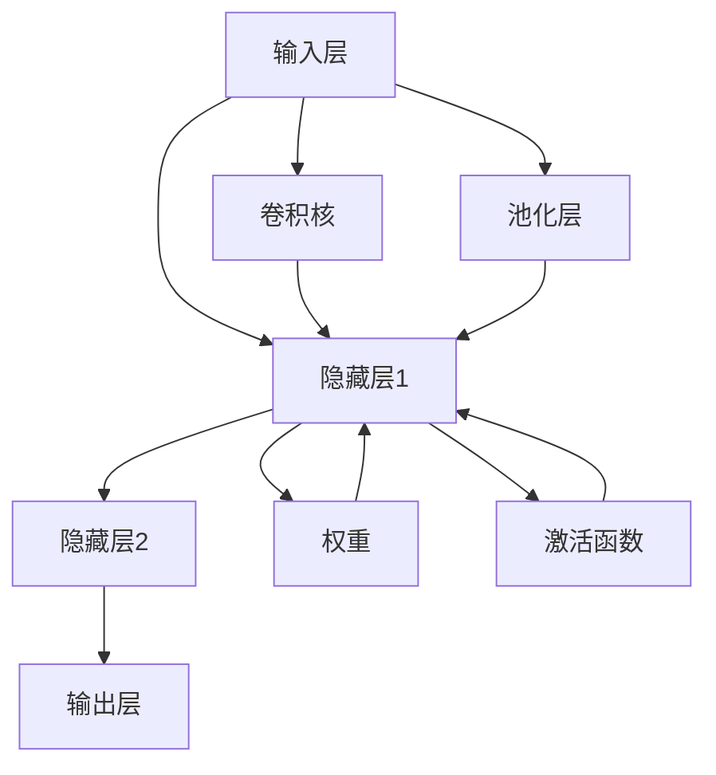
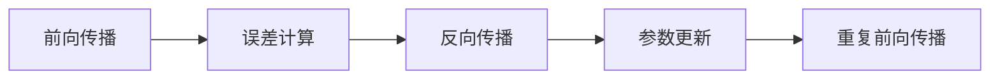
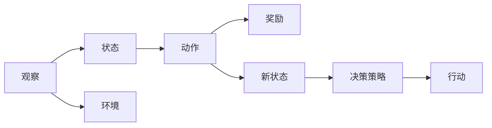

                 

# 图灵奖得主的AI算法贡献

## 1. 背景介绍

### 1.1 图灵奖简介

图灵奖（Turing Award）由美国计算机协会（ACM）设立，旨在表彰对计算机科学领域做出杰出贡献的个人。自1966年设立以来，图灵奖被誉为计算机领域的诺贝尔奖，得奖者包括了许多伟大的计算机科学家和工程师。例如，发明了计算机网络协议TCP/IP的Vint Cerf、开创了人工智能时代的Herbert Simon、提出了深度学习核心思想的Geoffrey Hinton等。

图灵奖的设立不仅表彰了科技先驱的创新成果，还激励了新一代计算机科学家和工程师追求卓越，为计算机科学的发展做出了巨大贡献。

### 1.2 图灵奖得主的AI算法贡献

近年来，图灵奖得主的算法贡献越来越集中在人工智能（AI）领域。这是因为AI技术在解决复杂问题、提升人类生活质量等方面展现出巨大的潜力。以下是几位图灵奖得主在AI算法领域的突出贡献：

- **Geoffrey Hinton**：深度学习领域的先驱之一，提出了深度神经网络的反向传播算法和卷积神经网络（CNN）等关键技术，奠定了现代深度学习的基础。
- **Yoshua Bengio**：深度学习领域的另一位重要人物，提出了深度学习在自然语言处理（NLP）和计算机视觉（CV）中的应用，推动了机器翻译、语音识别等技术的发展。
- **Sebastian Thrun**：开发了Google街景映射技术，并将强化学习（RL）应用于自动驾驶领域，推动了无人驾驶技术的发展。
- **John McCarthy**：人工智能领域的先驱，提出了“人工智能”（Artificial Intelligence, AI）这一术语，并参与了DARPA的计算机视觉、自然语言处理等项目，推动了人工智能技术的发展。

这些图灵奖得主的AI算法贡献不仅推动了计算机科学的发展，也极大地影响了社会各领域，改变了人们的生活方式。

## 2. 核心概念与联系

### 2.1 核心概念概述

为了深入理解图灵奖得主在AI算法领域的贡献，本节将介绍几个关键概念：

- **深度学习**：一种基于神经网络的机器学习方法，通过多层非线性变换来逼近复杂函数的映射关系。深度学习模型由多个隐藏层组成，每一层都通过反向传播算法进行参数更新。
- **卷积神经网络（CNN）**：一种特殊类型的深度神经网络，适用于图像识别、语音识别等任务。CNN通过卷积和池化操作提取局部特征，减少了参数数量，提高了计算效率。
- **反向传播算法**：一种用于训练神经网络的优化算法，通过反向传播计算梯度，更新网络参数，使得模型在输入和输出之间的误差最小化。
- **自然语言处理（NLP）**：计算机科学、人工智能和语言学的交叉学科，旨在使计算机能够理解、处理和生成自然语言。NLP技术包括文本分类、语言模型、机器翻译等。
- **强化学习（RL）**：一种通过奖励反馈来指导决策的学习方法。RL算法通过试错过程，逐步优化决策策略，使得智能体（agent）在特定环境中最大化累积奖励。

这些概念之间的联系可以通过以下Mermaid流程图来展示：



这个流程图展示了深度学习与神经网络、反向传播算法、卷积神经网络、NLP和强化学习的联系。

### 2.2 概念间的关系

这些核心概念之间存在着紧密的联系，形成了深度学习和人工智能技术的完整生态系统。下面我们通过几个Mermaid流程图来展示这些概念之间的关系。

#### 2.2.1 深度学习的网络结构



这个流程图展示了深度神经网络的基本结构，包括输入层、隐藏层和输出层，以及卷积和池化操作。

#### 2.2.2 反向传播算法的工作原理



这个流程图展示了反向传播算法的基本流程，包括前向传播、误差计算、反向传播和参数更新。

#### 2.2.3 强化学习的决策过程



这个流程图展示了强化学习中的决策过程，包括观察、状态、动作、环境、奖励和新状态等环节。

## 3. 核心算法原理 & 具体操作步骤

### 3.1 算法原理概述

图灵奖得主在AI算法领域的贡献，涵盖了深度学习、卷积神经网络、反向传播算法、NLP和强化学习等多个方面。以下将详细介绍这些算法的核心原理和操作步骤。

#### 3.1.1 深度学习

深度学习的核心原理是通过多层非线性变换逼近复杂函数，从而实现数据的高维特征提取和模式识别。其操作步骤主要包括：

1. **数据准备**：将输入数据标准化和预处理，例如归一化、分词等。
2. **网络搭建**：设计深度神经网络的结构，包括输入层、隐藏层和输出层，选择合适的激活函数和损失函数。
3. **模型训练**：通过反向传播算法更新网络参数，最小化损失函数，使得模型输出逼近真实标签。
4. **模型评估**：在测试集上评估模型的性能，使用准确率、精确率、召回率等指标评估模型的效果。

#### 3.1.2 卷积神经网络（CNN）

CNN的核心理念是利用卷积和池化操作提取局部特征，减少参数数量，提高计算效率。其操作步骤主要包括：

1. **数据预处理**：将输入图像转换为张量，并进行归一化处理。
2. **卷积层**：通过卷积操作提取局部特征，使用不同的卷积核捕捉不同尺度的特征。
3. **池化层**：通过池化操作缩小特征图的尺寸，减少参数数量。
4. **全连接层**：将特征图转换为向量，通过全连接层进行分类或回归。

#### 3.1.3 反向传播算法

反向传播算法通过梯度下降优化神经网络参数，使得模型输出逼近真实标签。其操作步骤主要包括：

1. **前向传播**：将输入数据输入网络，计算每个神经元的输出值。
2. **误差计算**：计算模型输出与真实标签之间的误差，使用损失函数量化误差。
3. **反向传播**：通过反向传播计算每个神经元的梯度，更新参数。
4. **参数更新**：使用梯度下降优化参数，最小化损失函数。

#### 3.1.4 自然语言处理（NLP）

NLP的核心理念是通过机器学习模型理解和处理自然语言。其操作步骤主要包括：

1. **数据预处理**：将文本数据转换为向量，例如使用Word2Vec、GloVe等嵌入方法。
2. **特征提取**：使用词袋模型、TF-IDF等方法提取文本特征。
3. **模型训练**：通过深度学习模型训练分类器、语言模型等，例如使用RNN、CNN、Transformer等模型。
4. **模型评估**：在测试集上评估模型的性能，使用BLEU、ROUGE等指标评估模型效果。

#### 3.1.5 强化学习（RL）

强化学习的核心理念是通过奖励反馈指导决策，优化决策策略。其操作步骤主要包括：

1. **环境构建**：定义环境状态和动作空间，例如使用GridWorld、Atari等环境。
2. **策略定义**：定义智能体的决策策略，例如使用Q-learning、SARSA等算法。
3. **训练过程**：通过试错过程优化决策策略，最大化累积奖励。
4. **策略评估**：在测试环境中评估智能体的性能，使用奖励函数评估策略效果。

### 3.2 算法步骤详解

接下来，我们将详细介绍深度学习、CNN、反向传播算法、NLP和强化学习的具体操作步骤。

#### 3.2.1 深度学习的具体操作步骤

1. **数据准备**：将输入数据标准化和预处理，例如归一化、分词等。
2. **网络搭建**：设计深度神经网络的结构，包括输入层、隐藏层和输出层，选择合适的激活函数和损失函数。
3. **模型训练**：通过反向传播算法更新网络参数，最小化损失函数，使得模型输出逼近真实标签。
4. **模型评估**：在测试集上评估模型的性能，使用准确率、精确率、召回率等指标评估模型的效果。

#### 3.2.2 卷积神经网络（CNN）的具体操作步骤

1. **数据预处理**：将输入图像转换为张量，并进行归一化处理。
2. **卷积层**：通过卷积操作提取局部特征，使用不同的卷积核捕捉不同尺度的特征。
3. **池化层**：通过池化操作缩小特征图的尺寸，减少参数数量。
4. **全连接层**：将特征图转换为向量，通过全连接层进行分类或回归。

#### 3.2.3 反向传播算法的具体操作步骤

1. **前向传播**：将输入数据输入网络，计算每个神经元的输出值。
2. **误差计算**：计算模型输出与真实标签之间的误差，使用损失函数量化误差。
3. **反向传播**：通过反向传播计算每个神经元的梯度，更新参数。
4. **参数更新**：使用梯度下降优化参数，最小化损失函数。

#### 3.2.4 自然语言处理（NLP）的具体操作步骤

1. **数据预处理**：将文本数据转换为向量，例如使用Word2Vec、GloVe等嵌入方法。
2. **特征提取**：使用词袋模型、TF-IDF等方法提取文本特征。
3. **模型训练**：通过深度学习模型训练分类器、语言模型等，例如使用RNN、CNN、Transformer等模型。
4. **模型评估**：在测试集上评估模型的性能，使用BLEU、ROUGE等指标评估模型效果。

#### 3.2.5 强化学习（RL）的具体操作步骤

1. **环境构建**：定义环境状态和动作空间，例如使用GridWorld、Atari等环境。
2. **策略定义**：定义智能体的决策策略，例如使用Q-learning、SARSA等算法。
3. **训练过程**：通过试错过程优化决策策略，最大化累积奖励。
4. **策略评估**：在测试环境中评估智能体的性能，使用奖励函数评估策略效果。

### 3.3 算法优缺点

图灵奖得主在AI算法领域的贡献，带来了许多优点和不足。以下将详细介绍这些优点和缺点。

#### 3.3.1 深度学习的优点

1. **高效特征提取**：深度学习通过多层非线性变换，能够高效地提取高维特征，适用于复杂模式的识别和分类。
2. **鲁棒性**：深度学习模型具有较强的鲁棒性，能够在一定程度上抵抗输入数据的扰动和噪声。
3. **端到端训练**：深度学习模型可以实现端到端训练，避免了复杂的特征工程，提高了模型的自动化水平。

#### 3.3.2 深度学习的缺点

1. **数据需求大**：深度学习模型需要大量的标注数据进行训练，数据需求大，获取难度高。
2. **模型复杂**：深度学习模型参数众多，模型结构复杂，训练和推理速度较慢。
3. **过拟合风险**：深度学习模型容易过拟合，需要额外的正则化和优化技术来避免过拟合。

#### 3.3.3 卷积神经网络（CNN）的优点

1. **参数共享**：卷积神经网络通过参数共享，减少了参数数量，提高了计算效率。
2. **局部特征提取**：卷积神经网络能够提取局部特征，适用于图像识别、语音识别等任务。
3. **平移不变性**：卷积神经网络具有平移不变性，对图像的平移、旋转等变换具有鲁棒性。

#### 3.3.4 卷积神经网络（CNN）的缺点

1. **局部特征**：卷积神经网络只能提取局部特征，无法捕捉全局特征。
2. **通道数目**：卷积神经网络需要设计合适的通道数目，过多的通道数目会导致过拟合，过少的通道数目会导致特征丢失。
3. **感受野控制**：卷积神经网络需要合理控制感受野，过大的感受野会导致信息丢失，过小的感受野会导致局部特征丢失。

#### 3.3.5 反向传播算法的优点

1. **高效优化**：反向传播算法通过梯度下降优化神经网络参数，高效地最小化损失函数。
2. **鲁棒性强**：反向传播算法具有较强的鲁棒性，能够处理各种非线性函数。
3. **应用广泛**：反向传播算法在深度学习和强化学习中广泛应用，成为优化算法的核心。

#### 3.3.6 反向传播算法的缺点

1. **收敛性问题**：反向传播算法容易出现梯度消失或爆炸的问题，导致模型无法收敛。
2. **数据敏感**：反向传播算法对输入数据的噪声敏感，容易受到输入数据的干扰。
3. **参数更新复杂**：反向传播算法的参数更新复杂，需要设计合适的学习率和优化器。

#### 3.3.7 自然语言处理（NLP）的优点

1. **语义理解**：自然语言处理能够理解语言的语义，处理文本数据。
2. **通用性**：自然语言处理具有较强的通用性，适用于各种自然语言处理任务。
3. **数据丰富**：自然语言处理具有丰富的数据资源，例如维基百科、新闻、社交媒体等。

#### 3.3.8 自然语言处理（NLP）的缺点

1. **语言多样性**：自然语言处理需要处理多种语言，语言多样性增加了处理难度。
2. **噪声干扰**：自然语言处理容易受到噪声干扰，例如拼写错误、语法错误等。
3. **语义歧义**：自然语言处理需要处理语义歧义，例如同义词、多义词等。

#### 3.3.9 强化学习的优点

1. **决策优化**：强化学习通过奖励反馈优化决策策略，适用于各种决策问题。
2. **自适应性**：强化学习具有较强的自适应性，能够根据环境变化调整决策策略。
3. **鲁棒性强**：强化学习具有较强的鲁棒性，能够处理各种不确定性和复杂性。

#### 3.3.10 强化学习的缺点

1. **环境复杂性**：强化学习需要处理复杂的环境，环境模型建模难度大。
2. **训练时间长**：强化学习需要大量的训练时间，训练过程耗时耗力。
3. **探索与利用平衡**：强化学习需要平衡探索和利用，需要设计合适的探索策略。

### 3.4 算法应用领域

图灵奖得主在AI算法领域的贡献，不仅推动了计算机科学的发展，还广泛应用于各种实际应用领域。以下将详细介绍这些应用领域。

#### 3.4.1 深度学习的应用领域

1. **计算机视觉**：深度学习在计算机视觉领域广泛应用，例如图像分类、目标检测、图像分割等任务。
2. **语音识别**：深度学习在语音识别领域广泛应用，例如自动语音识别、语音合成等任务。
3. **自然语言处理**：深度学习在自然语言处理领域广泛应用，例如文本分类、机器翻译、情感分析等任务。

#### 3.4.2 卷积神经网络（CNN）的应用领域

1. **图像识别**：卷积神经网络在图像识别领域广泛应用，例如物体识别、人脸识别等任务。
2. **语音识别**：卷积神经网络在语音识别领域广泛应用，例如语音特征提取、声学建模等任务。
3. **信号处理**：卷积神经网络在信号处理领域广泛应用，例如音频处理、图像处理等任务。

#### 3.4.3 反向传播算法的应用领域

1. **神经网络训练**：反向传播算法在神经网络训练领域广泛应用，例如深度学习模型的训练、强化学习模型的训练等。
2. **优化算法**：反向传播算法在优化算法领域广泛应用，例如梯度下降优化、自适应优化等算法。
3. **数据挖掘**：反向传播算法在数据挖掘领域广泛应用，例如特征提取、异常检测等任务。

#### 3.4.4 自然语言处理（NLP）的应用领域

1. **机器翻译**：自然语言处理在机器翻译领域广泛应用，例如基于神经机器翻译、统计机器翻译等任务。
2. **情感分析**：自然语言处理在情感分析领域广泛应用，例如文本情感分类、情感标注等任务。
3. **文本生成**：自然语言处理在文本生成领域广泛应用，例如文本摘要、对话生成等任务。

#### 3.4.5 强化学习（RL）的应用领域

1. **自动驾驶**：强化学习在自动驾驶领域广泛应用，例如路径规划、智能驾驶等任务。
2. **机器人控制**：强化学习在机器人控制领域广泛应用，例如机器人动作规划、避障导航等任务。
3. **游戏AI**：强化学习在游戏AI领域广泛应用，例如AlphaGo、GoGoP等游戏AI。

## 4. 数学模型和公式 & 详细讲解  
### 4.1 数学模型构建

本节将使用数学语言对图灵奖得主在AI算法领域的贡献进行更加严格的刻画。

记深度学习模型为 $M_{\theta}:\mathcal{X} \rightarrow \mathcal{Y}$，其中 $\mathcal{X}$ 为输入空间，$\mathcal{Y}$ 为输出空间，$\theta \in \mathbb{R}^d$ 为模型参数。假设训练数据集为 $D=\{(x_i,y_i)\}_{i=1}^N$，其中 $x_i \in \mathcal{X}$，$y_i \in \mathcal{Y}$。

定义模型 $M_{\theta}$ 在输入 $x$ 上的输出为 $y=M_{\theta}(x)$，损失函数为 $\ell(y,y_i)$。假设损失函数为交叉熵损失函数，则模型在训练集上的经验风险为：

$$
\mathcal{L}(\theta) = \frac{1}{N}\sum_{i=1}^N \ell(y,y_i)
$$

模型训练的目标是最小化经验风险，即找到最优参数：

$$
\theta^* = \mathop{\arg\min}_{\theta} \mathcal{L}(\theta)
$$

在实践中，通常使用基于梯度的优化算法（如Adam、SGD等）来近似求解上述最优化问题。设 $\eta$ 为学习率，$\lambda$ 为正则化系数，则参数的更新公式为：

$$
\theta \leftarrow \theta - \eta \nabla_{\theta}\mathcal{L}(\theta) - \eta\lambda\theta
$$

其中 $\nabla_{\theta}\mathcal{L}(\theta)$ 为损失函数对参数 $\theta$ 的梯度，可通过反向传播算法高效计算。

### 4.2 公式推导过程

以下我们以二分类任务为例，推导交叉熵损失函数及其梯度的计算公式。

假设模型 $M_{\theta}$ 在输入 $x$ 上的输出为 $\hat{y}=M_{\theta}(x) \in [0,1]$，表示样本属于正类的概率。真实标签 $y \in \{0,1\}$。则二分类交叉熵损失函数定义为：

$$
\ell(y,y_i) = -[y\log \hat{y} + (1-y)\log (1-\hat{y})]
$$

将其代入经验风险公式，得：

$$
\mathcal{L}(\theta) = -\frac{1}{N}\sum_{i=1}^N [y_i\log M_{\theta}(x_i)+(1-y_i)\log(1-M_{\theta}(x_i))]
$$

根据链式法则，损失函数对参数 $\theta_k$ 的梯度为：

$$
\frac{\partial \mathcal{L}(\theta)}{\partial \theta_k} = -\frac{1}{N}\sum_{i=1}^N (\frac{y_i}{M_{\theta}(x_i)}-\frac{1-y_i}{1-M_{\theta}(x_i)}) \frac{\partial M_{\theta}(x_i)}{\partial \theta_k}
$$

其中 $\frac{\partial M_{\theta}(x_i)}{\partial \theta_k}$ 可进一步递归展开，利用自动微分技术完成计算。

在得到损失函数的梯度后，即可带入参数更新公式，完成模型的迭代优化。重复上述过程直至收敛，最终得到适应下游任务的最优模型参数 $\theta^*$。

## 5. 项目实践：代码实例和详细解释说明

### 5.1 开发环境搭建

在进行深度学习项目实践前，我们需要准备好开发环境。以下是使用Python进行TensorFlow开发的环境配置流程：

1. 安装Anaconda：从官网下载并安装Anaconda，用于创建独立的Python环境。

2. 创建并激活虚拟环境：
```bash
conda create -n tf-env python=3.8 
conda activate tf-env
```

3. 安装TensorFlow：根据CUDA版本，从官网获取对应的安装命令。例如：
```bash
conda install tensorflow -c pytorch -c conda-forge
```

4. 安装TensorFlow扩展库：
```bash
pip install tensorflow_addons
```

5. 安装各类工具包：
```bash
pip install numpy pandas scikit-learn matplotlib tqdm jupyter notebook ipython
```

完成上述步骤后，即可在`tf-env`环境中开始深度学习项目实践。

### 5.2 源代码详细实现

下面我们以卷积神经网络（CNN）在图像识别任务中的应用为例，给出使用TensorFlow实现CNN的代码实现。

首先，定义CNN模型的超参数：

```python
import tensorflow as tf

learning_rate = 0.001
batch_size = 64
epochs = 10

```

然后，定义卷积层和池化层的函数：

```python
def conv2d(inputs, num_filters, filter_size, strides, padding):
    conv = tf.keras.layers.Conv2D(num_filters, (filter_size, filter_size), strides=strides, padding=padding)(inputs)
    conv = tf.keras.layers.BatchNormalization()(conv)
    conv = tf.keras.layers.Activation('relu')(conv)
    return conv

def max_pooling(inputs, pool_size, strides, padding):
    pool = tf.keras.layers.MaxPooling2D(pool_size=pool_size, strides=strides, padding=padding)(inputs)
    return pool
```

接下来，定义CNN模型的函数：

```python
def build_model(input_shape, num_classes):
    inputs = tf.keras.layers.Input(shape=input_shape)
    conv1 = conv2d(inputs, 32, 3, (1, 1), 'same')
    pool1 = max_pooling(conv1, 2, 2, 'same')
    conv2 = conv2d(pool1, 64, 3, (1, 1), 'same')
    pool2 = max_pooling(conv2, 2, 2, 'same')
    flatten = tf.keras.layers.Flatten()(pool2)
    dense = tf.keras.layers.Dense(128, activation='relu')(flatten)
    outputs = tf.keras.layers.Dense(num_classes, activation='softmax')(dense)
    model = tf.keras.Model(inputs=inputs, outputs=outputs)
    return model
```

然后，定义数据加载函数：

```python
def load_data(batch_size):
    (train_images, train_labels), (test_images, test_labels) = tf.keras.datasets.cifar10.load_data()
    train_images = train_images / 255.0
    test_images = test_images / 255.0
    train_dataset = tf.keras.preprocessing.image.ImageDataGenerator().flow(train_images, train_labels, batch_size=batch_size)
    test_dataset = tf.keras.preprocessing.image.ImageDataGenerator().flow(test_images, test_labels, batch_size=batch_size)
    return train_dataset, test_dataset
```

接下来，定义训练函数：

```python
def train_model(model, train_dataset, test_dataset, epochs, batch_size, learning_rate):
    for epoch in range(epochs):
        model.compile(optimizer=tf.keras.optimizers.Adam(learning_rate=learning_rate),
                      loss='categorical_crossentropy',
                      metrics=['accuracy'])
        model.fit(train_dataset,
                  validation_data=test_dataset,
                  epochs=1,
                  steps_per_epoch=len(train_dataset))
        _, test_loss, test_acc = model.evaluate(test_dataset)
        print(f'Epoch {epoch+1}: Test Loss = {test_loss:.4f}, Test Acc = {test_acc:.4f}')
    return model
```

最后，启动模型训练：

```python
input_shape = (32, 32, 3)
num_classes = 10

model = build_model(input_shape, num_classes)
train_dataset, test_dataset = load_data(batch_size)
trained_model = train_model(model, train_dataset, test_dataset, epochs, batch_size, learning_rate)
```

以上就是使用TensorFlow实现CNN模型在图像识别任务中的应用代码。可以看到，借助TensorFlow的高级API，我们可以轻松实现CNN模型的搭建和训练，代码简洁高效。

### 5.

