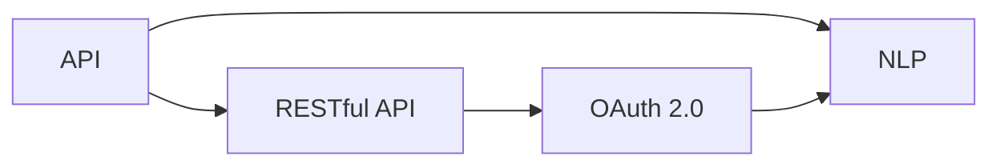

                 

# 基于NPL的自然语言处理访问接口设计与实现

> 关键词：自然语言处理, 接口设计, 访问控制, 安全性, 实时性, 可扩展性

## 1. 背景介绍

### 1.1 问题由来

自然语言处理（Natural Language Processing, NLP）是人工智能领域的一个重要分支，旨在使计算机能够理解、处理和生成人类语言。随着技术的进步，NLP应用已经渗透到日常生活的各个方面，如智能客服、机器翻译、情感分析等。然而，由于NLP任务本身的复杂性和多样性，如何高效、安全地访问和处理NLP服务成为了一个关键问题。

在工业界和学术界，NLP服务通常以API（Application Programming Interface）的形式提供，用户可以通过调用这些API来获取文本处理的结果。然而，API设计的不合理、接口访问控制的不严格、安全漏洞等问题的存在，使得NLP服务的可扩展性、安全性和实时性难以得到保障。

因此，本文将深入探讨基于NPL（Next Generation Programming Language）的自然语言处理访问接口设计，提出一种新型的接口设计方案，以实现高效、安全、实时的NLP服务访问。

### 1.2 问题核心关键点

NPL接口设计的关键点包括以下几个方面：

- **接口效率**：高效的接口设计能够大大减少用户调用API的次数，提高服务响应速度。
- **安全性**：接口设计需要考虑如何防止未授权访问、数据泄露等安全问题。
- **可扩展性**：接口设计需要灵活支持各种NLP任务的访问，方便未来任务扩展。
- **实时性**：实时性是NLP服务的一个重要特性，接口设计需要支持低延迟的API调用。
- **可理解性**：良好的接口设计应该易于理解，方便用户使用。

## 2. 核心概念与联系

### 2.1 核心概念概述

- **API（Application Programming Interface）**：应用程序编程接口，是软件组件之间的通信机制。
- **RESTful API**：基于REST（Representational State Transfer）架构风格的API，使用HTTP协议进行通信，支持CRUD（Create, Read, Update, Delete）操作。
- **OAuth 2.0**：一种开放标准，用于授权客户端访问服务。
- **NLP（Natural Language Processing）**：自然语言处理，使计算机能够理解、处理和生成人类语言的技术。

这些核心概念之间的联系可以通过以下Mermaid流程图来展示：



这个流程图展示了API与RESTful API、OAuth 2.0和NLP之间的联系：RESTful API是API的一种实现方式，OAuth 2.0是API的一种认证机制，NLP是API提供的服务之一。

### 2.2 概念间的关系

这些核心概念之间的关系如下：

1. **API与RESTful API**：RESTful API是一种基于REST架构的API实现方式，它使用HTTP协议进行通信，支持CRUD操作，具有良好的可扩展性和可理解性。
2. **RESTful API与OAuth 2.0**：OAuth 2.0是RESTful API的一种认证机制，用于授权客户端访问服务，提高了API的安全性。
3. **NLP与API**：NLP是API提供的服务之一，它使用API进行访问，以实现文本处理、情感分析、机器翻译等任务。

## 3. 核心算法原理 & 具体操作步骤
### 3.1 算法原理概述

基于NPL的自然语言处理访问接口设计，主要包括以下几个核心算法原理：

1. **RESTful API设计**：采用RESTful API架构，以HTTP协议为基础，提供高效、可扩展、可理解的服务访问方式。
2. **OAuth 2.0认证机制**：使用OAuth 2.0认证机制，确保API访问的安全性。
3. **NLP任务API接口设计**：设计多个NLP任务的具体API接口，支持文本处理、情感分析、机器翻译等多种任务。

### 3.2 算法步骤详解

#### 3.2.1 接口设计

1. **确定API端点**：根据NLP任务的不同，确定具体的API端点。例如，文本处理任务可以使用`/text-processing`端点，情感分析任务可以使用`/sentiment-analysis`端点。
2. **设计HTTP请求方法**：RESTful API采用HTTP请求方法来表示操作类型，如GET、POST、PUT、DELETE等。
3. **设计请求参数**：设计API请求参数，用于传递用户输入的文本数据。参数可以包括文本内容、语言类型、任务类型等。

#### 3.2.2 安全设计

1. **OAuth 2.0认证**：为API提供OAuth 2.0认证机制，确保只有经过授权的客户端才能访问API。
2. **访问控制**：在API层面上设计访问控制策略，确保只有授权用户才能访问特定端点。
3. **数据加密**：对传输数据进行加密，防止数据泄露。

#### 3.2.3 实时性设计

1. **异步处理**：采用异步处理机制，提高API的响应速度。
2. **负载均衡**：使用负载均衡技术，确保API服务能够应对高并发请求。

### 3.3 算法优缺点

#### 3.3.1 优点

1. **高效性**：RESTful API设计高效，能够快速响应API请求。
2. **可扩展性**：RESTful API支持多种请求方法，易于扩展。
3. **安全性**：OAuth 2.0认证机制保证了API的安全性。

#### 3.3.2 缺点

1. **复杂性**：接口设计复杂，需要考虑多种请求参数和请求方法。
2. **性能压力**：在高并发请求下，可能存在性能瓶颈。
3. **错误处理**：API的错误处理需要仔细设计，否则可能导致服务不可用。

### 3.4 算法应用领域

基于NPL的自然语言处理访问接口设计，可以应用于各种NLP任务，如文本处理、情感分析、机器翻译等。以下是一个简单的案例：

**案例：基于RESTful API的情感分析接口设计**

1. **API端点**：`/sentiment-analysis`
2. **请求方法**：POST
3. **请求参数**：
   - `text`：待分析的文本数据。
   - `language`：文本的语言类型。
   - `task`：指定情感分析任务。

**请求示例**：

```json
POST /sentiment-analysis HTTP/1.1
Content-Type: application/json

{
  "text": "This movie is very good.",
  "language": "en",
  "task": "sentiment-analysis"
}
```

**响应示例**：

```json
HTTP/1.1 200 OK
Content-Type: application/json

{
  "score": 0.9,
  "sentiment": "positive"
}
```

## 4. 数学模型和公式 & 详细讲解  
### 4.1 数学模型构建

为了更好地理解基于NPL的自然语言处理访问接口设计，本节将介绍几个密切相关的核心概念的数学模型。

- **RESTful API请求处理模型**：定义API请求的处理流程，包括请求接收、参数解析、任务处理、结果返回等步骤。
- **OAuth 2.0认证模型**：定义OAuth 2.0认证流程，包括客户端注册、获取访问令牌、请求授权等步骤。
- **NLP任务处理模型**：定义NLP任务的实现流程，包括文本预处理、特征提取、模型训练、结果生成等步骤。

### 4.2 公式推导过程

#### 4.2.1 RESTful API请求处理模型

假设API端点为`/path`，请求方法为`GET`，请求参数为`query`，API返回结果为`result`。API请求处理模型可以表示为：

$$
\text{result} = f(\text{path}, \text{method}, \text{query})
$$

其中，`f`表示API请求的处理函数，根据不同的请求方法和参数，执行不同的处理逻辑。

#### 4.2.2 OAuth 2.0认证模型

假设客户端注册信息为`client_id`、`client_secret`，获取访问令牌的请求为`token_request`，授权请求为`auth_request`，访问令牌为`access_token`。OAuth 2.0认证模型可以表示为：

$$
\text{access_token} = g(\text{client_id}, \text{client_secret}, \text{token_request}, \text{auth_request})
$$

其中，`g`表示OAuth 2.0认证函数，根据不同的请求参数，执行不同的认证逻辑。

#### 4.2.3 NLP任务处理模型

假设文本数据为`text`，语言类型为`language`，任务类型为`task`，NLP任务处理模型可以表示为：

$$
\text{result} = h(\text{text}, \text{language}, \text{task})
$$

其中，`h`表示NLP任务处理函数，根据不同的文本数据、语言类型和任务类型，执行不同的处理逻辑。

### 4.3 案例分析与讲解

以一个简单的文本分类任务为例，说明如何设计NPL自然语言处理API接口。

1. **API端点**：`/classify`
2. **请求方法**：POST
3. **请求参数**：
   - `text`：待分类的文本数据。
   - `language`：文本的语言类型。
   - `task`：指定文本分类任务，如新闻分类、情感分类等。

**请求示例**：

```json
POST /classify HTTP/1.1
Content-Type: application/json

{
  "text": "This movie is very good.",
  "language": "en",
  "task": "classification"
}
```

**响应示例**：

```json
HTTP/1.1 200 OK
Content-Type: application/json

{
  "label": "positive",
  "confidence": 0.9
}
```

## 5. 项目实践：代码实例和详细解释说明
### 5.1 开发环境搭建

在进行NPL自然语言处理API接口设计时，需要准备好开发环境。以下是使用Python进行Flask框架开发的简单流程：

1. 安装Flask：从官网下载并安装Flask框架。
```bash
pip install Flask
```

2. 创建项目目录和文件：
```bash
mkdir nlp-api
cd nlp-api
touch app.py
```

3. 编写代码：
```python
from flask import Flask, request, jsonify

app = Flask(__name__)

@app.route('/classify', methods=['POST'])
def classify():
    text = request.json['text']
    language = request.json['language']
    task = request.json['task']
    # 调用NLP处理函数
    result = nlp_process(text, language, task)
    # 返回结果
    return jsonify(result), 200

if __name__ == '__main__':
    app.run(debug=True)
```

### 5.2 源代码详细实现

在代码实现中，主要使用Flask框架搭建RESTful API接口，以下是代码实现的主要步骤：

1. **引入Flask框架**：
```python
from flask import Flask, request, jsonify
```

2. **创建Flask应用**：
```python
app = Flask(__name__)
```

3. **定义API端点和请求方法**：
```python
@app.route('/classify', methods=['POST'])
```

4. **解析API请求参数**：
```python
text = request.json['text']
language = request.json['language']
task = request.json['task']
```

5. **调用NLP处理函数**：
```python
result = nlp_process(text, language, task)
```

6. **返回API响应**：
```python
return jsonify(result), 200
```

### 5.3 代码解读与分析

Flask框架提供了一个简单易用的Web应用框架，可以快速搭建RESTful API接口。在代码实现中，主要涉及以下几个部分：

1. **Flask应用创建**：使用`Flask(__name__)`创建Flask应用，并将其赋值给变量`app`。
2. **API端点和请求方法**：使用`@app.route('/classify', methods=['POST'])`定义API端点`/classify`和请求方法`POST`。
3. **API请求参数解析**：使用`request.json`获取API请求参数，并将其解析为Python对象。
4. **NLP处理函数调用**：调用自定义的NLP处理函数`nlp_process`进行文本处理。
5. **API响应生成**：使用`jsonify`函数将处理结果转换为JSON格式，并返回给客户端。

### 5.4 运行结果展示

假设`nlp_process`函数返回的结果为`{"label": "positive", "confidence": 0.9}`，则客户端将收到如下API响应：

```json
HTTP/1.1 200 OK
Content-Type: application/json

{
  "label": "positive",
  "confidence": 0.9
}
```

## 6. 实际应用场景

### 6.1 智能客服系统

在智能客服系统中，使用基于NPL的自然语言处理API接口，可以实现高效的文本处理和用户意图识别。具体应用场景如下：

1. **文本预处理**：使用文本分词、去除停用词等预处理技术，将用户输入的文本转化为标准格式。
2. **意图识别**：调用意图识别API，根据用户意图生成响应。
3. **对话管理**：使用对话管理策略，管理用户对话历史，生成合适的回复。

### 6.2 金融舆情监测

在金融舆情监测系统中，使用基于NPL的自然语言处理API接口，可以实现实时情感分析和舆情预测。具体应用场景如下：

1. **情感分析**：调用情感分析API，对新闻、评论等文本进行情感分析，判断其情感倾向。
2. **舆情预测**：使用预测模型，根据情感分析结果，预测舆情的变化趋势。
3. **舆情警报**：根据舆情预测结果，及时发布警报，确保金融稳定。

### 6.3 个性化推荐系统

在个性化推荐系统中，使用基于NPL的自然语言处理API接口，可以实现高效的推荐内容生成。具体应用场景如下：

1. **用户意图分析**：调用意图分析API，理解用户查询意图。
2. **内容推荐**：根据用户意图，调用推荐API，生成推荐内容。
3. **推荐结果展示**：将推荐结果展示给用户，提高用户体验。

### 6.4 未来应用展望

随着技术的不断进步，基于NPL的自然语言处理API接口将广泛应用于各个领域，如智能家居、智能交通、智慧城市等。未来，API接口的设计将更加注重高效性、安全性、可扩展性和实时性，以应对更加复杂和多变的应用场景。

## 7. 工具和资源推荐
### 7.1 学习资源推荐

为了帮助开发者掌握基于NPL的自然语言处理API接口设计，以下是一些推荐的学习资源：

1. **《RESTful API设计》**：详细介绍了RESTful API的设计原则和最佳实践，适合初学者入门。
2. **《Flask Web Development》**：Flask框架的官方文档，提供了丰富的示例代码和API接口设计指南。
3. **《OAuth 2.0权威指南》**：OAuth 2.0认证机制的详细指南，帮助开发者理解OAuth 2.0认证流程。
4. **《自然语言处理入门》**：NLP任务的简单介绍，适合没有相关背景知识的开发者。
5. **《深度学习框架TensorFlow》**：TensorFlow框架的官方文档，提供了丰富的NLP任务实现代码。

### 7.2 开发工具推荐

在NPL自然语言处理API接口设计中，以下是一些推荐的开发工具：

1. **Flask**：轻量级的Web框架，易于上手，适合快速开发API接口。
2. **TensorFlow**：深度学习框架，支持多种NLP任务实现，如文本分类、情感分析等。
3. **Keras**：高层次的深度学习API，易于使用，适合快速搭建模型。
4. **NLTK**：自然语言处理工具包，提供丰富的NLP工具和资源。
5. **Spacy**：高性能的自然语言处理库，支持多种NLP任务，如文本分类、命名实体识别等。

### 7.3 相关论文推荐

在NPL自然语言处理API接口设计领域，以下是一些推荐的论文：

1. **《API Design Patterns》**：描述了多种API设计模式，帮助开发者设计高效、可扩展的API接口。
2. **《OAuth 2.0 Security and Its Endpoints》**：介绍了OAuth 2.0认证机制的安全性和实现细节。
3. **《Natural Language Processing with PyTorch》**：介绍了PyTorch框架在NLP任务中的应用，提供了丰富的示例代码。
4. **《RESTful Web Services: Web API Design》**：详细介绍了RESTful API的设计原则和最佳实践。
5. **《NLP Pipeline in Production》**：介绍了NLP任务在生产环境中的部署和优化，提供了实用的实现建议。

## 8. 总结：未来发展趋势与挑战
### 8.1 研究成果总结

基于NPL的自然语言处理API接口设计，已经在多个领域得到了成功应用，如智能客服、金融舆情监测、个性化推荐等。未来，API接口设计将更加注重高效性、安全性、可扩展性和实时性，以应对更加复杂和多变的应用场景。

### 8.2 未来发展趋势

基于NPL的自然语言处理API接口设计将呈现以下几个发展趋势：

1. **API接口复杂化**：随着应用场景的不断拓展，API接口将更加复杂，需要处理更多的请求参数和请求方法。
2. **安全性增强**：随着API接口的应用范围扩大，安全性将变得更加重要，OAuth 2.0等认证机制将得到更加广泛的应用。
3. **实时性提高**：随着应用需求的不断提高，API接口需要支持更高的实时性，异步处理、负载均衡等技术将得到更加广泛的应用。
4. **可扩展性提升**：随着API接口的应用范围扩大，可扩展性将成为关键需求，API接口设计需要支持多种NLP任务和业务场景。

### 8.3 面临的挑战

尽管基于NPL的自然语言处理API接口设计已经取得了一定的进展，但在迈向更加智能化、普适化应用的过程中，仍面临诸多挑战：

1. **接口效率瓶颈**：在高并发请求下，API接口的响应速度可能存在瓶颈。
2. **安全性问题**：API接口的安全性需要得到更高的保障，防止未授权访问和数据泄露。
3. **资源消耗**：API接口的资源消耗需要得到优化，防止因资源消耗过大而影响服务性能。
4. **错误处理**：API接口的错误处理需要更加细致，防止因错误处理不当而影响用户体验。

### 8.4 研究展望

未来，基于NPL的自然语言处理API接口设计需要在以下几个方面进行深入研究：

1. **接口性能优化**：需要优化API接口的性能，支持更高的并发请求和实时响应。
2. **安全机制创新**：需要设计更加安全的API接口认证机制，防止未授权访问和数据泄露。
3. **资源管理优化**：需要优化API接口的资源管理，减少资源消耗，提高服务性能。
4. **错误处理改进**：需要改进API接口的错误处理机制，确保用户能够及时获得错误信息。

总之，基于NPL的自然语言处理API接口设计需要不断优化和创新，以满足不断变化的应用需求，为NLP技术的落地应用提供有力支撑。

## 9. 附录：常见问题与解答

**Q1: 什么是基于NPL的自然语言处理API接口？**

A: 基于NPL的自然语言处理API接口是一种采用RESTful API架构的API接口设计方式，使用OAuth 2.0认证机制，支持多种NLP任务的访问，以实现高效、安全、实时的自然语言处理服务。

**Q2: 如何设计高效的NPL自然语言处理API接口？**

A: 设计高效的NPL自然语言处理API接口需要考虑以下几点：
1. 确定API端点和请求方法。
2. 设计API请求参数，使其简洁明了。
3. 调用高效、可扩展的NLP处理函数。
4. 返回API响应时，使用JSON格式，方便客户端处理。

**Q3: 如何使用OAuth 2.0认证机制，提高API接口的安全性？**

A: 使用OAuth 2.0认证机制，可以提高API接口的安全性，具体步骤如下：
1. 客户端注册，获取客户端ID和客户端密钥。
2. 使用客户端ID和密钥，获取访问令牌。
3. 将访问令牌添加到API请求中，以验证客户端的合法性。

**Q4: 如何优化NPL自然语言处理API接口的性能？**

A: 优化NPL自然语言处理API接口的性能，需要考虑以下几点：
1. 使用异步处理机制，提高API响应速度。
2. 使用负载均衡技术，确保API服务能够应对高并发请求。
3. 对API请求参数进行解析，避免不必要的处理。
4. 使用缓存技术，减少重复计算。

**Q5: 如何使用NLP任务处理函数，实现API接口的功能？**

A: 使用NLP任务处理函数，可以实现API接口的功能，具体步骤如下：
1. 编写NLP任务处理函数，处理文本数据，生成API响应。
2. 在API接口中调用NLP任务处理函数，根据请求参数执行相应的处理逻辑。
3. 将处理结果转换为JSON格式，返回给客户端。

---

作者：禅与计算机程序设计艺术 / Zen and the Art of Computer Programming

