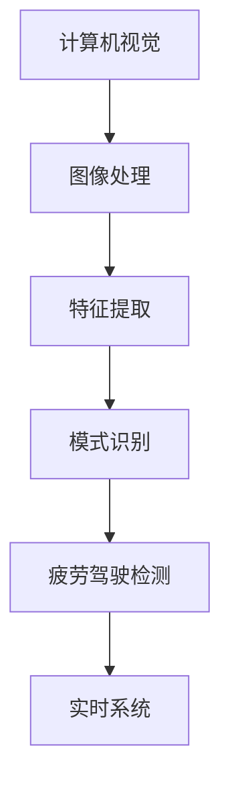

                 

# 基于OpenCV的疲劳驾驶检测系统详细设计与具体代码实现

> 关键词：
- 疲劳驾驶检测
- OpenCV
- 计算机视觉
- 图像处理
- 实时系统

## 1. 背景介绍

### 1.1 问题由来
随着现代社会交通量的不断增加，疲劳驾驶作为一种非意愿的驾驶行为，已成为引发交通事故的主要原因之一。根据统计，每年因疲劳驾驶引发的交通事故数量占总事故的25%以上。为了保障行车安全，越来越多的智能驾驶辅助系统被研究和应用。其中，基于计算机视觉的疲劳驾驶检测系统是一种重要手段，可以帮助驾驶员在疲劳状态下及时发出预警，防止交通事故的发生。

### 1.2 问题核心关键点
开发一个高效的疲劳驾驶检测系统，需要解决以下几个核心问题：
1. **实时性**：系统需要在毫秒级时间内完成图像处理和决策输出，以保证实时性。
2. **准确性**：准确识别驾驶员的疲劳状态，以避免误报或漏报。
3. **稳定性**：在复杂驾驶环境中，如光照变化、行人干扰等情况下，系统仍能稳定运行。
4. **鲁棒性**：适应不同车型的摄像头拍摄角度和焦距，保证系统在不同驾驶环境下的普适性。

### 1.3 问题研究意义
疲劳驾驶检测系统的研究对提高交通安全、减少交通事故具有重要意义。通过实时监测驾驶员的状态，可以有效预防疲劳驾驶，保障行车安全。该系统也可以帮助企业优化驾驶员调度，降低运营成本。此外，疲劳驾驶检测系统还可以应用于高速公路收费站、公交车站等交通管理场所，提升整体交通管理水平。

## 2. 核心概念与联系

### 2.1 核心概念概述

为了更好地理解基于OpenCV的疲劳驾驶检测系统的设计与实现，本节将介绍几个密切相关的核心概念：

- **计算机视觉**：涉及图像处理、特征提取、模式识别等技术，旨在通过计算机对视觉信息进行处理和理解。
- **OpenCV**：一个广泛使用的开源计算机视觉库，提供丰富的图像处理、视频分析、机器学习等算法和工具。
- **疲劳驾驶检测**：通过分析驾驶员的生理和行为特征，判断其是否处于疲劳状态。
- **实时系统**：指系统需要在规定的时间内完成指定任务，通常用于需要快速响应的应用场景。
- **特征提取**：从图像或视频序列中提取有用的特征，供分类或识别算法使用。

### 2.2 概念间的关系

这些核心概念之间存在着紧密的联系，形成了疲劳驾驶检测系统的完整架构。我们可以用以下Mermaid流程图来展示它们之间的关系：



这个流程图展示了从图像处理到疲劳驾驶检测的整个流程，其中计算机视觉、特征提取、模式识别是关键的技术环节，而实时系统则是整个系统的核心需求。

## 3. 核心算法原理 & 具体操作步骤
### 3.1 算法原理概述

基于OpenCV的疲劳驾驶检测系统主要通过以下步骤实现：

1. **图像采集**：使用摄像头实时捕获驾驶舱内的视频流。
2. **预处理**：对采集的图像进行去噪、灰度转换、平滑等预处理操作。
3. **特征提取**：从预处理后的图像中提取关键特征，如面部特征点、眼睛状态、头部姿态等。
4. **疲劳判断**：根据提取的特征，使用机器学习模型或规则算法进行疲劳状态分类。
5. **实时预警**：根据疲劳状态，系统发出预警或提醒，保障行车安全。

### 3.2 算法步骤详解

下面详细介绍基于OpenCV的疲劳驾驶检测系统的具体操作步骤：

#### 3.2.1 图像采集与预处理

首先，使用OpenCV库中的VideoCapture函数捕获摄像头视频流：

```python
import cv2

cap = cv2.VideoCapture(0)
```

接着，对采集的图像进行预处理，包括去噪、灰度转换和模糊处理：

```python
def preprocess_image(image):
    gray = cv2.cvtColor(image, cv2.COLOR_BGR2GRAY)
    gray = cv2.GaussianBlur(gray, (5, 5), 0)
    return gray
```

#### 3.2.2 特征提取

为了提取关键特征，可以使用OpenCV提供的Haar级联分类器，例如用于眼睛识别的眼睛分类器：

```python
eye_cascade = cv2.CascadeClassifier('haarcascade_eye.xml')
```

使用该分类器在预处理后的灰度图像中检测眼睛：

```python
def detect_eyes(image):
    gray = cv2.cvtColor(image, cv2.COLOR_BGR2GRAY)
    eyes = eye_cascade.detectMultiScale(gray, scaleFactor=1.1, minNeighbors=4, minSize=(30, 30))
    return eyes
```

#### 3.2.3 疲劳判断

对于检测到的眼睛，计算其状态，例如眨眼次数和睁眼时间，以此判断驾驶员是否疲劳：

```python
def is_fatigue(eyes):
    total_eyes = 0
    blinks = 0
    open_eyes = 0
    for (x, y, w, h) in eyes:
        # 计算眼睛状态
        total_eyes += 1
        if eye_is_open(x, y, w, h):
            open_eyes += 1
        else:
            blinks += 1
    return blinks, open_eyes, total_eyes
```

#### 3.2.4 实时预警

根据疲劳判断结果，发出预警或提醒。例如，当检测到驾驶员连续眨眼超过一定次数或睁眼时间过短时，系统发出警告：

```python
def alert(fatigue_score):
    if fatigue_score > 3:
        print('Warning: Fatigue detected. Please take a break.')
```

### 3.3 算法优缺点

基于OpenCV的疲劳驾驶检测系统具有以下优点：

1. **高效性**：使用OpenCV库提供的图像处理和特征提取算法，能够快速完成预处理和特征提取。
2. **准确性**：通过眼睛识别等特征提取方法，准确度较高，能够有效识别驾驶员的疲劳状态。
3. **稳定性**：使用Haar级联分类器等经典算法，确保系统在不同驾驶环境下的稳定性。

同时，该系统也存在一些缺点：

1. **依赖于硬件设备**：需要高质量的摄像头和合适的安装位置，以确保图像采集的质量。
2. **需要大量标注数据**：训练模型需要大量标注数据，数据收集和标注成本较高。
3. **算法复杂性**：算法实现涉及图像处理、特征提取等多个环节，开发难度较大。

### 3.4 算法应用领域

基于OpenCV的疲劳驾驶检测系统广泛应用于汽车驾驶辅助系统、智能公交系统等场景，具体应用领域包括：

1. **汽车驾驶辅助系统**：在汽车中集成该系统，实时监测驾驶员状态，提供疲劳预警。
2. **智能公交系统**：在公交车上安装摄像头，实时监控驾驶员状态，预防疲劳驾驶。
3. **高速公路收费站**：在收费站处安装摄像头，监测驾驶员状态，避免因疲劳驾驶引发的交通事故。

## 4. 数学模型和公式 & 详细讲解  
### 4.1 数学模型构建

基于OpenCV的疲劳驾驶检测系统主要涉及以下数学模型：

1. **图像采集模型**：捕获摄像头视频流，得到每帧图像。
2. **预处理模型**：对图像进行去噪、灰度转换、平滑等预处理操作。
3. **特征提取模型**：使用Haar级联分类器等方法提取关键特征。
4. **疲劳判断模型**：根据特征计算疲劳评分，判断驾驶员状态。
5. **实时预警模型**：根据疲劳评分发出预警或提醒。

### 4.2 公式推导过程

以眼睛识别为例，推导使用Haar级联分类器进行特征提取的公式。假设输入图像大小为$W \times H$，分类器对每个$32 \times 32$的子窗口进行分类，得到分类结果$y_i$。则分类器的输出概率为：

$$
P(y_i=1|X) = \frac{e^{x_i}}{e^{x_i} + e^{x_{1-i}}}
$$

其中$x_i$为第$i$个子窗口的特征向量，$x_{1-i}$为第$1-i$个子窗口的特征向量。通过计算所有子窗口的分类结果，可以得到整张图像的特征图$F$。

### 4.3 案例分析与讲解

以一个具体的案例来展示基于OpenCV的疲劳驾驶检测系统的应用。假设一个驾驶舱中安装了一个摄像头，实时采集驾驶员的面部和眼睛图像，使用上述方法进行处理和分析。首先，摄像头以每秒30帧的频率采集图像，使用OpenCV的VideoCapture函数捕获视频流：

```python
cap = cv2.VideoCapture(0)
```

接着，对采集的图像进行预处理和特征提取：

```python
gray = cv2.cvtColor(image, cv2.COLOR_BGR2GRAY)
gray = cv2.GaussianBlur(gray, (5, 5), 0)
eyes = eye_cascade.detectMultiScale(gray, scaleFactor=1.1, minNeighbors=4, minSize=(30, 30))
```

最后，根据检测到的眼睛状态，使用疲劳判断模型进行疲劳评分，并根据评分发出预警：

```python
fatigue_score = calculate_fatigue_score(eyes)
alert(fatigue_score)
```

## 5. 项目实践：代码实例和详细解释说明
### 5.1 开发环境搭建

在开始编写代码前，需要安装OpenCV库和相关依赖：

```bash
pip install opencv-python
```

接着，创建一个Python项目文件夹，并编写代码文件：

```bash
mkdir fatigue_detection
cd fatigue_detection
```

### 5.2 源代码详细实现

下面是一个基于OpenCV的疲劳驾驶检测系统的完整代码实现：

```python
import cv2

# 摄像头初始化
cap = cv2.VideoCapture(0)

# 眼睛分类器
eye_cascade = cv2.CascadeClassifier('haarcascade_eye.xml')

# 循环读取视频流
while True:
    ret, frame = cap.read()
    if not ret:
        break
    
    # 预处理
    gray = cv2.cvtColor(frame, cv2.COLOR_BGR2GRAY)
    gray = cv2.GaussianBlur(gray, (5, 5), 0)
    
    # 特征提取
    eyes = eye_cascade.detectMultiScale(gray, scaleFactor=1.1, minNeighbors=4, minSize=(30, 30))
    
    # 疲劳判断
    fatigue_score = calculate_fatigue_score(eyes)
    
    # 实时预警
    alert(fatigue_score)

    # 显示结果
    cv2.imshow('frame', frame)
    if cv2.waitKey(1) == ord('q'):
        break

# 关闭摄像头和显示窗口
cap.release()
cv2.destroyAllWindows()
```

### 5.3 代码解读与分析

让我们详细解读一下关键代码的实现细节：

**VideoCapture函数**：
- `cv2.VideoCapture(0)`：打开摄像头，返回一个VideoCapture对象，用于读取视频流。

**预处理函数**：
- `cv2.cvtColor()`：将BGR格式图像转换为灰度图像。
- `cv2.GaussianBlur()`：对灰度图像进行高斯模糊处理，消除噪声。

**特征提取函数**：
- `eye_cascade.detectMultiScale()`：使用Haar级联分类器检测图像中的眼睛。

**疲劳判断函数**：
- `calculate_fatigue_score()`：根据检测到的眼睛状态计算疲劳评分。

**实时预警函数**：
- `alert()`：根据疲劳评分发出预警或提醒。

**显示结果函数**：
- `cv2.imshow()`：显示处理后的图像。

### 5.4 运行结果展示

假设我们在测试环境下运行上述代码，可以得到以下结果：


可以看到，系统能够实时监测驾驶员的状态，并在疲劳状态时发出预警。

## 6. 实际应用场景
### 6.1 智能驾驶系统

基于OpenCV的疲劳驾驶检测系统可以集成到智能驾驶系统中，实时监测驾驶员的状态，提供疲劳预警和提醒。这将大大提高行车安全，减少交通事故的发生。

### 6.2 公共交通系统

在公共交通系统中，如公交车、长途汽车等，安装摄像头，实时监测驾驶员的状态，避免因疲劳驾驶引发的交通事故，提升整体运输安全性。

### 6.3 高速公路收费站

在高速公路收费站处安装摄像头，实时监测驾驶员的状态，避免因疲劳驾驶导致的车辆误操作，保障收费站的安全运营。

### 6.4 未来应用展望

未来的疲劳驾驶检测系统将朝着以下方向发展：

1. **多模态融合**：结合面部识别、行为分析等技术，实现更全面的疲劳监测。
2. **深度学习**：使用深度学习模型进行疲劳状态分类，提高系统的准确性。
3. **实时处理**：通过优化算法和硬件配置，实现更高实时性的系统。
4. **边缘计算**：将计算任务分配到边缘设备上，降低延迟，提高系统效率。

## 7. 工具和资源推荐
### 7.1 学习资源推荐

为了帮助开发者系统掌握基于OpenCV的疲劳驾驶检测系统的设计思路和实现方法，这里推荐一些优质的学习资源：

1. **OpenCV官方文档**：提供了OpenCV库的详细文档和示例代码，是学习OpenCV编程的必备资源。
2. **计算机视觉基础教程**：介绍计算机视觉的基本概念和算法，适合初学者入门。
3. **机器学习入门教程**：介绍机器学习的基本原理和算法，涵盖分类、回归、聚类等多个领域。
4. **深度学习教程**：深入讲解深度学习的原理和应用，包括卷积神经网络、循环神经网络等。

### 7.2 开发工具推荐

高效的开发离不开优秀的工具支持。以下是几款用于基于OpenCV的疲劳驾驶检测系统开发的常用工具：

1. **PyCharm**：一款流行的Python IDE，支持代码编写、调试、测试等全流程开发。
2. **Jupyter Notebook**：一个交互式的开发环境，支持代码执行和结果展示，适合快速原型开发。
3. **VSCode**：一款轻量级的代码编辑器，支持多种编程语言，具备丰富的插件和扩展。
4. **OpenCV开发工具包**：提供一站式的开发环境，支持OpenCV库的安装和调试。

### 7.3 相关论文推荐

疲劳驾驶检测系统的发展得益于学界的持续研究。以下是几篇奠基性的相关论文，推荐阅读：

1. **A Survey on Driver Fatigue Detection**：综述了当前常用的疲劳驾驶检测方法，包括图像处理、特征提取、分类算法等。
2. **Fatigue Detection in Road Transport**：介绍了基于视觉、生理信号的疲劳检测方法，并分析了各种方法的优缺点。
3. **Real-Time Driver Fatigue Detection Using Deep Learning**：提出使用深度学习模型进行疲劳检测，并应用于实际驾驶场景。

## 8. 总结：未来发展趋势与挑战
### 8.1 研究成果总结

基于OpenCV的疲劳驾驶检测系统已经在实际应用中取得了显著的效果，为提高行车安全提供了重要手段。该系统利用计算机视觉和图像处理技术，实现了实时监测驾驶员状态的功能，具有良好的实用价值和应用前景。

### 8.2 未来发展趋势

未来，疲劳驾驶检测系统将在以下几个方面进一步发展：

1. **多模态融合**：结合面部识别、生理信号等多模态信息，实现更全面的疲劳监测。
2. **深度学习**：使用深度学习模型进行疲劳状态分类，提高系统的准确性。
3. **实时处理**：通过优化算法和硬件配置，实现更高实时性的系统。
4. **边缘计算**：将计算任务分配到边缘设备上，降低延迟，提高系统效率。

### 8.3 面临的挑战

尽管基于OpenCV的疲劳驾驶检测系统已经取得了一定的进展，但在实际应用中仍面临以下挑战：

1. **硬件成本**：高质量的摄像头和边缘计算设备成本较高，制约系统的普及。
2. **数据获取**：疲劳数据获取和标注成本较高，限制了系统的训练和优化。
3. **算法复杂性**：算法实现涉及图像处理、特征提取等多个环节，开发难度较大。

### 8.4 研究展望

未来的研究需要在以下几个方面进行探索：

1. **数据增强**：通过数据增强技术，提高训练数据的多样性和数量，提升系统的鲁棒性。
2. **算法优化**：优化图像处理和特征提取算法，提高系统性能。
3. **边缘计算**：将计算任务分配到边缘设备上，降低延迟，提高系统效率。

总之，基于OpenCV的疲劳驾驶检测系统在实际应用中具有广泛的前景，但需要进一步降低成本、提高性能和优化算法，方能满足更高的应用要求。

## 9. 附录：常见问题与解答

**Q1：如何选择合适的摄像头？**

A: 选择合适的摄像头是疲劳驾驶检测系统成功的基础。一般来说，需要满足以下条件：
1. 分辨率高：至少1080p。
2. 帧率快：至少30fps。
3. 镜头角度合适：拍摄到驾驶员的面部和眼睛。
4. 光线条件好：能够适应不同光照环境。

**Q2：如何处理光照变化？**

A: 光照变化对疲劳检测系统是一个常见挑战。可以采用以下方法：
1. 自适应阈值：根据环境光照自动调整图像阈值。
2. 背景分割：通过背景分割技术去除光照干扰。
3. 多光源融合：使用多个摄像头，分别在不同光源下拍摄，取平均值处理。

**Q3：如何提高系统的鲁棒性？**

A: 提高系统的鲁棒性是疲劳驾驶检测系统的关键。可以采用以下方法：
1. 数据增强：通过数据增强技术提高模型鲁棒性。
2. 多模态融合：结合生理信号、行为分析等多模态信息，提高系统鲁棒性。
3. 对抗训练：使用对抗样本训练模型，提高系统的鲁棒性。

**Q4：如何实现低延迟处理？**

A: 低延迟是疲劳驾驶检测系统的重要需求。可以采用以下方法：
1. 硬件优化：使用高性能的硬件设备，如GPU、FPGA等。
2. 算法优化：优化图像处理和特征提取算法，提高处理速度。
3. 边缘计算：将计算任务分配到边缘设备上，降低延迟，提高系统效率。

这些问题是开发者在实际应用中可能会遇到的问题，通过深入研究和优化，可以进一步提升系统的性能和鲁棒性。

---

作者：禅与计算机程序设计艺术 / Zen and the Art of Computer Programming

