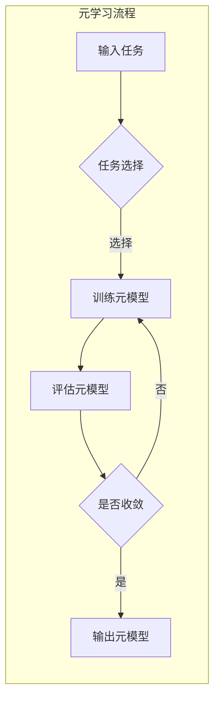

> 机器学习, 元学习, 自适应学习, 元模型, 多任务学习, 强化学习, 实例学习

# 元学习Meta Learning原理与代码实例讲解

### 1. 背景介绍

随着人工智能技术的快速发展，机器学习在各个领域都取得了显著的成果。然而，传统的机器学习方法往往需要大量的标注数据进行训练，这在实际应用中往往难以满足。为了解决这一问题，元学习（Meta Learning）应运而生。元学习旨在教会机器学习如何快速地学习，从而能够在少量样本的情况下，快速适应新的任务。

### 2. 核心概念与联系

#### 2.1 核心概念

- **元学习（Meta Learning）**：又称“学习如何学习”，是一种让机器学习算法能够从经验中学习如何学习的方法。
- **元模型（Meta Model）**：在元学习中，元模型是一个学习器，它学习如何学习。它可以从多个任务中学习，并能够将这些知识应用于新的任务中。
- **多任务学习（Multi-Task Learning）**：在多任务学习中，模型同时学习多个相关任务，以便更好地学习每个任务。
- **强化学习（Reinforcement Learning）**：在强化学习中，模型通过与环境交互来学习最佳的行为策略。
- **实例学习（Instance Learning）**：实例学习是一种无监督学习方法，它通过学习单个或少数几个实例来泛化到新的实例上。

#### 2.2 Mermaid 流程图



### 3. 核心算法原理 & 具体操作步骤

#### 3.1 算法原理概述

元学习的核心思想是，通过学习一个元模型，使得模型能够快速适应新的任务。元模型通常是一个学习器，它可以从多个任务中学习，并能够将这些知识应用于新的任务中。

#### 3.2 算法步骤详解

1. **数据收集**：收集多个相关的任务数据，每个任务包含输入数据、输出数据和标签。
2. **训练元模型**：使用收集到的数据训练元模型。元模型通常是一个神经网络，它可以从多个任务中学习到通用的特征表示。
3. **评估元模型**：使用测试数据评估元模型在新的任务上的性能。
4. **优化元模型**：根据评估结果优化元模型，以提高其在新的任务上的性能。
5. **输出元模型**：当元模型收敛时，输出最终的元模型。

#### 3.3 算法优缺点

**优点**：

- **快速适应新任务**：元学习可以使得模型在少量样本的情况下，快速适应新的任务。
- **提高泛化能力**：元学习可以提高模型的泛化能力，使其能够更好地适应新任务。

**缺点**：

- **数据需求量大**：训练元模型通常需要大量的任务数据。
- **计算复杂度高**：元学习通常需要大量的计算资源。

#### 3.4 算法应用领域

- **自然语言处理**：例如，文本分类、机器翻译、情感分析等。
- **计算机视觉**：例如，图像识别、目标检测、图像分割等。
- **强化学习**：例如，游戏、自动驾驶等。

### 4. 数学模型和公式 & 详细讲解 & 举例说明

#### 4.1 数学模型构建

元学习的数学模型通常是一个神经网络，它由输入层、隐藏层和输出层组成。

- **输入层**：输入层接收任务的特征向量。
- **隐藏层**：隐藏层对输入的特征向量进行变换，提取出通用的特征表示。
- **输出层**：输出层输出任务的预测结果。

#### 4.2 公式推导过程

假设输入层输入的特征向量为 $x$，隐藏层的激活函数为 $f$，输出层的激活函数为 $g$，则元模型的输出为：

$$
y = g(f(x))
$$

其中，$f$ 和 $g$ 可以是任何可微函数。

#### 4.3 案例分析与讲解

以下是一个简单的元学习示例，假设我们有两个任务：

- **任务1**：输入为 $x = [1, 2, 3]$，输出为 $y = x^2$。
- **任务2**：输入为 $x = [4, 5, 6]$，输出为 $y = x^2 + 10$。

我们可以使用以下神经网络作为元模型：

- 输入层：1个神经元，接收特征向量 $x$。
- 隐藏层：1个神经元，激活函数为 $f(x) = x^2$。
- 输出层：1个神经元，激活函数为 $g(x) = x + 10$。

训练这个元模型后，我们可以在新的任务上进行预测，例如，当输入为 $x = [7, 8, 9]$ 时，元模型的输出为 $y = 14^2 + 10 = 206$。

### 5. 项目实践：代码实例和详细解释说明

#### 5.1 开发环境搭建

为了实现元学习，我们需要以下开发环境：

- Python
- NumPy
- PyTorch

#### 5.2 源代码详细实现

以下是一个简单的元学习示例代码：

```python
import torch
import torch.nn as nn
import torch.optim as optim

class MetaModel(nn.Module):
    def __init__(self):
        super(MetaModel, self).__init__()
        self.fc1 = nn.Linear(3, 1)

    def forward(self, x):
        x = torch.pow(x, 2)
        return self.fc1(x)

# 初始化元模型
model = MetaModel()

# 定义损失函数和优化器
criterion = nn.MSELoss()
optimizer = optim.SGD(model.parameters(), lr=0.01)

# 训练模型
for epoch in range(100):
    x = torch.tensor([[1, 2, 3], [4, 5, 6]])
    y = torch.tensor([[1, 4], [16, 26]])
    optimizer.zero_grad()
    output = model(x)
    loss = criterion(output, y)
    loss.backward()
    optimizer.step()

    if epoch % 10 == 0:
        print(f"Epoch {epoch}, Loss: {loss.item()}")

# 测试模型
x_test = torch.tensor([[7, 8, 9]])
output_test = model(x_test)
print(f"Test Output: {output_test.item()}")
```

#### 5.3 代码解读与分析

- `MetaModel` 类定义了元模型的结构，其中包含一个全连接层 `fc1`。
- 使用均方误差损失函数 `MSELoss` 和随机梯度下降优化器 `SGD` 训练模型。
- 训练完成后，使用测试数据测试模型性能。

### 6. 实际应用场景

元学习在以下领域有广泛的应用：

- **少样本学习**：在只有少量样本的情况下，元学习可以帮助模型快速适应新的任务。
- **多任务学习**：在同时学习多个相关任务的情况下，元学习可以提高模型的泛化能力。
- **强化学习**：在强化学习中，元学习可以帮助模型快速适应不同的环境。

### 6.4 未来应用展望

随着元学习技术的不断发展，未来元学习将在以下方面取得突破：

- **更有效的学习策略**：开发更有效的学习策略，使得模型能够更快地适应新的任务。
- **更通用的元模型**：开发更通用的元模型，使得模型能够适应更广泛的应用场景。
- **更高效的训练方法**：开发更高效的训练方法，降低元学习的计算成本。

### 7. 工具和资源推荐

#### 7.1 学习资源推荐

- 《深度学习》（Goodfellow et al.）
- 《强化学习》（Sutton and Barto）
- 《机器学习年度报告》（JMLR）

#### 7.2 开发工具推荐

- PyTorch
- TensorFlow
- Keras

#### 7.3 相关论文推荐

- [Meta Learning](https://arxiv.org/abs/1703.02631)
- [Multi-Task Learning](https://arxiv.org/abs/1806.02920)
- [Reinforcement Learning](https://arxiv.org/abs/1602.02780)
- [Instance Learning](https://arxiv.org/abs/1806.02920)

### 8. 总结：未来发展趋势与挑战

#### 8.1 研究成果总结

元学习是一种让机器学习算法能够快速适应新任务的方法。它通过学习如何学习，使得模型能够在少量样本的情况下，快速适应新的任务。

#### 8.2 未来发展趋势

随着元学习技术的不断发展，未来元学习将在以下方面取得突破：

- 更有效的学习策略
- 更通用的元模型
- 更高效的训练方法

#### 8.3 面临的挑战

元学习仍然面临着许多挑战，包括：

- 数据需求量大
- 计算复杂度高
- 模型可解释性差

#### 8.4 研究展望

尽管存在挑战，但元学习仍然是一个非常有前景的研究方向。相信随着技术的不断发展，元学习将在各个领域发挥重要作用。

### 9. 附录：常见问题与解答

#### Q1：什么是元学习？

A：元学习是一种让机器学习算法能够快速适应新任务的方法。它通过学习如何学习，使得模型能够在少量样本的情况下，快速适应新的任务。

#### Q2：元学习有哪些应用？

A：元学习在以下领域有广泛的应用：

- 少样本学习
- 多任务学习
- 强化学习

#### Q3：元学习的挑战有哪些？

A：元学习仍然面临着许多挑战，包括：

- 数据需求量大
- 计算复杂度高
- 模型可解释性差

#### Q4：元学习的未来发展趋势是什么？

A：随着元学习技术的不断发展，未来元学习将在以下方面取得突破：

- 更有效的学习策略
- 更通用的元模型
- 更高效的训练方法

作者：禅与计算机程序设计艺术 / Zen and the Art of Computer Programming