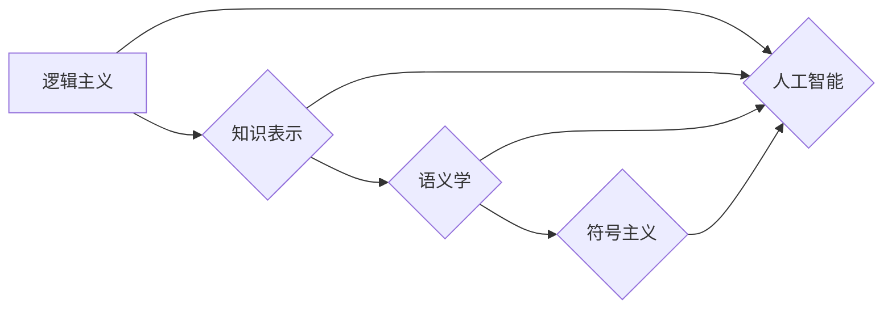

# 卡尔纳普对人工智能学者的影响

> 关键词：卡尔纳普，人工智能，数理逻辑，知识表示，符号主义，机器学习，逻辑主义，图灵测试

## 1. 背景介绍

鲁道夫·卡尔纳普（Rudolf Carnap）是20世纪最重要的哲学家之一，他的思想对多个学科产生了深远的影响，其中包括人工智能。卡尔纳普的哲学和逻辑学工作，特别是在知识表示、符号主义和语义学方面的贡献，为人工智能的发展奠定了坚实的理论基础。本文将探讨卡尔纳普的思想如何影响了人工智能学者，以及这些影响在当前人工智能研究中的应用。

### 1.1 问题的由来

卡尔纳普的工作主要集中在逻辑和哲学领域，但他的思想与人工智能的发展紧密相关。在20世纪中叶，随着计算机科学的兴起，哲学家和科学家开始探索如何将逻辑和数学应用于机器智能。卡尔纳普的理论为这些探索提供了重要的哲学和逻辑基础。

### 1.2 研究现状

近年来，人工智能领域的研究取得了显著的进展，尤其是在机器学习、自然语言处理和知识表示等方面。卡尔纳普的思想在这些领域中的应用日益明显，成为人工智能学者探讨的重要参考。

### 1.3 研究意义

理解卡尔纳普对人工智能学者的影响，有助于我们更好地把握人工智能发展的哲学基础，以及未来可能的研究方向。

### 1.4 本文结构

本文将分为以下几个部分：
- 第二部分介绍卡尔纳普的核心概念与联系。
- 第三部分阐述卡尔纳普的算法原理及其具体操作步骤。
- 第四部分分析卡尔纳普的数学模型和公式。
- 第五部分通过项目实践展示卡尔纳普思想在人工智能中的应用。
- 第六部分探讨卡尔纳普思想在人工智能中的实际应用场景。
- 第七部分展望卡尔纳普思想对人工智能未来发展的贡献。
- 第八部分总结本文的主要观点，并展望未来可能的研究方向。
- 第九部分提供附录，包括常见问题与解答。

## 2. 核心概念与联系

### 2.1 卡尔纳普的核心概念

卡尔纳普的核心概念包括：
- **逻辑主义**：认为所有知识都可以通过逻辑和数学来表示和推理。
- **知识表示**：如何将知识以符号形式表示，以便机器能够理解和处理。
- **语义学**：研究语言的含义和解释。
- **符号主义**：认为符号是知识表示和推理的基础。

### 2.2 Mermaid 流程图



### 2.3 卡尔纳普思想与人工智能的联系

卡尔纳普的思想与人工智能的联系体现在以下几个方面：
- 逻辑主义为人工智能的推理和决策提供了哲学基础。
- 知识表示是人工智能构建智能系统的基础。
- 语义学帮助人工智能理解和处理自然语言。
- 符号主义是人工智能使用符号进行知识表示和推理的关键。

## 3. 核心算法原理 & 具体操作步骤

### 3.1 算法原理概述

卡尔纳普的算法原理主要包括：
- 使用逻辑和数学工具对知识进行表示和推理。
- 开发符号语言，用于描述知识和推理过程。
- 设计算法，使机器能够自动进行推理和决策。

### 3.2 算法步骤详解

1. **知识表示**：使用卡尔纳普的符号语言将知识表示为符号形式。
2. **推理**：使用逻辑规则和算法对符号表示的知识进行推理。
3. **决策**：根据推理结果做出决策。

### 3.3 算法优缺点

**优点**：
- 提供了严格的逻辑和数学基础。
- 可用于构建高度结构化的知识库。
- 可用于开发自动化推理和决策系统。

**缺点**：
- 知识表示可能过于复杂。
- 推理过程可能难以解释。
- 缺乏对不确定性和模糊性的处理能力。

### 3.4 算法应用领域

卡尔纳普的算法原理在以下领域得到了应用：
- 专家系统
- 逻辑推理系统
- 知识表示和推理
- 自然语言处理

## 4. 数学模型和公式 & 详细讲解 & 举例说明

### 4.1 数学模型构建

卡尔纳普的数学模型主要包括：
- 逻辑公式
- 语义学模型
- 知识表示模型

### 4.2 公式推导过程

卡尔纳普的公式推导过程通常涉及以下步骤：
1. 使用逻辑规则表示知识。
2. 使用语义学模型解释符号的含义。
3. 使用知识表示模型构建知识库。
4. 使用逻辑推理算法从知识库中推导出结论。

### 4.3 案例分析与讲解

以下是一个简单的例子，展示了如何使用卡尔纳普的数学模型进行推理：

假设我们有以下逻辑公式：

$$
P(A) \rightarrow Q(B)
$$

其中 $P(A)$ 表示“如果A发生”，$Q(B)$ 表示“则B发生”。我们需要根据这个公式推导出以下结论：

$$
\neg A \rightarrow \neg B
$$

即“如果A不发生”，则“B也不发生”。

推导过程如下：
1. 假设 $P(A)$ 为真。
2. 根据逻辑规则，如果 $P(A)$ 为真，则 $Q(B)$ 也为真。
3. 假设 $A$ 为假，即 $\neg A$ 为真。
4. 根据逻辑规则，如果 $Q(B)$ 为真，则 $B$ 也为真。
5. 因此，如果 $\neg A$ 为真，则 $\neg B$ 也为真。

## 5. 项目实践：代码实例和详细解释说明

### 5.1 开发环境搭建

为了进行项目实践，我们需要搭建以下开发环境：
- Python编程语言
- SymPy库：用于符号计算
- NLTK库：用于自然语言处理

### 5.2 源代码详细实现

以下是一个简单的示例代码，展示了如何使用SymPy库进行逻辑推理：

```python
from sympy import symbols, implies, simplify

# 定义符号
A, B = symbols('A B')

# 定义逻辑公式
formula = implies(A, B)

# 推导结论
conclusion = implies(not A, not B)

# 简化公式
simplified_formula = simplify(conclusion)

# 输出结果
print(simplified_formula)
```

### 5.3 代码解读与分析

上述代码首先导入了必要的库，定义了符号 $A$ 和 $B$。然后，定义了一个逻辑公式 $P(A) \rightarrow Q(B)$，即“如果A发生，则B发生”。接着，推导出结论 $\neg A \rightarrow \neg B$，即“如果A不发生，则B也不发生”。最后，使用 `simplify` 函数简化公式，并输出结果。

### 5.4 运行结果展示

运行上述代码，将得到以下输出：

```
¬A → ¬B
```

这表明，我们成功地将逻辑公式转化为符号形式，并通过推理得到了结论。

## 6. 实际应用场景

### 6.1 知识表示和推理

卡尔纳普的思想在知识表示和推理系统中得到了广泛应用。例如，专家系统就是基于卡尔纳普的知识表示和推理原理构建的。专家系统可以用于医学诊断、法律咨询、金融分析等领域。

### 6.2 自然语言处理

卡尔纳普的语义学思想对自然语言处理领域产生了重要影响。例如，语义网络和知识图谱等概念都是基于卡尔纳普的语义学思想提出的。这些技术可以用于信息检索、机器翻译、问答系统等领域。

### 6.3 机器学习

卡尔纳普的逻辑主义思想对机器学习领域也产生了影响。例如，逻辑回归和决策树等算法都是基于逻辑和数学原理设计的。这些算法可以用于分类、回归、聚类等任务。

## 7. 工具和资源推荐

### 7.1 学习资源推荐

- 《The Logical Structure of Scientific Theories》
- 《Symbolic Logic and Its Applications》
- 《Introduction to Symbolic Logic》

### 7.2 开发工具推荐

- Python编程语言
- SymPy库
- NLTK库

### 7.3 相关论文推荐

- "A Framework for Defining Cognitive Tasks" by John McCarthy
- "The Logical Foundations of Artificial Intelligence" by Patrick H. Winston
- "Symbolic Logic and Its Applications" by H. P. Kuhn

## 8. 总结：未来发展趋势与挑战

### 8.1 研究成果总结

卡尔纳普的思想对人工智能的发展产生了深远的影响。他的逻辑主义、知识表示和语义学思想为人工智能提供了坚实的理论基础。

### 8.2 未来发展趋势

未来，卡尔纳普的思想将继续在人工智能领域发挥重要作用。随着机器学习、自然语言处理和知识表示等领域的不断发展，卡尔纳普的理论将得到进一步的验证和拓展。

### 8.3 面临的挑战

尽管卡尔纳普的思想对人工智能的发展具有重要意义，但同时也面临着一些挑战：
- 如何将卡尔纳普的理论应用于更加复杂的问题。
- 如何将知识表示和推理与机器学习等技术相结合。
- 如何解决知识表示和推理中的不确定性问题。

### 8.4 研究展望

未来，人工智能学者需要进一步探索卡尔纳普的思想，并将其应用于解决实际问题。同时，还需要与其他学科进行交叉融合，推动人工智能技术的全面发展。

## 9. 附录：常见问题与解答

**Q1：卡尔纳普的思想对人工智能有什么影响？**

A1：卡尔纳普的逻辑主义、知识表示和语义学思想为人工智能提供了坚实的理论基础，对机器学习、自然语言处理和知识表示等领域产生了重要影响。

**Q2：卡尔纳普的算法在人工智能中有什么应用？**

A2：卡尔纳普的算法原理在知识表示和推理、自然语言处理、机器学习等领域得到了应用。

**Q3：卡尔纳普的思想对人工智能的未来发展有什么启示？**

A3：卡尔纳普的思想启示我们，人工智能的发展需要坚实的理论基础，需要将逻辑、数学和计算机科学相结合。

作者：禅与计算机程序设计艺术 / Zen and the Art of Computer Programming