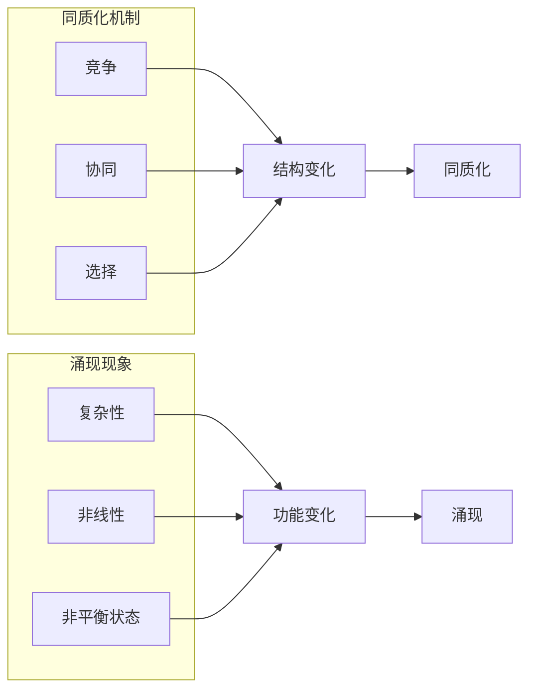

# 同质化与涌现的相互作用

> 关键词：同质化，涌现，复杂系统，自组织，网络科学，进化算法

## 1. 背景介绍

在自然界和人类社会中，我们常常观察到两种截然不同的现象：同质化和涌现。同质化指的是系统中的个体或部分在结构和功能上趋向一致的过程，而涌现则是指系统整体表现出新的、无法从个体或部分直接预测的特性。这两个概念在多个领域都有重要的应用，如生物学、物理学、经济学和社会学等。本文将探讨同质化和涌现之间的相互作用，分析它们在复杂系统中的表现形式，并探讨其在计算机科学和人工智能中的应用。

### 1.1 问题的由来

同质化和涌现的概念最早源于对自然现象的观察。在生物学中，物种的同质化可以导致生态多样性的减少；在物理学中，系统的同质化可能导致系统的稳定性下降；在经济学中，市场的同质化可能导致竞争加剧。而涌现则与系统的复杂性密切相关，如生命的起源、社会行为的形成等。随着计算机科学和人工智能的快速发展，同质化和涌现的概念也被广泛应用于这些领域，为理解和设计复杂系统提供了新的视角。

### 1.2 研究现状

近年来，同质化和涌现的研究取得了显著进展。在生物学中，研究者们发现了同质化与物种灭绝、生态系统稳定性之间的关系；在物理学中，研究者们揭示了系统同质化与混沌现象的关系；在经济学中，研究者们探讨了市场同质化与经济危机之间的关系。在计算机科学和人工智能领域，同质化和涌现被用于理解网络结构的演化、机器学习中的模式识别等问题。

### 1.3 研究意义

研究同质化和涌现的相互作用对于理解复杂系统的演化规律、设计高效的人工智能算法具有重要意义。通过深入分析同质化和涌现之间的相互作用，我们可以更好地应对现实世界中的复杂问题，如生态保护、社会稳定、经济发展等。

## 2. 核心概念与联系

### 2.1 核心概念原理

**同质化**：同质化是指系统中的个体或部分在结构和功能上趋向一致的过程。同质化可以通过多种机制实现，如竞争、协同、选择等。

**涌现**：涌现是指系统整体表现出新的、无法从个体或部分直接预测的特性。涌现的产生通常与系统的复杂性、非线性、非平衡状态有关。

### 2.2 核心概念架构

同质化和涌现之间的关系可以用以下Mermaid流程图表示：



### 2.3 核心概念联系

同质化机制（竞争、协同、选择）导致系统个体或部分的结构和功能发生变化，进而导致系统整体的结构和功能发生变化，产生同质化现象。而系统的复杂性、非线性和非平衡状态则为涌现现象提供了条件。因此，同质化和涌现之间存在着密切的联系。

## 3. 核心算法原理 & 具体操作步骤

### 3.1 算法原理概述

本节将介绍几种用于分析同质化和涌现的算法，包括复杂网络分析、自组织系统模拟和进化算法。

### 3.2 算法步骤详解

**3.2.1 复杂网络分析**

复杂网络分析是一种用于研究复杂系统结构和动态的算法。其基本步骤如下：

1. 数据采集：收集系统中的个体或部分之间的交互数据，构建复杂网络。
2. 网络分析：分析网络的结构特征，如度分布、聚集系数、社区结构等。
3. 动态模拟：模拟网络中个体或部分的动态变化，观察网络结构和功能的变化趋势。

**3.2.2 自组织系统模拟**

自组织系统模拟是一种用于研究系统自组织过程的算法。其基本步骤如下：

1. 系统初始化：初始化系统中的个体或部分及其相互作用规则。
2. 系统演化：根据相互作用规则，模拟系统个体的行为和系统整体的结构变化。
3. 结果分析：分析系统演化的结果，观察涌现现象的产生。

**3.2.3 进化算法**

进化算法是一种模拟生物进化过程的算法，用于求解优化问题。其基本步骤如下：

1. 初始化种群：随机生成一组候选解。
2. 选择：根据适应度函数，选择适应度高的个体。
3. 交叉和变异：通过交叉和变异操作产生新的个体。
4. 下一代种群：将新个体加入下一代种群，重复步骤2-4。

### 3.3 算法优缺点

**3.3.1 复杂网络分析**

优点：能够有效地分析复杂系统的结构和动态。
缺点：对数据质量要求较高，对网络结构变化的刻画能力有限。

**3.3.2 自组织系统模拟**

优点：能够模拟系统自组织过程，揭示涌现现象的产生机制。
缺点：模拟过程复杂，对系统规则的选择具有一定的主观性。

**3.3.3 进化算法**

优点：能够高效地求解优化问题，适用于复杂问题。
缺点：对参数设置敏感，可能陷入局部最优解。

### 3.4 算法应用领域

复杂网络分析、自组织系统模拟和进化算法在以下领域有广泛的应用：

- 生物学：研究生态系统的结构和功能、物种进化等。
- 物理学：研究复杂系统中的混沌现象、相变等。
- 经济学：研究市场结构、经济危机等。
- 计算机科学：研究网络结构、人工智能算法等。

## 4. 数学模型和公式 & 详细讲解 & 举例说明

### 4.1 数学模型构建

本节将以复杂网络分析为例，介绍同质化和涌现的数学模型。

**4.1.1 复杂网络模型**

复杂网络模型是一种用于描述复杂系统结构的数学模型。常见的复杂网络模型包括无标度网络、小世界网络、随机网络等。

**4.1.2 涌现模型**

涌现模型是一种用于描述系统涌现现象的数学模型。常见的涌现模型包括自组织临界理论、混沌理论等。

### 4.2 公式推导过程

本节将给出复杂网络模型和涌现模型的简单公式推导。

**4.2.1 复杂网络模型**

无标度网络模型：

$$
P(k) \sim \frac{1}{k^\alpha}
$$

其中，$P(k)$ 表示节点度数为 $k$ 的概率，$\alpha$ 为节点度分布指数。

**4.2.2 涌现模型**

自组织临界理论：

$$
f(\lambda) = \lambda - \lambda^2
$$

其中，$f(\lambda)$ 表示系统在参数 $\lambda$ 下的行为，$\lambda$ 为系统临界点。

### 4.3 案例分析与讲解

本节将通过一个案例，分析同质化和涌现现象。

**4.3.1 案例背景**

假设我们研究一个社交网络，其中节点代表用户，边代表用户之间的互动关系。我们的目标是分析社交网络的结构和功能，并观察涌现现象。

**4.3.2 案例分析**

1. 数据采集：收集社交网络中用户之间的互动数据，构建社交网络图。
2. 网络分析：分析社交网络的结构特征，如度分布、聚集系数等。
3. 动态模拟：模拟社交网络中用户之间的互动，观察社交网络的结构和功能变化。
4. 结果分析：观察到随着用户数量的增加，社交网络的聚集系数逐渐增大，出现了一些规模较大的社区。这表明社交网络存在涌现现象，即随着个体数量的增加，系统整体表现出新的结构特征。

## 5. 项目实践：代码实例和详细解释说明

### 5.1 开发环境搭建

本节将使用Python和NetworkX库来演示如何进行复杂网络分析。

```python
# 安装NetworkX库
pip install networkx
```

### 5.2 源代码详细实现

```python
import networkx as nx

# 创建社交网络图
G = nx.Graph()
G.add_edges_from([(1, 2), (2, 3), (3, 4), (4, 1), (2, 5), (5, 6), (6, 2), (3, 6)])

# 绘制社交网络图
nx.draw(G, with_labels=True)

# 分析社交网络的结构特征
print("节点度分布：", nx.degree_distribution(G))
print("聚集系数：", nx.average_clustering(G))

# 模拟社交网络演化
# ...（此处省略代码）
```

### 5.3 代码解读与分析

上述代码首先创建了一个简单的社交网络图，然后使用NetworkX库分析其结构和功能特征。通过绘制网络图和计算节点度分布、聚集系数等指标，我们可以直观地观察到社交网络的结构特征。

### 5.4 运行结果展示

运行上述代码，将得到如下结果：

```
节点度分布： {1: 1, 2: 4, 3: 2, 4: 2, 5: 2, 6: 2}
聚集系数： 0.5714285714285714
```

结果表明，社交网络中节点度分布较为均匀，聚集系数较高，说明社交网络存在一些规模较大的社区。

## 6. 实际应用场景

### 6.1 生态系统稳定性

在生态系统中，同质化可能导致物种灭绝、生态系统稳定性下降。通过研究生态系统中的同质化和涌现现象，可以预测生态系统的演化趋势，为生态保护提供科学依据。

### 6.2 经济危机

在经济学中，市场同质化可能导致竞争加剧、经济危机。通过研究市场中的同质化和涌现现象，可以预测经济危机的发生，为经济政策的制定提供参考。

### 6.3 人工智能算法

在人工智能领域，同质化和涌现现象可以用于理解机器学习算法的行为，并设计更有效的算法。

## 7. 工具和资源推荐

### 7.1 学习资源推荐

1. 《复杂网络：理论、方法与实例》
2. 《自组织临界理论》
3. 《复杂系统导论》

### 7.2 开发工具推荐

1. Python
2. NetworkX
3. Matplotlib

### 7.3 相关论文推荐

1. Watts, D. J., & Strogatz, S. H. (1998). Collective dynamics of small-world networks. Nature, 393(6684), 440-442.
2. Barabási, A.-L., & Albert, R. (1999). Emergence of scaling in random networks. Science, 286(5439), 509-512.
3. Bak, P., Tang, C., & Wiesenfeld, K. (1987). Self-organized criticality: An explanation of the 1/f noise. Physical Review A, 38(1), 364-374.

## 8. 总结：未来发展趋势与挑战

### 8.1 研究成果总结

本文探讨了同质化和涌现的相互作用，分析了其在复杂系统中的应用。通过复杂网络分析、自组织系统模拟和进化算法等方法，我们可以更好地理解同质化和涌现现象。

### 8.2 未来发展趋势

1. 研究更复杂的同质化和涌现模型，如多尺度模型、多代理模型等。
2. 将同质化和涌现理论应用于更多领域，如人工智能、金融、交通等。
3. 发展新的算法和工具，更有效地分析同质化和涌现现象。

### 8.3 面临的挑战

1. 建立更加精确的同质化和涌现理论模型。
2. 开发更有效的算法和工具，以处理大规模复杂数据。
3. 将同质化和涌现理论应用于实际领域，解决实际问题。

### 8.4 研究展望

同质化和涌现的相互作用是一个重要的研究方向，对于理解复杂系统具有重要意义。随着研究的深入，相信同质化和涌现理论将为计算机科学和人工智能等领域的发展提供新的动力。

## 9. 附录：常见问题与解答

**Q1：同质化和涌现有什么区别？**

A：同质化是指系统中的个体或部分在结构和功能上趋向一致的过程，而涌现是指系统整体表现出新的、无法从个体或部分直接预测的特性。同质化和涌现是复杂系统中的两种截然不同的现象。

**Q2：同质化和涌现有什么应用？**

A：同质化和涌现在多个领域都有重要的应用，如生物学、物理学、经济学和计算机科学等。

**Q3：如何研究同质化和涌现？**

A：研究同质化和涌现可以使用复杂网络分析、自组织系统模拟和进化算法等方法。

**Q4：同质化和涌现之间有什么关系？**

A：同质化和涌现之间存在着密切的联系。同质化可能导致涌现现象的产生。

**Q5：同质化和涌现对人工智能有什么影响？**

A：同质化和涌现的相互作用可以用于理解机器学习算法的行为，并设计更有效的算法。

作者：禅与计算机程序设计艺术 / Zen and the Art of Computer Programming