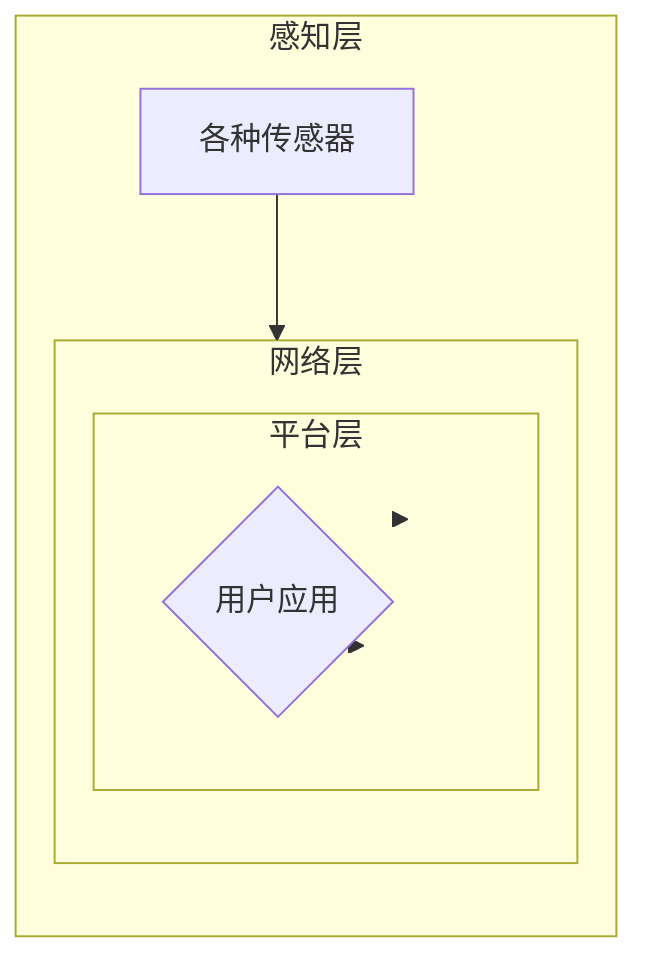

# 基于Java的智能家居设计：让Java成为您智能家居系统的大脑

> 关键词：智能家居，Java，物联网，Java EE，微服务，RESTful API，MQTT，MQTT broker，Spring Boot

## 1. 背景介绍

随着物联网（IoT）技术的快速发展，智能家居市场正迎来前所未有的增长。智能家居系统通过将各种智能设备连接起来，为用户提供更加便捷、舒适、节能的生活方式。Java作为一种成熟、稳定的编程语言，在构建智能家居系统中扮演着越来越重要的角色。本文将探讨如何利用Java技术构建一个高效、可靠的智能家居系统，使其成为用户家中智能生活的大脑。

## 2. 核心概念与联系

### 2.1 智能家居系统架构

智能家居系统通常采用分层架构，包括感知层、网络层、平台层和应用层。以下是一个基于Mermaid流程图表示的智能家居系统架构：



### 2.2 Java技术栈

在智能家居系统的开发中，Java技术栈扮演着核心角色。以下是一些关键技术和框架：

- **Java EE**：提供企业级应用开发所需的框架和规范，如EJB、JPA、JSF等。
- **Spring Boot**：简化Java EE应用开发，提供自动配置、嵌入式服务器等功能。
- **RESTful API**：用于构建可扩展的网络服务，实现设备与平台层之间的通信。
- **MQTT**：轻量级的消息传输协议，适用于物联网设备间的通信。
- **MQTT broker**：用于消息代理和路由的消息服务器。

## 3. 核心算法原理 & 具体操作步骤

### 3.1 算法原理概述

智能家居系统的核心算法包括：

- **数据采集与处理**：通过传感器采集环境数据，如温度、湿度、光照等。
- **事件处理**：根据采集到的数据，触发相应的事件，如自动调节空调、灯光等。
- **决策与控制**：根据预设规则或学习到的模式，决策和控制设备行为。
- **用户交互**：通过用户界面与用户进行交互，如手机应用、网页界面等。

### 3.2 算法步骤详解

1. **数据采集与处理**：使用传感器采集环境数据，并进行初步处理，如滤波、归一化等。
2. **事件处理**：根据预设规则或机器学习模型，对采集到的数据进行事件识别。
3. **决策与控制**：根据事件处理结果，决策和控制智能设备的行为。
4. **用户交互**：通过用户界面展示系统状态，接收用户指令，并反馈执行结果。

### 3.3 算法优缺点

**优点**：

- **Java EE** 提供成熟的企业级解决方案，保证系统稳定性和可扩展性。
- **Spring Boot** 简化开发流程，提高开发效率。
- **RESTful API** 方便设备与平台层之间的通信。
- **MQTT** 适用于低功耗、低带宽的物联网设备通信。

**缺点**：

- **Java EE** 学习曲线较陡峭，需要一定的学习成本。
- **Java** 在运行时资源消耗较大，对硬件要求较高。

### 3.4 算法应用领域

智能家居系统的算法应用领域包括：

- **家庭自动化**：自动调节灯光、温度、湿度等。
- **安全监控**：实时监控家庭安全，如门窗状态、烟雾报警等。
- **健康监测**：监测家庭成员的健康状况，如心率、血压等。
- **能源管理**：优化能源使用，降低能耗。

## 4. 数学模型和公式 & 详细讲解 & 举例说明

### 4.1 数学模型构建

智能家居系统中的数学模型通常包括以下几种：

- **线性回归**：用于预测设备状态，如温度、湿度等。
- **决策树**：用于分类任务，如设备故障诊断。
- **支持向量机**：用于分类和回归任务。

### 4.2 公式推导过程

以下以线性回归为例，介绍公式推导过程：

假设我们要预测房间温度 $T$，其数学模型为：

$$
T = \beta_0 + \beta_1 \cdot X_1 + \beta_2 \cdot X_2 + \cdots + \beta_n \cdot X_n + \epsilon
$$

其中 $X_1, X_2, \cdots, X_n$ 为影响温度的因素，$\beta_0, \beta_1, \cdots, \beta_n$ 为模型参数，$\epsilon$ 为误差项。

### 4.3 案例分析与讲解

以下以智能空调为例，分析智能家居系统的数学模型和算法。

**场景**：当室内温度超过设定值时，空调自动开启。

**数学模型**：

- 设定值 $T_{set}$：用户设定的温度阈值。
- 实时温度 $T_{real}$：传感器采集到的实时温度。
- 空调开关状态 $S_{AC}$：1表示开启，0表示关闭。

**算法**：

- 当 $T_{real} > T_{set}$ 时，$S_{AC} = 1$，开启空调。
- 当 $T_{real} \leq T_{set}$ 时，$S_{AC} = 0$，关闭空调。

## 5. 项目实践：代码实例和详细解释说明

### 5.1 开发环境搭建

以下是使用Java技术栈搭建智能家居系统开发环境的步骤：

1. 安装Java开发工具包（JDK）。
2. 安装集成开发环境（IDE），如IntelliJ IDEA或Eclipse。
3. 安装Spring Boot和RESTful API开发库。
4. 安装MQTT broker，如Mosquitto或Eclipse Mosquitto。

### 5.2 源代码详细实现

以下是一个简单的智能家居系统示例，使用Spring Boot框架和RESTful API实现设备控制功能。

```java
@RestController
@RequestMapping("/api/devices")
public class DeviceController {

    @Autowired
    private DeviceService deviceService;

    @PostMapping("/turnOn")
    public ResponseEntity<String> turnOnDevice(@RequestParam String deviceId) {
        deviceService.turnOnDevice(deviceId);
        return ResponseEntity.ok("Device " + deviceId + " turned on.");
    }

    @PostMapping("/turnOff")
    public ResponseEntity<String> turnOffDevice(@RequestParam String deviceId) {
        deviceService.turnOffDevice(deviceId);
        return ResponseEntity.ok("Device " + deviceId + " turned off.");
    }
}
```

### 5.3 代码解读与分析

以上代码定义了一个简单的设备控制API，包括开启和关闭设备的功能。其中，`DeviceService`负责与MQTT broker通信，控制设备状态。

```java
@Service
public class DeviceService {

    @Autowired
    private MQTTClient mqttClient;

    public void turnOnDevice(String deviceId) {
        mqttClient.publish("device/" + deviceId + "/on", "true");
    }

    public void turnOffDevice(String deviceId) {
        mqttClient.publish("device/" + deviceId + "/off", "false");
    }
}
```

### 5.4 运行结果展示

当用户通过API调用 `/api/devices/turnOn?deviceId=AC` 时，设备控制服务会向MQTT broker发送消息，通知空调开启。

## 6. 实际应用场景

智能家居系统在实际应用中具有广泛的应用场景，以下列举几个典型例子：

- **家庭自动化**：自动调节灯光、窗帘、空调等设备，提高居住舒适度。
- **安全监控**：实时监控家庭安全，如门窗状态、烟雾报警等。
- **健康监测**：监测家庭成员的健康状况，如心率、血压等。
- **能源管理**：优化能源使用，降低能耗。

## 7. 工具和资源推荐

### 7.1 学习资源推荐

- **Java EE官方文档**：https://docs.oracle.com/en/java/javase/
- **Spring Boot官方文档**：https://spring.io/projects/spring-boot
- **RESTful API设计指南**：https://restfulapi.net/
- **MQTT官方文档**：https://mosquitto.org/

### 7.2 开发工具推荐

- **IntelliJ IDEA**：https://www.jetbrains.com/idea/
- **Eclipse**：https://www.eclipse.org/
- **Postman**：https://www.postman.com/

### 7.3 相关论文推荐

- **《Smart Home Systems: State of the Art and Challenges》**：https://ieeexplore.ieee.org/document/7277436
- **《A Survey on Home Automation: Techniques, Applications, and Future Trends》**：https://ieeexplore.ieee.org/document/7288715

## 8. 总结：未来发展趋势与挑战

### 8.1 研究成果总结

本文介绍了基于Java的智能家居系统设计，分析了系统架构、核心算法、技术栈等内容，并给出了实际应用场景和代码实例。通过本文的学习，读者可以了解到如何利用Java技术构建一个高效、可靠的智能家居系统。

### 8.2 未来发展趋势

智能家居系统未来发展趋势包括：

- **多智能体协同**：智能家居系统将与其他智能系统（如智慧城市、智慧医疗等）进行协同，实现更加智能化的生活体验。
- **边缘计算**：将计算能力下沉到边缘设备，提高系统响应速度和实时性。
- **个性化定制**：根据用户需求，为用户提供更加个性化的智能家居解决方案。

### 8.3 面临的挑战

智能家居系统在发展过程中面临着以下挑战：

- **数据安全和隐私保护**：智能家居系统涉及大量用户隐私数据，如何保证数据安全和隐私保护是一个重要问题。
- **设备兼容性**：智能家居设备种类繁多，如何保证设备之间的兼容性是一个挑战。
- **人机交互**：如何设计更加自然、便捷的人机交互界面，是提升用户体验的关键。

### 8.4 研究展望

未来，智能家居系统将在以下几个方面进行深入研究：

- **人工智能**：利用人工智能技术，实现更加智能化的家庭生活。
- **区块链**：利用区块链技术，保障智能家居系统的数据安全和隐私保护。
- **5G技术**：利用5G技术，提高智能家居系统的实时性和稳定性。

## 9. 附录：常见问题与解答

**Q1：Java是否适合用于智能家居系统开发？**

A：是的，Java适合用于智能家居系统开发。Java具有成熟的技术栈、良好的跨平台性和稳定性，能够满足智能家居系统开发的需求。

**Q2：如何保证智能家居系统的安全性？**

A：为了保证智能家居系统的安全性，可以采取以下措施：

- 采用加密通信协议，如TLS/SSL。
- 对用户数据进行脱敏处理。
- 限制设备访问权限，防止未授权访问。
- 定期更新系统漏洞补丁。

**Q3：如何实现智能家居系统的个性化定制？**

A：可以通过以下方式实现智能家居系统的个性化定制：

- 用户自定义场景和规则。
- 根据用户行为，动态调整设备状态。
- 利用机器学习技术，预测用户需求。

**Q4：智能家居系统如何与智慧城市系统协同？**

A：智能家居系统可以通过以下方式与智慧城市系统协同：

- 数据共享：将智能家居系统采集到的数据共享给智慧城市系统。
- 资源共享：共享智慧城市系统提供的资源，如公共安全、交通管理等。
- 业务协同：协同开展智慧城市相关业务，如环保、能源管理等。

作者：禅与计算机程序设计艺术 / Zen and the Art of Computer Programming