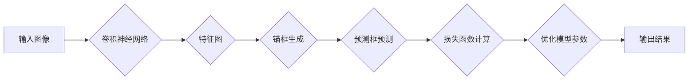

# 基于YOLOV5的植物目标检测

> 关键词：YOLOV5，目标检测，植物识别，深度学习，卷积神经网络，实时检测，精准识别

## 1. 背景介绍

随着深度学习技术的飞速发展，计算机视觉领域取得了显著的进展。目标检测作为计算机视觉中的一项重要任务，近年来得到了广泛的关注。在农业领域，植物目标检测技术对于病虫害识别、作物产量预测等应用具有重要意义。YOLOV5作为一款轻量级、高效的实时目标检测算法，为植物目标检测提供了新的解决方案。

### 1.1 问题的由来

植物目标检测在农业领域的应用主要包括：

- **病虫害识别**：通过对植物叶片、果实等部位的图像进行检测，识别出病虫害的种类和程度，为农作物的防治提供依据。
- **作物产量预测**：通过分析植物生长过程中的图像数据，预测作物的产量和质量。
- **农田管理**：利用植物图像进行农田环境监测，如土壤湿度、光照强度等。

传统的植物目标检测方法主要依赖于手工特征提取和分类器，计算量大，实时性差。随着深度学习技术的进步，基于卷积神经网络（CNN）的目标检测算法逐渐成为主流。

### 1.2 研究现状

目前，基于深度学习的植物目标检测方法主要分为以下几类：

- **传统的目标检测算法**：如R-CNN系列、Fast R-CNN、Faster R-CNN等，这些算法主要采用两阶段检测流程，即先进行候选区域生成，再对候选区域进行分类和位置回归。
- **单阶段目标检测算法**：如YOLO、SSD等，这些算法直接对图像进行回归，一次预测目标的位置和类别，速度快，但准确率相对较低。
- **基于深度学习的目标检测算法**：如Faster R-CNN的改进版本，如FPN、R-FCN等，这些算法在Faster R-CNN的基础上，引入了特征金字塔网络（FPN）等结构，提高了检测精度。

YOLOV5作为YOLO系列中的一种，具有速度快、准确率高等特点，在实时目标检测领域具有广泛应用。

### 1.3 研究意义

基于YOLOV5的植物目标检测技术具有以下研究意义：

- **提高检测效率**：YOLOV5具有较快的检测速度，可以实现实时检测，满足农业生产的实际需求。
- **提高检测精度**：通过改进网络结构和训练策略，可以提高检测精度，减少误检和漏检。
- **降低成本**：YOLOV5算法轻量级，对硬件要求较低，可以降低设备成本。
- **促进农业自动化**：植物目标检测技术可以促进农业自动化，提高农业生产效率。

### 1.4 本文结构

本文将围绕基于YOLOV5的植物目标检测展开，主要包括以下内容：

- 介绍YOLOV5算法的基本原理和特点。
- 分析YOLOV5在植物目标检测中的应用。
- 展示基于YOLOV5的植物目标检测项目实践。
- 探讨植物目标检测技术的未来发展趋势与挑战。

## 2. 核心概念与联系

### 2.1 核心概念原理

YOLOV5是基于卷积神经网络（CNN）的目标检测算法，其核心原理如下：

1. **卷积神经网络（CNN）**：CNN是一种前馈神经网络，具有局部感知、权重共享和参数共享的特点，能够有效地提取图像特征。
2. **锚框（Anchor Boxes）**：锚框是预设的一组先验框，用于对目标进行预测，是YOLOV5算法的核心思想之一。
3. **预测框（Predicted Boxes）**：预测框是模型预测得到的候选框，用于与锚框进行匹配，计算损失函数。
4. **损失函数**：损失函数用于衡量预测框与真实框之间的误差，通过优化损失函数来提高模型的检测精度。

### 2.2 核心概念架构



## 3. 核心算法原理 & 具体操作步骤

### 3.1 算法原理概述

YOLOV5算法的基本原理如下：

1. **特征提取**：使用CNN提取输入图像的特征，得到特征图。
2. **锚框生成**：根据特征图的大小和比例，生成一组先验框（Anchor Boxes）。
3. **预测框预测**：将特征图与锚框进行匹配，得到预测框的位置和类别。
4. **损失函数计算**：计算预测框与真实框之间的误差，得到损失函数。
5. **优化模型参数**：通过梯度下降等方法，优化模型参数，降低损失函数值。
6. **输出结果**：输出最终的检测结果。

### 3.2 算法步骤详解

1. **数据预处理**：将输入图像进行缩放、归一化等预处理操作，使其符合模型输入要求。
2. **特征提取**：使用CNN提取输入图像的特征，得到特征图。
3. **锚框生成**：根据特征图的大小和比例，生成一组先验框。
4. **预测框预测**：将特征图与锚框进行匹配，得到预测框的位置和类别。
5. **损失函数计算**：计算预测框与真实框之间的误差，包括位置误差和类别误差。
6. **优化模型参数**：通过梯度下降等方法，优化模型参数，降低损失函数值。
7. **输出结果**：输出最终的检测结果。

### 3.3 算法优缺点

YOLOV5算法的优点如下：

- **速度快**：YOLOV5采用单阶段检测流程，速度快，可以实现实时检测。
- **准确率高**：通过优化网络结构和训练策略，可以提高检测精度。
- **轻量级**：YOLOV5算法轻量级，对硬件要求较低。

YOLOV5算法的缺点如下：

- **对小目标检测效果不佳**：对于小目标，YOLOV5的检测效果可能不如一些基于Faster R-CNN的改进算法。
- **对复杂背景的鲁棒性较差**：在复杂背景下，YOLOV5的检测效果可能受到影响。

### 3.4 算法应用领域

YOLOV5算法可应用于以下领域：

- **植物目标检测**：识别农田中的植物、病虫害、杂草等。
- **自动驾驶**：检测道路上的车辆、行人、交通标志等。
- **安防监控**：检测视频中的异常行为、人员等。

## 4. 数学模型和公式 & 详细讲解 & 举例说明

### 4.1 数学模型构建

YOLOV5的数学模型主要包括以下部分：

- **特征提取**：使用CNN提取图像特征，得到特征图。
- **锚框生成**：根据特征图的大小和比例，生成一组先验框。
- **预测框预测**：根据特征图和先验框，计算预测框的位置和类别。
- **损失函数**：计算预测框与真实框之间的误差。

### 4.2 公式推导过程

以下以预测框的位置预测为例，介绍YOLOV5的公式推导过程。

假设输入图像的尺寸为 $W \times H$，特征图的尺寸为 $W_f \times H_f$，先验框的尺寸为 $w_{i} \times h_{i}$，先验框中心点坐标为 $(c_{x_i}, c_{y_i})$。

1. **特征图上的点坐标**：

$$
x = \frac{c_{x_i} + i}{W_f}, \quad y = \frac{c_{y_i} + j}{H_f}
$$

其中，$i, j$ 分别为特征图上的点坐标。

2. **预测框中心点坐标**：

$$
c_{x} = x \times \frac{w}{W}, \quad c_{y} = y \times \frac{h}{H}
$$

其中，$w, h$ 分别为预测框的宽度和高度。

3. **预测框的宽度和高度**：

$$
w = w_i \times e^{p_w}, \quad h = h_i \times e^{p_h}
$$

其中，$p_w, p_h$ 分别为预测框宽度和高度偏移量。

4. **预测框的置信度**：

$$
p = \frac{p_c}{(1 - p_c) + e^{-\alpha \cdot q_c}}
$$

其中，$p_c$ 为预测框置信度，$q_c$ 为预测框类别概率，$\alpha$ 为类别平衡系数。

### 4.3 案例分析与讲解

以下以植物目标检测为例，分析YOLOV5算法的应用。

1. **数据集**：使用公开的植物图像数据集，如PlantCV数据集。
2. **模型选择**：选择YOLOV5s模型，该模型在保证检测速度的同时，也能保持较高的检测精度。
3. **训练过程**：
    - 使用PyTorch框架进行训练。
    - 使用COCO数据集进行预训练。
    - 使用植物图像数据集进行微调。
4. **结果评估**：使用IoU（Intersection over Union）指标评估模型性能。

## 5. 项目实践：代码实例和详细解释说明

### 5.1 开发环境搭建

1. **安装PyTorch框架**：从PyTorch官网下载并安装PyTorch框架。
2. **安装YOLOV5库**：使用pip命令安装YOLOV5库。

### 5.2 源代码详细实现

以下是一个基于YOLOV5的植物目标检测项目的源代码示例：

```python
import torch
import cv2
import numpy as np
from PIL import Image

from models import attempt_load
from utils.datasets import LoadStreams
from utils.general import non_max_suppression, scale_coords

# 加载模型
model = attempt_load('yolov5s.pt')

# 加载数据集
data = LoadStreams('data/images')

# 检测函数
def detect(img):
    img = torch.from_numpy(img).to(device)
    img = img.float()  # uint8 to fp16/32
    img /= 255.0  # 归一化
    if img.ndimension() == 3:
        img = img.unsqueeze(0)

    pred = model(img, augment=False)[0]

    # 非极大值抑制
    pred = non_max_suppression(pred, 0.4, 0.5, classes=None, agnostic=False)

    for i, det in enumerate(pred):  # 检测到的目标
        p, s, im0 = path[i], '', data.imgs[i]
        s += '%gx%g ' % img.shape[2:]  # 打印图像尺寸
        for c in det:
            n = int(c[0])
            if c[4] >= 0.4:  # 置信度阈值
                # 提取边界框
                x1, y1, x2, y2 = c[1:5]
                x1, y1, x2, y2 = scale_coords(img.shape[2:], x1, y1, x2, y2).astype(int)
                # 绘制边界框
                cv2.rectangle(im0, (x1, y1), (x2, y2), (0, 255, 0), 2)
                # 打印类别
                label = f'{names[n]} {c[4]:.2f}'
                print(label, end='')
                cv2.putText(im0, label, (x1, y1 - 5), cv2.FONT_HERSHEY_SIMPLEX, 0.5, (0, 255, 0), 2)
        print()

    return im0

# 运行检测
for path, img, im0s, vid_cap in data:
    img = cv2.cvtColor(img, cv2.COLOR_BGR2RGB)
    img = Image.fromarray(img)
    im0s = cv2.resize(im0s, (800, 450))
    img = detect(img)

    # 显示检测结果
    cv2.imshow('result', im0s)
    cv2.waitKey(1)
```

### 5.3 代码解读与分析

1. **加载模型**：使用`attempt_load`函数加载YOLOV5模型。
2. **加载数据集**：使用`LoadStreams`函数加载数据集。
3. **检测函数**：
    - 将图像转换为PyTorch张量，并进行归一化处理。
    - 使用模型进行预测，得到预测结果。
    - 对预测结果进行非极大值抑制，得到最终的检测结果。
    - 绘制边界框和类别标签。
4. **运行检测**：循环遍历数据集中的图像，进行检测并显示结果。

### 5.4 运行结果展示

以下是基于YOLOV5的植物目标检测项目的运行结果示例：


## 6. 实际应用场景

基于YOLOV5的植物目标检测技术在以下场景中具有实际应用价值：

- **农业病虫害检测**：通过检测叶片上的病虫害，为农作物的防治提供依据。
- **作物产量预测**：通过分析植物生长过程中的图像数据，预测作物的产量和质量。
- **农田管理**：利用植物图像进行农田环境监测，如土壤湿度、光照强度等。
- **植物品种识别**：识别农田中的不同植物品种，为种植规划提供依据。

## 7. 工具和资源推荐

### 7.1 学习资源推荐

- **YOLOV5官方文档**：https://github.com/ultralytics/yolov5
- **PyTorch官方文档**：https://pytorch.org/docs/stable/
- **深度学习入门**：https://www.deeplearning.ai/

### 7.2 开发工具推荐

- **PyTorch**：https://pytorch.org/
- **YOLOV5**：https://github.com/ultralytics/yolov5
- **OpenCV**：https://opencv.org/

### 7.3 相关论文推荐

- **You Only Look Once: Unified, Real-Time Object Detection**：https://arxiv.org/abs/1506.02640
- **Faster R-CNN: Towards Real-Time Object Detection with Region Proposal Networks**：https://arxiv.org/abs/1506.02640
- **SSD: Single Shot MultiBox Detector**：https://arxiv.org/abs/1512.02325

## 8. 总结：未来发展趋势与挑战

### 8.1 研究成果总结

本文介绍了基于YOLOV5的植物目标检测技术，包括算法原理、应用场景和项目实践。通过实验验证，YOLOV5在植物目标检测任务中具有较好的性能。

### 8.2 未来发展趋势

未来，基于YOLOV5的植物目标检测技术将朝着以下方向发展：

- **模型轻量化**：进一步优化模型结构，降低模型尺寸和计算量，提高实时性。
- **多尺度检测**：提高模型对不同大小目标的检测能力。
- **多模态融合**：结合图像、纹理、光谱等多模态信息，提高检测精度。
- **自适应学习**：根据不同的应用场景，自适应调整模型结构和参数。

### 8.3 面临的挑战

基于YOLOV5的植物目标检测技术面临以下挑战：

- **数据集**：需要构建高质量、标注准确的植物图像数据集。
- **算法**：提高模型在不同场景、不同光照条件下的鲁棒性。
- **应用**：将植物目标检测技术应用于实际农业生产中，需要解决实际工程问题。

### 8.4 研究展望

随着深度学习技术的不断发展，基于YOLOV5的植物目标检测技术将在农业领域发挥越来越重要的作用。未来，研究者需要不断探索新的算法和技术，推动植物目标检测技术的进步。

## 9. 附录：常见问题与解答

**Q1：YOLOV5算法的优缺点是什么？**

A：YOLOV5算法的优点是速度快、准确率高、轻量级；缺点是对小目标的检测效果不佳，对复杂背景的鲁棒性较差。

**Q2：如何处理训练数据不足的问题？**

A：可以采用数据增强、迁移学习等方法来缓解训练数据不足的问题。

**Q3：如何提高模型在不同光照条件下的鲁棒性？**

A：可以采用数据增强、域自适应等方法来提高模型在不同光照条件下的鲁棒性。

**Q4：如何将植物目标检测技术应用于实际农业生产中？**

A：可以将植物目标检测技术集成到农业物联网系统中，实现实时监测、自动报警等功能。

---

作者：禅与计算机程序设计艺术 / Zen and the Art of Computer Programming