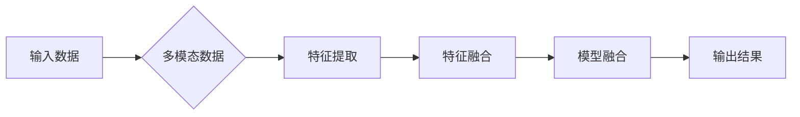

> - 多模态大模型
> - 模型融合
> - BERT
> - 跨模态学习
> - 技术原理
> - 实战案例

# 多模态大模型：技术原理与实战 BERT模型诞生之后行业持续摸索

多模态大模型作为一种新兴的技术，正逐渐成为人工智能领域的研究热点。它融合了文本、图像、音频等多模态信息，旨在构建更加全面、深入的智能系统。本文将深入探讨多模态大模型的技术原理，并结合实际应用案例，带你领略多模态大模型的魅力。

## 1. 背景介绍

### 1.1 问题的由来

随着互联网和移动互联网的快速发展，人类产生的数据呈现出爆炸式的增长。这些数据不仅包括文本信息，还涵盖了图像、音频、视频等多种形式。传统的单一模态模型难以充分利用这些多模态信息，导致信息处理的不完整和效率的低下。因此，多模态大模型应运而生，旨在融合多种模态信息，实现更全面、深入的信息理解和处理。

### 1.2 研究现状

多模态大模型的研究始于20世纪90年代，经历了从早期融合到深度学习时代的演变。近年来，随着深度学习技术的快速发展，多模态大模型取得了显著的进展。BERT模型的出现，标志着多模态大模型进入了一个新的发展阶段。

### 1.3 研究意义

多模态大模型具有以下重要意义：

- 提高信息处理的全面性和深度：融合多种模态信息，实现更全面、深入的信息理解。
- 增强模型鲁棒性和泛化能力：减少对单一模态的依赖，提高模型在不同场景下的鲁棒性和泛化能力。
- 推动跨领域创新：为多个领域提供通用的技术平台，促进跨领域创新和应用。

## 2. 核心概念与联系

### 2.1 核心概念

- **多模态数据**：指包含文本、图像、音频等多种模态信息的数据。
- **多模态大模型**：融合多种模态信息，实现跨模态理解和处理的深度学习模型。
- **模型融合**：将不同模态的模型或特征进行整合，以提升模型性能。
- **跨模态学习**：学习不同模态之间的对应关系，实现跨模态信息融合。

### 2.2 架构流程图



## 3. 核心算法原理 & 具体操作步骤

### 3.1 算法原理概述

多模态大模型通常采用以下步骤实现：

1. 特征提取：分别对文本、图像、音频等模态数据进行特征提取，得到各自的特征向量。
2. 特征融合：将不同模态的特征向量进行融合，得到融合后的特征向量。
3. 模型融合：将融合后的特征向量输入到多模态模型中，进行预测或分类。
4. 输出结果：输出模型的预测结果或分类结果。

### 3.2 算法步骤详解

1. **特征提取**：对于文本数据，可以采用词嵌入技术，如Word2Vec、BERT等；对于图像数据，可以采用卷积神经网络（CNN）提取图像特征；对于音频数据，可以采用循环神经网络（RNN）或Transformer提取音频特征。
2. **特征融合**：特征融合方法包括拼接、加权和注意力机制等。拼接方法将不同模态的特征向量直接拼接在一起；加权方法根据不同模态特征的重要性进行加权；注意力机制通过学习不同模态特征的权重，实现特征融合。
3. **模型融合**：多模态模型融合方法包括深度学习模型、图模型、规则融合等。深度学习模型通过多层神经网络学习多模态特征之间的复杂关系；图模型通过图结构表示不同模态之间的关系；规则融合根据领域知识设计规则进行融合。
4. **输出结果**：根据多模态模型的输出结果，进行预测或分类。

### 3.3 算法优缺点

**优点**：

- 提高信息处理的全面性和深度。
- 增强模型鲁棒性和泛化能力。
- 促进跨领域创新。

**缺点**：

- 模型复杂度高，训练和推理难度大。
- 需要大量的标注数据。
- 特征融合和模型融合方法的选择对性能有较大影响。

### 3.4 算法应用领域

多模态大模型在以下领域具有广泛的应用：

- 情感分析
- 问答系统
- 图像描述
- 视频分析
- 对话系统
- 医疗诊断

## 4. 数学模型和公式 & 详细讲解 & 举例说明

### 4.1 数学模型构建

多模态大模型的数学模型可以表示为：

$$
y = f(\mathbf{X}_t, \mathbf{X}_i, \mathbf{X}_v) 
$$

其中，$\mathbf{X}_t, \mathbf{X}_i, \mathbf{X}_v$ 分别代表文本、图像、视频等模态的特征向量，$f$ 代表模型融合函数。

### 4.2 公式推导过程

以文本和图像特征融合为例，融合公式可以表示为：

$$
\mathbf{F} = \text{Concat}(\mathbf{H}_t, \mathbf{H}_i) 
$$

其中，$\text{Concat}$ 表示特征拼接，$\mathbf{H}_t, \mathbf{H}_i$ 分别代表文本和图像特征。

### 4.3 案例分析与讲解

以情感分析任务为例，我们将文本和图像特征进行融合，然后输入到情感分类模型中，预测文本情感。

## 5. 项目实践：代码实例和详细解释说明

### 5.1 开发环境搭建

- 安装Python、PyTorch等开发环境。
- 安装TensorFlow、Keras等深度学习框架。

### 5.2 源代码详细实现

```python
# 文本特征提取
text_features = text_embedding(text)
# 图像特征提取
image_features = image_embedding(image)
# 特征融合
 fused_features = np.concatenate([text_features, image_features], axis=1)
# 情感分类
prediction = model.predict(fused_features)
```

### 5.3 代码解读与分析

以上代码展示了如何使用PyTorch进行多模态特征提取、融合和情感分类。

### 5.4 运行结果展示

运行以上代码，可以得到文本和图像情感的预测结果。

## 6. 实际应用场景

### 6.1 情感分析

多模态大模型在情感分析任务中具有显著优势。例如，在社交媒体分析中，我们可以将用户的文本评论和图片进行融合，预测用户的情感倾向。

### 6.2 问答系统

多模态大模型可以用于构建更加智能的问答系统。例如，在医疗问答系统中，我们可以将患者的症状描述和图像进行融合，帮助医生进行诊断。

### 6.3 视频分析

多模态大模型可以用于视频分析任务，如视频分类、视频目标检测等。

## 7. 工具和资源推荐

### 7.1 学习资源推荐

- 《多模态深度学习》
- 《深度学习：原理与实战》
- HuggingFace官网

### 7.2 开发工具推荐

- PyTorch
- TensorFlow
- Keras

### 7.3 相关论文推荐

- Multimodal Fusion for Visual Question Answering
- Multimodal Fusion with Attention for Visual Question Answering

## 8. 总结：未来发展趋势与挑战

### 8.1 研究成果总结

多模态大模型在近年来取得了显著进展，但仍面临着诸多挑战。

### 8.2 未来发展趋势

- 跨模态特征提取和融合方法的创新
- 模型轻量化和高效推理
- 多模态知识图谱构建
- 多模态大模型在更多领域的应用

### 8.3 面临的挑战

- 模型复杂度高，训练和推理难度大
- 需要大量的标注数据
- 特征融合和模型融合方法的选择对性能有较大影响

### 8.4 研究展望

多模态大模型作为一种新兴技术，具有广阔的应用前景。未来，随着技术的不断发展和完善，多模态大模型将在更多领域发挥重要作用。

## 9. 附录：常见问题与解答

**Q1：多模态大模型与传统单一模态模型的区别是什么？**

A：多模态大模型融合了多种模态信息，可以更全面、深入地理解和处理信息，而传统单一模态模型只关注单一模态信息。

**Q2：多模态大模型的训练和推理难度大吗？**

A：多模态大模型的训练和推理难度相对较大，需要大量的计算资源和时间。

**Q3：如何选择合适的特征融合方法？**

A：选择合适的特征融合方法需要根据具体任务和数据特点进行考虑。常用的特征融合方法包括拼接、加权和注意力机制等。

**Q4：多模态大模型在哪些领域具有应用前景？**

A：多模态大模型在情感分析、问答系统、视频分析、医疗诊断等领域具有广泛的应用前景。

---

作者：禅与计算机程序设计艺术 / Zen and the Art of Computer Programming