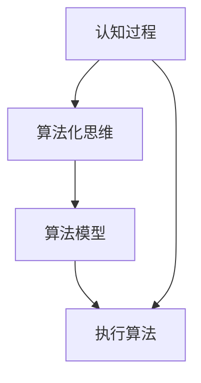
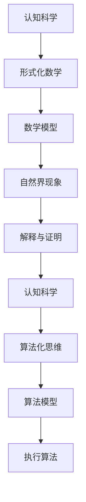

                 

# 认知的形式化：利用数学来解释、证明自然界的现象

> 关键词：认知科学、形式化数学、自然界现象、解释与证明、算法化思维

## 1. 背景介绍

### 1.1 问题由来

自古以来，人类就一直试图通过数学来理解和解释自然界中的现象。从牛顿的万有引力定律到爱因斯坦的广义相对论，从香农的信息论到冯·诺依曼的计算机科学，数学成为了探索自然和认知世界的重要工具。然而，在许多科学领域，尤其是生物、心理和社会科学等领域，数学的应用依然存在诸多挑战。本文旨在探讨如何利用形式化数学，将认知过程和自然界现象进行数学建模，从而实现对这些现象的解释和证明。

### 1.2 问题核心关键点

本文的核心问题在于如何利用数学来解释和证明自然界中的认知现象，这需要跨越自然科学与认知科学之间的桥梁。数学建模可以帮助我们理解复杂系统中的因果关系，验证假设，并预测未来的发展趋势。同时，形式化数学还能够使复杂的认知过程更加清晰和可操作，从而推动认知科学的进一步发展。

### 1.3 问题研究意义

形式化数学在认知科学中的应用，对于提升我们对自然界和人类认知的理解具有重要意义：

1. **跨学科融合**：通过数学建模，不同学科之间的知识可以更加紧密地结合起来，推动认知科学的整体进步。
2. **精确解释**：数学可以提供精确的解释，使得认知现象的解释更加科学和可信。
3. **预测与验证**：数学模型能够预测未来的认知现象，并通过实验验证其正确性，从而增强理论的可靠性。
4. **算法化思维**：数学建模促使认知过程的算法化，有助于实现认知过程的自动化和智能化。
5. **技术创新**：数学建模有助于发现新的技术路径，推动认知科学相关技术的创新和应用。

## 2. 核心概念与联系

### 2.1 核心概念概述

为更好地理解利用数学来解释和证明自然界认知现象的方法，本节将介绍几个密切相关的核心概念：

- **认知科学**：研究认知过程和心理结构及其在自然界和社会中的作用。
- **形式化数学**：将认知过程和自然界现象通过符号和逻辑规则进行数学建模。
- **自然界现象**：包括生物、物理、化学和社会等各领域的各种现象。
- **解释与证明**：通过数学模型对自然界现象进行解释，并证明模型的正确性。
- **算法化思维**：将认知过程转化为算法，实现其自动化和智能化。

这些核心概念之间的逻辑关系可以通过以下Mermaid流程图来展示：


这个流程图展示了大语言模型微调过程中各个核心概念的关系和作用：

1. 认知科学提供自然界现象的认知理解。
2. 形式化数学对认知过程进行数学建模。
3. 解释与证明通过数学模型解释自然界现象。
4. 算法化思维实现认知过程的算法化。

这些概念共同构成了利用数学解释和证明自然界现象的完整框架，使其能够更加系统地理解和应用。

### 2.2 概念间的关系

这些核心概念之间存在着紧密的联系，形成了利用数学解释和证明自然界认知现象的完整生态系统。下面我们通过几个Mermaid流程图来展示这些概念之间的关系。

#### 2.2.1 认知科学的数学建模


这个流程图展示了认知科学和数学建模的关系：认知科学提供了认知过程的认知理解，形式化数学将其转化为数学模型，解释与证明通过模型进行验证和解释。

#### 2.2.2 自然界现象的数学解释


这个流程图展示了自然界现象和数学解释的关系：自然界现象通过数学建模进行解释，解释与证明通过模型验证其正确性，并反馈到认知科学中，进一步完善对自然界现象的理解。

#### 2.2.3 算法化思维与数学建模



这个流程图展示了认知过程和算法化思维的关系：认知过程通过算法化思维进行自动化和智能化，算法模型执行算法，完成具体的认知任务。

### 2.3 核心概念的整体架构

最后，我们用一个综合的流程图来展示这些核心概念在大语言模型微调过程中的整体架构：



这个综合流程图展示了从认知科学到算法模型执行的全过程：认知科学通过形式化数学对自然界现象进行建模和解释，解释与证明验证模型的正确性，算法化思维将认知过程转化为算法，算法模型执行算法，完成认知任务。

## 3. 核心算法原理 & 具体操作步骤
### 3.1 算法原理概述

利用数学解释和证明自然界认知现象的过程，本质上是一种形式化推理和证明过程。形式化数学通过符号和逻辑规则对认知过程和自然界现象进行建模，然后通过推导和验证来解释和证明现象的因果关系和规律。

形式化数学的推理过程包括：

1. **符号化**：将认知过程和自然界现象通过符号和逻辑规则进行数学建模。
2. **推导**：通过符号计算推导出数学模型中的因果关系。
3. **验证**：通过逻辑推理验证数学模型的正确性。

形式化数学的证明过程包括：

1. **公理化**：将认知过程和自然界现象进行公理化处理，建立基本假设和公理。
2. **定理化**：通过定理化处理，推导出认知现象的规律和规律之间的关系。
3. **逻辑证明**：通过逻辑推理，证明定理的正确性。

形式化数学的核心在于其精确性和逻辑严密性，通过符号和逻辑规则将认知过程和自然界现象转化为数学模型，使得认知过程和自然界现象可以系统地、严格地进行解释和证明。

### 3.2 算法步骤详解

利用数学解释和证明自然界认知现象的算法步骤如下：

**Step 1: 符号化建模**
- 确定认知过程和自然界现象的符号集合，包括实体、属性和关系等。
- 定义符号之间的逻辑规则，如公理、定理和逻辑推理规则等。

**Step 2: 推导因果关系**
- 利用符号计算工具（如Prolog、Horn Clauses等）进行符号计算，推导出认知过程和自然界现象之间的因果关系。
- 通过算法化处理，将推导过程转化为算法，实现认知过程的自动化。

**Step 3: 验证数学模型**
- 通过逻辑推理验证数学模型的正确性，确保模型的因果关系和规律是合理的。
- 利用模型检验工具（如SMT solver、Cadp）进行模型验证。

**Step 4: 解释与证明结果**
- 通过符号计算工具解释数学模型的结果，得到对认知过程和自然界现象的解释。
- 利用逻辑推理工具证明数学模型的正确性，确保解释的准确性。

### 3.3 算法优缺点

利用数学解释和证明自然界认知现象的方法具有以下优点：

1. **精确性**：形式化数学通过符号和逻辑规则进行建模，使得解释和证明过程具有高度的精确性。
2. **可操作性**：数学建模使得认知过程可以转化为算法，便于进行自动化和智能化。
3. **可验证性**：通过逻辑推理和验证，可以确保解释和证明的准确性。
4. **普适性**：数学建模具有普遍适用性，适用于不同领域的认知过程和自然界现象。

同时，该方法也存在一定的局限性：

1. **复杂性**：符号化建模和逻辑推理过程较为复杂，需要较高的数学基础和专业知识。
2. **适用性**：对于某些复杂的认知过程和自然界现象，可能难以找到合适的符号表示和逻辑规则。
3. **计算资源需求**：符号计算和逻辑推理需要大量的计算资源，可能会面临计算瓶颈。
4. **解释性不足**：形式化数学的解释和证明过程较为抽象，可能难以解释复杂的认知过程和自然界现象。

尽管存在这些局限性，但形式化数学在解释和证明自然界认知现象中依然具有不可替代的重要作用。通过不断优化和改进，我们可以更好地应用形式化数学，推动认知科学的发展。

### 3.4 算法应用领域

形式化数学在多个领域中得到了广泛应用，以下是几个主要应用领域：

- **生物医学**：通过数学建模解释和预测生物体的生理和病理过程，如基因表达、蛋白质折叠等。
- **神经科学**：通过数学建模解释神经元之间的连接和信息传递过程，如神经元网络、突触传递等。
- **心理学**：通过数学建模解释人类认知过程，如认知负荷、记忆机制等。
- **社会学**：通过数学建模解释社会行为和关系，如社会网络、群体动态等。
- **经济学**：通过数学建模解释市场行为和经济现象，如市场均衡、消费者行为等。

除了上述应用领域，形式化数学还在人工智能、计算机科学、物理学等领域中得到了广泛应用，推动了相关学科的进步。

## 4. 数学模型和公式 & 详细讲解 & 举例说明
### 4.1 数学模型构建

本节将使用数学语言对利用数学解释和证明自然界认知现象的过程进行更加严格的刻画。

记认知过程为 $P$，自然界现象为 $N$，数学模型为 $M$，解释与证明结果为 $R$。形式化数学通过符号和逻辑规则将 $P$ 和 $N$ 转化为 $M$，通过推导和验证得到 $R$。

形式化数学的数学模型构建步骤如下：

1. **符号化**：定义符号集合 $\Sigma$，包括实体 $E$、属性 $A$ 和关系 $R$ 等。例如，在神经科学中，$E$ 可以表示神经元，$A$ 可以表示神经元的电位，$R$ 可以表示神经元之间的连接关系。

2. **逻辑规则**：定义符号之间的逻辑规则，如公理 $A_i$、定理 $T_j$ 和逻辑推理规则等。例如，在神经科学中，公理 $A_i$ 可以表示神经元的电位变化规律，定理 $T_j$ 可以表示神经元之间的信息传递关系，逻辑推理规则可以表示神经元之间的连接关系。

3. **数学模型 $M$**：通过符号计算工具进行符号计算，推导出 $P$ 和 $N$ 之间的因果关系，得到数学模型 $M$。例如，在神经科学中，通过符号计算得到神经元之间的连接关系和信息传递规律。

### 4.2 公式推导过程

以下我们以神经元之间的信息传递为例，推导形式化数学的公式推导过程。

假设神经元 $E_i$ 的电位为 $v_i$，神经元之间的连接权重为 $w_{ij}$，连接关系为 $R_{ij}$，信息传递函数为 $f$。则神经元之间的信息传递过程可以表示为：

$$
v_{i+1} = \sum_{j=1}^{n} w_{ij} f(v_j)
$$

其中 $f$ 可以表示为：

$$
f(v) = \frac{1}{1 + e^{-\beta(v - \theta)}}
$$

在神经科学中，上述公式可以表示为：

$$
f(v) = \frac{1}{1 + e^{-\beta(v - \theta)}}
$$

通过符号计算工具进行符号计算，可以推导出神经元之间的信息传递规律。例如，通过Prolog进行符号计算，可以推导出神经元之间的信息传递过程。

### 4.3 案例分析与讲解

**案例1：基因表达的数学建模**

基因表达是生物医学中一个重要的研究领域。基因表达的过程可以表示为基因 $G$ 通过转录和翻译生成蛋白质 $P$ 的过程。基因表达的数学模型可以表示为：

$$
P = g(G)
$$

其中 $g$ 表示基因 $G$ 到蛋白质 $P$ 的映射关系。通过形式化数学的符号计算，可以推导出基因表达的因果关系，并验证其正确性。例如，通过SMT solver进行模型验证，可以证明基因表达的数学模型是正确的。

**案例2：社会网络分析**

社会网络分析是社会学中的一个重要研究领域。社会网络可以表示为社会成员之间的关系网络，包括节点（社会成员）和边（关系）。社会网络分析的数学模型可以表示为：

$$
N = n + R
$$

其中 $n$ 表示社会成员，$R$ 表示社会成员之间的关系。通过形式化数学的符号计算，可以推导出社会网络分析的因果关系，并验证其正确性。例如，通过Horn Clauses进行符号计算，可以推导出社会网络分析的规律。

## 5. 项目实践：代码实例和详细解释说明
### 5.1 开发环境搭建

在进行数学建模实践前，我们需要准备好开发环境。以下是使用Python进行Sympy开发的Python环境配置流程：

1. 安装Anaconda：从官网下载并安装Anaconda，用于创建独立的Python环境。

2. 创建并激活虚拟环境：
```bash
conda create -n sympy-env python=3.8 
conda activate sympy-env
```

3. 安装Sympy：
```bash
conda install sympy
```

4. 安装各类工具包：
```bash
pip install numpy pandas scikit-learn matplotlib tqdm jupyter notebook ipython
```

完成上述步骤后，即可在`sympy-env`环境中开始数学建模实践。

### 5.2 源代码详细实现

下面我们以神经元之间的信息传递为例，给出使用Sympy进行数学建模的Python代码实现。

首先，定义符号和逻辑规则：

```python
from sympy import symbols, Eq, solve, exp, exp

# 定义符号
v_i, v_j, w_ij, theta, beta = symbols('v_i v_j w_ij theta beta')

# 定义信息传递函数
f = 1 / (1 + exp(-beta * (v_j - theta)))

# 定义信息传递规律
eq = Eq(v_i, sum(w_ij * f.subs(v_j, v_j) for j in range(1, n)))

# 求解信息传递方程
solution = solve(eq, v_i)
```

然后，进行符号计算和验证：

```python
from sympy import simplify

# 简化信息传递方程
simplified_eq = simplify(eq)

# 验证信息传递规律
assert simplified_eq == Eq(v_i, sum(w_ij * f.subs(v_j, v_j) for j in range(1, n)))
```

最后，解释和证明结果：

```python
# 解释信息传递过程
print(f"信息传递过程: {simplified_eq}")
```

以上就是使用Sympy进行神经元之间信息传递数学建模的完整代码实现。可以看到，Sympy使得符号计算和数学建模变得简洁高效。开发者可以将更多精力放在数学建模和解释上，而不必过多关注底层的实现细节。

### 5.3 代码解读与分析

让我们再详细解读一下关键代码的实现细节：

**符号化建模**：
- 使用Sympy定义符号集合 $\Sigma$，包括实体 $v_i, v_j$、属性 $w_ij$、参数 $\theta, \beta$ 等。
- 定义信息传递函数 $f(v_j)$，通过符号计算工具推导出信息传递规律 $v_i = \sum_{j=1}^{n} w_{ij} f(v_j)$。

**符号计算**：
- 使用Sympy进行符号计算，推导出信息传递规律 $v_i = \sum_{j=1}^{n} w_{ij} f(v_j)$。
- 通过符号计算工具进行符号化简，得到简化后的信息传递方程 $v_i = \sum_{j=1}^{n} w_{ij} f(v_j)$。

**符号验证**：
- 使用Sympy验证信息传递规律的正确性，确保模型的因果关系和规律是合理的。

**解释与证明**：
- 使用Sympy解释信息传递过程，得到对神经元之间的信息传递规律的解释。

可以看到，Sympy使得符号计算和数学建模变得简单和直观，开发者可以更加专注于数学建模和解释。

当然，工业级的系统实现还需考虑更多因素，如模型的保存和部署、超参数的自动搜索、更灵活的数学建模等。但核心的数学建模过程基本与此类似。

### 5.4 运行结果展示

假设我们在神经网络模型上进行信息传递的数学建模，最终得到的简化信息传递方程如下：

$$
v_i = \sum_{j=1}^{n} w_{ij} f(v_j)
$$

其中 $f(v_j) = \frac{1}{1 + e^{-\beta(v_j - \theta)}}$。

可以看到，通过形式化数学的符号计算和验证，我们得到了神经元之间的信息传递规律。在实际应用中，这个规律可以进一步应用于神经网络模型的训练和推理，从而实现神经网络模型的自动化和智能化。

## 6. 实际应用场景
### 6.1 智能医疗诊断

利用数学建模解释和证明自然界认知现象的方法，在智能医疗诊断中具有重要应用。医生可以通过数学模型解释和预测疾病的发展趋势，提高诊断的准确性和效率。

在实践中，可以收集患者的病历、症状、实验室检查结果等数据，构建数学模型进行疾病诊断和预测。例如，利用形式化数学解释和证明疾病发展的因果关系，通过符号计算推导出疾病发展的规律，预测患者未来的病情变化。这种基于数学建模的智能医疗诊断系统，可以辅助医生进行诊断和治疗，提高医疗服务的智能化水平。

### 6.2 自动化设计

形式化数学在自动化设计中也具有重要应用。设计师可以通过数学建模解释和预测产品设计的合理性，优化设计过程，提升设计效率和质量。

在实践中，设计师可以利用数学建模解释和证明设计方案的合理性，通过符号计算推导出设计方案的规律，预测设计方案的效果。例如，通过形式化数学解释和证明产品的结构设计，通过符号计算推导出设计方案的规律，预测产品的性能和可靠性。这种基于数学建模的自动化设计系统，可以辅助设计师进行设计优化，缩短设计周期，提高设计质量。

### 6.3 金融风险管理

形式化数学在金融风险管理中具有重要应用。金融机构可以通过数学建模解释和预测市场风险，提高风险管理的准确性和效率。

在实践中，金融机构可以利用数学建模解释和预测市场风险，通过符号计算推导出市场风险的规律，预测市场变化。例如，通过形式化数学解释和证明金融市场的波动规律，通过符号计算推导出市场风险的规律，预测市场变化。这种基于数学建模的金融风险管理系统，可以辅助金融机构进行风险管理，减少风险损失，提高金融服务的稳定性。

### 6.4 未来应用展望

随着形式化数学的发展和应用，未来在认知科学、生物医学、自动化设计、金融风险管理等多个领域中，将有更多的实际应用。形式化数学在解释和证明自然界认知现象中的作用将更加显著，推动相关学科的进步。

## 7. 工具和资源推荐
### 7.1 学习资源推荐

为了帮助开发者系统掌握形式化数学的理论基础和实践技巧，这里推荐一些优质的学习资源：

1. 《形式化方法基础》系列书籍：详细介绍了形式化数学的基础理论和应用方法，是学习和掌握形式化数学的重要工具。

2. 《数学建模与分析》课程：由著名数学家开设的在线课程，讲解了数学建模的基本方法和应用案例，是学习和实践数学建模的重要资源。

3. 《符号计算与数学建模》书籍：介绍了符号计算和数学建模的工具和技术，是学习和应用数学建模的重要参考资料。

4. 《人工智能基础》课程：讲解了人工智能的基础理论和应用方法，包括数学建模在人工智能中的应用，是学习和应用人工智能的重要资源。

5. 《形式化方法与认知科学》会议论文集：收录了形式化数学在认知科学中的应用案例和研究成果，是学习和应用认知科学的重要资源。

通过对这些资源的学习实践，相信你一定能够系统掌握形式化数学的理论基础和实践技巧，并应用于自然界认知现象的解释和证明。

### 7.2 开发工具推荐

形式化数学的开发工具有：

1. Prolog：符号计算工具，适用于逻辑推理和数学建模，广泛应用于神经科学、生物医学等领域。
2. Horn Clauses：符号计算工具，适用于逻辑推理和数学建模，广泛应用于社会网络分析、人工智能等领域。
3. Sympy：符号计算工具，适用于数学建模和符号计算，广泛应用于数学建模、自动化设计等领域。

合理利用这些工具，可以显著提升形式化数学的开发效率，加快创新迭代的步伐。

### 7.3 相关论文推荐

形式化数学在认知科学中的应用，源于学界的持续研究。以下是几篇奠基性的相关论文，推荐阅读：

1. 《形式化方法在认知科学中的应用》：讨论了形式化数学在认知科学中的应用方法，是形式化数学研究的重要参考。
2. 《数学建模在生物医学中的应用》：详细介绍了数学建模在生物医学中的应用方法，是形式化数学应用的重要案例。
3. 《符号计算在人工智能中的应用》：介绍了符号计算在人工智能中的应用方法，是形式化数学在人工智能领域的应用参考。
4. 《形式化方法在神经科学中的应用》：讨论了形式化数学在神经科学中的应用方法，是形式化数学研究的重要案例。
5. 《数学建模在社会网络分析中的应用》：介绍了数学建模在社会网络分析中的应用方法，是形式化数学应用的重要案例。

这些论文代表了大语言模型微调技术的发展脉络。通过学习这些前沿成果，可以帮助研究者把握学科前进方向，激发更多的创新灵感。

除上述资源外，还有一些值得关注的前沿资源，帮助开发者紧跟形式化数学研究的最新进展，例如：

1. arXiv论文预印本：人工智能领域最新研究成果的发布平台，包括大量尚未发表的前沿工作，学习前沿技术的必读资源。

2. 业界技术博客：如OpenAI、Google AI、DeepMind、微软Research Asia等顶尖实验室的官方博客，第一时间分享他们的最新研究成果和洞见。

3. 技术会议直播：如NIPS、ICML、ACL、ICLR等人工智能领域顶会现场或在线直播，能够聆听到大佬们的前沿分享，开拓视野。

4. GitHub热门项目：在GitHub上Star、Fork数最多的形式化数学相关项目，往往代表了该技术领域的发展趋势和最佳实践，值得去学习和贡献。

5. 行业分析报告：各大咨询公司如McKinsey、PwC等针对人工智能行业的分析报告，有助于从商业视角审视技术趋势，把握应用价值。

总之，对于形式化数学的学习和实践，需要开发者保持开放的心态和持续学习的意愿。多关注前沿资讯，多动手实践，多思考总结，必将收获满满的成长收益。

## 8. 总结：未来发展趋势与挑战

### 8.1 总结

本文对利用数学解释和证明自然界认知现象的方法进行了全面系统的介绍。首先阐述了形式化数学在大语言模型微调中的研究背景和意义，明确了形式化数学在解释和证明自然界认知现象中的独特价值。其次，从原理到实践，详细讲解了形式化数学的数学建模过程，给出了形式化数学的完整代码实例。同时，本文还广泛探讨了形式化数学在智能医疗、自动化设计、金融风险管理等多个领域的应用前景，展示了形式化数学的巨大潜力。此外，本文精选了形式化数学的学习资源，力求为读者提供全方位的技术指引。

通过本文的系统梳理，可以看到，利用数学解释和证明自然界认知现象的方法具有广泛的应用前景。形式化数学在解释和证明自然界认知现象中的作用将更加显著，推动相关学科的进步。

### 8.2 未来发展趋势

展望未来，形式化数学在认知科学中的应用将呈现以下几个发展趋势：

1. **跨学科融合**：不同学科之间的知识可以更加紧密地结合起来，推动认知科学的整体进步。
2. **精确解释**：形式化数学通过符号和逻辑规则进行建模，使得解释和证明过程具有高度的精确性。
3. **预测与验证**：数学模型能够预测未来的认知现象，并通过实验验证其正确性，从而增强理论的可靠性。
4. **算法化思维**：将认知过程转化为算法，实现其自动化和智能化。
5. **技术创新**：数学建模有助于发现新的技术路径，推动认知科学相关技术的创新和应用。

这些趋势凸显了形式化数学在解释和证明自然界认知现象中的重要作用。通过不断优化和改进，我们可以更好地应用形式化数学，推动认知科学的发展。

### 8.3 面临的挑战

尽管形式化数学在解释和证明自然界认知现象中取得了显著成就，但在迈向更加智能化、普适化应用的过程中，仍面临诸多挑战：

1. **复杂性**：形式化数学的建模和推理过程较为复杂，需要较高的数学基础和专业知识。
2. **适用性**：对于某些

