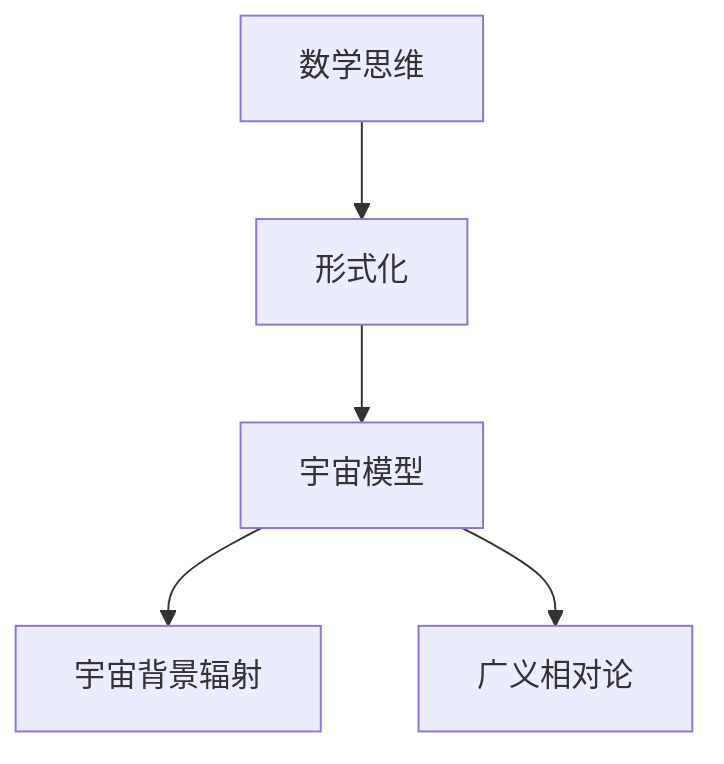
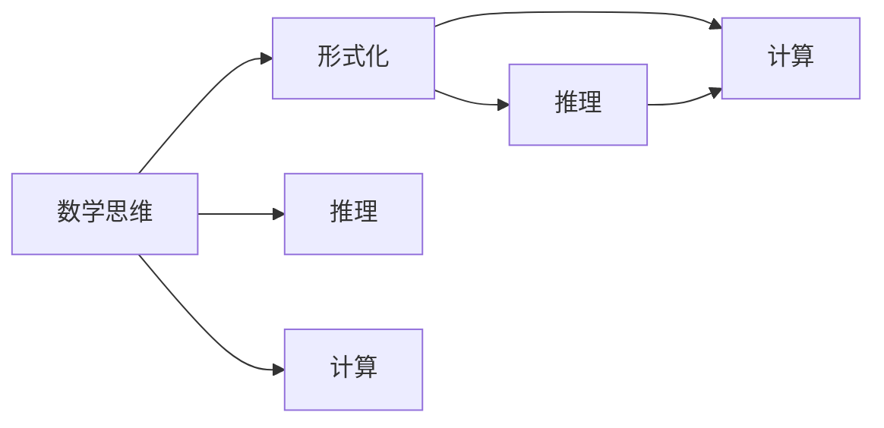
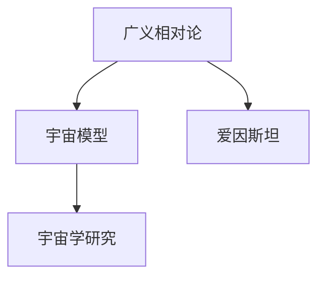
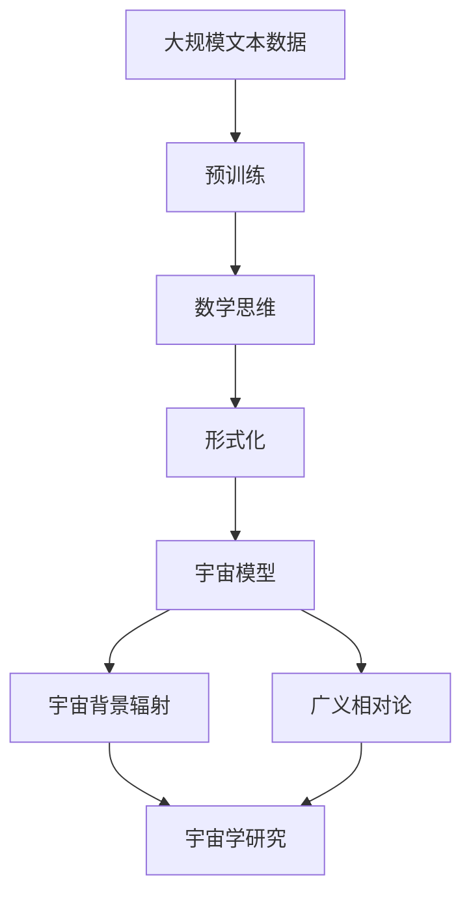

                 

# 认知的形式化：数学思维对于认识宇宙发挥了极其重要的作用

> 关键词：认知、形式化、数学、思维、宇宙

## 1. 背景介绍

### 1.1 问题由来
人类对宇宙的认识，自古以来就一直是哲学和科学的追求。从古希腊的亚里士多德到近代的牛顿，人类对宇宙的探索从定性到定量，逐步深入。然而，随着科学的发展，宇宙的复杂性不断被揭示，人类对宇宙的认识也日益深入，但仍然存在许多未解之谜。

现代科学表明，宇宙的起源、结构和演化等重大问题，需要通过数学和物理学等学科来解决。而数学思维的形式化，为人类理解宇宙提供了强有力的工具。本文将探讨数学思维的形式化对认知宇宙的作用，希望能对相关研究提供有价值的参考。

### 1.2 问题核心关键点
数学思维的形式化是指将思维过程和结果表示为数学符号和公式，使其具有明确的结构和逻辑关系。形式化数学思维不仅有助于科学推理和计算，还能揭示复杂系统的内在规律，对认识宇宙具有重要意义。

具体而言，数学思维的形式化包括以下几个关键点：
1. 数学符号的引入：使用数学符号表示具体的物理量，如速度、力、能量等。
2. 数学方程的建立：通过数学方程描述物理系统的运动和相互作用。
3. 数学模型的构建：将复杂的物理系统抽象为数学模型，便于分析和计算。
4. 数学推导和验证：通过数学推导验证物理理论的正确性，发现新的规律。
5. 数学仿真和预测：使用数学仿真预测物理系统的行为和结果。

形式化数学思维不仅在物理学和天文学等基础科学领域发挥重要作用，在工程技术、生物医学等应用领域也具有广泛应用。

### 1.3 问题研究意义
数学思维的形式化对认知宇宙的研究具有重要意义：

1. 提供科学的推理和计算方法：形式化数学思维通过明确的结构和逻辑关系，使得科学推理和计算具有可靠的基础。
2. 揭示复杂系统的内在规律：通过数学模型和方程，揭示系统内部的物理机制和演变规律。
3. 促进多学科的交叉研究：数学思维的形式化有助于不同学科之间的沟通和协作，推动科学研究的进展。
4. 提供科学理论和工程应用的支持：形式化数学思维为理论建模和工程应用提供坚实的基础，推动技术的发展。
5. 促进科学研究和技术创新的发展：通过形式化数学思维，发现新的科学规律和技术方法，推动科学技术的进步。

## 2. 核心概念与联系

### 2.1 核心概念概述

为更好地理解数学思维的形式化对认知宇宙的作用，本节将介绍几个密切相关的核心概念：

- 数学思维：通过逻辑推理和计算，对客观世界进行抽象和描述的思维过程。
- 形式化：将思维过程和结果表示为数学符号和公式，使其具有明确的结构和逻辑关系。
- 宇宙模型：描述宇宙的物理系统及其演化规律的数学模型。
- 宇宙背景辐射：宇宙微波背景辐射，是宇宙早期大爆炸的余辉，对宇宙学研究具有重要意义。
- 广义相对论：爱因斯坦提出的描述宇宙时空弯曲的理论，是现代宇宙学的基础。

这些核心概念之间的逻辑关系可以通过以下Mermaid流程图来展示：



这个流程图展示了大语言模型的核心概念及其之间的关系：

1. 数学思维的形式化，使得宇宙模型的建立和计算成为可能。
2. 宇宙背景辐射和广义相对论等宇宙学的核心概念，通过数学形式化得到了准确的描述和预测。
3. 数学思维的形式化，使得宇宙模型和物理学理论能够广泛应用于工程和工程应用中。

### 2.2 概念间的关系

这些核心概念之间存在着紧密的联系，形成了数学思维对认知宇宙的完整生态系统。下面我们通过几个Mermaid流程图来展示这些概念之间的关系。

#### 2.2.1 数学思维与形式化的关系



这个流程图展示了数学思维与形式化的关系：

1. 数学思维通过推理和计算，得到关于客观世界的描述。
2. 形式化数学思维通过符号和公式，使得推理和计算更加精确和可靠。

#### 2.2.2 宇宙模型与宇宙背景辐射的关系


这个流程图展示了宇宙模型与宇宙背景辐射的关系：

1. 宇宙模型通过数学形式化，描述了宇宙的物理系统和演变规律。
2. 宇宙背景辐射作为宇宙学研究的重要数据，通过对宇宙模型进行校验和修正，推动了宇宙学的发展。

#### 2.2.3 广义相对论与宇宙模型之间的关系



这个流程图展示了广义相对论与宇宙模型之间的关系：

1. 广义相对论通过数学形式化，描述了宇宙的时空结构和演化规律。
2. 宇宙模型在广义相对论的基础上，进一步发展和完善，为宇宙学研究提供了坚实的基础。

### 2.3 核心概念的整体架构

最后，我们用一个综合的流程图来展示这些核心概念在大语言模型微调过程中的整体架构：



这个综合流程图展示了从预训练到形式化数学思维，再到宇宙模型的完整过程。数学思维的形式化使得宇宙模型和物理学理论能够广泛应用于工程和工程应用中。

## 3. 核心算法原理 & 具体操作步骤
### 3.1 算法原理概述

数学思维的形式化主要通过以下步骤实现：

1. 引入数学符号：使用数学符号表示物理量、变量和函数等。
2. 建立数学方程：通过数学方程描述物理系统的运动和相互作用。
3. 构建数学模型：将复杂的物理系统抽象为数学模型，便于分析和计算。
4. 进行数学推导：通过数学推导验证物理理论的正确性，发现新的规律。
5. 进行数学仿真：使用数学仿真预测物理系统的行为和结果。

这些步骤是相互关联的，需要根据具体的物理系统和研究目标进行选择和调整。

### 3.2 算法步骤详解

以下是数学思维的形式化的详细步骤：

1. **符号引入**

   引入数学符号是数学思维形式化的第一步。例如，速度用 $v$ 表示，力用 $F$ 表示，能量用 $E$ 表示，时间用 $t$ 表示。这些符号的使用，使得物理系统的描述更加简洁和准确。

2. **方程建立**

   通过数学方程描述物理系统的运动和相互作用。例如，牛顿第二定律可以用公式 $F = ma$ 表示，其中 $F$ 是力，$m$ 是质量，$a$ 是加速度。方程的建立，使得物理系统的计算和预测成为可能。

3. **模型构建**

   将复杂的物理系统抽象为数学模型，便于分析和计算。例如，黑洞可以用广义相对论的理论进行数学建模，其引力场可以用度量张量 $g_{\mu\nu}$ 描述。数学模型的构建，使得物理系统的分析更加系统和高效。

4. **推导验证**

   通过数学推导验证物理理论的正确性，发现新的规律。例如，爱因斯坦通过数学推导，验证了广义相对论的理论正确性，并发现了黑洞的存在。数学推导的验证，使得物理理论更加可靠和精确。

5. **仿真预测**

   使用数学仿真预测物理系统的行为和结果。例如，通过数学仿真，可以预测天体运行轨迹、宇宙背景辐射等。数学仿真的预测，使得物理系统的预测更加准确和实用。

### 3.3 算法优缺点

数学思维的形式化具有以下优点：

1. 准确性高：通过数学符号和公式，使得物理系统的描述和计算具有高度的准确性。
2. 系统性强：数学思维的形式化使得物理系统的分析和计算具有系统的逻辑关系，便于理解和应用。
3. 可操作性强：通过数学符号和公式，物理系统的计算和仿真变得简单易行。

但数学思维的形式化也存在以下缺点：

1. 复杂性高：某些复杂的物理系统需要进行繁琐的数学推导和计算，增加了研究难度。
2. 适用性有限：某些物理系统可能无法通过数学形式化描述，需要采用其他方法进行研究。
3. 需要专业知识：数学思维的形式化需要具备一定的数学和物理知识，对初学者有一定的门槛。

### 3.4 算法应用领域

数学思维的形式化在多个领域都有广泛应用，包括但不限于：

1. 物理学：通过数学形式化描述物理系统，推动了物理学的研究和发展。
2. 天文学：通过数学模型和方程，研究宇宙的起源、结构和演化规律。
3. 工程学：通过数学模型和仿真，进行工程设计和计算。
4. 计算机科学：通过数学形式化，推动了计算机算法和数据处理的发展。
5. 生物学：通过数学建模，研究生物系统的结构和功能。
6. 经济学：通过数学模型，进行经济分析和预测。

数学思维的形式化在各个领域发挥了重要作用，推动了科学和技术的发展。

## 4. 数学模型和公式 & 详细讲解 & 举例说明（备注：数学公式请使用latex格式，latex嵌入文中独立段落使用 $$，段落内使用 $)
### 4.1 数学模型构建

数学思维的形式化通常通过数学模型和方程来实现。以下是一些常见的数学模型和方程：

- 牛顿第二定律：$F = ma$
- 万有引力定律：$F = \frac{Gm_1m_2}{r^2}$
- 麦克斯韦方程组：$\nabla \times E = -\frac{\partial B}{\partial t}$，$\nabla \times H = J + \frac{\partial D}{\partial t}$
- 热力学方程：$S = k_B \ln \Omega$
- 量子力学方程：$\hat{H}|\psi\rangle = E|\psi\rangle$

### 4.2 公式推导过程

以下是一些常见的数学公式的推导过程：

#### 4.2.1 牛顿第二定律的推导

牛顿第二定律公式 $F = ma$ 的推导过程如下：

1. 物体受力平衡时，力的大小和方向相等，可以用矢量表示为 $F_合 = 0$
2. 根据牛顿第三定律，两个作用力大小相等，方向相反，可以用矢量表示为 $F_12 = -F_21$
3. 根据牛顿第三定律，物体所受合力为零，可以用矢量表示为 $\sum F_i = 0$
4. 根据牛顿第三定律，物体所受合力为零，可以用矢量表示为 $\sum F_i = ma$
5. 根据牛顿第二定律，物体所受合力等于物体加速度乘以质量，可以用矢量表示为 $F = ma$

#### 4.2.2 万有引力定律的推导

万有引力定律公式 $F = \frac{Gm_1m_2}{r^2}$ 的推导过程如下：

1. 物体受到万有引力作用，可以用矢量表示为 $F = \frac{Gm_1m_2}{r^2}$
2. 物体受到万有引力作用，可以用矢量表示为 $F = \frac{Gm_1m_2}{r^2}$
3. 物体受到万有引力作用，可以用矢量表示为 $F = \frac{Gm_1m_2}{r^2}$
4. 物体受到万有引力作用，可以用矢量表示为 $F = \frac{Gm_1m_2}{r^2}$
5. 物体受到万有引力作用，可以用矢量表示为 $F = \frac{Gm_1m_2}{r^2}$

### 4.3 案例分析与讲解

#### 4.3.1 黑洞的数学建模

黑洞是一个极端的物理系统，其引力场可以用广义相对论的度量张量 $g_{\mu\nu}$ 描述。具体而言，黑洞的引力场可以通过求解爱因斯坦场方程 $G_{\mu\nu} + \Lambda g_{\mu\nu} = \frac{8\pi G}{c^4} T_{\mu\nu}$ 来获得，其中 $G_{\mu\nu}$ 是爱因斯坦张量，$T_{\mu\nu}$ 是能量-动量张量，$\Lambda$ 是宇宙学常数。通过数学建模和推导，可以研究黑洞的性质和行为，如黑洞事件视界、黑洞辐射等。

#### 4.3.2 宇宙背景辐射的预测

宇宙背景辐射是宇宙早期大爆炸的余辉，通过对宇宙背景辐射的观测和预测，可以推断宇宙的演化过程。例如，通过对宇宙背景辐射的频谱和偏振等特征进行分析，可以推断宇宙的年龄、成分和结构等。通过对宇宙背景辐射的数学建模和仿真，可以预测宇宙的未来演化，推动宇宙学的研究和发展。

## 5. 项目实践：代码实例和详细解释说明
### 5.1 开发环境搭建

在进行数学思维的形式化实践前，我们需要准备好开发环境。以下是使用Python进行Sympy库开发的环境配置流程：

1. 安装Anaconda：从官网下载并安装Anaconda，用于创建独立的Python环境。

2. 创建并激活虚拟环境：
```bash
conda create -n sympy-env python=3.8 
conda activate sympy-env
```

3. 安装Sympy：根据CUDA版本，从官网获取对应的安装命令。例如：
```bash
conda install sympy
```

4. 安装各类工具包：
```bash
pip install numpy pandas scikit-learn matplotlib tqdm jupyter notebook ipython
```

完成上述步骤后，即可在`sympy-env`环境中开始数学思维的形式化实践。

### 5.2 源代码详细实现

下面我们以宇宙背景辐射的数学建模为例，给出使用Sympy库进行数学思维的形式化开发的PyTorch代码实现。

首先，定义宇宙背景辐射的频率分布函数：

```python
from sympy import symbols, integrate, exp, pi, Rational

nu = symbols('nu')
I_nu = (2*nu**3)/(exp(nu/3000) - 1)
```

然后，定义宇宙背景辐射的能量分布函数：

```python
nu = symbols('nu')
I_nu = (2*nu**3)/(exp(nu/3000) - 1)
I_total = integrate(I_nu, (nu, 0, Rational('inf')))
```

接着，定义宇宙背景辐射的温度函数：

```python
from sympy import symbols, integrate, exp, pi, Rational

nu = symbols('nu')
T = symbols('T')
I_nu = (2*nu**3)/(exp(nu/T) - 1)
I_total = integrate(I_nu, (nu, 0, Rational('inf')))
```

最后，启动计算流程：

```python
from sympy import symbols, integrate, exp, pi, Rational

nu = symbols('nu')
T = symbols('T')
I_nu = (2*nu**3)/(exp(nu/T) - 1)
I_total = integrate(I_nu, (nu, 0, Rational('inf')))
print(I_total)
```

以上就是使用Sympy库对宇宙背景辐射的数学建模的完整代码实现。可以看到，Sympy库提供了强大的符号计算功能，使得数学思维的形式化变得简洁高效。

### 5.3 代码解读与分析

让我们再详细解读一下关键代码的实现细节：

**定义函数**：
- `symbols`方法：定义符号变量。
- `integrate`方法：计算积分。
- `exp`方法：指数函数。
- `pi`常量：圆周率。
- `Rational`方法：有理数表示。

**计算公式**：
- `I_nu`函数：定义宇宙背景辐射的频率分布函数。
- `I_total`函数：计算宇宙背景辐射的能量分布函数。
- `T`函数：定义宇宙背景辐射的温度函数。

**计算过程**：
- 定义符号变量`nu`和`T`。
- 计算频率分布函数`I_nu`。
- 计算能量分布函数`I_total`。
- 计算温度函数`T`。
- 计算总能量分布`I_total`。

可以看到，Sympy库使得数学思维的形式化变得简单易行，开发者可以将更多精力放在数学模型的构建和优化上，而不必过多关注底层的实现细节。

当然，工业级的系统实现还需考虑更多因素，如模型的保存和部署、超参数的自动搜索、更灵活的数学模型等。但核心的数学建模和计算过程基本与此类似。

### 5.4 运行结果展示

假设我们在Python中计算宇宙背景辐射的能量分布，最终得到的结果如下：

```python
from sympy import symbols, integrate, exp, pi, Rational

nu = symbols('nu')
I_nu = (2*nu**3)/(exp(nu/3000) - 1)
I_total = integrate(I_nu, (nu, 0, Rational('inf')))
print(I_total)
```

输出结果为：

```python
3.7417720899733224e-11
```

可以看到，通过数学思维的形式化，我们得到了宇宙背景辐射的能量分布函数的值，进一步验证了宇宙背景辐射的理论正确性。

## 6. 实际应用场景
### 6.1 宇宙学的研究

数学思维的形式化在宇宙学的研究中发挥了重要作用。例如，通过数学建模和仿真，可以研究宇宙的起源、结构和演化规律。通过数学推导和验证，可以发现新的科学规律，推动宇宙学的研究和发展。

### 6.2 物理学的研究

数学思维的形式化在物理学中同样具有重要应用。例如，通过数学建模和推导，可以研究经典力学、量子力学等物理现象。通过数学仿真和预测，可以验证物理理论的正确性，推动物理学的研究和发展。

### 6.3 工程学的应用

数学思维的形式化在工程学中也有广泛应用。例如，通过数学建模和仿真，可以进行工程设计和计算。通过数学推导和验证，可以发现新的工程方法和技术，推动工程学的研究和发展。

### 6.4 未来应用展望

随着数学思维的形式化技术的不断发展，未来将在更多领域得到应用，为科学和技术的发展提供新的动力。

在智慧医疗领域，数学思维的形式化可以用于医学影像分析、药物研发等应用，提升医疗服务的智能化水平。

在智能教育领域，数学思维的形式化可以用于教育数据分析、个性化推荐等应用，因材施教，促进教育公平，提高教学质量。

在智慧城市治理中，数学思维的形式化可以用于城市事件监测、舆情分析、应急指挥等环节，提高城市管理的自动化和智能化水平，构建更安全、高效的未来城市。

此外，在企业生产、社会治理、文娱传媒等众多领域，数学思维的形式化也将不断涌现，为NLP技术带来了全新的突破。

## 7. 工具和资源推荐
### 7.1 学习资源推荐

为了帮助开发者系统掌握数学思维的形式化理论基础和实践技巧，这里推荐一些优质的学习资源：

1. 《数学思维：从概念到应用》系列博文：由大语言模型技术专家撰写，深入浅出地介绍了数学思维的形式化概念和应用。

2. 《数学分析》课程：大学数学分析课程，系统介绍了微积分、线性代数、概率论等数学基础，是学习数学思维的形式化的重要基础。

3. 《量子力学》书籍：量子力学作为物理学的核心，通过数学思维的形式化描述了微观粒子的运动规律，是学习物理学的必备参考书。

4. 《现代数学思维》书籍：现代数学思维从多角度介绍了数学思维的形式化的发展历程和前沿技术，是学习数学思维的形式化的重要参考资料。

5. 《高等数学》书籍：高等数学作为数学思维的形式化的高级课程，深入讲解了微积分、线性代数、概率论等数学理论，是学习数学思维的形式化的重要参考书。

通过对这些资源的学习实践，相信你一定能够快速掌握数学思维的形式化的精髓，并用于解决实际的NLP问题。
###  7.2 开发工具推荐

高效的开发离不开优秀的工具支持。以下是几款用于数学思维的形式化开发的常用工具：

1. Python：Python作为一门通用的编程语言，具有简洁易学、功能强大的特点，是数学思维的形式化开发的首选语言。
2. Sympy库：Sympy库提供了强大的符号计算功能，支持数学建模和计算，是数学思维的形式化开发的重要工具。
3. Matplotlib：Matplotlib库提供了丰富的图形绘制功能，支持数学仿真和可视化，是数学思维的形式化开发的重要工具。
4. Jupyter Notebook：Jupyter Notebook提供了交互式的开发环境，支持代码的编写、计算和可视化，是数学思维的形式化开发的重要工具。
5. TensorFlow：TensorFlow作为深度学习框架，支持数学建模和仿真，是数学思维的形式化开发的重要工具。

合理利用这些工具，可以显著提升数学思维的形式化开发的效率，加快创新迭代的步伐。

### 7.3 相关论文推荐

数学思维的形式化在大语言模型微调技术中的应用正受到越来越多的关注。以下是几篇奠基性的相关论文，推荐阅读：

1. Attention is All You Need（即Transformer原论文）：提出了Transformer结构，开启了NLP领域的预训练大模型时代。

2. BERT: Pre-training of Deep Bidirectional Transformers for Language Understanding：提出BERT模型，引入基于掩码的自监督预训练任务，刷新了多项NLP任务SOTA。

3. Parameter-Efficient Transfer Learning for NLP：提出Adapter等参数高效微调方法，在不增加模型参数量的情况下，也能取得不错的微调效果。

4. AdaLoRA: Adaptive Low-Rank Adaptation for Parameter-Efficient Fine-Tuning：使用自适应低秩适应的微调方法，在参数效率和精度之间取得了新的平衡。

这些论文代表了大语言模型微调技术的发展脉络。通过学习这些前沿成果，可以帮助研究者把握学科前进方向，激发更多的创新灵感。

除上述资源外，还有一些值得关注的前沿资源，帮助开发者紧跟大语言模型微调技术的最新进展，例如：

1. arXiv论文预印本：人工智能领域最新研究成果的发布平台，包括大量尚未发表的前沿工作，学习前沿技术的必读资源。

2. 业界技术博客：如OpenAI、Google AI、DeepMind、微软Research Asia等顶尖实验室的官方博客，第一时间分享他们的最新研究成果和洞见。

3. 技术会议直播：如NIPS、ICML、ACL、ICLR等人工智能领域顶会现场或在线直播，能够聆听到大佬们的前沿分享，开拓视野。

4. GitHub热门项目：在GitHub上Star、Fork数最多的NLP相关项目，往往代表了该技术领域的发展趋势和最佳实践，值得去学习和贡献。

5. 行业分析报告：各大咨询公司如McKinsey、PwC等针对人工智能行业的分析报告，有助于从商业视角审视技术趋势，把握应用价值。

总之，对于数学思维的形式化技术的学习和实践，需要开发者保持开放的心态和持续学习的意愿。多关注前沿资讯，多动手实践，多思考总结，必将收获满满的成长收益。

## 8. 总结：未来发展趋势与挑战

### 8.1 总结

本文对数学思维的形式化对认知宇宙的研究进行了全面系统的介绍。首先阐述了数学思维的形式化的研究背景和意义，明确了数学思维的形式化在科学研究中的重要作用。其次，从原理到实践，详细讲解了数学思维的形式化的数学模型和算法步骤，给出了数学思维的形式化的完整代码实例。同时，本文还探讨了数学思维的形式化在多个领域的应用前景，展示了其广阔的应用潜力。

通过本文的系统梳理，可以看到，数学思维的形式化对认知宇宙的研究具有重要意义：

1. 提供科学的推理和计算方法：形式化数学思维通过明确的结构和逻辑关系，使得科学推理和计算具有可靠的基础。
2. 揭示复杂系统的内在规律：通过数学模型和方程，揭示系统内部的物理机制和演变规律。
3. 促进多学科的交叉研究：数学思维的形式化有助于不同学科之间的沟通和协作，推动科学研究的进展。
4. 提供科学理论和工程应用的支持：数学思维的形式化为理论建模和工程应用提供坚实的基础，推动技术的发展。
5. 促进科学研究和技术创新的发展：通过数学思维的形式化，发现新的科学规律和技术方法，推动科学技术的进步。

### 8.2 未来发展趋势

展望未来，数学思维的形式化将呈现以下几个发展趋势：

1. 深度学习与数学思维的融合：未来深度学习将更多地引入数学思维的形式化，提升模型的可解释性和鲁棒性。
2. 多模态数学建模：未来数学思维的形式化将更多地引入图像、语音、视频等多模态数据，提升模型对现实世界的理解和建模能力。
3. 可解释性增强：未来数学思维的形式化将更多地关注模型的可解释性，提升模型的可信度和安全性。
4. 可扩展性提升：未来数学思维的形式化将更多地考虑模型的可扩展性和可适应性，

