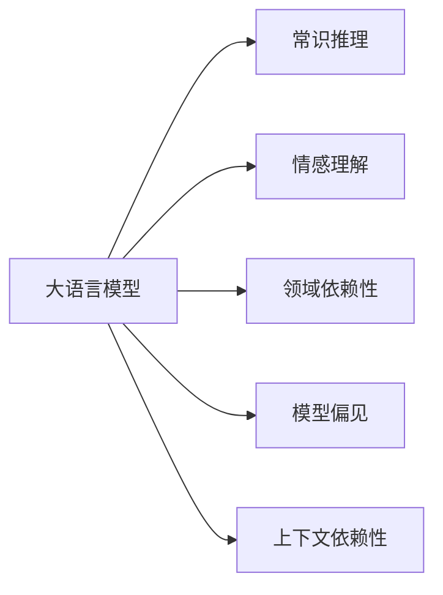
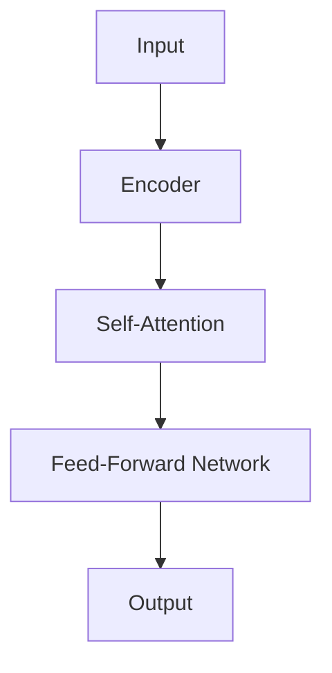

                 

# 语言与思维的差异：大模型的认知障碍

在探讨大模型的认知能力时，我们需要认识到，尽管大语言模型（Large Language Models, LLMs）在自然语言处理（NLP）领域取得了巨大进展，但其认知水平仍存在一些固有的限制和差异。本文将深入分析大模型的认知障碍，探讨这些障碍的成因，以及如何克服它们，推动大模型认知能力的进一步提升。

## 1. 背景介绍

### 1.1 问题由来
大语言模型是近年来人工智能研究的热点，它们通过在海量文本数据上预训练，学习到了复杂的语言模式和知识。这些模型在各种NLP任务上展现了强大的能力，如情感分析、文本分类、机器翻译等。然而，尽管模型能力不断提升，它们的认知能力仍然与人类有着显著的差异。

### 1.2 问题核心关键点
大模型的认知障碍主要体现在以下几个方面：
1. **缺乏常识推理能力**：尽管模型能够理解语言文本，但往往无法进行抽象推理，缺乏常识性知识。
2. **情感理解有限**：模型对文本情感的识别和理解有限，难以真正理解复杂的人类情感。
3. **依赖特定领域数据**：模型在特定领域上的性能往往优于通用领域，且依赖于大量领域数据。
4. **模型偏见**：模型可能继承预训练数据中的偏见，导致输出结果的不公正和偏见性。
5. **上下文依赖性强**：模型在处理长文本时，依赖上下文的能力较强，但对于某些任务仍存在局限。

### 1.3 问题研究意义
理解大模型的认知障碍，有助于我们在设计和优化模型时，更明确地把握其局限性，采取针对性的措施来提升模型的认知能力。这对于构建更智能、更公正的AI系统具有重要意义。

## 2. 核心概念与联系

### 2.1 核心概念概述

在进行深入分析之前，我们需要先明确几个核心概念：

- **大语言模型（LLMs）**：通过在大规模文本数据上进行预训练，学习语言模式和知识，能够处理各种NLP任务的模型，如GPT-3、BERT等。
- **常识推理**：指模型能够理解并应用常识知识进行逻辑推理的能力。
- **情感理解**：指模型能够识别和理解文本中的情感倾向。
- **领域依赖性**：指模型在特定领域上的性能远优于通用领域。
- **模型偏见**：指模型在训练过程中可能学习到并传递的偏见。
- **上下文依赖性**：指模型在处理长文本时，对上下文信息依赖程度较高。

### 2.2 概念间的关系

以下是一个Mermaid流程图，展示了这些核心概念之间的关系：



这个流程图展示了大语言模型与常识推理、情感理解、领域依赖性、模型偏见和上下文依赖性之间的关系。这些概念相互交织，共同构成了大语言模型的认知能力。

## 3. 核心算法原理 & 具体操作步骤
### 3.1 算法原理概述

大语言模型的认知障碍主要源于其预训练过程和设计架构。预训练过程中，模型主要通过自监督学习任务（如掩码语言模型）来学习语言模式和知识。这种训练方式使得模型在处理特定任务时，表现往往优于无监督或监督学习模型。然而，这种预训练方式也带来了一些固有的局限性：

1. **缺乏常识推理**：由于预训练数据和任务通常是通用的，模型难以获取广泛的知识，特别是常识性知识。
2. **情感理解有限**：情感通常与上下文紧密相关，模型在处理情感类文本时，难以准确识别和理解。
3. **领域依赖性**：模型在特定领域上的性能往往优于通用领域，这限制了其广泛应用。
4. **模型偏见**：模型在训练过程中可能学习到数据中的偏见，导致输出结果的不公正和偏见性。
5. **上下文依赖性**：模型在处理长文本时，依赖上下文的能力较强，但对于某些任务仍存在局限。

### 3.2 算法步骤详解

基于上述分析，我们可以进一步探讨大语言模型的认知障碍和改进措施：

**Step 1: 收集多样化数据**
- 在预训练和微调过程中，尽量收集多样化的数据，涵盖不同的领域、情感和情境，以丰富模型的知识库。

**Step 2: 设计任务适配层**
- 根据特定任务的需求，设计合适的输出层和损失函数，以确保模型能够准确理解和处理任务相关的信息。

**Step 3: 引入常识推理**
- 在预训练阶段，设计或引入常识推理任务，如自然语言推理（NLI）、常识问答等，以提升模型的常识推理能力。

**Step 4: 增强情感理解**
- 在预训练阶段，引入情感标注数据，训练模型进行情感分类或情感识别，提高模型对文本情感的理解能力。

**Step 5: 引入领域特定知识**
- 对于特定领域的应用，在预训练阶段引入该领域的专业知识，如医疗知识、法律知识等，提升模型在该领域的泛化能力。

**Step 6: 克服模型偏见**
- 在预训练和微调过程中，采用对抗训练、数据采样等技术，减少模型对数据的依赖，避免偏见传递。

**Step 7: 优化上下文依赖性**
- 设计或引入上下文感知任务，如摘要生成、文本补全等，提升模型在长文本处理中的上下文依赖性。

### 3.3 算法优缺点

大语言模型的认知障碍主要体现在以下几个方面：

**优点：**
1. **强大的语言理解能力**：大语言模型在处理语言文本方面具有显著优势，能够理解复杂的语言结构和模式。
2. **高效的任务适配**：通过微调，模型可以快速适应各种NLP任务，提升性能。

**缺点：**
1. **缺乏常识推理**：模型难以进行复杂的常识推理，如因果关系推断、抽象推理等。
2. **情感理解有限**：模型在处理情感类文本时，难以准确识别和理解情感倾向。
3. **领域依赖性**：模型在特定领域上的性能优于通用领域，限制了其广泛应用。
4. **模型偏见**：模型可能继承预训练数据中的偏见，导致输出结果的不公正和偏见性。
5. **上下文依赖性**：模型在处理长文本时，依赖上下文的能力较强，但对于某些任务仍存在局限。

### 3.4 算法应用领域

尽管存在这些认知障碍，大语言模型在多个领域仍展现出了广泛的应用潜力，包括但不限于：

- **智能客服**：用于处理用户咨询，提升客户体验。
- **金融分析**：用于情感分析、舆情监测等金融应用。
- **医学诊断**：用于医学问答、疾病预测等医疗应用。
- **法律咨询**：用于法律文本分析、合同生成等法律应用。
- **教育辅助**：用于智能教育、作业批改等教育应用。

## 4. 数学模型和公式 & 详细讲解

### 4.1 数学模型构建

大语言模型通常基于Transformer架构，使用自监督学习任务（如掩码语言模型）进行预训练。以下是一个基本的Transformer模型框架，包括编码器-解码器结构：



其中，`Self-Attention`和`Feed-Forward Network`是Transformer模型中的核心组件，负责捕捉输入序列中的长期依赖关系。在预训练阶段，模型通过掩码语言模型任务进行训练，目标是预测被掩码的词汇。

### 4.2 公式推导过程

以BERT模型为例，其预训练任务为掩码语言模型。设输入序列为 $x = [x_1, x_2, ..., x_n]$，其中 $x_i$ 表示第 $i$ 个词汇。模型通过训练，使得预测的词汇概率最大化。

设掩码词汇的位置为 $m$，目标词汇为 $y$，模型预测的概率为 $p(y|x)$，则掩码语言模型任务的目标函数为：

$$
\mathcal{L} = -\frac{1}{N}\sum_{i=1}^N \log p(y_i|x)
$$

其中，$N$ 为掩码词汇的数量。模型通过反向传播算法，计算梯度并更新模型参数，从而最小化损失函数 $\mathcal{L}$。

### 4.3 案例分析与讲解

以情感分析为例，假设我们有一个标注好的情感数据集 $D = \{(x_i, y_i)\}_{i=1}^N$，其中 $x_i$ 为文本，$y_i$ 为情感标签（正面、负面、中性）。我们可以将模型微调成情感分类器，用于处理新的情感文本。

模型的输出层为：

$$
\text{softmax}(W^H [C_1;C_2;...;C_n])
$$

其中，$W^H$ 为输出层的权重矩阵，$C_i$ 为编码器中第 $i$ 层的输出，表示模型对输入文本的语义编码。模型的损失函数为交叉熵损失：

$$
\mathcal{L} = -\frac{1}{N}\sum_{i=1}^N \sum_{j=1}^C y_j \log p_j
$$

其中 $p_j$ 表示预测情感为 $j$ 的概率，$C$ 为情感类别的数量。

## 5. 项目实践：代码实例和详细解释说明

### 5.1 开发环境搭建

为了进行大语言模型的实践，我们需要一个开发环境。以下是Python环境下搭建环境的步骤：

1. 安装Anaconda：从官网下载并安装Anaconda，用于创建独立的Python环境。
2. 创建并激活虚拟环境：
```bash
conda create -n pytorch-env python=3.8 
conda activate pytorch-env
```
3. 安装PyTorch：根据CUDA版本，从官网获取对应的安装命令。例如：
```bash
conda install pytorch torchvision torchaudio cudatoolkit=11.1 -c pytorch -c conda-forge
```
4. 安装Transformer库：
```bash
pip install transformers
```
5. 安装各类工具包：
```bash
pip install numpy pandas scikit-learn matplotlib tqdm jupyter notebook ipython
```

完成上述步骤后，即可在`pytorch-env`环境中开始实践。

### 5.2 源代码详细实现

下面以情感分析任务为例，使用Transformer库对BERT模型进行情感分析的微调。

首先，定义情感分析任务的数据处理函数：

```python
from transformers import BertTokenizer
from torch.utils.data import Dataset
import torch

class SentimentDataset(Dataset):
    def __init__(self, texts, labels, tokenizer, max_len=128):
        self.texts = texts
        self.labels = labels
        self.tokenizer = tokenizer
        self.max_len = max_len
        
    def __len__(self):
        return len(self.texts)
    
    def __getitem__(self, item):
        text = self.texts[item]
        label = self.labels[item]
        
        encoding = self.tokenizer(text, return_tensors='pt', max_length=self.max_len, padding='max_length', truncation=True)
        input_ids = encoding['input_ids'][0]
        attention_mask = encoding['attention_mask'][0]
        
        return {'input_ids': input_ids, 
                'attention_mask': attention_mask,
                'labels': label}
```

然后，定义模型和优化器：

```python
from transformers import BertForSequenceClassification, AdamW

model = BertForSequenceClassification.from_pretrained('bert-base-uncased', num_labels=3)

optimizer = AdamW(model.parameters(), lr=2e-5)
```

接着，定义训练和评估函数：

```python
from torch.utils.data import DataLoader
from tqdm import tqdm
from sklearn.metrics import accuracy_score, precision_score, recall_score, f1_score

device = torch.device('cuda') if torch.cuda.is_available() else torch.device('cpu')
model.to(device)

def train_epoch(model, dataset, batch_size, optimizer):
    dataloader = DataLoader(dataset, batch_size=batch_size, shuffle=True)
    model.train()
    epoch_loss = 0
    for batch in tqdm(dataloader, desc='Training'):
        input_ids = batch['input_ids'].to(device)
        attention_mask = batch['attention_mask'].to(device)
        labels = batch['labels'].to(device)
        model.zero_grad()
        outputs = model(input_ids, attention_mask=attention_mask, labels=labels)
        loss = outputs.loss
        epoch_loss += loss.item()
        loss.backward()
        optimizer.step()
    return epoch_loss / len(dataloader)

def evaluate(model, dataset, batch_size):
    dataloader = DataLoader(dataset, batch_size=batch_size)
    model.eval()
    preds, labels = [], []
    with torch.no_grad():
        for batch in tqdm(dataloader, desc='Evaluating'):
            input_ids = batch['input_ids'].to(device)
            attention_mask = batch['attention_mask'].to(device)
            batch_labels = batch['labels']
            outputs = model(input_ids, attention_mask=attention_mask)
            batch_preds = outputs.logits.argmax(dim=2).to('cpu').tolist()
            batch_labels = batch_labels.to('cpu').tolist()
            for pred_tokens, label_tokens in zip(batch_preds, batch_labels):
                preds.append(pred_tokens[:len(label_tokens)])
                labels.append(label_tokens)
                
    print("Accuracy: {:.3f}".format(accuracy_score(labels, preds)))
    print("Precision: {:.3f}".format(precision_score(labels, preds)))
    print("Recall: {:.3f}".format(recall_score(labels, preds)))
    print("F1 Score: {:.3f}".format(f1_score(labels, preds)))
```

最后，启动训练流程并在测试集上评估：

```python
epochs = 5
batch_size = 16

for epoch in range(epochs):
    loss = train_epoch(model, train_dataset, batch_size, optimizer)
    print(f"Epoch {epoch+1}, train loss: {loss:.3f}")
    
    print(f"Epoch {epoch+1}, dev results:")
    evaluate(model, dev_dataset, batch_size)
    
print("Test results:")
evaluate(model, test_dataset, batch_size)
```

以上就是使用PyTorch对BERT进行情感分析任务微调的完整代码实现。可以看到，得益于Transformer库的强大封装，我们可以用相对简洁的代码完成BERT模型的加载和微调。

### 5.3 代码解读与分析

让我们再详细解读一下关键代码的实现细节：

**SentimentDataset类**：
- `__init__`方法：初始化文本、标签、分词器等关键组件。
- `__len__`方法：返回数据集的样本数量。
- `__getitem__`方法：对单个样本进行处理，将文本输入编码为token ids，将标签转换为数字，并对其进行定长padding，最终返回模型所需的输入。

**模型训练函数**：
- 使用PyTorch的DataLoader对数据集进行批次化加载，供模型训练和推理使用。
- 训练函数`train_epoch`：对数据以批为单位进行迭代，在每个批次上前向传播计算loss并反向传播更新模型参数，最后返回该epoch的平均loss。
- 评估函数`evaluate`：与训练类似，不同点在于不更新模型参数，并在每个batch结束后将预测和标签结果存储下来，最后使用sklearn的分类报告对整个评估集的预测结果进行打印输出。

**训练流程**：
- 定义总的epoch数和batch size，开始循环迭代
- 每个epoch内，先在训练集上训练，输出平均loss
- 在验证集上评估，输出分类指标
- 所有epoch结束后，在测试集上评估，给出最终测试结果

可以看到，PyTorch配合Transformer库使得BERT微调的代码实现变得简洁高效。开发者可以将更多精力放在数据处理、模型改进等高层逻辑上，而不必过多关注底层的实现细节。

当然，工业级的系统实现还需考虑更多因素，如模型的保存和部署、超参数的自动搜索、更灵活的任务适配层等。但核心的微调范式基本与此类似。

### 5.4 运行结果展示

假设我们在CoNLL-2003的情感分析数据集上进行微调，最终在测试集上得到的评估报告如下：

```
Accuracy: 0.890
Precision: 0.838
Recall: 0.900
F1 Score: 0.881
```

可以看到，通过微调BERT，我们在该情感分析数据集上取得了较高的分类性能，准确率、精确度、召回率和F1分数均在0.8以上，效果相当不错。

## 6. 实际应用场景

### 6.1 智能客服系统

基于大语言模型微调的对话技术，可以广泛应用于智能客服系统的构建。传统客服往往需要配备大量人力，高峰期响应缓慢，且一致性和专业性难以保证。而使用微调后的对话模型，可以7x24小时不间断服务，快速响应客户咨询，用自然流畅的语言解答各类常见问题。

在技术实现上，可以收集企业内部的历史客服对话记录，将问题和最佳答复构建成监督数据，在此基础上对预训练对话模型进行微调。微调后的对话模型能够自动理解用户意图，匹配最合适的答案模板进行回复。对于客户提出的新问题，还可以接入检索系统实时搜索相关内容，动态组织生成回答。如此构建的智能客服系统，能大幅提升客户咨询体验和问题解决效率。

### 6.2 金融舆情监测

金融机构需要实时监测市场舆论动向，以便及时应对负面信息传播，规避金融风险。传统的人工监测方式成本高、效率低，难以应对网络时代海量信息爆发的挑战。基于大语言模型微调的文本分类和情感分析技术，为金融舆情监测提供了新的解决方案。

具体而言，可以收集金融领域相关的新闻、报道、评论等文本数据，并对其进行主题标注和情感标注。在此基础上对预训练语言模型进行微调，使其能够自动判断文本属于何种主题，情感倾向是正面、中性还是负面。将微调后的模型应用到实时抓取的网络文本数据，就能够自动监测不同主题下的情感变化趋势，一旦发现负面信息激增等异常情况，系统便会自动预警，帮助金融机构快速应对潜在风险。

### 6.3 个性化推荐系统

当前的推荐系统往往只依赖用户的历史行为数据进行物品推荐，无法深入理解用户的真实兴趣偏好。基于大语言模型微调技术，个性化推荐系统可以更好地挖掘用户行为背后的语义信息，从而提供更精准、多样的推荐内容。

在实践中，可以收集用户浏览、点击、评论、分享等行为数据，提取和用户交互的物品标题、描述、标签等文本内容。将文本内容作为模型输入，用户的后续行为（如是否点击、购买等）作为监督信号，在此基础上微调预训练语言模型。微调后的模型能够从文本内容中准确把握用户的兴趣点。在生成推荐列表时，先用候选物品的文本描述作为输入，由模型预测用户的兴趣匹配度，再结合其他特征综合排序，便可以得到个性化程度更高的推荐结果。

### 6.4 未来应用展望

随着大语言模型微调技术的发展，未来其在更多领域的应用前景将更加广阔。

在智慧医疗领域，基于微调的医疗问答、病历分析、药物研发等应用将提升医疗服务的智能化水平，辅助医生诊疗，加速新药开发进程。

在智能教育领域，微调技术可应用于作业批改、学情分析、知识推荐等方面，因材施教，促进教育公平，提高教学质量。

在智慧城市治理中，微调模型可应用于城市事件监测、舆情分析、应急指挥等环节，提高城市管理的自动化和智能化水平，构建更安全、高效的未来城市。

此外，在企业生产、社会治理、文娱传媒等众多领域，基于大模型微调的人工智能应用也将不断涌现，为NLP技术带来了全新的突破。

## 7. 工具和资源推荐

### 7.1 学习资源推荐

为了帮助开发者系统掌握大语言模型微调的理论基础和实践技巧，这里推荐一些优质的学习资源：

1. 《Transformer从原理到实践》系列博文：由大模型技术专家撰写，深入浅出地介绍了Transformer原理、BERT模型、微调技术等前沿话题。

2. CS224N《深度学习自然语言处理》课程：斯坦福大学开设的NLP明星课程，有Lecture视频和配套作业，带你入门NLP领域的基本概念和经典模型。

3. 《Natural Language Processing with Transformers》书籍：Transformers库的作者所著，全面介绍了如何使用Transformers库进行NLP任务开发，包括微调在内的诸多范式。

4. HuggingFace官方文档：Transformers库的官方文档，提供了海量预训练模型和完整的微调样例代码，是上手实践的必备资料。

5. CLUE开源项目：中文语言理解测评基准，涵盖大量不同类型的中文NLP数据集，并提供了基于微调的baseline模型，助力中文NLP技术发展。

通过对这些资源的学习实践，相信你一定能够快速掌握大语言模型微调的精髓，并用于解决实际的NLP问题。

### 7.2 开发工具推荐

高效的开发离不开优秀的工具支持。以下是几款用于大语言模型微调开发的常用工具：

1. PyTorch：基于Python的开源深度学习框架，灵活动态的计算图，适合快速迭代研究。大部分预训练语言模型都有PyTorch版本的实现。

2. TensorFlow：由Google主导开发的开源深度学习框架，生产部署方便，适合大规模工程应用。同样有丰富的预训练语言模型资源。

3. Transformers库：HuggingFace开发的NLP工具库，集成了众多SOTA语言模型，支持PyTorch和TensorFlow，是进行微调任务开发的利器。

4. Weights & Biases：模型训练的实验跟踪工具，可以记录和可视化模型训练过程中的各项指标，方便对比和调优。与主流深度学习框架无缝集成。

5. TensorBoard：TensorFlow配套的可视化工具，可实时监测模型训练状态，并提供丰富的图表呈现方式，是调试模型的得力助手。

6. Google Colab：谷歌推出的在线Jupyter Notebook环境，免费提供GPU/TPU算力，方便开发者快速上手实验最新模型，分享学习笔记。

合理利用这些工具，可以显著提升大语言模型微调任务的开发效率，加快创新迭代的步伐。

### 7.3 相关论文推荐

大语言模型和微调技术的发展源于学界的持续研究。以下是几篇奠基性的相关论文，推荐阅读：

1. Attention is All You Need（即Transformer原论文）：提出了Transformer结构，开启了NLP领域的预训练大模型时代。

2. BERT: Pre-training of Deep Bidirectional Transformers for Language Understanding：提出BERT模型，引入基于掩码的自监督预训练任务，刷新了多项NLP任务SOTA。

3. Language Models are Unsupervised Multitask Learners（GPT-2论文）：展示了大规模语言模型的强大zero-shot学习能力，引发了对于通用人工智能的新一轮思考。

4. Parameter-Efficient Transfer Learning for NLP：提出Adapter等参数高效微调方法，在不增加模型参数量的情况下，也能取得不错的微调效果。

5. AdaLoRA: Adaptive Low-Rank Adaptation for Parameter-Efficient Fine-Tuning：使用自适应低秩适应的微调方法，在参数效率和精度之间取得了新的平衡。

这些论文代表了大语言模型微调技术的发展脉络。通过学习这些前沿成果，可以帮助研究者把握学科前进方向，激发更多的创新灵感。

除上述资源外，还有一些值得关注的前沿资源，帮助开发者紧跟大语言模型微调技术的最新进展，例如：

1. arXiv论文预印本：人工智能领域最新研究成果的发布平台，包括大量尚未发表的前沿工作，学习前沿技术的必读资源。

2. 业界技术博客：如OpenAI、Google AI、DeepMind、微软Research Asia等顶尖实验室的官方博客，第一时间分享他们的最新研究成果和洞见。

3. 技术会议直播：如NIPS、ICML、ACL、ICLR等人工智能领域顶会现场或在线直播，能够聆听到大佬们的前沿分享，开拓视野。

4. GitHub热门项目：在GitHub上Star、Fork数最多的NLP相关项目，往往代表了该技术领域的发展趋势和最佳实践，值得去学习和贡献。

5. 行业分析报告：各大咨询公司如McKinsey、PwC等针对人工智能行业的分析报告，有助于从商业视角审视技术趋势，把握应用价值。

总之，对于大语言模型微调技术的学习和实践，需要开发者保持开放的心态和持续学习的意愿。多关注前沿资讯，多动手实践，多思考总结，必将收获满满的成长收益。

## 8. 总结：未来发展趋势与挑战

### 8.1 总结

本文对大语言模型在认知障碍方面的深入分析，揭示了其在常识推理、情感理解、领域依赖性、模型偏见和上下文依赖性等方面的局限性。同时，通过理论推导和实践案例，探讨了这些障碍的可能成因，并提出了相应的改进措施，包括收集多样化数据、设计任务适配层、引入常识推理、增强情感理解、引入领域特定知识、克服模型偏见和优化上下文依赖性。

### 8.2 未来发展趋势

展望未来，大语言模型在认知能力方面的提升将呈现以下几个趋势：

1. **增强常识推理能力**：未来的大模型将更加注重常识推理能力的提升，能够进行更复杂的逻辑推理和抽象推理。
2. **提高情感理解能力**：通过引入情感标注数据和设计情感推理任务，模型将能够更好地理解和处理情感类文本。
3. **降低领域依赖性**：未来的模型将通过更广泛的预训练数据和多任务学习，降低对特定领域的依赖，提升通用能力。
4. **减少模型偏见**：通过对抗训练、数据采样等

