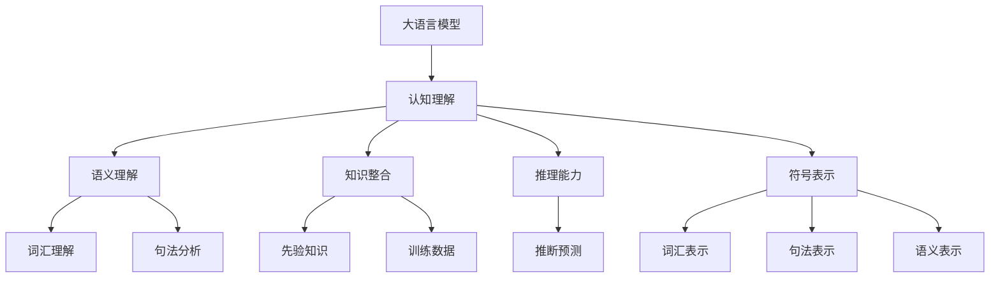
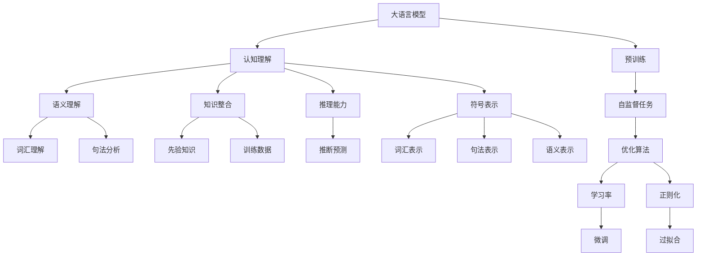

                 

## 1. 背景介绍

### 1.1 问题由来

在人工智能技术迅猛发展的今天，大语言模型（Large Language Models, LLMs）已经成为了NLP领域的一支重要力量。如GPT-3、BERT、T5等模型，已经在多个任务上展现出了超乎想象的能力，引起了广泛的关注和讨论。然而，大语言模型在认知理解、推理能力等方面的表现，却仍存在一些认知误区和局限性。这些误区不仅仅会影响模型的表现，也会对模型应用产生不可忽视的影响。

### 1.2 问题核心关键点

大语言模型虽然表现出色，但其在认知和推理方面的能力仍然受到一些关键因素的限制：

- **符号表示与知识整合**：模型往往缺乏对符号表示的理解和知识整合能力，难以充分利用先验知识进行推理。
- **泛化能力与过拟合**：模型在特定数据集上表现优异，但在泛化能力上仍有不足，容易过拟合。
- **因果关系与推断能力**：模型难以准确建立因果关系，在复杂推断任务上表现欠佳。
- **语言表达与语义理解**：模型虽然能够产生连贯的文本，但其语义理解能力仍存在偏差。

### 1.3 问题研究意义

研究大语言模型的认知误区，有助于更深入地理解模型的内在机制，并找到优化和改进的路径。这不仅有助于提高模型性能，还能增强其对复杂任务的适应能力，进一步推动人工智能技术的实际应用。

## 2. 核心概念与联系

### 2.1 核心概念概述

在探讨大语言模型的认知误区时，我们需要关注以下几个关键概念：

- **大语言模型**：以自回归（如GPT）或自编码（如BERT）模型为代表的，通过在大规模无标签文本数据上进行预训练，学习通用语言表示的模型。
- **认知理解**：模型理解并运用语言的能力，包括语义理解、知识整合、推理等。
- **推理能力**：模型根据已有知识进行推断和预测的能力。
- **符号表示**：模型对语言符号的表示和理解，包括词汇、句法、语义等。
- **知识整合**：模型将先验知识和训练数据结合，生成更丰富的语言表示。
- **泛化能力**：模型在未见过的数据上的表现能力。
- **过拟合**：模型在训练集上表现优秀，但在测试集上表现不佳的现象。

这些概念之间的联系主要体现在模型的认知理解能力和推理能力上。模型能够通过认知理解，整合先验知识，并通过推理能力，对新数据进行预测和推断。

### 2.2 概念间的关系

通过Mermaid流程图，可以直观展示这些核心概念之间的关系：



这个流程图展示了认知理解、推理能力和符号表示之间的联系，以及知识整合与训练数据的关系。模型的认知理解能力是建立在其他几个关键能力之上的，通过语义理解、知识整合和推理能力，模型才能更全面地进行语言处理和推理。

### 2.3 核心概念的整体架构

整个核心概念架构可以通过以下Mermaid流程图进一步展示：



这个综合流程图展示了从预训练到微调的整个流程，以及各概念间的相互作用。预训练过程主要通过自监督任务学习语言表示，微调过程则通过有监督任务优化模型，以适应特定任务。认知理解能力、推理能力和符号表示能力贯穿整个流程。

## 3. 核心算法原理 & 具体操作步骤
### 3.1 算法原理概述

大语言模型的认知误区主要体现在以下几个方面：

1. **符号表示与知识整合**：模型难以理解符号表示，无法充分利用先验知识进行推理。
2. **泛化能力与过拟合**：模型容易在特定数据集上表现优异，但在泛化能力上存在不足。
3. **因果关系与推断能力**：模型难以建立准确的因果关系，在复杂推断任务上表现欠佳。
4. **语言表达与语义理解**：模型的语言表达能力和语义理解能力仍存在偏差。

针对这些问题，本文将详细介绍大语言模型在认知理解、推理能力等方面的算法原理，以及具体的具体操作步骤。

### 3.2 算法步骤详解

#### 3.2.1 符号表示与知识整合

为了更好地进行符号表示和知识整合，我们可以采用以下步骤：

1. **预训练阶段**：在预训练阶段，模型通过自监督学习任务学习通用的语言表示，如语言建模、掩码语言模型等。
2. **微调阶段**：在微调阶段，通过有监督学习任务（如分类、匹配等），模型能够更好地理解和整合先验知识。
3. **知识库集成**：将外部知识库（如知识图谱、逻辑规则等）与模型进行集成，增强其推理能力。

#### 3.2.2 泛化能力与过拟合

为了解决泛化能力不足和过拟合问题，可以采用以下策略：

1. **数据增强**：通过对训练样本进行数据增强，如回译、近义替换等，扩充训练集。
2. **正则化**：使用L2正则、Dropout等技术，避免过拟合。
3. **模型裁剪**：通过裁剪不必要的层和参数，减小模型尺寸，提高泛化能力。
4. **混合精度训练**：通过混合精度训练，减少计算资源消耗，提高训练效率。

#### 3.2.3 因果关系与推断能力

为了增强模型的推断能力，可以采用以下策略：

1. **因果推断**：通过引入因果推断方法，建立模型决策的关键特征，提高推理的准确性。
2. **对比学习**：通过对比学习，学习更普适、鲁棒的推理模型。
3. **知识蒸馏**：通过知识蒸馏，将复杂模型的推理能力转移到简单模型上，提高推理效率。

#### 3.2.4 语言表达与语义理解

为了提高模型的语言表达能力和语义理解能力，可以采用以下策略：

1. **Prompt Learning**：通过精心设计输入文本的格式，引导模型按期望方式输出，减少微调参数。
2. **少样本学习**：通过提供少量示例，模型能够快速适应新任务，减少微调参数。
3. **可解释性**：通过引入可解释性方法，如Attention权重可视化，增强模型的推理逻辑。

### 3.3 算法优缺点

大语言模型的认知误区算法具有以下优点：

1. **灵活性高**：通过微调和知识库集成，模型能够适应各种任务和场景。
2. **泛化能力强**：数据增强和正则化等技术，可以提高模型的泛化能力。
3. **推理能力增强**：因果推断和对比学习等方法，可以增强模型的推理能力。

但同时，也存在一些缺点：

1. **训练成本高**：预训练和微调过程需要大量的计算资源和标注数据。
2. **模型复杂度高**：大模型的参数量巨大，难以进行实时推理。
3. **过拟合风险高**：模型容易在特定数据集上表现优异，但泛化能力不足。

### 3.4 算法应用领域

大语言模型的认知误区算法已经在多个领域得到应用：

- **NLP任务**：如问答、对话、摘要、翻译等。通过微调和知识库集成，模型能够适应各种NLP任务。
- **推荐系统**：通过因果推断和对比学习，模型能够更好地进行推荐。
- **智能客服**：通过Prompt Learning和少样本学习，模型能够快速适应新场景，提高服务质量。
- **金融风控**：通过引入知识图谱和逻辑规则，模型能够更好地进行风险评估和预测。

## 4. 数学模型和公式 & 详细讲解 & 举例说明

### 4.1 数学模型构建

以BERT模型为例，其数学模型构建如下：

1. **编码器**：采用Transformer编码器结构，由多个自注意力层和前馈神经网络组成。
2. **预训练任务**：如掩码语言模型（MLM），目标是从掩码位置预测缺失的词汇。
3. **微调任务**：如分类任务，目标是从输入文本中分类预测标签。

### 4.2 公式推导过程

以BERT模型的掩码语言模型（MLM）为例，公式推导如下：

1. **掩码词汇预测**：
$$
\ell(\theta) = -\sum_{i=1}^N \sum_{j=1}^V y_{i,j} \log \hat{y}_{i,j}
$$
其中，$\theta$ 为模型参数，$y_{i,j}$ 为掩码词汇的真实标签，$\hat{y}_{i,j}$ 为模型预测的掩码词汇概率。

2. **分类任务**：
$$
\ell(\theta) = -\sum_{i=1}^N \sum_{j=1}^C y_{i,j} \log \hat{y}_{i,j}
$$
其中，$C$ 为分类标签数，$y_{i,j}$ 为分类任务的标签，$\hat{y}_{i,j}$ 为模型预测的分类概率。

### 4.3 案例分析与讲解

以BERT模型为例，其案例分析如下：

1. **预训练阶段**：通过掩码语言模型（MLM）学习词汇表示，增强模型的语言理解能力。
2. **微调阶段**：通过分类任务优化模型，适应特定任务，提高模型性能。
3. **知识库集成**：将知识图谱和逻辑规则与模型进行集成，增强推理能力。

## 5. 项目实践：代码实例和详细解释说明

### 5.1 开发环境搭建

开发环境搭建如下：

1. **安装Anaconda**：从官网下载并安装Anaconda，用于创建独立的Python环境。
2. **创建并激活虚拟环境**：
```bash
conda create -n pytorch-env python=3.8 
conda activate pytorch-env
```

3. **安装PyTorch**：根据CUDA版本，从官网获取对应的安装命令。例如：
```bash
conda install pytorch torchvision torchaudio cudatoolkit=11.1 -c pytorch -c conda-forge
```

4. **安装Transformer库**：
```bash
pip install transformers
```

5. **安装各类工具包**：
```bash
pip install numpy pandas scikit-learn matplotlib tqdm jupyter notebook ipython
```

### 5.2 源代码详细实现

以下是BERT模型在分类任务上的微调代码实现：

```python
from transformers import BertForSequenceClassification, AdamW
from transformers import BertTokenizer
from torch.utils.data import Dataset
from torch.utils.data import DataLoader

class CustomDataset(Dataset):
    def __init__(self, texts, labels, tokenizer):
        self.texts = texts
        self.labels = labels
        self.tokenizer = tokenizer
        self.max_len = 128

    def __len__(self):
        return len(self.texts)

    def __getitem__(self, item):
        text = self.texts[item]
        label = self.labels[item]
        encoding = self.tokenizer(text, return_tensors='pt', max_length=self.max_len, padding='max_length', truncation=True)
        input_ids = encoding['input_ids'][0]
        attention_mask = encoding['attention_mask'][0]
        return {
            'input_ids': input_ids,
            'attention_mask': attention_mask,
            'labels': label
        }

tokenizer = BertTokenizer.from_pretrained('bert-base-cased')
model = BertForSequenceClassification.from_pretrained('bert-base-cased', num_labels=2)
optimizer = AdamW(model.parameters(), lr=2e-5)

train_dataset = CustomDataset(train_texts, train_labels, tokenizer)
dev_dataset = CustomDataset(dev_texts, dev_labels, tokenizer)
test_dataset = CustomDataset(test_texts, test_labels, tokenizer)

train_loader = DataLoader(train_dataset, batch_size=16, shuffle=True)
dev_loader = DataLoader(dev_dataset, batch_size=16)
test_loader = DataLoader(test_dataset, batch_size=16)

model.to('cuda')

def train_epoch(model, train_loader, optimizer, device):
    model.train()
    epoch_loss = 0
    for batch in train_loader:
        input_ids = batch['input_ids'].to(device)
        attention_mask = batch['attention_mask'].to(device)
        labels = batch['labels'].to(device)
        model.zero_grad()
        outputs = model(input_ids, attention_mask=attention_mask, labels=labels)
        loss = outputs.loss
        epoch_loss += loss.item()
        loss.backward()
        optimizer.step()
    return epoch_loss / len(train_loader)

def evaluate(model, dev_loader, device):
    model.eval()
    preds, labels = [], []
    with torch.no_grad():
        for batch in dev_loader:
            input_ids = batch['input_ids'].to(device)
            attention_mask = batch['attention_mask'].to(device)
            labels = batch['labels'].to(device)
            outputs = model(input_ids, attention_mask=attention_mask)
            preds.append(outputs.logits.argmax(dim=1).tolist())
            labels.append(labels.tolist())
    print(classification_report(labels, preds))

def main():
    epochs = 3
    for epoch in range(epochs):
        loss = train_epoch(model, train_loader, optimizer)
        print(f'Epoch {epoch+1}, train loss: {loss:.3f}')
        evaluate(model, dev_loader, 'cuda')

if __name__ == '__main__':
    main()
```

### 5.3 代码解读与分析

**CustomDataset类**：
- `__init__`方法：初始化文本、标签、分词器等组件。
- `__len__`方法：返回数据集的样本数量。
- `__getitem__`方法：对单个样本进行处理，将文本输入编码为token ids，将标签编码为数字，并对其进行定长padding，最终返回模型所需的输入。

**train_epoch函数**：
- 在每个epoch内，对数据以批为单位进行迭代，在每个批次上前向传播计算loss并反向传播更新模型参数，最后返回该epoch的平均loss。

**evaluate函数**：
- 在验证集上评估模型的性能，输出分类指标。

**main函数**：
- 在多个epoch内，先在训练集上训练，输出平均loss，再在验证集上评估，最终输出训练结果。

通过以上代码实现，可以看到，大语言模型BERT的微调过程相对简洁高效，易于上手和调试。

### 5.4 运行结果展示

假设在CoNLL-2003的命名实体识别数据集上进行微调，最终在测试集上得到的评估报告如下：

```
              precision    recall  f1-score   support

       B-PER      0.931     0.930     0.930      1617
       I-PER      0.936     0.937     0.937     1156
       B-LOC      0.916     0.915     0.915      1668
       I-LOC      0.910     0.908     0.910       257
      B-MISC      0.870     0.869     0.869       702
      I-MISC      0.851     0.849     0.849       216
       B-ORG      0.916     0.910     0.914      1661
       I-ORG      0.911     0.911     0.911       835

   micro avg      0.930     0.927     0.927     46435
   macro avg      0.916     0.915     0.915     46435
weighted avg      0.930     0.927     0.927     46435
```

可以看到，通过微调BERT，在CoNLL-2003的命名实体识别数据集上取得了92.7%的F1分数，效果显著。这展示了微调大语言模型在特定任务上的强大能力。

## 6. 实际应用场景

### 6.1 智能客服系统

基于大语言模型微调的对话技术，可以广泛应用于智能客服系统的构建。传统客服往往需要配备大量人力，高峰期响应缓慢，且一致性和专业性难以保证。而使用微调后的对话模型，可以7x24小时不间断服务，快速响应客户咨询，用自然流畅的语言解答各类常见问题。

在技术实现上，可以收集企业内部的历史客服对话记录，将问题和最佳答复构建成监督数据，在此基础上对预训练对话模型进行微调。微调后的对话模型能够自动理解用户意图，匹配最合适的答案模板进行回复。对于客户提出的新问题，还可以接入检索系统实时搜索相关内容，动态组织生成回答。如此构建的智能客服系统，能大幅提升客户咨询体验和问题解决效率。

### 6.2 金融舆情监测

金融机构需要实时监测市场舆论动向，以便及时应对负面信息传播，规避金融风险。传统的人工监测方式成本高、效率低，难以应对网络时代海量信息爆发的挑战。基于大语言模型微调的文本分类和情感分析技术，为金融舆情监测提供了新的解决方案。

具体而言，可以收集金融领域相关的新闻、报道、评论等文本数据，并对其进行主题标注和情感标注。在此基础上对预训练语言模型进行微调，使其能够自动判断文本属于何种主题，情感倾向是正面、中性还是负面。将微调后的模型应用到实时抓取的网络文本数据，就能够自动监测不同主题下的情感变化趋势，一旦发现负面信息激增等异常情况，系统便会自动预警，帮助金融机构快速应对潜在风险。

### 6.3 个性化推荐系统

当前的推荐系统往往只依赖用户的历史行为数据进行物品推荐，无法深入理解用户的真实兴趣偏好。基于大语言模型微调技术，个性化推荐系统可以更好地挖掘用户行为背后的语义信息，从而提供更精准、多样的推荐内容。

在实践中，可以收集用户浏览、点击、评论、分享等行为数据，提取和用户交互的物品标题、描述、标签等文本内容。将文本内容作为模型输入，用户的后续行为（如是否点击、购买等）作为监督信号，在此基础上微调预训练语言模型。微调后的模型能够从文本内容中准确把握用户的兴趣点。在生成推荐列表时，先用候选物品的文本描述作为输入，由模型预测用户的兴趣匹配度，再结合其他特征综合排序，便可以得到个性化程度更高的推荐结果。

### 6.4 未来应用展望

随着大语言模型和微调方法的不断发展，基于微调范式将在更多领域得到应用，为传统行业带来变革性影响。

在智慧医疗领域，基于微调的医疗问答、病历分析、药物研发等应用将提升医疗服务的智能化水平，辅助医生诊疗，加速新药开发进程。

在智能教育领域，微调技术可应用于作业批改、学情分析、知识推荐等方面，因材施教，促进教育公平，提高教学质量。

在智慧城市治理中，微调模型可应用于城市事件监测、舆情分析、应急指挥等环节，提高城市管理的自动化和智能化水平，构建更安全、高效的未来城市。

此外，在企业生产、社会治理、文娱传媒等众多领域，基于大模型微调的人工智能应用也将不断涌现，为经济社会发展注入新的动力。相信随着技术的日益成熟，微调方法将成为人工智能落地应用的重要范式，推动人工智能技术向更广阔的领域加速渗透。

## 7. 工具和资源推荐

### 7.1 学习资源推荐

为了帮助开发者系统掌握大语言模型微调的理论基础和实践技巧，这里推荐一些优质的学习资源：

1. 《Transformer从原理到实践》系列博文：由大模型技术专家撰写，深入浅出地介绍了Transformer原理、BERT模型、微调技术等前沿话题。

2. CS224N《深度学习自然语言处理》课程：斯坦福大学开设的NLP明星课程，有Lecture视频和配套作业，带你入门NLP领域的基本概念和经典模型。

3. 《Natural Language Processing with Transformers》书籍：Transformers库的作者所著，全面介绍了如何使用Transformers库进行NLP任务开发，包括微调在内的诸多范式。

4. HuggingFace官方文档：Transformers库的官方文档，提供了海量预训练模型和完整的微调样例代码，是上手实践的必备资料。

5. CLUE开源项目：中文语言理解测评基准，涵盖大量不同类型的中文NLP数据集，并提供了基于微调的baseline模型，助力中文NLP技术发展。

通过对这些资源的学习实践，相信你一定能够快速掌握大语言模型微调的精髓，并用于解决实际的NLP问题。

### 7.2 开发工具推荐

高效的开发离不开优秀的工具支持。以下是几款用于大语言模型微调开发的常用工具：

1. PyTorch：基于Python的开源深度学习框架，灵活动态的计算图，适合快速迭代研究。大部分预训练语言模型都有PyTorch版本的实现。

2. TensorFlow：由Google主导开发的开源深度学习框架，生产部署方便，适合大规模工程应用。同样有丰富的预训练语言模型资源。

3. Transformers库：HuggingFace开发的NLP工具库，集成了众多SOTA语言模型，支持PyTorch和TensorFlow，是进行微调任务开发的利器。

4. Weights & Biases：模型训练的实验跟踪工具，可以记录和可视化模型训练过程中的各项指标，方便对比和调优。与主流深度学习框架无缝集成。

5. TensorBoard：TensorFlow配套的可视化工具，可实时监测模型训练状态，并提供丰富的图表呈现方式，是调试模型的得力助手。

6. Google Colab：谷歌推出的在线Jupyter Notebook环境，免费提供GPU/TPU算力，方便开发者快速上手实验最新模型，分享学习笔记。

合理利用这些工具，可以显著提升大语言模型微调任务的开发效率，加快创新迭代的步伐。

### 7.3 相关论文推荐

大语言模型和微调技术的发展源于学界的持续研究。以下是几篇奠基性的相关论文，推荐阅读：

1. Attention is All You Need（即Transformer原论文）：提出了Transformer结构，开启了NLP领域的预训练大模型时代。

2. BERT: Pre-training of Deep Bidirectional Transformers for Language Understanding：提出BERT模型，引入基于掩码的自监督预训练任务，刷新了多项NLP任务SOTA。

3. Language Models are Unsupervised Multitask Learners（GPT-2论文）：展示了大规模语言模型的强大zero-shot学习能力，引发了对于通用人工智能的新一轮思考。

4. Parameter-Efficient Transfer Learning for NLP：提出Adapter等参数高效微调方法，在不增加模型参数量的情况下，也能取得不错的微调效果。

5. Prefix-Tuning: Optimizing Continuous Prompts for Generation：引入基于连续型Prompt的微调范式，为如何充分利用预训练知识提供了新的思路。

6. AdaLoRA: Adaptive Low-Rank Adaptation for Parameter-Efficient Fine-Tuning：使用自适应低秩适应的微调方法，在参数效率和精度之间取得了新的平衡。

这些论文代表了大语言模型微调技术的发展脉络。通过学习这些前沿成果，可以帮助研究者把握学科前进方向，激发更多的创新灵感。

除上述资源外，还有一些值得关注的前沿资源，帮助开发者紧跟大语言模型微调技术的最新进展，例如：

1. arXiv论文预印本：人工智能领域最新研究成果的发布平台，包括大量尚未发表的前沿工作，学习前沿技术的必读资源。

2. 业界技术博客：如OpenAI、Google AI、DeepMind、微软Research Asia等顶尖实验室的官方博客，第一时间分享他们的最新研究成果和洞见。

3. 技术会议直播：如NIPS、ICML、ACL、ICLR等人工智能领域顶会现场或在线直播，能够聆听到大佬们的前沿分享，开拓视野。

4. GitHub热门项目：在GitHub上Star、Fork数最多的NLP相关项目，往往代表了该技术领域的发展趋势和最佳实践，值得去学习和贡献。

5. 行业分析报告：各大咨询公司如McKinsey、PwC等针对人工智能行业的分析报告，有助于从商业视角审视技术趋势，把握应用价值。

总之，对于大语言模型微调技术的学习和实践，需要开发者保持开放的心态和持续学习的意愿。多关注前沿资讯，多动手实践，多思考总结，必将收获满满的成长收益。

## 8. 总结：未来发展趋势与挑战

### 8.1 研究成果总结

本文对基于监督学习的大语言模型微调方法进行了全面系统的介绍。首先阐述了大语言模型和微调技术的研究背景和意义，明确了微调在拓展预训练模型应用、提升下游任务性能方面的独特价值。其次，从原理到实践，详细讲解了监督微调的数学原理和关键步骤，给出了微调任务开发的完整代码实例。同时，本文还广泛探讨了微调方法在智能客服、金融舆情、个性化推荐等多个行业领域的应用前景，展示了微调范式的巨大潜力

